<p align="center">
  
</p>

<h1 align="center">Universidad Peruana de Ciencias Aplicadas</h1>
<h2 align="center">Carrera de Ingeniería de Software</h2>

<h3 align="center">1ACC0238</h3>

<h3 align="center">Aplicaciones para Dispositivos Móviles</h3>
<h3 align="center">NRC</h3>
<h3 align="center">4939</h3>

<h1 align="center">Informe de Trabajo Final</h1>

<h3 align="center">Docente</h3>
<h2 align="center">David Gerardo Quevedo Velasco</h2>

<h3 align="center">Equipo</h3>
<h2 align="center">Trakto</h2>

<h3 align="center">Proyecto</h3>
<h2 align="center">Trakto Route</h2>

<h2 align="center">Integrantes</h2>

<table align="center">
  <tr>
    <th>Código</th>
    <th>Apellidos y Nombres</th>
  </tr>
  <tr>
    <td>UXXXXXXXXXX</td>
    <td>Miembro 1</td>
  </tr>
  <tr>
    <td>U20251B991</td>
    <td>Aguilar Aguayo Jeferson Renzo</td>
  </tr>
  <tr>
    <td>U202019498</td>
    <td>Fernandez Garfias, Alexander Piero</td>
  </tr>
  <tr>
    <td>UXXXXXXXXXX</td>
    <td>Miembro 4</td>
  </tr>
  <tr>
    <td>UXXXXXXXXXX</td>
    <td>Miembro 5</td>
  </tr>
</table>

<h3 align="center">Periodo 202620</h3>


<div style="page-break-after: always;"></div>

<h2 align="center">Registro de Versiones del Informe</h2>

| Versión | Fecha | Autor | Descripción de modificación |
|---|---|---|---|
| AV1 | 20/09/2026 | Fecha | Creación del informe. Inclusión de la presentación de la startup y del producto, Lean UX, análisis de competidores, entrevistas, Needfinding y Requirements Specification hasta Product Backlog. |

<div style="page-break-after: always;"></div>

<h2 align="center">Project Report Collaboration Insights</h2>


**AV1.** Para el primer avance, el equipo trabajó en la definición de la startup **Trakto** y de su producto **Trakto Route**, el desarrollo del proceso Lean UX, el análisis competitivo, las entrevistas, los artefactos de Needfinding y la especificación inicial de requisitos. Las actividades fueron distribuidas entre los integrantes y consolidadas mediante herramientas colaborativas y control de versiones.

<div style="page-break-after: always;"></div>

## Contenido

- [Student Outcome](#student-outcome)
- [Objetivos SMART](#objetivos-smart)
- [Capítulo I: Presentación](#capítulo-i-presentación)
    - [1.1. Startup Profile](#11-startup-profile)
        - [1.1.1. Descripción de la Startup](#111-descripción-de-la-startup)
        - [1.1.2. Perfiles de integrantes del equipo](#112-perfiles-de-integrantes-del-equipo)
    - [1.2. Solution Profile](#12-solution-profile)
        - [1.2.1. Antecedentes y problemática](#121-antecedentes-y-problemática)
        - [1.2.2. Lean UX Process](#122-lean-ux-process)
            - [1.2.2.1. Lean UX Problem Statements](#1221-lean-ux-problem-statements)
            - [1.2.2.2. Lean UX Assumptions](#1222-lean-ux-assumptions)
            - [1.2.2.3. Lean UX Hypothesis Statements](#1223-lean-ux-hypothesis-statements)
            - [1.2.2.4. Lean UX Canvas](#1224-lean-ux-canvas)
    - [1.3. Segmentos objetivo](#13-segmentos-objetivo)
- [Capítulo II: Requirements Development and Software Solution Design](#capítulo-ii-requirements-development-and-software-solution-design)
    - [2.1. Competidores](#21-competidores)
        - [2.1.1. Análisis competitivo](#211-análisis-competitivo)
        - [2.1.2. Estrategias y tácticas frente a competidores](#212-estrategias-y-tácticas-frente-a-competidores)
    - [2.2. Entrevistas](#22-entrevistas)
        - [2.2.1. Diseño de entrevistas](#221-diseño-de-entrevistas)
        - [2.2.2. Registro de entrevistas](#222-registro-de-entrevistas)
        - [2.2.3. Análisis de entrevistas](#223-análisis-de-entrevistas)
    - [2.3. Needfinding](#23-needfinding)
        - [2.3.1. User Personas](#231-user-personas)
        - [2.3.2. User Task Matrix](#232-user-task-matrix)
        - [2.3.3. User Journey Mapping](#233-user-journey-mapping)
        - [2.3.4. Empathy Mapping](#234-empathy-mapping)
        - [2.3.5. Big Picture EventStorming](#235-big-picture-eventstorming)
        - [2.3.6. Ubiquitous Language](#236-ubiquitous-language)
    - [2.4. Requirements Specification](#24-requirements-specification)
        - [To-Be Scenario Mapping](#to-be-scenario-mapping)
        - [2.4.1. User Stories](#241-user-stories)
        - [2.4.2. Impact Mapping](#242-impact-mapping)
        - [2.4.3. Product Backlog](#243-product-backlog)
    - [2.5. Strategic-Level Domain-Driven Design](#25-strategic-level-domain-driven-design)
        - [2.5.1. EventStorming](#251-eventstorming)
            - [2.5.1.1. Candidate Context Discovery](#2511-candidate-context-discovery)
            - [2.5.1.2. Domain Message Flows Modeling](#2512-domain-message-flows-modeling)
            - [2.5.1.3. Bounded Context Canvases](#2513-bounded-context-canvases)
        - [2.5.2. Context Mapping](#252-context-mapping)
        - [2.5.3. Software Architecture](#253-software-architecture)
            - [2.5.3.1. Software Architecture Context Level Diagrams](#2531-software-architecture-context-level-diagrams)
            - [2.5.3.2. Software Architecture Container Level Diagrams](#2532-software-architecture-container-level-diagrams)
            - [2.5.3.3. Software Architecture Deployment Diagrams](#2533-software-architecture-deployment-diagrams)
    - [2.6. Tactical-Level Domain-Driven Design](#26-tactical-level-domain-driven-design)
        - [2.6.1. Bounded Context: Trip Management](#261-bounded-context-trip-management)
            - [2.6.1.1. Domain Layer](#2611-domain-layer)
            - [2.6.1.2. Interface Layer](#2612-interface-layer)
            - [2.6.1.3. Application Layer](#2613-application-layer)
            - [2.6.1.4. Infrastructure Layer](#2614-infrastructure-layer)
            - [2.6.1.5. Bounded Context Software Architecture Component Level Diagrams](#2615-bounded-context-software-architecture-component-level-diagrams)
            - [2.6.1.6. Bounded Context Software Architecture Code Level Diagrams](#2616-bounded-context-software-architecture-code-level-diagrams)
                - [2.6.1.6.1. Bounded Context Domain Layer Class Diagrams](#26161-bounded-context-domain-layer-class-diagrams)
                - [2.6.1.6.2. Bounded Context Database Design Diagram](#26162-bounded-context-database-design-diagram)
        - [2.6.2. Bounded Context: Fleet Management](#262-bounded-context-fleet-management)
            - [2.6.2.1. Domain Layer](#2621-domain-layer)
            - [2.6.2.2. Interface Layer](#2622-interface-layer)
            - [2.6.2.3. Application Layer](#2623-application-layer)
            - [2.6.2.4. Infrastructure Layer](#2624-infrastructure-layer)
            - [2.6.2.5. Bounded Context Software Architecture Component Level Diagrams](#2625-bounded-context-software-architecture-component-level-diagrams)
            - [2.6.2.6. Bounded Context Software Architecture Code Level Diagrams](#2626-bounded-context-software-architecture-code-level-diagrams)
                - [2.6.2.6.1. Bounded Context Domain Layer Class Diagrams](#26261-bounded-context-domain-layer-class-diagrams)
                - [2.6.2.6.2. Bounded Context Database Design Diagram](#26262-bounded-context-database-design-diagram)
        - [2.6.3. Bounded Context: Incident Management](#263-bounded-context-incident-management)
            - [2.6.3.1. Domain Layer](#2631-domain-layer)
            - [2.6.3.2. Interface Layer](#2632-interface-layer)
            - [2.6.3.3. Application Layer](#2633-application-layer)
            - [2.6.3.4. Infrastructure Layer](#2634-infrastructure-layer)
            - [2.6.3.5. Bounded Context Software Architecture Component Level Diagrams](#2635-bounded-context-software-architecture-component-level-diagrams)
            - [2.6.3.6. Bounded Context Software Architecture Code Level Diagrams](#2636-bounded-context-software-architecture-code-level-diagrams)
                - [2.6.3.6.1. Bounded Context Domain Layer Class Diagrams](#26361-bounded-context-domain-layer-class-diagrams)
                - [2.6.3.6.2. Bounded Context Database Design Diagram](#26362-bounded-context-database-design-diagram)
        - [2.6.4. Bounded Context: Operational History](#264-bounded-context-operational-history)
            - [2.6.4.1. Domain Layer](#2641-domain-layer)
            - [2.6.4.2. Interface Layer](#2642-interface-layer)
            - [2.6.4.3. Application Layer](#2643-application-layer)
            - [2.6.4.4. Infrastructure Layer](#2644-infrastructure-layer)
            - [2.6.4.5. Bounded Context Software Architecture Component Level Diagrams](#2645-bounded-context-software-architecture-component-level-diagrams)
            - [2.6.4.6. Bounded Context Software Architecture Code Level Diagrams](#2646-bounded-context-software-architecture-code-level-diagrams)
                - [2.6.4.6.1. Bounded Context Domain Layer Class Diagrams](#26461-bounded-context-domain-layer-class-diagrams)
                - [2.6.4.6.2. Bounded Context Database Design Diagram](#26462-bounded-context-database-design-diagram)
        - [2.6.5. Bounded Context: IAM](#265-bounded-context-iam)
            - [2.6.5.1. Domain Layer](#2651-domain-layer)
            - [2.6.5.2. Interface Layer](#2652-interface-layer)
            - [2.6.5.3. Application Layer](#2653-application-layer)
            - [2.6.5.4. Infrastructure Layer](#2654-infrastructure-layer)
            - [2.6.5.5. Bounded Context Software Architecture Component Level Diagrams](#2655-bounded-context-software-architecture-component-level-diagrams)
            - [2.6.5.6. Bounded Context Software Architecture Code Level Diagrams](#2656-bounded-context-software-architecture-code-level-diagrams)
                - [2.6.5.6.1. Bounded Context Domain Layer Class Diagrams](#26561-bounded-context-domain-layer-class-diagrams)
                - [2.6.5.6.2. Bounded Context Database Design Diagram](#26562-bounded-context-database-design-diagram)
        - [2.6.6. Bounded Context: Profile](#266-bounded-context-profile)
            - [2.6.6.1. Domain Layer](#2661-domain-layer)
            - [2.6.6.2. Interface Layer](#2662-interface-layer)
            - [2.6.6.3. Application Layer](#2663-application-layer)
            - [2.6.6.4. Infrastructure Layer](#2664-infrastructure-layer)
            - [2.6.6.5. Bounded Context Software Architecture Component Level Diagrams](#2665-bounded-context-software-architecture-component-level-diagrams)
            - [2.6.6.6. Bounded Context Software Architecture Code Level Diagrams](#2666-bounded-context-software-architecture-code-level-diagrams)
                - [2.6.6.6.1. Bounded Context Domain Layer Class Diagrams](#26661-bounded-context-domain-layer-class-diagrams)
                - [2.6.6.6.2. Bounded Context Database Design Diagram](#26662-bounded-context-database-design-diagram)

<div style="page-break-after: always;"></div>

# Student Outcome

[Completar con el Student Outcome indicado por el docente. Debe incluir las acciones específicas realizadas por cada integrante y las conclusiones grupales correspondientes al avance.]

<div style="page-break-after: always;"></div>

# Objetivos SMART

De acuerdo con la rúbrica, cada integrante debe formular al menos dos objetivos SMART orientados a su desarrollo profesional posterior a la carrera. Los siguientes enunciados constituyen una propuesta inicial y deben ser validados personalmente por cada integrante antes de la entrega final.

| Integrante | Objetivo SMART 1 | Objetivo SMART 2 |
|---|---|---|
| Aguilar Aguayo Jeferson Renzo | Durante los 12 meses posteriores a la culminación de la carrera, completar al menos una certificación o programa especializado relacionado con desarrollo de software y aplicar lo aprendido en un proyecto verificable de portafolio. | Durante los 18 meses posteriores a la graduación, participar en al menos un proyecto profesional de desarrollo de software en el que contribuya de manera documentada al frontend, backend o base de datos y registre los principales aprendizajes obtenidos. |
| Fernandez Garfias, Alexander Piero | Durante los 12 meses posteriores a la culminación de la carrera, fortalecer su especialización en desarrollo backend completando al menos una certificación o ruta avanzada en Java/Spring y publicando un proyecto de portafolio con documentación técnica. | Durante los 18 meses posteriores a la graduación, participar en un proyecto profesional o colaborativo donde aplique prácticas de arquitectura de software, pruebas y diseño de APIs, documentando al menos dos mejoras técnicas implementadas. |
| Miembro 1 | **Pendiente de validación por el integrante.** Formular dos objetivos específicos, medibles, alcanzables, relevantes y delimitados en el tiempo. | **Pendiente de validación por el integrante.** |
| Miembro 4 | **Pendiente de validación por el integrante.** Formular dos objetivos específicos, medibles, alcanzables, relevantes y delimitados en el tiempo. | **Pendiente de validación por el integrante.** |
| Miembro 5 | **Pendiente de validación por el integrante.** Formular dos objetivos específicos, medibles, alcanzables, relevantes y delimitados en el tiempo. | **Pendiente de validación por el integrante.** |

<div style="page-break-after: always;"></div>

# Capítulo I: Presentación

## 1.1. Startup Profile

### 1.1.1. Descripción de la Startup

**Trakto** es una startup tecnológica orientada a la digitalización y mejora de las operaciones de transporte terrestre de carga. Su propósito es desarrollar productos digitales que permitan a empresas transportistas y a sus clientes disponer de información organizada, trazable y accesible sobre los viajes de carga.

Su producto principal es **Trakto Route**, una aplicación móvil Android desarrollada en **Kotlin**. La aplicación consume una **API REST desarrollada en Java con Spring Boot**, responsable de centralizar las reglas de negocio, autenticación, gestión de viajes, flota, incidencias e historial operativo. La información persistente del sistema se almacena en **MySQL**.

Trakto Route permite gestionar y consultar viajes, rutas, vehículos, conductores y eventos operativos; registrar paradas, descansos, retrasos, problemas e incidencias; y revisar el historial de las operaciones. Para los clientes que contratan el transporte, la solución busca proporcionar visibilidad del estado y progreso de sus envíos sin exponer funciones internas de administración de flota.


### 1.1.2. Perfiles de integrantes del equipo

| Foto | Información |
|---|---|
|  | **Nombre:** Miembro 1<br><br>**Código:** UXXXXXXXXXX<br><br>**Carrera:** Ingeniería de Software<br><br>**Acerca de mí:** [Conocimientos técnicos, habilidades y aporte al equipo.] |
|  | **Nombre:** Aguilar Aguayo Jeferson Renzo<br><br>**Código:** U20251B991<br><br>**Carrera:** Ingeniería de Software<br><br>**Acerca de mí:** Estudiante del quinto ciclo de Ing. de Software. mis conocimientos sobre lenguajes de programación se centran en JS, CSS, HTML y MySQL. Mis fortalezas como parte de un equipo son el trabajo colaborativo, responsabilidad con las entregas de las partes del trabajo y creatividad en ideas de mejoras sobre el proyecto. |
|  | **Nombre:** Alexander Piero Fernandez Garfias<br><br>**Código:** U202019498<br><br>**Carrera:** Ingeniería de Software<br><br>**Acerca de mí:** Soy estudiante de Ingeniería de Software. Me interesa el desarrollo de aplicaciones móviles y la construcción de soluciones de software aplicando buenas prácticas de programación y diseño. |
|  | **Nombre:** Miembro 4<br><br>**Código:** UXXXXXXXXXX<br><br>**Carrera:** Ingeniería de Software<br><br>**Acerca de mí:** [Conocimientos técnicos, habilidades y aporte al equipo.] |
|  | **Nombre:** Miembro 5<br><br>**Código:** UXXXXXXXXXX<br><br>**Carrera:** Ingeniería de Software<br><br>**Acerca de mí:** [Conocimientos técnicos, habilidades y aporte al equipo.] |
<div style="page-break-after: always;"></div>

## 1.2. Solution Profile

### 1.2.1. Antecedentes y problemática


**Who (¿Quién?) - ¿A quiénes afecta el problema?**  
Afecta, por un lado, a las **empresas de transporte de carga**, cuyos responsables necesitan gestionar viajes, vehículos, conductores, rutas e incidencias; y, por otro, a los **clientes que contratan servicios de transporte de carga**, quienes necesitan conocer el estado, progreso y eventos relevantes de sus envíos.

**What (¿Qué?) - ¿Cuál es el problema exactamente?**  
La información relacionada con las operaciones de transporte suele encontrarse distribuida entre diferentes medios. Esto dificulta que las empresas transportistas gestionen de manera centralizada los viajes y sus recursos, y que sus clientes consulten oportunamente el estado y progreso de los envíos contratados.

**Where (¿Dónde?) - ¿En qué contexto ocurre?**  
En las operaciones de transporte terrestre de carga, principalmente durante la coordinación entre **empresas transportistas** que administran vehículos, conductores y viajes, y **empresas o comerciantes clientes** que contratan el traslado de mercancías. El enfoque inicial se encuentra en el mercado peruano.

**When (¿Cuándo?) - ¿En qué momento se manifiesta el problema?**  
Durante la planificación, ejecución y finalización de los viajes. Para la empresa transportista se manifiesta al asignar recursos, actualizar estados o registrar eventos e incidencias; para el cliente, al intentar conocer el avance del envío o informarse sobre retrasos y problemas durante el traslado.

**Why (¿Por qué?) - ¿Por qué ocurre el problema?**  
El problema surge cuando la información de viajes, vehículos, conductores e incidencias se encuentra dispersa o se gestiona mediante diferentes medios, dificultando el control organizado de las operaciones.

**How (¿Cómo?) - ¿Cómo impacta en el usuario?**  
En las empresas transportistas genera mayor esfuerzo para organizar y consultar la información operativa y mantener la trazabilidad de los viajes. En los clientes genera incertidumbre y dependencia de llamadas o mensajes cuando necesitan conocer el estado de sus envíos o entender una incidencia.

**How Much (¿Cuánto?) - ¿Qué tan grande es el problema?**  
Las empresas de transporte gestionan múltiples viajes, vehículos, conductores e incidencias, por lo que la fragmentación de la información aumenta el esfuerzo necesario para supervisar cada operación. En este contexto, **Trakto Route** busca integrar la gestión de viajes, flota, incidencias e historial operativo y brindar al cliente visibilidad de los envíos asociados a su organización.

#### Objetivos de la solución

- Centralizar la información operativa de viajes, rutas, vehículos, conductores e incidencias.
- Permitir a supervisores de transporte registrar y consultar el ciclo de vida de cada viaje.
- Proporcionar a los clientes autorizados visibilidad del estado y progreso de sus envíos.
- Mantener un historial consultable que facilite la trazabilidad de las operaciones.
- Proveer una arquitectura cliente-servidor donde la aplicación Android consuma servicios REST y la información oficial permanezca centralizada en el backend.

#### Restricciones iniciales

- La aplicación móvil se implementará para **Android utilizando Kotlin**.
- Los servicios backend se implementarán en **Java con Spring Boot** y expondrán una **API REST**.
- La persistencia central del sistema utilizará **MySQL**.
- El alcance inicial se orientará al mercado peruano y a operaciones de transporte terrestre de carga.
- Las funcionalidades avanzadas de telemetría vehicular, hardware GPS propio y optimización automática de rutas quedan fuera del alcance inicial, salvo futuras integraciones.

<div style="page-break-after: always;"></div>


### 1.2.2. Lean UX Process

#### 1.2.2.1. Lean UX Problem Statements

**Problem Statement – Brand New Initiative**

El estado actual del dominio del **transporte terrestre de carga** se apoya con frecuencia en una combinación de sistemas de rastreo, hojas de cálculo, llamadas, mensajería y registros separados utilizados por empresas transportistas y por clientes que necesitan conocer el avance de sus envíos.

Lo que estas alternativas no siempre resuelven de manera integrada es la **trazabilidad de extremo a extremo de una operación**, relacionando en un mismo producto el viaje, la ruta, el vehículo, el conductor, los eventos operativos y las incidencias, junto con una vista de seguimiento apropiada para el cliente que contrata el servicio.

**Trakto Route** abordará esta brecha mediante una aplicación móvil Android en Kotlin conectada a una API REST en Java/Spring Boot y una base de datos MySQL centralizada. La estrategia inicial prioriza la gestión de viajes, flota e incidencias para las empresas transportistas y la consulta segura del estado de los envíos para sus clientes.

El foco inicial estará en **empresas peruanas de transporte de carga** y en **empresas o comerciantes que contratan servicios de transporte de carga**.

Se considerará evidencia inicial de éxito que, durante la validación del producto, los representantes de ambos segmentos puedan consultar la información necesaria de una operación desde Trakto Route y completen las tareas críticas definidas sin depender de registros dispersos para esos mismos datos.

<div style="page-break-after: always;"></div>

#### 1.2.2.2. Lean UX Assumptions

Las assumptions se expresan como creencias que deberán validarse mediante entrevistas, pruebas de usabilidad y métricas de uso. Se organizan según los cinco tipos requeridos por la rúbrica.

##### Business Assumptions

1. Creemos que las empresas de transporte de carga valorarán una solución móvil que centralice viajes, flota e incidencias sin requerir infraestructura telemática propia.
2. Creemos que un modelo B2B de suscripción puede ser viable si la solución reduce la fragmentación de información operativa.
3. Creemos que iniciar en el mercado peruano permite adaptar el producto a procesos y condiciones locales antes de ampliar su alcance.

##### Business Outcome Assumptions

1. Creemos que la adopción será visible en el crecimiento de usuarios activos de empresas registradas durante los primeros meses.
2. Creemos que el valor del producto podrá observarse en el porcentaje de viajes gestionados con eventos e incidencias registrados.
3. Creemos que la retención aumentará cuando supervisores y clientes consulten recurrentemente el estado e historial de sus operaciones.

##### User Assumptions

1. Creemos que los supervisores y responsables de empresas transportistas necesitan gestionar viajes, vehículos, conductores, rutas e incidencias.
2. Creemos que clientes que requieren servicios de transporte de carga necesitan conocer el estado, progreso y eventos relevantes de sus envíos.
3. Creemos que ambos segmentos utilizarán principalmente dispositivos móviles para consultas frecuentes durante una operación.

##### User Outcome and Benefit Assumptions

1. Creemos que los responsables de transporte desean reducir el tiempo empleado en reunir información distribuida entre diferentes medios.
2. Creemos que los clientes desean reducir la incertidumbre respecto al estado de sus envíos.
3. Creemos que disponer de historial y trazabilidad facilita revisar lo ocurrido durante una operación y tomar decisiones posteriores.

##### Feature Assumptions

1. Creemos que la **gestión centralizada de viajes, rutas, vehículos y conductores** permitirá al supervisor organizar mejor las operaciones.
2. Creemos que el **registro de eventos e incidencias** permitirá mantener trazabilidad del desarrollo de cada viaje.
3. Creemos que el **seguimiento del estado del envío para clientes autorizados** reducirá la dependencia de llamadas y mensajes para solicitar información.
4. Creemos que el **historial operativo** permitirá revisar viajes anteriores y analizar eventos asociados.
5. Creemos que la **autenticación y autorización por roles** permitirá ofrecer información y acciones distintas a supervisores y clientes de forma segura.

<div style="page-break-after: always;"></div>

#### 1.2.2.3. Lean UX Hypothesis Statements

Cada hipótesis deriva de una Feature Assumption y utiliza la estructura indicada por Lean UX. En cada caso, los componentes del template se presentan en inglés y el contenido específico de la hipótesis se expresa a continuación.

##### Hypothesis Statement 1 – Gestión centralizada

**We believe we will achieve** mayor adopción de la gestión digital de operaciones  
**If** supervisores de empresas de transporte de carga  
**Attain** la capacidad de organizar y consultar una operación desde un único sistema  
**With** la gestión centralizada de viajes, rutas, vehículos y conductores.

##### Hypothesis Statement 2 – Eventos e incidencias

**We believe we will achieve** mayor trazabilidad de los viajes gestionados  
**If** supervisores de transporte  
**Attain** la capacidad de registrar lo ocurrido durante la operación  
**With** el registro de paradas, descansos, retrasos, problemas e incidencias.

##### Hypothesis Statement 3 – Seguimiento del cliente

**We believe we will achieve** mayor uso recurrente de Trakto Route por parte de clientes  
**If** clientes que requieren servicios de transporte de carga  
**Attain** mayor visibilidad y menor incertidumbre sobre sus envíos  
**With** la consulta del estado, progreso y eventos relevantes del viaje asociado a su envío.

##### Hypothesis Statement 4 – Historial operativo

**We believe we will achieve** mayor consulta de información histórica para revisión de operaciones  
**If** supervisores de transporte y clientes autorizados  
**Attain** la capacidad de revisar viajes y eventos anteriores de forma organizada  
**With** el historial operativo centralizado.

##### Hypothesis Statement 5 – Acceso por roles

**We believe we will achieve** uso seguro y adecuado de las funcionalidades por cada tipo de usuario  
**If** supervisores y clientes registrados  
**Attain** acceso únicamente a la información y acciones que corresponden a su rol  
**With** autenticación y autorización basada en roles.

<div style="page-break-after: always;"></div>


#### 1.2.2.4. Lean UX Canvas

El **Lean UX Canvas** de Trakto Route fue elaborado en **Miro**, considerando la problemática, los supuestos, las hipótesis y los segmentos objetivo definidos durante el proceso Lean UX.


<div style="page-break-after: always;"></div>

## 1.3. Segmentos objetivo

### Segmento 1: Empresas de transporte de carga

Este segmento está conformado por empresas dedicadas al transporte terrestre de mercancías que administran vehículos, conductores, rutas y viajes. Estas organizaciones necesitan mantener organizada la información de sus operaciones, consultar el estado de los viajes e identificar paradas, descansos, retrasos, problemas, accidentes u otras incidencias que puedan presentarse durante los recorridos.

**Trakto Route** busca atender estas necesidades mediante una aplicación móvil que centralice la gestión y consulta de viajes, vehículos, conductores, rutas e incidencias. Asimismo, permite mantener un historial de las operaciones realizadas, facilitando la revisión de viajes anteriores y la evaluación del desempeño de los vehículos y conductores.

**Segmento Objetivo: Empresas de transporte de carga**

| Característica | Descripción |
|---|---|
| Tipo de cliente | Empresa (B2B) |
| Sector | Transporte terrestre de carga |
| Ubicación | Perú |
| Usuarios principales | Gestores de flota, supervisores y responsables de operaciones |
| Recursos gestionados | Camiones, conductores, rutas y viajes |
| Necesidad principal | Gestionar y mantener la trazabilidad de las operaciones de transporte |
| Funcionalidades de mayor valor | Gestión de viajes, consulta de rutas y estados, registro de incidencias e historial de vehículos, conductores y operaciones |

### Segmento 2: Clientes que requieren servicios de transporte de carga

Este segmento está conformado por organizaciones y comerciantes que dependen de terceros para trasladar mercancías y que necesitan conocer el progreso de los envíos contratados. A diferencia del primer segmento, estos usuarios no administran la flota ni asignan conductores; su necesidad principal es disponer de información confiable sobre el estado del traslado, los retrasos o incidencias relevantes y la culminación del servicio.

**Trakto Route** atiende este segmento mediante funcionalidades de consulta asociadas a los envíos autorizados para cada cliente. De esta forma, el usuario puede revisar el estado del viaje relacionado con su carga, conocer eventos relevantes y reducir la dependencia de llamadas o mensajes para solicitar actualizaciones.

**Segmento Objetivo: Clientes que requieren servicios de transporte de carga**

| Característica | Descripción |
|---|---|
| Tipo de cliente | Empresa o comerciante (B2B) |
| Actividad | Organizaciones que contratan servicios de transporte de mercancías |
| Ubicación inicial | Perú |
| Usuarios principales | Responsables de logística, compras, distribución o propietarios de negocios |
| Necesidad principal | Conocer el estado y progreso de sus envíos con mayor transparencia |
| Problemas frecuentes | Retrasos, poca visibilidad, comunicación lenta y preocupación por la seguridad de la mercancía |
| Funcionalidades de mayor valor | Consulta de estado del envío, progreso del viaje, eventos relevantes, incidencias e historial de envíos |

<div style="page-break-after: always;"></div>

# Capítulo II: Requirements Development and Software Solution Design

## 2.1. Competidores

Para comprender el entorno competitivo de **Trakto Route**, se analizaron soluciones relacionadas con la gestión de flotas, administración de operaciones logísticas y gestión del transporte de carga. Este análisis permite identificar las principales funcionalidades ofrecidas actualmente en el mercado, así como sus fortalezas y diferencias frente a nuestra propuesta.

Para el análisis competitivo se han considerado competidores directos e indirectos que ofrecen funcionalidades relacionadas con la gestión de vehículos, conductores, rutas, viajes, incidencias e historial de operaciones.

<div style="page-break-after: always;"></div>


### 2.1.1. Análisis competitivo

### Competitive Analysis Landscape

<div align="center">

<table>

<tr>
<th colspan="6" style="text-align: center">
Competitive Analysis Landscape
</th>
</tr>

<tr>
<th colspan="2">
¿Por qué llevar a cabo este análisis?
</th>

<td colspan="4">
Tiene como objetivo identificar y comprender las características, fortalezas y debilidades de las soluciones existentes en el mercado de transporte y logística, con la finalidad de detectar oportunidades de diferenciación y definir una propuesta de valor clara para Trakto Route.
</td>
</tr>


<tr>

<th colspan="2"></th>

<th style="text-align: center;">
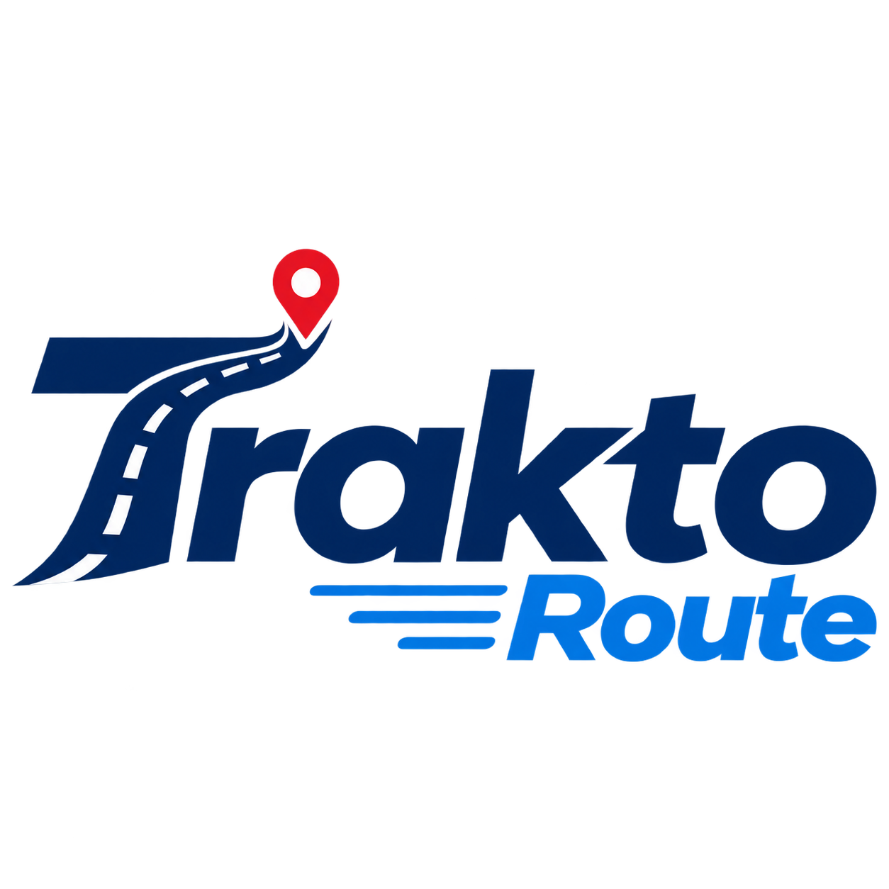
</th>

<th style="text-align: center;">

</th>

<th style="text-align: center;">
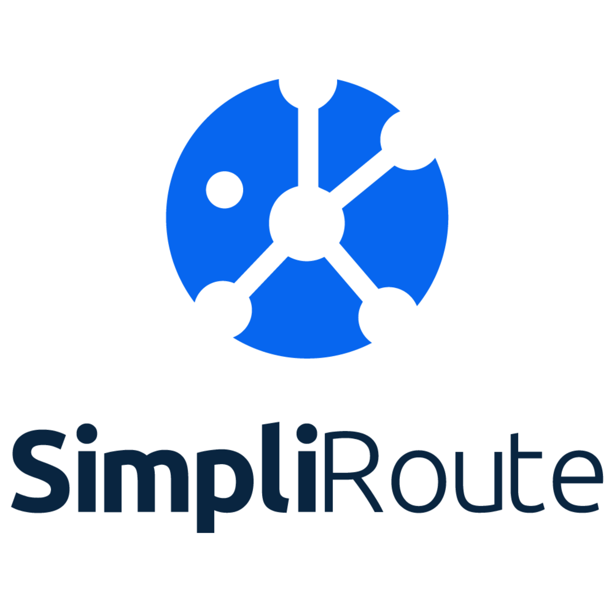
</th>

<th style="text-align: center;">

</th>

</tr>


<tr>

<td rowspan="2" style="vertical-align: middle; font-weight: bold;">
Perfil
</td>

<td>
Overview
</td>


<td>

<i>
Trakto Route es una solución móvil Android orientada a mejorar la trazabilidad de viajes de transporte de carga. La aplicación está desarrollada en Kotlin y consume una API REST propia implementada en Java con Spring Boot, con persistencia centralizada en MySQL. Diferencia las capacidades disponibles para responsables de empresas transportistas y para clientes que consultan sus envíos.
</i>

</td>


<td>

<i>
Samsara es una plataforma integral de gestión de flotas que combina telemática, seguridad, mantenimiento y monitoreo operativo mediante software, sensores y dispositivos conectados.
</i>

</td>


<td>

<i>
SimpliRoute es una plataforma SaaS enfocada en la planificación de rutas, monitoreo de operaciones y optimización logística para empresas de distribución y transporte.
</i>

</td>


<td>

<i>
DispatchTrack es una plataforma especializada en gestión de última milla que permite planificar, monitorear entregas y mejorar la comunicación entre operadores y conductores.
</i>

</td>

</tr>


<tr>

<td>
Ventaja competitiva<br>
¿Qué valor ofrece a los clientes?
</td>


<td>

<i>

<ul>

<li>
Registro digital de viajes desde campo.
</li>

<li>
Seguimiento del estado del viaje mediante información centralizada.
</li>

<li>
Adaptación inicial a escenarios con conectividad variable.
</li>

<li>
Separación de funcionalidades según rol del usuario.
</li>

</ul>

</i>

</td>


<td>

<i>

<ul>

<li>
Visibilidad integral de flotas.
</li>

<li>
Analítica avanzada mediante telemática.
</li>

<li>
Herramientas de seguridad y mantenimiento preventivo.
</li>

</ul>

</i>

</td>


<td>

<i>

<ul>

<li>
Optimización automática de rutas.
</li>

<li>
Seguimiento en tiempo real.
</li>

<li>
Reducción de costos operativos.
</li>

</ul>

</i>

</td>


<td>

<i>

<ul>

<li>
Control especializado de entregas.
</li>

<li>
Mejora de experiencia del cliente final.
</li>

<li>
Seguimiento de operaciones de última milla.
</li>

</ul>

</i>

</td>

</tr>


<tr>

<td rowspan="2" style="vertical-align: middle; font-weight: bold;">
Perfil de Marketing
</td>


<td>
Mercado objetivo
</td>


<td>

<i>

<ul>

<li>
Empresas peruanas de transporte de carga.
</li>

<li>
Clientes que requieren servicios de transporte de carga.
</li>

<li>
Empresas pequeñas y medianas que requieren mejorar la supervisión de viajes.
</li>

</ul>

</i>

</td>


<td>

<i>

<ul>

<li>
Empresas con flotas medianas y grandes.
</li>

<li>
Organizaciones que requieren control integral de vehículos.
</li>

<li>
Empresas con necesidades avanzadas de monitoreo.
</li>

</ul>

</i>

</td>


<td>

<i>

<ul>

<li>
Empresas de logística y distribución.
</li>

<li>
Retail y operadores con múltiples rutas.
</li>

<li>
Empresas que buscan eficiencia operacional.
</li>

</ul>

</i>

</td>


<td>

<i>

<ul>

<li>
Empresas enfocadas en distribución.
</li>

<li>
Comercio electrónico.
</li>

<li>
Operaciones de última milla.
</li>

</ul>

</i>

</td>

</tr>


<tr>

<td>
Estrategias de Marketing
</td>


<td>

<i>

<ul>

<li>
Pilotos B2B con empresas de transporte.
</li>

<li>
Demostraciones funcionales.
</li>

<li>
Validación mediante usuarios reales.
</li>

</ul>

</i>

</td>


<td>

<i>

<ul>

<li>
Venta consultiva empresarial.
</li>

<li>
Demostraciones online.
</li>

<li>
Enfoque en seguridad y eficiencia.
</li>

</ul>

</i>

</td>


<td>

<i>

<ul>

<li>
Demostraciones comerciales.
</li>

<li>
Contenido educativo.
</li>

<li>
Posicionamiento basado en optimización logística.
</li>

</ul>

</i>

</td>


<td>

<i>

<ul>

<li>
Venta empresarial directa.
</li>

<li>
Demostraciones personalizadas.
</li>

<li>
Enfoque en resultados operativos.
</li>

</ul>

</i>

</td>

</tr>


<tr>

<td rowspan="3" style="vertical-align: middle; font-weight: bold;">
Perfil de producto
</td>


<td>
Productos & Servicios
</td>


<td>

<i>

<ul>

<li>
Aplicación móvil Android desarrollada en Kotlin.
</li>

<li>
API REST desarrollada en Java con Spring Boot.
</li>

<li>
Registro de viajes, avances e incidencias.
</li>

<li>
Línea de tiempo del recorrido.
</li>

<li>
Persistencia centralizada en MySQL mediante el backend.
</li>

</ul>

</i>

</td>


<td>

<i>

<ul>

<li>
Gestión de flotas.
</li>

<li>
Telemática vehicular.
</li>

<li>
Seguridad y mantenimiento.
</li>

<li>
Analítica operacional.
</li>

</ul>

</i>

</td>


<td>

<i>

<ul>

<li>
Planificación de rutas.
</li>

<li>
Monitoreo operativo.
</li>

<li>
Notificaciones e integraciones.
</li>

</ul>

</i>

</td>


<td>

<i>

<ul>

<li>
Planificación de entregas.
</li>

<li>
Seguimiento de última milla.
</li>

<li>
Aplicación para conductores.
</li>

</ul>

</i>

</td>

</tr>


<tr>

<td>
Precios & Costos
</td>

<td>
Modelo de suscripción pendiente de validación según tamaño de empresa y necesidades operativas.
</td>


<td>
Modelo basado en cotización según cantidad de vehículos y funcionalidades contratadas.
</td>


<td>
Planes según módulos y alcance operativo requerido.
</td>


<td>
Cotización empresarial según requerimientos del cliente.
</td>

</tr>


<tr>

<td>
Canales de distribución<br>(Web y/o Móvil)
</td>


<td>

<i>

<ul>

<li>
Aplicación móvil Android.
</li>

<li>
Servicios backend REST para la operación del producto.
</li>

<li>
Canales digitales B2B.
</li>

</ul>

</i>

</td>


<td>

<i>

<ul>

<li>
Plataforma web.
</li>

<li>
Aplicaciones móviles.
</li>

<li>
Hardware conectado.
</li>

</ul>

</i>

</td>


<td>

<i>

<ul>

<li>
Plataforma web.
</li>

<li>
Aplicaciones móviles.
</li>

</ul>

</i>

</td>


<td>

<i>

<ul>

<li>
Plataforma web.
</li>

<li>
Aplicación móvil.
</li>

</ul>

</i>

</td>

</tr>


<tr>

<td rowspan="4" style="vertical-align: middle; font-weight: bold;">
Análisis SWOT
</td>


<td>
Fortalezas
</td>

<td>
<ul>
<li>Enfoque específico en trazabilidad de viajes.</li>
<li>Separación por roles.</li>
<li>Adaptación inicial al contexto peruano.</li>
</ul>
</td>

<td>
<ul>
<li>Plataforma madura.</li>
<li>Amplio ecosistema tecnológico.</li>
<li>Hardware y analítica avanzada.</li>
</ul>
</td>

<td>
<ul>
<li>Especialización en optimización logística.</li>
<li>Experiencia regional.</li>
</ul>
</td>

<td>
<ul>
<li>Experiencia en última milla.</li>
<li>Solución especializada en entregas.</li>
</ul>
</td>

</tr>

<tr>

<td>
Debilidades
</td>


<td>
<ul>
<li>Sin adopción validada.</li>
<li>Sin resultados medidos.</li>
<li>Sin infraestructura telemática propia.</li>
</ul>
</td>


<td>
<ul>
<li>Mayor costo de implementación.</li>
<li>Puede ser complejo para necesidades pequeñas.</li>
</ul>
</td>

<td>
<ul>
<li>Puede superar necesidades básicas.</li>
<li>Menor enfoque en trazabilidad personalizada.</li>
</ul>
</td>

<td>
<ul>
<li>Mayor orientación hacia entrega final.</li>
<li>Menor ajuste para seguimiento general del viaje.</li>
</ul>
</td>

</tr>

<tr>

<td>
Oportunidades
</td>

<td>
<ul>
<li>Digitalización del transporte peruano.</li>
<li>Validación en escenarios de conectividad variable.</li>
<li>Integraciones futuras.</li>
</ul>
</td>

<td>
<ul>
<li>Crecimiento de IoT y analítica.</li>
<li>Mayor adopción empresarial.</li>
</ul>
</td>

<td>
<ul>
<li>Automatización logística.</li>
<li>Crecimiento del comercio digital.</li>
</ul>
</td>

<td>
<ul>
<li>Expansión de última milla.</li>
<li>Crecimiento del comercio electrónico.</li>
</ul>
</td>

</tr>

<tr>

<td>
Amenazas
</td>

<td>
<ul>
<li>Competidores consolidados.</li>
<li>Resistencia al cambio tecnológico.</li>
<li>Baja disposición de pago inicial.</li>
</ul>
</td>

<td>
<ul>
<li>Competidores regionales.</li>
<li>Costos elevados.</li>
</ul>
</td>

<td>
<ul>
<li>Plataformas globales con mayor inversión.</li>
</ul>
</td>

<td>
<ul>
<li>Soluciones integrales con mayor presencia.</li>
</ul>
</td>

</tr>

</table>

</div>


### 2.1.2. Estrategias y tácticas frente a competidores

En esta sección se presentan las principales estrategias y tácticas que **Trakto Route** plantea desarrollar para competir dentro del mercado de soluciones de gestión de flotas y operaciones de transporte de carga. Estas acciones buscan fortalecer la propuesta de valor del producto, generar diferenciación frente a las alternativas existentes y responder a las necesidades identificadas en empresas de transporte y clientes que requieren servicios de transporte de carga.

Las estrategias consideran el posicionamiento de Trakto Route frente a soluciones consolidadas como Samsara, SimpliRoute y DispatchTrack, priorizando la trazabilidad operativa, facilidad de adopción, accesibilidad móvil y adaptación al contexto de empresas que requieren mejorar la organización y seguimiento de sus operaciones.


## Estrategias


**Diferenciación del producto:**  

Trakto Route buscará diferenciarse frente a plataformas integrales de gestión de flotas mediante una solución enfocada específicamente en la trazabilidad operativa de viajes y transporte de carga. La propuesta estará orientada a centralizar progresivamente información relacionada con viajes, vehículos, conductores, rutas, incidencias e historial operativo, reduciendo la dependencia de registros dispersos y herramientas independientes.


**Enfoque en la trazabilidad de las operaciones:**  

Trakto Route priorizará la recopilación y organización de información asociada a las operaciones de transporte, incluyendo datos de viajes, rutas, paradas, descansos, retrasos e incidencias. Esto permitirá que las empresas puedan disponer de un historial organizado de sus operaciones y mejorar la visibilidad sobre el desarrollo de cada viaje.


**Experiencia de usuario accesible:**  

Trakto Route buscará ofrecer una experiencia de uso sencilla e intuitiva mediante interfaces diferenciadas según el rol del usuario, permitiendo que supervisores de transporte y clientes autorizados puedan acceder a la información que corresponde a su rol sin requerir conocimientos técnicos especializados.


**Adaptación al contexto operativo de las empresas:**  

Trakto Route se desarrollará considerando las necesidades específicas de empresas de transporte de carga y empresas o comerciantes que contratan estos servicios, especialmente aquellas relacionadas con procesos manuales, dificultades de seguimiento operativo, conectividad limitada y necesidad de una transición progresiva hacia herramientas digitales.


**Enfoque en movilidad y acceso operativo:**  

Trakto Route priorizará el acceso mediante dispositivos móviles, permitiendo que los responsables de la operación puedan consultar información relacionada con viajes, vehículos, conductores, rutas e incidencias desde aplicaciones diseñadas para escenarios operativos de campo.


## Tácticas


**Implementación de retroalimentación de usuarios:**  

Se recopilarán y analizarán comentarios de supervisores, gestores de flota, coordinadores logísticos y operadores de transporte con la finalidad de identificar problemas actuales, necesidades emergentes y oportunidades de mejora. Esta información permitirá priorizar funcionalidades que generen mayor valor para los usuarios.


**Monitoreo de la competencia:**  

Se realizará un seguimiento periódico de soluciones existentes en el mercado como Samsara, SimpliRoute, DispatchTrack y otras plataformas relacionadas con gestión de flotas y logística. Este análisis permitirá identificar nuevas funcionalidades, tendencias tecnológicas y oportunidades de diferenciación para Trakto Route.


**Marketing digital B2B:**  

Se desarrollarán acciones de comunicación dirigidas a empresas de transporte de carga y empresas o comerciantes que contratan estos servicios mediante contenido relacionado con trazabilidad de viajes, organización de operaciones, gestión de incidencias y digitalización logística. El objetivo será posicionar a Trakto Route como una alternativa orientada a mejorar la visibilidad y control operativo.


**Contacto y demostraciones con empresas:**  

Se establecerá contacto con empresas del sector transporte y logística para presentar la propuesta de valor de Trakto Route mediante demostraciones funcionales. Estas actividades permitirán obtener validación temprana, identificar necesidades reales y evaluar la aceptación de la solución.


**Validación mediante pruebas con usuarios:**  

Se realizarán pruebas con representantes de los segmentos objetivo para evaluar la facilidad de uso, comprensión de funcionalidades y utilidad de la información proporcionada por Trakto Route. Los resultados permitirán validar hipótesis del producto y definir mejoras antes de ampliar su alcance funcional.


**Mejora continua de la solución:**  

Trakto Route seguirá un proceso de mejora continua basado en resultados obtenidos mediante entrevistas, pruebas con usuarios, análisis competitivo y retroalimentación del mercado. Esto permitirá mantener una evolución alineada con las necesidades reales del sector transporte y logística.


<div style="page-break-after: always;"></div>


## 2.2. Entrevistas


### 2.2.1. Diseño de entrevistas


Las entrevistas tienen como objetivo comprender las necesidades, dificultades y procesos actuales de los segmentos objetivo de **Trakto Route** respecto a la gestión de viajes, vehículos, conductores, rutas e incidencias dentro de las operaciones de transporte.

Asimismo, buscan identificar las herramientas utilizadas actualmente, los métodos empleados para registrar y consultar información operativa, las principales limitaciones existentes y los factores considerados importantes al momento de adoptar una solución tecnológica.

La información obtenida permitirá validar las hipótesis planteadas durante el proceso Lean UX, identificar oportunidades de mejora y determinar las funcionalidades que generan mayor valor para los usuarios.


## Segmento objetivo 1: Empresas de transporte de carga


1. ¿Cuánto tiempo lleva su empresa realizando operaciones de transporte de carga?

2. ¿Cuántos vehículos y conductores gestionan actualmente?

3. ¿Cómo organizan y consultan actualmente la información relacionada con los viajes realizados?

4. ¿Qué herramientas o sistemas utilizan actualmente para gestionar información de vehículos, conductores, rutas y operaciones?

5. ¿Cuáles son los principales problemas o dificultades que enfrentan al gestionar sus operaciones de transporte?

6. ¿Cómo registran actualmente paradas, descansos, retrasos, problemas, accidentes u otras incidencias ocurridas durante un viaje?

7. ¿Cómo consultan el estado de un viaje cuando necesitan conocer el avance de una operación en curso?

8. ¿Qué procedimiento siguen actualmente cuando ocurre una incidencia durante una operación de transporte?

9. ¿Mantienen algún registro histórico de viajes, rutas e incidencias? ¿Cómo gestionan actualmente esta información?

10. ¿Qué información considera más importante consultar para conocer el estado y desempeño de una operación de transporte?

11. ¿Qué dificultades encuentra al administrar información relacionada con vehículos, conductores, rutas y viajes?

12. ¿Qué tan útil sería para su empresa contar con una aplicación móvil que permita organizar y consultar información operativa desde un solo lugar?


## Segmento objetivo 2: Clientes que requieren servicios de transporte de carga

1. ¿Qué tipo de productos o mercancías envía habitualmente y con qué frecuencia contrata servicios de transporte de carga?
2. ¿Qué información necesita conocer desde que entrega la mercancía hasta que llega a su destino?
3. ¿Cómo consulta actualmente el estado o avance de sus envíos?
4. ¿Qué canales utiliza para comunicarse con la empresa transportista?
5. ¿Qué dificultades encuentra cuando necesita conocer dónde se encuentra su mercancía o cuánto falta para la entrega?
6. ¿Ha tenido retrasos, daños, pérdidas u otros problemas durante un traslado? ¿Cómo fue informado?
7. ¿Qué información considera más importante recibir cuando ocurre un retraso o incidencia?
8. ¿Con qué frecuencia solicita actualizaciones sobre un envío en curso?
9. ¿Mantiene algún registro de envíos anteriores? ¿Qué información conserva?
10. ¿Qué tan importante es para usted conocer el progreso del viaje sin realizar llamadas o enviar mensajes al transportista?
11. ¿Qué dispositivo y canales digitales utiliza con mayor frecuencia para consultar información de sus operaciones o pedidos?
12. ¿Qué tan útil sería una aplicación móvil que le permita consultar el estado, progreso e incidencias relevantes de sus envíos desde un solo lugar?

<div style="page-break-after: always;"></div>

### 2.2.2. Registro de entrevistas

En esta sección se presenta el registro de las entrevistas realizadas a los usuarios pertenecientes a los segmentos objetivo de **Trakto Route**. Para cada entrevista se registran los datos del entrevistado, la evidencia visual, el enlace al video, la duración correspondiente y un resumen de las principales respuestas obtenidas.

---

## Segmento objetivo 1: Empresas de transporte de carga

### Entrevista 1

| Campo | Detalle |
|---|---|
| Nombres y apellidos | Gianfranco Quispe |
| Segmento objetivo | Empresas de transporte de carga |
| Cargo / actividad | Empresario del sector de transporte y logística |
| Duración | 4:34 |
| URL del video | [Ver video](https://upcedupe-my.sharepoint.com/:v:/g/personal/u202218899_upc_edu_pe/IQDkzObcE5ATSpmZvlKaZk58ARkz3Yp5qF9_nS_ZYSTAGaQ?nav=eyJyZWZlcnJhbEluZm8iOnsicmVmZXJyYWxBcHAiOiJPbmVEcml2ZUZvckJ1c2luZXNzIiwicmVmZXJyYWxBcHBQbGF0Zm9ybSI6IldlYiIsInJlZmVycmFsTW9kZSI6InZpZXciLCJyZWZlcnJhbFZpZXciOiJNeUZpbGVzTGlua0NvcHkifX0&e=QOjMzT) |

<p align="center">
  
</p>

**Resumen:**  
Gianfranco Quispe es un empresario con cinco años de experiencia en el sector logístico y de transporte. Durante la entrevista destacó la importancia de utilizar tecnología para mejorar la eficiencia y seguridad de las operaciones, especialmente en zonas rurales del Perú. Actualmente emplea herramientas GPS y medios de comunicación en tiempo real para supervisar y coordinar los viajes. También recopila información de sus clientes mediante encuestas y sistemas de calificación. Frente a incrementos de demanda, aumenta temporalmente la disponibilidad de vehículos y reorganiza sus operaciones. Sus respuestas evidencian la necesidad de contar con una aplicación como **Trakto Route**, que permita centralizar la gestión de vehículos, conductores, rutas y viajes.

---

### Entrevista 2

| Campo | Detalle |
|---|---|
| Nombres y apellidos | Diego Cisneros |
| Segmento objetivo | Empresas de transporte de carga |
| Cargo / actividad | Personal relacionado con la gestión de transporte |
| Duración | 6:25 |
| URL del video | [Ver video](https://upcedupe-my.sharepoint.com/:v:/g/personal/u202218899_upc_edu_pe/IQA-12ReLDzQR49ealZCQkCfATl5EcCRvhjS1SzkyXFY-xU?nav=eyJyZWZlcnJhbEluZm8iOnsicmVmZXJyYWxBcHAiOiJPbmVEcml2ZUZvckJ1c2luZXNzIiwicmVmZXJyYWxBcHBQbGF0Zm9ybSI6IldlYiIsInJlZmVycmFsTW9kZSI6InZpZXciLCJyZWZlcnJhbFZpZXciOiJNeUZpbGVzTGlua0NvcHkifX0&e=Ujrc4n) |

<p align="center">
  
</p>

**Resumen:**  
Diego Cisneros considera que una aplicación móvil permitiría automatizar y optimizar diferentes procesos relacionados con el transporte, brindando mayor control sobre las operaciones. Señala que uno de los principales problemas son los retrasos ocasionados por el mal estado de algunas carreteras. Actualmente utiliza Excel para registrar información sobre los camiones, controlar su estado y programar mantenimientos según el tiempo de uso. Esto demuestra la necesidad de una solución como **Trakto Route**, donde la información de vehículos, viajes, rutas y estados pueda mantenerse centralizada y disponible de manera más rápida.

---

### Entrevista 3

| Campo | Detalle |
|---|---|
| Nombres y apellidos | Valeria Cardenas |
| Segmento objetivo | Empresas de transporte de carga |
| Cargo / actividad | Administradora en empresa de transporte de carga |
| Duración | 4:08 |
| URL del video | [Ver video](https://upcedupe-my.sharepoint.com/:v:/g/personal/u202218899_upc_edu_pe/IQBtRonP6CraSJUSB36JKYOyActf48po9v-Z1ghUJw-bAgE?nav=eyJyZWZlcnJhbEluZm8iOnsicmVmZXJyYWxBcHAiOiJPbmVEcml2ZUZvckJ1c2luZXNzIiwicmVmZXJyYWxBcHBQbGF0Zm9ybSI6IldlYiIsInJlZmVycmFsTW9kZSI6InZpZXciLCJyZWZlcnJhbFZpZXciOiJNeUZpbGVzTGlua0NvcHkifX0&e=6Xlw1F) |

<p align="center">
  
</p>

**Resumen:**  
Valeria Cardenas cuenta con dos años de experiencia como administradora en el sector de transporte de carga. Menciona que las condiciones geográficas y de infraestructura del país representan dificultades importantes para las operaciones. Actualmente utiliza herramientas como Excel y rastreo satelital para gestionar los envíos y consultar su avance. También considera importantes la seguridad, puntualidad y adecuada gestión de los vehículos y conductores. La entrevista evidencia la necesidad de centralizar la información operativa y mantener un historial de vehículos, viajes y recorridos mediante una solución móvil como **Trakto Route**.

---

## Segmento objetivo 2: Clientes que requieren servicios de transporte de carga

### Entrevista 4

| Campo | Detalle |
|---|---|
| Nombres y apellidos | Rodrigo Guerra |
| Segmento objetivo | Clientes que requieren servicios de transporte de carga |
| Cargo / actividad | Emprendedor |
| Duración | 5:49 |
| URL del video | [Ver video](https://upcedupe-my.sharepoint.com/:v:/g/personal/u202218899_upc_edu_pe/IQAV3DQLGB33SpVkVyUbv9pQAUsYOLoLLNGkZGiAaly_qig?nav=eyJyZWZlcnJhbEluZm8iOnsicmVmZXJyYWxBcHAiOiJPbmVEcml2ZUZvckJ1c2luZXNzIiwicmVmZXJyYWxBcHBQbGF0Zm9ybSI6IldlYiIsInJlZmVycmFsTW9kZSI6InZpZXciLCJyZWZlcnJhbFZpZXciOiJNeUZpbGVzTGlua0NvcHkifX0&e=wJlceN) |

<p align="center">
  
</p>

**Resumen:**  
Rodrigo Guerra es un emprendedor que depende de servicios de transporte de mercancías para desarrollar sus actividades comerciales. Durante la entrevista destacó problemas relacionados con la falta de visibilidad de los envíos y el control de los costos. Considera importante poder consultar el estado de un traslado y conocer su avance de forma sencilla. Mostró interés en utilizar una aplicación móvil que mejore la transparencia de las operaciones y destacó que la interfaz debería ser intuitiva y contar con un diseño moderno.

---

### Entrevista 5

| Campo | Detalle |
|---|---|
| Nombres y apellidos | Alejandro Medina |
| Segmento objetivo | Clientes que requieren servicios de transporte de carga |
| Cargo / actividad | Personal de empresa de mobiliario |
| Duración | 3:35 |
| URL del video | [Ver video](https://upcedupe-my.sharepoint.com/:v:/g/personal/u202218899_upc_edu_pe/IQCYIb0z_NwBTLbajN-6r4f9AWyuPx7pVcLQDYFiSKfXhjQ?nav=eyJyZWZlcnJhbEluZm8iOnsicmVmZXJyYWxBcHAiOiJPbmVEcml2ZUZvckJ1c2luZXNzIiwicmVmZXJycmFsTW9kZSI6InZpZXciLCJyZWZlcnJhbFZpZXciOiJNeUZpbGVzTGlua0NvcHkifX0&e=ah7IkZ) |

<p align="center">
  
</p>

**Resumen:**  
Alejandro Medina trabaja en una empresa dedicada al sector mobiliario y considera fundamental el servicio de transporte para realizar las entregas de sus productos. Entre los principales problemas identifica los retrasos, los posibles daños a la mercancía y la falta de comunicación con los transportistas. Considera útil disponer de una aplicación que permita conocer el estado de los envíos y mejorar la transparencia durante el traslado. También menciona como importante conocer la ubicación y el progreso de la entrega. Sus respuestas muestran interés por una solución que facilite el seguimiento y reduzca la incertidumbre durante las operaciones de transporte.


---

### Entrevista 6

| Campo | Detalle |
|---|---|
| Nombres y apellidos | Jael Pinta |
| Segmento objetivo | Clientes que requieren servicios de transporte de carga |
| Cargo / actividad | Comerciante mayorista de prendas |
| Duración | 4:12 |
| URL del video | [Ver video](https://upcedupe-my.sharepoint.com/:v:/g/personal/u202218899_upc_edu_pe/IQAz-85vOfF1R46gy8UA0z54AfCV6TF7BxvrpjY63Y2yBAs?nav=eyJyZWZlcnJhbEluZm8iOnsicmVmZXJyYWxBcHAiOiJPbmVEcml2ZUZvckJ1c2luZXNzIiwicmVmZXJyYWxBcHBQbGF0Zm9ybSI6IldlYiIsInJlZmVycmFsTW9kZSI6InZpZXciLCJyZWZlcnJhbFZpZXciOiJNeUZpbGVzTGlua0NvcHkifX0&e=CS9mfl) |

<p align="center">
  
</p>

**Resumen:**  
Jael Pinta se dedica a la venta mayorista de prendas hacia diferentes zonas del interior del país y utiliza servicios de transporte para realizar sus envíos. Su principal preocupación es la seguridad de la mercancía, debido a que en algunas ocasiones los productos no llegan completos o en las mismas condiciones en las que fueron enviados. También menciona que la comunicación mediante canales tradicionales puede resultar lenta y generar pérdida de tiempo al consultar el estado de los envíos. Considera importante contar con mayor información sobre el traslado y mejorar la organización y trazabilidad de las operaciones.


<div style="page-break-after: always;"></div>


### 2.2.3. Análisis de entrevistas

A partir de las **siete entrevistas realizadas**, distribuidas en **tres participantes del segmento de empresas de transporte de carga** y **cuatro participantes del segmento de clientes que requieren servicios de transporte de carga**, se analizaron las principales características, necesidades, dificultades y expectativas identificadas. El análisis considera aspectos objetivos y subjetivos recurrentes en las respuestas y sirve como base para la construcción de los User Personas y demás artefactos de Needfinding.

### Segmento objetivo 1: Empresas de transporte de carga

A partir de las tres entrevistas realizadas a representantes de empresas de transporte de carga, se identificó que el **100 % de los entrevistados considera importante conocer la ubicación de sus vehículos durante el desarrollo de los viajes**. Asimismo, el **66.7 % indicó tener dificultades para obtener de manera inmediata información sobre el estado de un recorrido cuando ocurre un retraso, parada no prevista u otra incidencia**.

Respecto a la comunicación, el **100 % señaló que mantiene contacto con los conductores durante las operaciones**, principalmente cuando necesita conocer el estado del viaje o resolver algún inconveniente. Sin embargo, el **66.7 % manifestó interés en contar con una solución que facilite la comunicación y permita relacionarla con la información del recorrido**.

En cuanto a la trazabilidad, el **66.7 % indicó que actualmente la información relacionada con vehículos, conductores, rutas e incidencias se encuentra distribuida entre diferentes medios o herramientas**, dificultando la consulta posterior de lo ocurrido durante una operación.

Finalmente, el **100 % de los entrevistados mostró interés en disponer de una plataforma que centralice la información de sus operaciones de transporte**, destacando como funcionalidades de mayor valor la geolocalización, la visualización de rutas y recorridos, el registro de incidencias, la comunicación con los conductores y el historial de viajes.

Estos resultados permiten identificar como características comunes del segmento la necesidad de **visibilidad operativa, control, comunicación rápida y trazabilidad de los recorridos**. Por ello, **Trakto Route** puede responder a estas necesidades mediante la centralización de información relacionada con cada operación de transporte.

<div style="page-break-after: always;"></div>

### Segmento objetivo 2: Clientes que requieren servicios de transporte de carga

A partir de las cuatro entrevistas realizadas a clientes que requieren servicios de transporte de carga, se identificó que el **100 % presenta la necesidad de conocer o mantener organizado el estado y progreso de la mercancía durante el traslado**. La falta de visibilidad y la dificultad para obtener información de manera oportuna aparecen de forma recurrente en las experiencias descritas.

Respecto a la comunicación, el **75 % de los entrevistados manifestó dificultades o ineficiencias al comunicarse con transportistas o conductores para conocer el estado de la carga**. Esto evidencia una dependencia de canales tradicionales que puede generar demoras y pérdida de tiempo al solicitar actualizaciones.

En relación con la seguridad de la mercancía, el **50 % manifestó preocupación por daños, pérdidas o por recibir productos en condiciones diferentes a las esperadas**. Asimismo, el **25 % mencionó explícitamente los retrasos como un problema relevante durante las operaciones de transporte**.

El **50 % expresó de manera explícita interés en utilizar una aplicación móvil o solución tecnológica que facilite el seguimiento del envío**, mientras que el resto de los participantes manifestó la necesidad de disponer de mayor información, organización y trazabilidad durante el traslado.

A partir de estos resultados, se identifica que este segmento se caracteriza principalmente por buscar **mayor visibilidad del envío, comunicación más eficiente, seguridad de la mercancía y trazabilidad del traslado**. Estas características respaldan el enfoque de **Trakto Route** como una aplicación móvil que permite consultar el estado, progreso e incidencias relevantes asociadas a los envíos.

<div style="page-break-after: always;"></div>


## 2.3. Needfinding

### 2.3.1. User Personas

Las siguientes fichas de **User Persona** fueron elaboradas en **UXPressia** a partir del análisis de los segmentos objetivo de **Trakto Route**, considerando las necesidades, comportamientos, objetivos y dificultades identificadas durante el proceso de entrevistas. Cada ficha representa un arquetipo de usuario que permite comprender mejor el contexto en el que se desarrollan las operaciones de transporte y las necesidades que Trakto Route busca atender.

Para el primer segmento, correspondiente a **empresas de transporte de carga**, se identificó un perfil relacionado con la gestión y supervisión de las operaciones de transporte, cuyo principal objetivo es mantener organizada la información de los viajes, vehículos, conductores y rutas. Este usuario necesita consultar el estado de los viajes, registrar incidencias y acceder al historial de las operaciones para mantener una adecuada trazabilidad de las actividades realizadas.

Para el segundo segmento, correspondiente a **clientes que requieren servicios de transporte de carga**, se identificó un perfil responsable de hacer seguimiento a mercancías enviadas mediante empresas transportistas. Este usuario valora especialmente conocer el estado y progreso del envío, recibir información oportuna sobre retrasos o incidencias y reducir la dependencia de llamadas o mensajes para solicitar actualizaciones.

**1. Primer segmento: Empresas de transporte de carga**


**2. Segundo segmento: Clientes que requieren servicios de transporte de carga**


<div style="page-break-after: always;"></div>

### 2.3.2. User Task Matrix

El **User Task Matrix** compara las principales tareas que realizan actualmente los representantes de ambos segmentos, independientemente de la existencia de Trakto Route. **Carlos Mendoza** representa a una empresa de transporte de carga y **Andrea Salazar** representa a una empresa cliente que contrata servicios de transporte.

| **User Task** | **Carlos Mendoza** | | **Andrea Salazar** | |
|---|---|---|---|---|
| | **Frecuencia** | **Importancia** | **Frecuencia** | **Importancia** |
| Revisar viajes programados y en curso | Siempre | Alta | A veces | Media |
| Verificar vehículo y conductor asignados | Siempre | Alta | Rara vez | Baja |
| Consultar el estado de un traslado | Siempre | Alta | Siempre | Alta |
| Consultar el progreso del viaje | Siempre | Alta | Siempre | Alta |
| Identificar retrasos o incidencias | Siempre | Alta | Siempre | Alta |
| Registrar información sobre incidencias | A veces | Alta | Nunca | Baja |
| Comunicarse con la contraparte cuando existe un problema | A veces | Alta | A veces | Alta |
| Consultar información de operaciones o envíos anteriores | A veces | Media | A veces | Media |
| Confirmar la finalización o entrega de un traslado | Siempre | Alta | Siempre | Alta |
| Revisar antecedentes de vehículos y conductores | A veces | Media | Nunca | Baja |
| Coordinar recursos de transporte | Siempre | Alta | Nunca | Baja |
| Solicitar actualizaciones del envío | Rara vez | Baja | Siempre | Alta |

### Análisis de la User Task Matrix

La matriz evidencia que ambos segmentos coinciden en la necesidad de conocer el **estado y progreso de una operación**, identificar retrasos o incidencias y confirmar su finalización. La diferencia principal se encuentra en el nivel de responsabilidad sobre la operación.

**Carlos Mendoza**, como supervisor de flota, administra directamente los recursos y el ciclo de vida del viaje, por lo que necesita verificar vehículos, conductores, rutas e incidencias y registrar información operativa.

**Andrea Salazar**, como responsable logística de una empresa cliente, no administra la flota del transportista. Su prioridad es obtener visibilidad del envío contratado, reducir la necesidad de solicitar actualizaciones manuales y conocer oportunamente los eventos que afectan la entrega.

Esta diferencia permite delimitar funcionalidades por rol: el primer segmento requiere capacidades de **gestión**, mientras que el segundo requiere principalmente capacidades de **consulta y seguimiento**.

<div style="page-break-after: always;"></div>

### 2.3.3. User Journey Mapping

En esta sección se presentan los **User Journey Maps elaborados en UXPressia** correspondientes a cada uno de los User Personas identificados para los segmentos objetivo de Trakto Route. Estos diagramas permiten representar de manera secuencial las actividades que realizan actualmente los usuarios durante una operación de transporte, desde la preparación del viaje hasta su finalización.

Para este análisis se elaboraron las versiones **As-Is** de los User Journey Maps, por lo que se representa la situación actual de los usuarios **sin considerar la existencia de Trakto Route como solución**. El objetivo es identificar las acciones realizadas durante el proceso, así como los pensamientos, emociones, dificultades y oportunidades que aparecen en cada etapa.

Cada User Journey Map se encuentra vinculado con el User Persona correspondiente. **Carlos Mendoza** representa al segmento de empresas de transporte de carga, mientras que **Andrea Salazar** representa al segmento de clientes que requieren servicios de transporte de carga.

#### 1. As-Is User Journey Map – Carlos Mendoza

El primer User Journey Map corresponde a **Carlos Mendoza**, supervisor de flota y representante del segmento de **empresas de transporte de carga**.

El journey representa el proceso actual que realiza Carlos para preparar y supervisar una operación de transporte. El recorrido comienza con la preparación del viaje y la verificación de los recursos necesarios, continúa con el inicio y seguimiento de la operación, contempla la gestión de posibles incidencias y finaliza con la revisión y registro de la información correspondiente al viaje realizado.

Durante este proceso, Carlos necesita consultar información sobre vehículos, conductores y rutas, verificar el estado de las operaciones, identificar retrasos o problemas y mantener registros que posteriormente le permitan revisar lo ocurrido durante cada viaje.

Las principales etapas consideradas en su As-Is User Journey Map son:

1. **Preparación del viaje:** revisa la información del viaje, la ruta, el vehículo y el conductor asignado.
2. **Inicio del viaje:** verifica que la operación haya comenzado de acuerdo con lo planificado y registra la información correspondiente al inicio.
3. **Seguimiento de la operación:** consulta el estado del viaje y obtiene información sobre su desarrollo mediante los medios disponibles actualmente.
4. **Gestión de incidencias:** identifica retrasos, paradas, problemas o accidentes y coordina las acciones necesarias para responder ante la situación.
5. **Finalización del viaje:** verifica la culminación de la operación, registra la información correspondiente y revisa lo ocurrido durante el recorrido.

A lo largo de estas etapas se identifican dificultades relacionadas con la **información distribuida entre diferentes medios, la necesidad de consultar constantemente el estado de las operaciones y la dificultad para mantener un historial organizado de viajes, vehículos, conductores e incidencias**.


<div style="page-break-after: always;"></div>


#### 2. As-Is User Journey Map – Andrea Salazar

El segundo User Journey Map corresponde a **Andrea Salazar**, responsable logística de una empresa cliente y representante del segmento de **clientes que requieren servicios de transporte de carga**.

El journey representa el proceso actual que realiza Andrea para hacer seguimiento a los envíos que su organización contrata con empresas transportistas. El recorrido comienza cuando coordina el despacho y obtiene los datos básicos del servicio, continúa con la consulta del avance del traslado, contempla la comunicación con el transportista ante retrasos o incidencias y finaliza cuando confirma la llegada de la mercancía.

Durante este proceso, Andrea necesita conocer el estado y progreso de los envíos contratados, consultar información relevante del traslado y comunicarse con el transportista cuando se presentan retrasos, daños u otras incidencias.

Las principales etapas consideradas en su As-Is User Journey Map son:

1. **Coordinación del envío:** confirma con el transportista los datos del servicio y de la mercancía.
2. **Inicio del traslado:** verifica que el envío haya iniciado y conserva los datos disponibles para seguimiento.
3. **Seguimiento del envío:** solicita o consulta actualizaciones para conocer el avance del traslado.
4. **Atención de incidencias:** se comunica con el transportista cuando existe un retraso, daño, pérdida u otro problema.
5. **Confirmación de entrega:** verifica la llegada de la mercancía y conserva la información relevante del servicio.

A lo largo de estas etapas se identifican dificultades relacionadas con la **falta de visibilidad continua, la dependencia de llamadas o mensajes, la demora para obtener actualizaciones y la incertidumbre cuando ocurre una incidencia**.


Los User Journey Maps permiten identificar similitudes y diferencias entre ambos perfiles. Mientras **Carlos Mendoza** necesita administrar directamente viajes, vehículos, conductores e incidencias, **Andrea Salazar** necesita principalmente consultar el progreso de los envíos contratados y recibir información oportuna cuando el servicio presenta cambios o problemas.

En ambos casos, el journey evidencia oportunidades relacionadas con la **centralización de la información, organización de los registros, trazabilidad de los viajes y acceso eficiente al historial de las operaciones**. Estas oportunidades servirán posteriormente como insumo para definir y priorizar las funcionalidades de la solución.

<div style="page-break-after: always;"></div>


### 2.3.4. Empathy Mapping

En esta sección se presentan los **Empathy Maps elaborados en UXPressia** para cada uno de los User Personas identificados en los segmentos objetivo de Trakto Route. Estos mapas permiten comprender con mayor profundidad las necesidades, comportamientos, pensamientos, preocupaciones y expectativas de los usuarios dentro de su contexto actual de trabajo.

Para su elaboración, se tomó como referencia la información obtenida durante las entrevistas y el análisis realizado previamente. Cada Empathy Map se encuentra vinculado con su respectivo User Persona y organiza los principales hallazgos relacionados con lo que el usuario necesita hacer, dice, ve, hace, escucha, piensa y siente. Asimismo, se identifican sus principales **Pains** y **Gains**, permitiendo comprender las dificultades que enfrenta actualmente y los resultados que espera alcanzar.

Al igual que los User Journey Maps As-Is, los Empathy Maps representan la **situación actual de los usuarios sin considerar a Trakto Route como solución**, permitiendo identificar posteriormente oportunidades de mejora a partir de problemas y necesidades reales.

#### 1. Empathy Map del primer segmento: Empresas de transporte de carga

El primer Empathy Map corresponde a **Carlos Mendoza**, supervisor de flota y representante del segmento de **empresas de transporte de carga**. Este perfil necesita gestionar información relacionada con los viajes, vehículos, conductores y rutas de la empresa, además de consultar el estado de las operaciones y atender las incidencias que puedan presentarse durante su desarrollo.

En su trabajo cotidiano, Carlos necesita revisar los viajes programados, verificar los vehículos y conductores asignados, consultar las rutas, conocer el estado de las operaciones y revisar los eventos ocurridos durante los recorridos. Para realizar estas actividades puede depender de diferentes registros, mensajes, llamadas u otras herramientas utilizadas por la empresa.

Entre sus principales preocupaciones se encuentran la dificultad para encontrar rápidamente información sobre una operación, la existencia de datos distribuidos entre diferentes medios, los posibles errores en los registros y la dificultad para consultar posteriormente lo ocurrido durante viajes anteriores.

Sus principales **Pains** están relacionados con la información dispersa, el tiempo necesario para consultar diferentes fuentes, la dificultad para mantener registros organizados y la necesidad de obtener información suficiente cuando ocurre un retraso, problema o incidencia.

Como principales **Gains**, Carlos busca disponer de información organizada y accesible, mantener una mayor trazabilidad de los viajes, facilitar la revisión de incidencias y contar con registros que le permitan evaluar posteriormente las operaciones, los vehículos y los conductores.


#### 2. Empathy Map del segundo segmento: Clientes que requieren servicios de transporte de carga

El segundo Empathy Map corresponde a **Andrea Salazar**, responsable logística de una empresa cliente. Su responsabilidad no es administrar la flota del transportista, sino asegurar que las mercancías contratadas lleguen al destino esperado y disponer de información suficiente para responder ante retrasos o problemas.

En su actividad cotidiana, Andrea coordina despachos, conserva datos del servicio, solicita actualizaciones sobre el traslado y se comunica con el transportista cuando necesita conocer el avance del envío o cuando ocurre una incidencia.

Entre sus principales preocupaciones se encuentran la **falta de visibilidad**, la demora en recibir respuestas, los retrasos, los posibles daños o pérdidas de mercancía y la dificultad para explicar a otras personas de su organización qué está ocurriendo con un envío.

Sus principales **Pains** son la dependencia de llamadas o mensajes, la información incompleta, la incertidumbre frente a retrasos y la falta de un historial sencillo de consultar.

Como principales **Gains**, Andrea busca consultar el estado del envío de forma autónoma, conocer oportunamente eventos relevantes, disponer de información histórica y reducir el tiempo empleado en solicitar actualizaciones manuales.


Los Empathy Maps permiten identificar que ambos perfiles comparten necesidades relacionadas con la **organización de la información, trazabilidad de las operaciones, consulta de incidencias y acceso a registros históricos**. Sin embargo, Carlos presenta un mayor enfoque en la gestión de vehículos, conductores y viajes individuales, mientras que Andrea requiere principalmente coordinar y organizar información correspondiente a múltiples operaciones de transporte.

Estos hallazgos complementan los resultados obtenidos mediante los User Personas, User Task Matrix y User Journey Maps, y permiten identificar oportunidades que posteriormente podrán ser consideradas durante la definición de las funcionalidades de Trakto Route.

<div style="page-break-after: always;"></div>


### 2.3.5. Big Picture EventStorming

En esta sección se presenta el resultado del **Big Picture EventStorming elaborado en Miro** con el objetivo de explorar y comprender el dominio de negocio de **Trakto Route** a alto nivel. Durante la sesión, el equipo identificó y organizó cronológicamente los principales **Domain Events**, actores y procesos relacionados con la gestión de las operaciones de transporte.

A partir del análisis colaborativo se identificaron seis **Bounded Contexts** principales: **IAM, Profile, Trip Management, Fleet Management, Incident Management y Operational History**. Cada contexto agrupa eventos y conceptos relacionados con una responsabilidad específica del dominio, permitiendo establecer una primera separación siguiendo los principios de **Domain-Driven Design**.

El contexto **IAM (Identity and Access Management)** gestiona los eventos relacionados con la autenticación, autorización y acceso de los usuarios. **Profile** administra la información asociada al perfil de cada usuario. **Trip Management** concentra el ciclo de vida de los viajes, incluyendo rutas, estados, paradas y descansos. **Fleet Management** administra los vehículos y conductores involucrados en las operaciones. **Incident Management** gestiona los retrasos, problemas, accidentes e incidencias ocurridas durante los viajes. Finalmente, **Operational History** mantiene el historial de viajes, vehículos y conductores, permitiendo conservar la trazabilidad de las operaciones realizadas.

Durante la sesión también se identificaron **Hot Spots** relacionados con los cambios de estado de los viajes, la disponibilidad de vehículos y conductores, los tipos de incidencias y las condiciones bajo las cuales una operación puede continuar o finalizar. Estos puntos representan aspectos del dominio que requieren un análisis posterior con mayor nivel de detalle.

A continuación, se presenta una captura del **Big Picture EventStorming de Trakto Route elaborado en Miro** durante la sesión.


<div style="page-break-after: always;"></div>


### 2.3.6. Ubiquitous Language

El siguiente glosario reúne los principales términos y conceptos utilizados dentro del dominio de negocio de **Trakto Route**, relacionados con la gestión de operaciones de transporte de carga. Su objetivo es establecer un lenguaje común, claro y sin ambigüedades entre los miembros del equipo y stakeholders del proyecto.

Los términos se presentan en inglés junto con su equivalente en español y corresponden exclusivamente a conceptos del dominio del negocio identificados durante el proceso de análisis y Big Picture EventStorming.

| **Term** | **Definition** |
|---|---|
| **Trip (Viaje)** | Operación de transporte realizada desde un punto de origen hasta un destino determinado, utilizando un vehículo, un conductor y una ruta asignada. |
| **Trip Status (Estado del viaje)** | Condición en la que se encuentra un viaje durante su ciclo de vida, como programado, preparado, en curso, finalizado o cancelado. |
| **Route (Ruta)** | Recorrido definido que debe seguirse durante una operación de transporte entre el origen y el destino. |
| **Driver (Conductor)** | Persona responsable de conducir el vehículo asignado durante una operación de transporte. |
| **Vehicle (Vehículo)** | Unidad de transporte utilizada para realizar un viaje y trasladar la carga entre el origen y el destino. |
| **Vehicle Availability (Disponibilidad del vehículo)** | Condición que determina si un vehículo se encuentra disponible para ser asignado a una operación de transporte. |
| **Driver Availability (Disponibilidad del conductor)** | Condición que determina si un conductor se encuentra disponible para participar en una operación de transporte. |
| **Stop (Parada)** | Interrupción temporal del desplazamiento del vehículo durante el desarrollo de un viaje. |
| **Rest (Descanso)** | Pausa realizada por el conductor durante una operación de transporte antes de continuar el viaje. |
| **Delay (Retraso)** | Situación en la que una operación presenta una demora respecto al tiempo previsto para su desarrollo. |
| **Problem (Problema)** | Situación inesperada que puede afectar el desarrollo normal de una operación de transporte. |
| **Incident (Incidencia)** | Evento ocurrido durante un viaje que afecta o puede afectar el desarrollo normal de la operación y requiere ser registrado o atendido. |
| **Incident Type (Tipo de incidencia)** | Clasificación utilizada para identificar la naturaleza de una incidencia ocurrida durante un viaje. |
| **Incident Status (Estado de incidencia)** | Condición actual de una incidencia, utilizada para determinar si se encuentra pendiente, en atención o atendida. |
| **Accident (Accidente)** | Suceso no planificado ocurrido durante una operación de transporte que puede afectar al conductor, vehículo, carga o continuidad del viaje. |
| **Trip History (Historial de viajes)** | Registro de los viajes realizados que permite consultar posteriormente la información y los eventos asociados a cada operación. |
| **Driver History (Historial del conductor)** | Registro de los viajes e incidencias asociados a un conductor a lo largo de sus operaciones. |
| **Vehicle History (Historial del vehículo)** | Registro de los viajes e incidencias asociados a un vehículo durante las operaciones en las que ha participado. |
| **Operation Performance (Desempeño de la operación)** | Resultado de la revisión de una operación de transporte considerando su desarrollo, cumplimiento y eventos registrados. |

<div style="page-break-after: always;"></div>


## 2.4. Requirements Specification

En esta sección se especifican los principales requisitos de **Trakto Route** a partir de la información obtenida durante el proceso de investigación, análisis de usuarios y Needfinding. Los requisitos identificados permiten definir las funcionalidades necesarias para atender las necesidades de los segmentos objetivo y establecer una base para la planificación y desarrollo del producto digital.

La especificación de requisitos inicia con el **To-Be Scenario Mapping** como artefacto de transición hacia el escenario futuro y continúa con las secciones numeradas de **User Stories, Impact Mapping y Product Backlog**, permitiendo relacionar las necesidades de los usuarios con las funcionalidades, prioridades y objetivos del producto.

### To-Be Scenario Mapping

El **To-Be Scenario Mapping** representa la experiencia esperada de los segmentos objetivo cuando utilizan **Trakto Route**. A diferencia de los User Journey Maps As-Is, este artefacto muestra cómo la solución propuesta transforma las actividades actuales, reduciendo la dispersión de información, la dependencia de llamadas o mensajes y la incertidumbre durante el seguimiento de los viajes.

**Segmento: Empresas de transporte de carga**<br>

| **Phases** | **Programación y asignación del viaje** | **Inicio del viaje** | **Seguimiento y gestión de incidencias** | **Finalización y revisión** |
| :- | :- | :- | :- | :- |
| **Doing** | - Ingresa a **Trakto Route** y programa el viaje.<br>- Registra o selecciona la ruta, el vehículo y el conductor que participarán en la operación.<br>- Verifica que los recursos asignados se encuentren disponibles. | - Consulta la información del viaje programado.<br>- Confirma el inicio de la operación y actualiza su estado.<br>- Verifica que el vehículo y conductor asignados correspondan al viaje. | - Consulta el estado y progreso del viaje desde la aplicación.<br>- Registra paradas, descansos, retrasos, problemas o accidentes cuando ocurren.<br>- Revisa las incidencias registradas y coordina las acciones necesarias para continuar la operación. | - Registra la finalización del viaje.<br>- Revisa los eventos ocurridos durante el recorrido.<br>- Consulta el historial del viaje, vehículo y conductor para mantener la trazabilidad de la operación. |
| **Thinking** | - “Puedo organizar el viaje y sus recursos desde un solo lugar.”<br>- “Necesito asegurarme de que el vehículo y el conductor estén disponibles antes de iniciar.” | - “Ahora puedo verificar rápidamente que la operación comenzó según lo planificado.”<br>- “La información del viaje está centralizada y disponible cuando la necesito.” | - “Puedo conocer lo que está ocurriendo durante el viaje sin reunir información de diferentes medios.”<br>- “Si ocurre un problema, necesito registrarlo y consultarlo de inmediato para tomar una decisión.” | - “Quiero revisar lo ocurrido durante el recorrido y conservar un historial confiable.”<br>- “Esta información me ayudará a evaluar futuras operaciones.” |
| **Feeling** | - Tranquilo al contar con la información de planificación organizada.<br>- Confiado al verificar los recursos antes del viaje. | - Seguro al confirmar el inicio y disponer de los datos de la operación.<br>- Satisfecho por acceder rápidamente a la información necesaria. | - En control al visualizar el progreso y los eventos del viaje.<br>- Más preparado para responder ante retrasos o incidencias. | - Satisfecho al cerrar la operación con la información registrada.<br>- Confiado al disponer de trazabilidad e historial para consultas posteriores. |

**Segmento: Clientes que requieren servicios de transporte de carga**<br>

| **Phases** | **Consulta del envío** | **Seguimiento del progreso** | **Consulta de incidencias** | **Confirmación de finalización** |
| :- | :- | :- | :- | :- |
| **Doing** | - Ingresa a **Trakto Route** con su cuenta.<br>- Consulta el envío asociado a su organización.<br>- Revisa la información general disponible del traslado. | - Consulta el estado y progreso del viaje relacionado con su mercancía.<br>- Revisa los eventos relevantes registrados durante el recorrido sin depender de llamadas o mensajes constantes. | - Consulta si se registró algún retraso, problema, accidente u otra incidencia que afecte el traslado.<br>- Utiliza la información disponible para decidir si necesita comunicarse con la empresa transportista. | - Verifica que el viaje haya finalizado.<br>- Confirma el estado final del traslado.<br>- Consulta posteriormente la información histórica del envío cuando la necesita. |
| **Thinking** | - “Quiero encontrar rápidamente la información de mi envío sin tener que solicitarla por otros medios.”<br>- “Necesito saber que estoy consultando el traslado correcto.” | - “Puedo revisar el avance del envío cuando lo necesite.”<br>- “Ya no tengo que llamar constantemente para saber cómo va el traslado.” | - “Si ocurre algo con mi mercancía, quiero enterarme y entender qué sucedió.”<br>- “Tener información del problema reduce la incertidumbre mientras espero una solución.” | - “Quiero confirmar que el traslado terminó y conservar la información por si necesito revisarla después.”<br>- “El historial me permite tener mayor claridad sobre el servicio recibido.” |
| **Feeling** | - Tranquilo al encontrar la información del envío en un solo lugar.<br>- Confiado al disponer de acceso autorizado a sus traslados. | - Informado y con menor incertidumbre durante el recorrido.<br>- Satisfecho por reducir la dependencia de canales de comunicación externos. | - Más seguro al conocer oportunamente los eventos relevantes.<br>- Preocupado si existe una incidencia, pero con mayor claridad sobre lo ocurrido. | - Satisfecho al confirmar la finalización del traslado.<br>- Confiado al disponer de un registro consultable de la operación. |

<div style="page-break-after: always;"></div>

### 2.4.1. User Stories


En esta sección se presentan las **User Stories** identificadas para **Trakto Route**. Estas historias describen las funcionalidades requeridas desde la perspectiva de los usuarios y se encuentran agrupadas mediante **Epics** relacionadas con las principales responsabilidades del dominio.

Cada User Story incluye su identificador, usuario, prioridad, Epic, título, descripción y varios criterios de aceptación verificables. Los criterios de aceptación se encuentran redactados en tiempo presente, en tercera persona y utilizando la estructura **Given-When-Then**, evitando referencias a elementos específicos de interfaz.

Adicionalmente, se incluyen **Technical Stories** para funcionalidades que no representan una interacción directa con el usuario final y **Spike Stories** destinadas a reducir incertidumbre mediante actividades de investigación, análisis o pruebas de viabilidad técnica.

#### Epics

| Epic ID | Epic | Descripción |
|---|---|---|
| EP01 | Identity and Access Management | Gestiona el registro, autenticación y acceso de los usuarios a Trakto Route. |
| EP02 | Profile Management | Gestiona la información asociada al perfil de los usuarios. |
| EP03 | Trip Management | Gestiona el ciclo de vida de los viajes, rutas, estados, paradas y descansos. |
| EP04 | Fleet Management | Gestiona los vehículos, conductores y su disponibilidad para las operaciones. |
| EP05 | Incident Management | Gestiona retrasos, problemas, accidentes e incidencias relacionadas con los viajes. |
| EP06 | Operational History | Gestiona el historial de viajes, vehículos, conductores, incidencias y desempeño de las operaciones. |

---

#### US01 – Registrar cuenta

| Campo | Detalle |
|---|---|
| **Story ID** | US01 |
| **User** | Usuario |
| **Priority** | High |
| **Epic** | EP01 – Identity and Access Management |
| **Title** | Registrar cuenta |
| **Description** | Como usuario, deseo registrar una cuenta para acceder a las funcionalidades de Trakto Route. |
| **Acceptance Criteria** | **Scenario 1: Registro válido**<br>**Given** que el usuario proporciona los datos requeridos y un correo no registrado<br>**When** solicita registrar su cuenta<br>**Then** el sistema registra la cuenta correctamente.<br><br>**Scenario 2: Correo ya registrado**<br>**Given** que existe una cuenta asociada al correo proporcionado<br>**When** el usuario solicita registrar una nueva cuenta<br>**Then** el sistema rechaza el registro e informa que el correo ya se encuentra registrado.<br><br>**Scenario 3: Datos inválidos**<br>**Given** que los datos proporcionados no cumplen las reglas establecidas<br>**When** el usuario solicita registrar su cuenta<br>**Then** el sistema rechaza el registro. |

---

#### US02 – Iniciar sesión

| Campo | Detalle |
|---|---|
| **Story ID** | US02 |
| **User** | Usuario |
| **Priority** | High |
| **Epic** | EP01 – Identity and Access Management |
| **Title** | Iniciar sesión |
| **Description** | Como usuario registrado, deseo autenticarme con mis credenciales para acceder de manera segura a Trakto Route. |
| **Acceptance Criteria** | **Scenario 1: Credenciales válidas**<br>**Given** que el usuario posee una cuenta registrada<br>**When** proporciona credenciales válidas<br>**Then** el sistema autentica al usuario y permite el acceso.<br><br>**Scenario 2: Credenciales inválidas**<br>**Given** que las credenciales proporcionadas son incorrectas<br>**When** el usuario intenta autenticarse<br>**Then** el sistema rechaza la autenticación.<br><br>**Scenario 3: Credenciales incompletas**<br>**Given** que el usuario no proporciona todos los datos requeridos<br>**When** intenta autenticarse<br>**Then** el sistema rechaza la solicitud. |

---

#### US03 – Consultar perfil

| Campo | Detalle |
|---|---|
| **Story ID** | US03 |
| **User** | Usuario |
| **Priority** | Medium |
| **Epic** | EP02 – Profile Management |
| **Title** | Consultar perfil |
| **Description** | Como usuario, deseo consultar la información de mi perfil para conocer los datos asociados a mi cuenta. |
| **Acceptance Criteria** | **Scenario 1: Perfil existente**<br>**Given** que el usuario posee un perfil registrado<br>**When** solicita consultar su información<br>**Then** el sistema proporciona los datos asociados al perfil.<br><br>**Scenario 2: Perfil inexistente**<br>**Given** que no existe un perfil asociado al usuario<br>**When** solicita consultar su información<br>**Then** el sistema informa que el perfil no se encuentra disponible. |

---

#### US04 – Actualizar perfil

| Campo | Detalle |
|---|---|
| **Story ID** | US04 |
| **User** | Usuario |
| **Priority** | Medium |
| **Epic** | EP02 – Profile Management |
| **Title** | Actualizar perfil |
| **Description** | Como usuario, deseo actualizar la información de mi perfil para mantener mis datos vigentes. |
| **Acceptance Criteria** | **Scenario 1: Actualización válida**<br>**Given** que el usuario posee un perfil registrado<br>**When** proporciona información válida para actualizarlo<br>**Then** el sistema actualiza los datos del perfil.<br><br>**Scenario 2: Información inválida**<br>**Given** que la información proporcionada no cumple las reglas establecidas<br>**When** el usuario solicita actualizar su perfil<br>**Then** el sistema rechaza la actualización y conserva la información anterior. |

---

#### US05 – Consultar viajes

| Campo | Detalle |
|---|---|
| **Story ID** | US05 |
| **User** | Supervisor de flota |
| **Priority** | High |
| **Epic** | EP03 – Trip Management |
| **Title** | Consultar viajes |
| **Description** | Como supervisor de flota, deseo consultar los viajes registrados para conocer las operaciones de transporte bajo mi responsabilidad. |
| **Acceptance Criteria** | **Scenario 1: Existen viajes**<br>**Given** que existen viajes registrados<br>**When** el supervisor solicita consultar los viajes<br>**Then** el sistema proporciona las operaciones disponibles.<br><br>**Scenario 2: No existen viajes**<br>**Given** que no existen viajes registrados<br>**When** el supervisor realiza la consulta<br>**Then** el sistema informa que no existen viajes disponibles. |

---

#### US06 – Consultar detalle de viaje

| Campo | Detalle |
|---|---|
| **Story ID** | US06 |
| **User** | Supervisor de flota |
| **Priority** | High |
| **Epic** | EP03 – Trip Management |
| **Title** | Consultar detalle de viaje |
| **Description** | Como supervisor de flota, deseo consultar el detalle de un viaje para conocer su ruta, conductor, vehículo, estado y demás información asociada. |
| **Acceptance Criteria** | **Scenario 1: Viaje existente**<br>**Given** que el viaje solicitado existe<br>**When** el supervisor consulta sus detalles<br>**Then** el sistema proporciona la información asociada al viaje.<br><br>**Scenario 2: Viaje inexistente**<br>**Given** que el viaje solicitado no existe<br>**When** el supervisor intenta consultar sus detalles<br>**Then** el sistema informa que el viaje no se encuentra disponible. |

---

#### US07 – Consultar estado del viaje

| Campo | Detalle |
|---|---|
| **Story ID** | US07 |
| **User** | Supervisor de flota |
| **Priority** | High |
| **Epic** | EP03 – Trip Management |
| **Title** | Consultar estado del viaje |
| **Description** | Como supervisor de flota, deseo consultar el estado de un viaje para conocer la situación actual de la operación. |
| **Acceptance Criteria** | **Scenario 1: Estado disponible**<br>**Given** que el viaje existe y posee un estado registrado<br>**When** el supervisor consulta su estado<br>**Then** el sistema proporciona el estado actual del viaje.<br><br>**Scenario 2: Viaje inexistente**<br>**Given** que el viaje solicitado no existe<br>**When** el supervisor consulta su estado<br>**Then** el sistema informa que el viaje no se encuentra disponible. |

---

#### US08 – Consultar ruta asignada

| Campo | Detalle |
|---|---|
| **Story ID** | US08 |
| **User** | Cliente de transporte |
| **Priority** | High |
| **Epic** | EP03 – Trip Management |
| **Title** | Consultar ruta asignada |
| **Description** | Como cliente de transporte, deseo consultar la ruta asignada a un viaje para conocer el recorrido establecido para la operación. |
| **Acceptance Criteria** | **Scenario 1: Ruta asignada**<br>**Given** que el viaje posee una ruta asignada<br>**When** el cliente consulta la ruta<br>**Then** el sistema proporciona la información correspondiente.<br><br>**Scenario 2: Ruta no asignada**<br>**Given** que el viaje no posee una ruta asignada<br>**When** el cliente realiza la consulta<br>**Then** el sistema informa que no existe una ruta asociada. |

---

#### US09 – Consultar conductor

| Campo | Detalle |
|---|---|
| **Story ID** | US09 |
| **User** | Supervisor de flota |
| **Priority** | High |
| **Epic** | EP04 – Fleet Management |
| **Title** | Consultar información del conductor |
| **Description** | Como supervisor de flota, deseo consultar la información del conductor asignado para conocer los datos del responsable de una operación. |
| **Acceptance Criteria** | **Scenario 1: Conductor asignado**<br>**Given** que el viaje posee un conductor asignado<br>**When** el supervisor solicita consultar su información<br>**Then** el sistema proporciona los datos disponibles del conductor.<br><br>**Scenario 2: Conductor no asignado**<br>**Given** que el viaje no posee un conductor asignado<br>**When** el supervisor realiza la consulta<br>**Then** el sistema informa que no existe un conductor asignado. |

---

#### US10 – Consultar vehículo

| Campo | Detalle |
|---|---|
| **Story ID** | US10 |
| **User** | Supervisor de flota |
| **Priority** | High |
| **Epic** | EP04 – Fleet Management |
| **Title** | Consultar información del vehículo |
| **Description** | Como supervisor de flota, deseo consultar la información del vehículo asignado para conocer la unidad utilizada en una operación. |
| **Acceptance Criteria** | **Scenario 1: Vehículo asignado**<br>**Given** que el viaje posee un vehículo asignado<br>**When** el supervisor solicita consultar su información<br>**Then** el sistema proporciona los datos disponibles del vehículo.<br><br>**Scenario 2: Vehículo no asignado**<br>**Given** que el viaje no posee un vehículo asignado<br>**When** el supervisor realiza la consulta<br>**Then** el sistema informa que no existe un vehículo asignado. |

---

#### US11 – Registrar incidencia

| Campo | Detalle |
|---|---|
| **Story ID** | US11 |
| **User** | Supervisor de flota |
| **Priority** | High |
| **Epic** | EP05 – Incident Management |
| **Title** | Registrar incidencia |
| **Description** | Como supervisor de flota, deseo registrar una incidencia asociada a un viaje para mantener constancia de los problemas ocurridos durante la operación. |
| **Acceptance Criteria** | **Scenario 1: Registro válido**<br>**Given** que existe un viaje y se proporciona información válida sobre una incidencia<br>**When** el supervisor solicita registrarla<br>**Then** el sistema registra la incidencia asociada al viaje.<br><br>**Scenario 2: Viaje inexistente**<br>**Given** que el viaje indicado no existe<br>**When** el supervisor intenta registrar una incidencia<br>**Then** el sistema rechaza el registro.<br><br>**Scenario 3: Información incompleta**<br>**Given** que no se proporciona la información requerida<br>**When** el supervisor solicita registrar la incidencia<br>**Then** el sistema rechaza la operación. |

---

#### US12 – Consultar eventos e incidencias del viaje

| Campo | Detalle |
|---|---|
| **Story ID** | US12 |
| **User** | Cliente de transporte |
| **Priority** | High |
| **Epic** | EP05 – Incident Management |
| **Title** | Consultar eventos e incidencias del viaje |
| **Description** | Como cliente de transporte, deseo consultar los eventos e incidencias de un viaje para conocer las situaciones ocurridas durante la operación. |
| **Acceptance Criteria** | **Scenario 1: Existen eventos**<br>**Given** que el viaje posee eventos o incidencias registrados<br>**When** el cliente solicita consultarlos<br>**Then** el sistema proporciona los registros asociados.<br><br>**Scenario 2: No existen eventos**<br>**Given** que el viaje no posee eventos registrados<br>**When** el cliente realiza la consulta<br>**Then** el sistema informa que no existen eventos disponibles. |

---

#### US13 – Consultar historial de viajes

| Campo | Detalle |
|---|---|
| **Story ID** | US13 |
| **User** | Cliente de transporte |
| **Priority** | High |
| **Epic** | EP06 – Operational History |
| **Title** | Consultar historial de viajes |
| **Description** | Como cliente de transporte, deseo consultar el historial de viajes para revisar operaciones realizadas anteriormente. |
| **Acceptance Criteria** | **Scenario 1: Historial disponible**<br>**Given** que existen viajes finalizados registrados<br>**When** el cliente consulta el historial<br>**Then** el sistema proporciona las operaciones históricas disponibles.<br><br>**Scenario 2: Historial vacío**<br>**Given** que no existen operaciones históricas<br>**When** el cliente realiza la consulta<br>**Then** el sistema informa que no existen registros disponibles. |

---

#### US14 – Consultar historial del conductor

| Campo | Detalle |
|---|---|
| **Story ID** | US14 |
| **User** | Supervisor de flota |
| **Priority** | Medium |
| **Epic** | EP06 – Operational History |
| **Title** | Consultar historial del conductor |
| **Description** | Como supervisor de flota, deseo consultar el historial de un conductor para revisar los viajes e incidencias asociados a sus operaciones anteriores. |
| **Acceptance Criteria** | **Scenario 1: Historial disponible**<br>**Given** que el conductor posee operaciones registradas<br>**When** el supervisor consulta su historial<br>**Then** el sistema proporciona los viajes e incidencias asociados.<br><br>**Scenario 2: Sin historial**<br>**Given** que el conductor no posee operaciones históricas<br>**When** el supervisor realiza la consulta<br>**Then** el sistema informa que no existen registros disponibles. |

---

#### US15 – Consultar historial del vehículo

| Campo | Detalle |
|---|---|
| **Story ID** | US15 |
| **User** | Supervisor de flota |
| **Priority** | Medium |
| **Epic** | EP06 – Operational History |
| **Title** | Consultar historial del vehículo |
| **Description** | Como supervisor de flota, deseo consultar el historial de un vehículo para revisar los viajes e incidencias asociados a la unidad. |
| **Acceptance Criteria** | **Scenario 1: Historial disponible**<br>**Given** que el vehículo posee operaciones registradas<br>**When** el supervisor consulta su historial<br>**Then** el sistema proporciona los viajes e incidencias asociados.<br><br>**Scenario 2: Sin historial**<br>**Given** que el vehículo no posee operaciones históricas<br>**When** el supervisor realiza la consulta<br>**Then** el sistema informa que no existen registros disponibles. |

---

#### US16 – Filtrar historial de viajes

| Campo | Detalle |
|---|---|
| **Story ID** | US16 |
| **User** | Cliente de transporte |
| **Priority** | Medium |
| **Epic** | EP06 – Operational History |
| **Title** | Filtrar historial de viajes |
| **Description** | Como cliente de transporte, deseo filtrar el historial de viajes para localizar operaciones anteriores según criterios específicos. |
| **Acceptance Criteria** | **Scenario 1: Existen coincidencias**<br>**Given** que existen viajes que cumplen los criterios indicados<br>**When** el cliente aplica los criterios de filtrado<br>**Then** el sistema proporciona las operaciones coincidentes.<br><br>**Scenario 2: No existen coincidencias**<br>**Given** que ningún viaje cumple los criterios indicados<br>**When** el cliente realiza el filtrado<br>**Then** el sistema informa que no existen resultados coincidentes. |

---

#### US17 – Programar viaje

| Campo | Detalle |
|---|---|
| **Story ID** | US17 |
| **User** | Supervisor de flota |
| **Priority** | High |
| **Epic** | EP03 – Trip Management |
| **Title** | Programar viaje |
| **Description** | Como supervisor de flota, deseo programar un viaje para registrar una nueva operación de transporte. |
| **Acceptance Criteria** | **Scenario 1: Programación válida**<br>**Given** que se proporciona la información requerida<br>**When** el supervisor solicita programar el viaje<br>**Then** el sistema registra la operación con estado programado.<br><br>**Scenario 2: Información incompleta**<br>**Given** que faltan datos requeridos<br>**When** el supervisor solicita programar el viaje<br>**Then** el sistema rechaza la operación.<br><br>**Scenario 3: Información inválida**<br>**Given** que los datos no cumplen las reglas establecidas<br>**When** el supervisor solicita programar el viaje<br>**Then** el sistema rechaza el registro. |

---

#### US18 – Asignar ruta a un viaje

| Campo | Detalle |
|---|---|
| **Story ID** | US18 |
| **User** | Supervisor de flota |
| **Priority** | High |
| **Epic** | EP03 – Trip Management |
| **Title** | Asignar ruta a un viaje |
| **Description** | Como supervisor de flota, deseo asignar una ruta a un viaje para establecer el recorrido que debe realizarse. |
| **Acceptance Criteria** | **Scenario 1: Asignación válida**<br>**Given** que existe un viaje y una ruta disponible<br>**When** el supervisor asigna la ruta<br>**Then** el sistema registra la ruta asociada al viaje.<br><br>**Scenario 2: Viaje inexistente**<br>**Given** que el viaje indicado no existe<br>**When** el supervisor intenta asignar una ruta<br>**Then** el sistema rechaza la operación.<br><br>**Scenario 3: Ruta inexistente**<br>**Given** que la ruta indicada no existe<br>**When** se intenta realizar la asignación<br>**Then** el sistema rechaza la operación. |

---

#### US19 – Actualizar estado del viaje

| Campo | Detalle |
|---|---|
| **Story ID** | US19 |
| **User** | Supervisor de flota |
| **Priority** | High |
| **Epic** | EP03 – Trip Management |
| **Title** | Actualizar estado del viaje |
| **Description** | Como supervisor de flota, deseo actualizar el estado de un viaje para reflejar la situación actual de la operación. |
| **Acceptance Criteria** | **Scenario 1: Cambio válido**<br>**Given** que el viaje existe y el cambio de estado está permitido<br>**When** el supervisor actualiza el estado<br>**Then** el sistema registra el nuevo estado.<br><br>**Scenario 2: Cambio no permitido**<br>**Given** que la transición solicitada no cumple las reglas establecidas<br>**When** el supervisor intenta actualizar el estado<br>**Then** el sistema rechaza el cambio.<br><br>**Scenario 3: Viaje inexistente**<br>**Given** que el viaje no existe<br>**When** el supervisor solicita actualizar su estado<br>**Then** el sistema rechaza la operación. |

---

#### US20 – Registrar parada

| Campo | Detalle |
|---|---|
| **Story ID** | US20 |
| **User** | Supervisor de flota |
| **Priority** | Medium |
| **Epic** | EP03 – Trip Management |
| **Title** | Registrar parada |
| **Description** | Como supervisor de flota, deseo registrar una parada ocurrida durante un viaje para mantener la trazabilidad de la operación. |
| **Acceptance Criteria** | **Scenario 1: Registro válido**<br>**Given** que el viaje se encuentra en curso<br>**When** el supervisor registra una parada válida<br>**Then** el sistema asocia la parada al viaje.<br><br>**Scenario 2: Viaje no iniciado**<br>**Given** que el viaje no se encuentra en curso<br>**When** se intenta registrar una parada<br>**Then** el sistema rechaza el registro.<br><br>**Scenario 3: Datos incompletos**<br>**Given** que faltan datos requeridos<br>**When** el supervisor solicita registrar la parada<br>**Then** el sistema rechaza la operación. |

---

#### US21 – Registrar descanso

| Campo | Detalle |
|---|---|
| **Story ID** | US21 |
| **User** | Supervisor de flota |
| **Priority** | Medium |
| **Epic** | EP03 – Trip Management |
| **Title** | Registrar descanso |
| **Description** | Como supervisor de flota, deseo registrar un descanso realizado durante un viaje para mantener constancia de las pausas de la operación. |
| **Acceptance Criteria** | **Scenario 1: Registro válido**<br>**Given** que el viaje se encuentra en curso<br>**When** el supervisor registra un descanso válido<br>**Then** el sistema asocia el descanso al viaje.<br><br>**Scenario 2: Viaje no iniciado**<br>**Given** que el viaje no se encuentra en curso<br>**When** se intenta registrar un descanso<br>**Then** el sistema rechaza el registro.<br><br>**Scenario 3: Datos incompletos**<br>**Given** que faltan datos requeridos<br>**When** se solicita registrar el descanso<br>**Then** el sistema rechaza la operación. |

---

#### US22 – Finalizar viaje

| Campo | Detalle |
|---|---|
| **Story ID** | US22 |
| **User** | Supervisor de flota |
| **Priority** | High |
| **Epic** | EP03 – Trip Management |
| **Title** | Finalizar viaje |
| **Description** | Como supervisor de flota, deseo finalizar un viaje para registrar que la operación de transporte ha concluido. |
| **Acceptance Criteria** | **Scenario 1: Finalización válida**<br>**Given** que el viaje se encuentra en curso y cumple las condiciones de finalización<br>**When** el supervisor solicita finalizarlo<br>**Then** el sistema registra el viaje como finalizado.<br><br>**Scenario 2: Estado incompatible**<br>**Given** que el viaje se encuentra en un estado que no permite su finalización<br>**When** el supervisor intenta finalizarlo<br>**Then** el sistema rechaza la operación.<br><br>**Scenario 3: Viaje inexistente**<br>**Given** que el viaje no existe<br>**When** se intenta finalizarlo<br>**Then** el sistema rechaza la operación. |

---

#### US23 – Registrar vehículo

| Campo | Detalle |
|---|---|
| **Story ID** | US23 |
| **User** | Supervisor de flota |
| **Priority** | High |
| **Epic** | EP04 – Fleet Management |
| **Title** | Registrar vehículo |
| **Description** | Como supervisor de flota, deseo registrar un vehículo para incorporarlo a las operaciones de transporte. |
| **Acceptance Criteria** | **Scenario 1: Registro válido**<br>**Given** que se proporcionan los datos requeridos de un vehículo no registrado<br>**When** el supervisor solicita registrarlo<br>**Then** el sistema registra el vehículo.<br><br>**Scenario 2: Vehículo duplicado**<br>**Given** que el vehículo ya se encuentra registrado<br>**When** el supervisor intenta registrarlo nuevamente<br>**Then** el sistema rechaza el registro.<br><br>**Scenario 3: Datos inválidos**<br>**Given** que los datos no cumplen las reglas establecidas<br>**When** se solicita registrar el vehículo<br>**Then** el sistema rechaza la operación. |

---

#### US24 – Actualizar información del vehículo

| Campo | Detalle |
|---|---|
| **Story ID** | US24 |
| **User** | Supervisor de flota |
| **Priority** | Medium |
| **Epic** | EP04 – Fleet Management |
| **Title** | Actualizar información del vehículo |
| **Description** | Como supervisor de flota, deseo actualizar la información de un vehículo para mantener sus datos vigentes. |
| **Acceptance Criteria** | **Scenario 1: Actualización válida**<br>**Given** que el vehículo se encuentra registrado<br>**When** el supervisor proporciona información válida<br>**Then** el sistema actualiza los datos del vehículo.<br><br>**Scenario 2: Vehículo inexistente**<br>**Given** que el vehículo no existe<br>**When** el supervisor intenta actualizarlo<br>**Then** el sistema rechaza la operación.<br><br>**Scenario 3: Datos inválidos**<br>**Given** que los datos proporcionados no son válidos<br>**When** se solicita la actualización<br>**Then** el sistema conserva la información anterior. |

---

#### US25 – Registrar conductor

| Campo | Detalle |
|---|---|
| **Story ID** | US25 |
| **User** | Supervisor de flota |
| **Priority** | High |
| **Epic** | EP04 – Fleet Management |
| **Title** | Registrar conductor |
| **Description** | Como supervisor de flota, deseo registrar un conductor para incorporarlo a las operaciones de transporte. |
| **Acceptance Criteria** | **Scenario 1: Registro válido**<br>**Given** que se proporcionan los datos requeridos de un conductor no registrado<br>**When** el supervisor solicita registrarlo<br>**Then** el sistema registra al conductor.<br><br>**Scenario 2: Conductor duplicado**<br>**Given** que el conductor ya se encuentra registrado<br>**When** se intenta registrarlo nuevamente<br>**Then** el sistema rechaza el registro.<br><br>**Scenario 3: Datos inválidos**<br>**Given** que los datos no cumplen las reglas establecidas<br>**When** se solicita registrar al conductor<br>**Then** el sistema rechaza la operación. |

---

#### US26 – Actualizar información del conductor

| Campo | Detalle |
|---|---|
| **Story ID** | US26 |
| **User** | Supervisor de flota |
| **Priority** | Medium |
| **Epic** | EP04 – Fleet Management |
| **Title** | Actualizar información del conductor |
| **Description** | Como supervisor de flota, deseo actualizar la información de un conductor para mantener sus datos vigentes. |
| **Acceptance Criteria** | **Scenario 1: Actualización válida**<br>**Given** que el conductor se encuentra registrado<br>**When** el supervisor proporciona información válida<br>**Then** el sistema actualiza los datos del conductor.<br><br>**Scenario 2: Conductor inexistente**<br>**Given** que el conductor no existe<br>**When** se intenta actualizar su información<br>**Then** el sistema rechaza la operación.<br><br>**Scenario 3: Datos inválidos**<br>**Given** que los datos proporcionados no son válidos<br>**When** se solicita la actualización<br>**Then** el sistema conserva la información anterior. |

---

#### US27 – Asignar vehículo a un viaje

| Campo | Detalle |
|---|---|
| **Story ID** | US27 |
| **User** | Supervisor de flota |
| **Priority** | High |
| **Epic** | EP04 – Fleet Management |
| **Title** | Asignar vehículo a un viaje |
| **Description** | Como supervisor de flota, deseo asignar un vehículo a un viaje para definir la unidad que realizará la operación. |
| **Acceptance Criteria** | **Scenario 1: Vehículo disponible**<br>**Given** que existe un viaje y el vehículo se encuentra disponible<br>**When** el supervisor realiza la asignación<br>**Then** el sistema registra el vehículo asociado al viaje.<br><br>**Scenario 2: Vehículo no disponible**<br>**Given** que el vehículo no se encuentra disponible<br>**When** se intenta asignarlo<br>**Then** el sistema rechaza la asignación.<br><br>**Scenario 3: Viaje inexistente**<br>**Given** que el viaje no existe<br>**When** se intenta realizar la asignación<br>**Then** el sistema rechaza la operación. |

---

#### US28 – Asignar conductor a un viaje

| Campo | Detalle |
|---|---|
| **Story ID** | US28 |
| **User** | Supervisor de flota |
| **Priority** | High |
| **Epic** | EP04 – Fleet Management |
| **Title** | Asignar conductor a un viaje |
| **Description** | Como supervisor de flota, deseo asignar un conductor a un viaje para definir al responsable de realizar la operación. |
| **Acceptance Criteria** | **Scenario 1: Conductor disponible**<br>**Given** que existe un viaje y el conductor se encuentra disponible<br>**When** el supervisor realiza la asignación<br>**Then** el sistema registra al conductor asociado al viaje.<br><br>**Scenario 2: Conductor no disponible**<br>**Given** que el conductor no se encuentra disponible<br>**When** se intenta asignarlo<br>**Then** el sistema rechaza la asignación.<br><br>**Scenario 3: Viaje inexistente**<br>**Given** que el viaje no existe<br>**When** se intenta realizar la asignación<br>**Then** el sistema rechaza la operación. |

---

#### US29 – Consultar disponibilidad de vehículos

| Campo | Detalle |
|---|---|
| **Story ID** | US29 |
| **User** | Supervisor de flota |
| **Priority** | Medium |
| **Epic** | EP04 – Fleet Management |
| **Title** | Consultar disponibilidad de vehículos |
| **Description** | Como supervisor de flota, deseo consultar la disponibilidad de los vehículos para identificar qué unidades pueden ser asignadas a una operación. |
| **Acceptance Criteria** | **Scenario 1: Vehículos disponibles**<br>**Given** que existen vehículos disponibles<br>**When** el supervisor consulta su disponibilidad<br>**Then** el sistema proporciona las unidades disponibles.<br><br>**Scenario 2: Sin vehículos disponibles**<br>**Given** que ninguna unidad se encuentra disponible<br>**When** el supervisor realiza la consulta<br>**Then** el sistema informa que no existen vehículos disponibles. |

---

#### US30 – Consultar disponibilidad de conductores

| Campo | Detalle |
|---|---|
| **Story ID** | US30 |
| **User** | Supervisor de flota |
| **Priority** | Medium |
| **Epic** | EP04 – Fleet Management |
| **Title** | Consultar disponibilidad de conductores |
| **Description** | Como supervisor de flota, deseo consultar la disponibilidad de los conductores para identificar quién puede ser asignado a una operación. |
| **Acceptance Criteria** | **Scenario 1: Conductores disponibles**<br>**Given** que existen conductores disponibles<br>**When** el supervisor consulta su disponibilidad<br>**Then** el sistema proporciona los conductores disponibles.<br><br>**Scenario 2: Sin conductores disponibles**<br>**Given** que ningún conductor se encuentra disponible<br>**When** el supervisor realiza la consulta<br>**Then** el sistema informa que no existen conductores disponibles. |

---

#### US31 – Registrar retraso

| Campo | Detalle |
|---|---|
| **Story ID** | US31 |
| **User** | Supervisor de flota |
| **Priority** | High |
| **Epic** | EP05 – Incident Management |
| **Title** | Registrar retraso |
| **Description** | Como supervisor de flota, deseo registrar un retraso ocurrido durante un viaje para mantener constancia de las demoras de la operación. |
| **Acceptance Criteria** | **Scenario 1: Registro válido**<br>**Given** que existe un viaje en curso<br>**When** el supervisor registra un retraso con la información requerida<br>**Then** el sistema asocia el retraso al viaje.<br><br>**Scenario 2: Viaje inexistente**<br>**Given** que el viaje indicado no existe<br>**When** se intenta registrar el retraso<br>**Then** el sistema rechaza la operación.<br><br>**Scenario 3: Información incompleta**<br>**Given** que faltan datos requeridos<br>**When** se solicita registrar el retraso<br>**Then** el sistema rechaza el registro. |

---

#### US32 – Registrar problema

| Campo | Detalle |
|---|---|
| **Story ID** | US32 |
| **User** | Supervisor de flota |
| **Priority** | High |
| **Epic** | EP05 – Incident Management |
| **Title** | Registrar problema |
| **Description** | Como supervisor de flota, deseo registrar un problema ocurrido durante un viaje para documentar situaciones que puedan afectar la operación. |
| **Acceptance Criteria** | **Scenario 1: Registro válido**<br>**Given** que existe un viaje en curso<br>**When** el supervisor registra un problema con información válida<br>**Then** el sistema asocia el problema al viaje.<br><br>**Scenario 2: Viaje inexistente**<br>**Given** que el viaje indicado no existe<br>**When** se intenta registrar el problema<br>**Then** el sistema rechaza la operación.<br><br>**Scenario 3: Información insuficiente**<br>**Given** que faltan datos requeridos<br>**When** se solicita registrar el problema<br>**Then** el sistema rechaza el registro. |

---

#### US33 – Registrar accidente

| Campo | Detalle |
|---|---|
| **Story ID** | US33 |
| **User** | Supervisor de flota |
| **Priority** | High |
| **Epic** | EP05 – Incident Management |
| **Title** | Registrar accidente |
| **Description** | Como supervisor de flota, deseo registrar un accidente asociado a un viaje para mantener constancia de los eventos que afectan la operación, el vehículo o el conductor. |
| **Acceptance Criteria** | **Scenario 1: Registro válido**<br>**Given** que existe un viaje en curso y se proporciona la información requerida<br>**When** el supervisor registra el accidente<br>**Then** el sistema asocia el accidente al viaje.<br><br>**Scenario 2: Viaje inexistente**<br>**Given** que el viaje indicado no existe<br>**When** se intenta registrar el accidente<br>**Then** el sistema rechaza la operación.<br><br>**Scenario 3: Información incompleta**<br>**Given** que faltan datos requeridos del accidente<br>**When** se solicita registrarlo<br>**Then** el sistema rechaza el registro. |

---

#### US34 – Actualizar estado de incidencia

| Campo | Detalle |
|---|---|
| **Story ID** | US34 |
| **User** | Supervisor de flota |
| **Priority** | High |
| **Epic** | EP05 – Incident Management |
| **Title** | Actualizar estado de incidencia |
| **Description** | Como supervisor de flota, deseo actualizar el estado de una incidencia para reflejar su situación durante el proceso de atención. |
| **Acceptance Criteria** | **Scenario 1: Cambio válido**<br>**Given** que existe una incidencia registrada y la transición está permitida<br>**When** el supervisor actualiza su estado<br>**Then** el sistema registra el nuevo estado.<br><br>**Scenario 2: Cambio no permitido**<br>**Given** que la transición solicitada no cumple las reglas establecidas<br>**When** se intenta actualizar la incidencia<br>**Then** el sistema rechaza la modificación.<br><br>**Scenario 3: Incidencia inexistente**<br>**Given** que la incidencia no existe<br>**When** se intenta actualizar su estado<br>**Then** el sistema rechaza la operación. |

---

#### US35 – Consultar detalle de incidencia

| Campo | Detalle |
|---|---|
| **Story ID** | US35 |
| **User** | Cliente de transporte |
| **Priority** | Medium |
| **Epic** | EP05 – Incident Management |
| **Title** | Consultar detalle de incidencia |
| **Description** | Como cliente de transporte, deseo consultar el detalle de una incidencia para conocer la situación registrada durante un viaje. |
| **Acceptance Criteria** | **Scenario 1: Incidencia existente**<br>**Given** que la incidencia se encuentra registrada<br>**When** el cliente solicita consultar sus detalles<br>**Then** el sistema proporciona la información asociada.<br><br>**Scenario 2: Incidencia inexistente**<br>**Given** que la incidencia no existe<br>**When** el cliente intenta consultarla<br>**Then** el sistema informa que la incidencia no se encuentra disponible. |

---

#### US36 – Consultar historial de incidencias

| Campo | Detalle |
|---|---|
| **Story ID** | US36 |
| **User** | Cliente de transporte |
| **Priority** | Medium |
| **Epic** | EP06 – Operational History |
| **Title** | Consultar historial de incidencias |
| **Description** | Como cliente de transporte, deseo consultar las incidencias registradas en operaciones anteriores para analizar los problemas ocurridos durante los viajes. |
| **Acceptance Criteria** | **Scenario 1: Historial disponible**<br>**Given** que existen incidencias registradas en operaciones anteriores<br>**When** el cliente consulta el historial<br>**Then** el sistema proporciona las incidencias disponibles.<br><br>**Scenario 2: Historial vacío**<br>**Given** que no existen incidencias históricas<br>**When** el cliente realiza la consulta<br>**Then** el sistema informa que no existen registros disponibles. |

---

#### US37 – Revisar desempeño de una operación

| Campo | Detalle |
|---|---|
| **Story ID** | US37 |
| **User** | Supervisor de flota |
| **Priority** | Medium |
| **Epic** | EP06 – Operational History |
| **Title** | Revisar desempeño de una operación |
| **Description** | Como supervisor de flota, deseo revisar el desempeño de un viaje finalizado para evaluar el desarrollo de la operación. |
| **Acceptance Criteria** | **Scenario 1: Operación finalizada**<br>**Given** que existe un viaje finalizado con información registrada<br>**When** el supervisor solicita revisar su desempeño<br>**Then** el sistema proporciona la información relacionada con el desarrollo de la operación.<br><br>**Scenario 2: Viaje no finalizado**<br>**Given** que el viaje todavía no ha finalizado<br>**When** el supervisor solicita evaluar su desempeño final<br>**Then** el sistema informa que la operación aún no puede evaluarse como finalizada. |

---

#### US38 – Consultar viajes por conductor

| Campo | Detalle |
|---|---|
| **Story ID** | US38 |
| **User** | Supervisor de flota |
| **Priority** | Medium |
| **Epic** | EP06 – Operational History |
| **Title** | Consultar viajes por conductor |
| **Description** | Como supervisor de flota, deseo consultar los viajes realizados por un conductor para revisar las operaciones en las que ha participado. |
| **Acceptance Criteria** | **Scenario 1: Existen viajes asociados**<br>**Given** que el conductor posee viajes registrados<br>**When** el supervisor consulta sus operaciones<br>**Then** el sistema proporciona los viajes asociados al conductor.<br><br>**Scenario 2: Sin viajes asociados**<br>**Given** que el conductor no posee viajes registrados<br>**When** el supervisor realiza la consulta<br>**Then** el sistema informa que no existen operaciones asociadas. |

---

#### US39 – Consultar viajes por vehículo

| Campo | Detalle |
|---|---|
| **Story ID** | US39 |
| **User** | Supervisor de flota |
| **Priority** | Medium |
| **Epic** | EP06 – Operational History |
| **Title** | Consultar viajes por vehículo |
| **Description** | Como supervisor de flota, deseo consultar los viajes realizados por un vehículo para revisar las operaciones en las que ha sido utilizado. |
| **Acceptance Criteria** | **Scenario 1: Existen viajes asociados**<br>**Given** que el vehículo posee viajes registrados<br>**When** el supervisor consulta sus operaciones<br>**Then** el sistema proporciona los viajes asociados al vehículo.<br><br>**Scenario 2: Sin viajes asociados**<br>**Given** que el vehículo no posee viajes registrados<br>**When** el supervisor realiza la consulta<br>**Then** el sistema informa que no existen operaciones asociadas. |

---

#### US40 – Consultar progreso de un envío

| Campo | Detalle |
|---|---|
| **Story ID** | US40 |
| **User** | Cliente de transporte |
| **Priority** | High |
| **Epic** | EP03 – Trip Management |
| **Title** | Consultar progreso de un envío |
| **Description** | Como cliente de transporte, deseo consultar el progreso del viaje asociado a mi envío para reducir la incertidumbre durante el traslado. |
| **Acceptance Criteria** | **Scenario 1: Envío autorizado**<br>**Given** que el envío está asociado a la organización del cliente<br>**When** el cliente consulta su progreso<br>**Then** el sistema proporciona el estado y la información de avance disponible.<br><br>**Scenario 2: Envío no autorizado**<br>**Given** que el envío no pertenece a la organización del cliente<br>**When** intenta consultarlo<br>**Then** el sistema deniega el acceso a la información. |

---

#### US41 – Consultar eventos relevantes de un envío

| Campo | Detalle |
|---|---|
| **Story ID** | US41 |
| **User** | Cliente de transporte |
| **Priority** | High |
| **Epic** | EP05 – Incident Management |
| **Title** | Consultar eventos relevantes de un envío |
| **Description** | Como cliente de transporte, deseo conocer los retrasos e incidencias relevantes de mi envío para tomar decisiones oportunas. |
| **Acceptance Criteria** | **Scenario 1: Existen eventos relevantes**<br>**Given** que el viaje asociado al envío registra eventos visibles para el cliente<br>**When** el cliente consulta el envío<br>**Then** el sistema proporciona los eventos relevantes autorizados.<br><br>**Scenario 2: Sin eventos relevantes**<br>**Given** que el envío no registra eventos relevantes<br>**When** el cliente realiza la consulta<br>**Then** el sistema informa el estado actual sin reportar incidencias inexistentes. |

---

### Technical Stories

Las siguientes historias representan requisitos técnicos necesarios para soportar las funcionalidades de **Trakto Route** que no implican una interacción directa con los usuarios finales. De acuerdo con la rúbrica, estas historias utilizan **Developer** como rol y sus criterios de aceptación consideran escenarios de solicitud y respuesta.

#### TS01 – Proporcionar servicios para la gestión de viajes

| Campo | Detalle |
|---|---|
| **Story ID** | TS01 |
| **User** | Developer |
| **Priority** | High |
| **Epic** | EP03 – Trip Management |
| **Title** | Proporcionar servicios para la gestión de viajes |
| **Description** | Como Developer, deseo disponer de servicios para gestionar la información de los viajes para que los datos de las operaciones puedan ser consultados y procesados de manera consistente. |
| **Acceptance Criteria** | **Scenario 1: Consulta válida**<br>**Given** que existen viajes registrados<br>**When** se realiza una solicitud válida de consulta<br>**Then** el servicio proporciona una respuesta exitosa con la información correspondiente.<br><br>**Scenario 2: Recurso inexistente**<br>**Given** que se solicita un viaje inexistente<br>**When** el servicio procesa la solicitud<br>**Then** proporciona una respuesta indicando que el recurso no fue encontrado.<br><br>**Scenario 3: Solicitud inválida**<br>**Given** que la solicitud contiene datos inválidos<br>**When** el servicio procesa la solicitud<br>**Then** proporciona una respuesta indicando que la solicitud no es válida. |

---

#### TS02 – Proporcionar servicios para la gestión de flota

| Campo | Detalle |
|---|---|
| **Story ID** | TS02 |
| **User** | Developer |
| **Priority** | High |
| **Epic** | EP04 – Fleet Management |
| **Title** | Proporcionar servicios para la gestión de flota |
| **Description** | Como Developer, deseo disponer de servicios para gestionar vehículos y conductores para que la información de la flota pueda ser consultada y actualizada de manera consistente. |
| **Acceptance Criteria** | **Scenario 1: Consulta válida**<br>**Given** que existen recursos de flota registrados<br>**When** se realiza una solicitud válida<br>**Then** el servicio proporciona la información correspondiente.<br><br>**Scenario 2: Recurso inexistente**<br>**Given** que se solicita un vehículo o conductor inexistente<br>**When** el servicio procesa la solicitud<br>**Then** proporciona una respuesta indicando que el recurso no fue encontrado.<br><br>**Scenario 3: Datos inválidos**<br>**Given** que la solicitud contiene información inválida<br>**When** el servicio intenta procesarla<br>**Then** proporciona una respuesta indicando que la solicitud no es válida. |

---

#### TS03 – Proporcionar servicios para la gestión de incidencias

| Campo | Detalle |
|---|---|
| **Story ID** | TS03 |
| **User** | Developer |
| **Priority** | High |
| **Epic** | EP05 – Incident Management |
| **Title** | Proporcionar servicios para la gestión de incidencias |
| **Description** | Como Developer, deseo disponer de servicios para registrar y consultar incidencias para que los eventos ocurridos durante los viajes puedan ser gestionados de manera consistente. |
| **Acceptance Criteria** | **Scenario 1: Registro válido**<br>**Given** que se proporciona una solicitud válida asociada a un viaje existente<br>**When** el servicio procesa el registro<br>**Then** registra la incidencia y proporciona una respuesta exitosa.<br><br>**Scenario 2: Viaje inexistente**<br>**Given** que la solicitud referencia un viaje inexistente<br>**When** el servicio procesa el registro<br>**Then** proporciona una respuesta indicando que el viaje no fue encontrado.<br><br>**Scenario 3: Consulta válida**<br>**Given** que existen incidencias asociadas a un viaje<br>**When** se solicita consultarlas<br>**Then** el servicio proporciona los registros correspondientes. |

---

#### TS04 – Proporcionar servicios para el historial operativo

| Campo | Detalle |
|---|---|
| **Story ID** | TS04 |
| **User** | Developer |
| **Priority** | Medium |
| **Epic** | EP06 – Operational History |
| **Title** | Proporcionar servicios para el historial operativo |
| **Description** | Como Developer, deseo disponer de servicios para consultar el historial operativo para que la información histórica de viajes, vehículos y conductores pueda ser recuperada de manera consistente. |
| **Acceptance Criteria** | **Scenario 1: Historial disponible**<br>**Given** que existen registros históricos<br>**When** se realiza una solicitud válida<br>**Then** el servicio proporciona la información histórica correspondiente.<br><br>**Scenario 2: Sin registros**<br>**Given** que no existen registros para los criterios solicitados<br>**When** el servicio procesa la consulta<br>**Then** proporciona una respuesta sin resultados.<br><br>**Scenario 3: Solicitud inválida**<br>**Given** que los parámetros solicitados no son válidos<br>**When** el servicio procesa la solicitud<br>**Then** proporciona una respuesta indicando que la consulta no es válida. |

---

### Spike Stories

Las Spike Stories permiten investigar aspectos técnicos antes de implementar una funcionalidad, reduciendo incertidumbre y facilitando la toma de decisiones del equipo.

#### SP01 – Investigar estrategia de sincronización ante conectividad variable

**Spike Story:**  
Como equipo de desarrollo, deseamos investigar estrategias de tolerancia a conectividad variable para determinar cómo la aplicación Android puede conservar temporalmente información necesaria y sincronizarla con el backend cuando la conexión se restablezca.

**Acceptance Criteria:**

- **Given** que Trakto Route depende de servicios REST remotos  
  **When** el equipo investiga estrategias de caché y sincronización  
  **Then** documenta ventajas, limitaciones y riesgos de las alternativas.

- **Given** que se selecciona una alternativa  
  **When** se realiza una prueba de concepto  
  **Then** se demuestra una consulta o registro temporal y su posterior sincronización con la API.

- **Given** que la prueba ha sido evaluada  
  **When** finaliza la investigación  
  **Then** el equipo documenta la alternativa recomendada sin reemplazar a MySQL como fuente oficial de persistencia.

**Definition of Done:**

- Alternativas investigadas y comparadas.
- Prueba de concepto realizada.
- Estrategia de sincronización y manejo de conflictos documentada.

---

#### SP02 – Investigar estrategia de autenticación segura

**Spike Story:**  
Como equipo de desarrollo, deseamos investigar alternativas de autenticación para determinar una estrategia segura y adecuada para Trakto Route.

**Acceptance Criteria:**

- **Given** que Trakto Route requiere autenticación de usuarios  
  **When** el equipo investiga las alternativas disponibles  
  **Then** documenta sus ventajas, limitaciones y consideraciones de seguridad.

- **Given** que se identifica una alternativa adecuada  
  **When** el desarrollador realiza una prueba de concepto  
  **Then** se valida un flujo básico de autenticación.

- **Given** que las alternativas han sido evaluadas  
  **When** finaliza la investigación  
  **Then** el equipo documenta la opción recomendada y su justificación.

**Definition of Done:**

- Alternativas de autenticación evaluadas.
- Prueba de concepto realizada.
- Riesgos y recomendación técnica documentados.

<div style="page-break-after: always;"></div>


### 2.4.2. Impact Mapping

El **Impact Mapping de Trakto Route** relaciona objetivos de negocio con los dos User Personas: **Carlos Mendoza**, supervisor de flota de una empresa transportista, y **Andrea Salazar**, responsable logística de una empresa cliente.

Se plantean los siguientes Business Goals SMART como hipótesis de negocio a validar:

- **BG01:** Alcanzar al menos **100 usuarios registrados** en Trakto Route durante los primeros **6 meses** posteriores al lanzamiento.
- **BG02:** Lograr que al menos el **70% de los usuarios activos de empresas transportistas** utilice las funcionalidades de gestión o consulta de viajes durante los primeros **6 meses**.
- **BG03:** Lograr que al menos el **60% de los clientes activos** consulte autónomamente el estado o progreso de sus envíos durante los primeros **8 meses**.

#### Business Goal 1

| **Actor / Persona** | **Impact** | **Deliverables** | **User Stories** |
|---|---|---|---|
| Carlos Mendoza – Supervisor de flota | Adopta Trakto Route para gestionar operaciones. | Registro, autenticación y perfil. | US01, US02, US03, US04 |
| Andrea Salazar – Cliente de transporte | Adopta Trakto Route para consultar sus envíos. | Registro, autenticación y acceso por rol. | US01, US02, US03, US04 |

#### Business Goal 2

| **Actor / Persona** | **Impact** | **Deliverables** | **User Stories** |
|---|---|---|---|
| Carlos Mendoza – Supervisor de flota | Centraliza programación, asignaciones y seguimiento operativo. | Gestión de viajes, rutas, vehículos y conductores. | US05, US06, US17, US18, US23, US25, US27, US28 |

#### Business Goal 3

| **Actor / Persona** | **Impact** | **Deliverables** | **User Stories** |
|---|---|---|---|
| Andrea Salazar – Cliente de transporte | Consulta el estado del envío sin depender de actualizaciones manuales. | Seguimiento y progreso del envío. | US07, US08, US40 |
| Andrea Salazar – Cliente de transporte | Revisa retrasos e incidencias relevantes del traslado. | Consulta de eventos e incidencias autorizadas. | US12, US35, US36, US41 |


<div style="page-break-after: always;"></div>

### 2.4.3. Product Backlog

El **Product Backlog** de Trakto Route reúne las User Stories identificadas y las organiza según su valor para el negocio. Cada historia cuenta con una estimación mediante **Story Points**, utilizando los valores **1, 2, 3, 5 y 8**, y se distribuye entre los Sprints planificados para el desarrollo del producto.

El orden del Product Backlog prioriza inicialmente las funcionalidades relacionadas con la gestión de viajes, flota e incidencias, debido a que representan las principales capacidades del dominio de Trakto Route.

| **Orden** | **User Story Id** | **Título** | **Story Points** | **Sprint** |
|---:|---|---|---:|---:|
| 1 | US17 | Programar viaje | 5 | 1 |
| 2 | US05 | Consultar viajes | 3 | 1 |
| 3 | US06 | Consultar detalle de viaje | 3 | 1 |
| 4 | US18 | Asignar ruta a un viaje | 3 | 1 |
| 5 | US23 | Registrar vehículo | 3 | 1 |
| 6 | US25 | Registrar conductor | 3 | 1 |
| 7 | US27 | Asignar vehículo a un viaje | 5 | 1 |
| 8 | US28 | Asignar conductor a un viaje | 5 | 1 |
| 9 | US07 | Consultar estado del viaje | 2 | 1 |
| 10 | US19 | Actualizar estado del viaje | 3 | 1 |
| 11 | US01 | Registrar cuenta | 3 | 1 |
| 12 | US02 | Iniciar sesión | 3 | 1 |
| 13 | US08 | Consultar ruta asignada | 2 | 2 |
| 14 | US09 | Consultar información del conductor | 2 | 2 |
| 15 | US10 | Consultar información del vehículo | 2 | 2 |
| 16 | US29 | Consultar disponibilidad de vehículos | 3 | 2 |
| 17 | US30 | Consultar disponibilidad de conductores | 3 | 2 |
| 18 | US11 | Registrar incidencia | 5 | 2 |
| 19 | US31 | Registrar retraso | 3 | 2 |
| 20 | US32 | Registrar problema | 3 | 2 |
| 21 | US33 | Registrar accidente | 3 | 2 |
| 22 | US34 | Actualizar estado de incidencia | 3 | 2 |
| 23 | US35 | Consultar detalle de incidencia | 2 | 2 |
| 24 | US12 | Consultar eventos e incidencias del viaje | 3 | 2 |
| 25 | US20 | Registrar parada | 3 | 2 |
| 26 | US21 | Registrar descanso | 3 | 2 |
| 27 | US22 | Finalizar viaje | 3 | 2 |
| 28 | US13 | Consultar historial de viajes | 5 | 3 |
| 29 | US16 | Filtrar historial de viajes | 3 | 3 |
| 30 | US14 | Consultar historial del conductor | 3 | 3 |
| 31 | US15 | Consultar historial del vehículo | 3 | 3 |
| 32 | US36 | Consultar historial de incidencias | 3 | 3 |
| 33 | US37 | Revisar desempeño de una operación | 5 | 3 |
| 34 | US38 | Consultar viajes por conductor | 3 | 3 |
| 35 | US39 | Consultar viajes por vehículo | 3 | 3 |
| 36 | US24 | Actualizar información del vehículo | 2 | 3 |
| 37 | US26 | Actualizar información del conductor | 2 | 3 |
| 38 | US03 | Consultar perfil | 2 | 3 |
| 39 | US04 | Actualizar perfil | 2 | 3 |
| 40 | US40 | Consultar progreso de un envío | 3 | 2 |
| 41 | US41 | Consultar eventos relevantes de un envío | 3 | 2 |

A continuación, se presenta una captura del **Product Backlog de Trakto Route elaborado en Trello**.


**Enlace público del Product Backlog en Trello:**  

https://trello.com/invite/b/6a9f35b637f25ac414075cf7/ATTIf84a9d213de599cd378224b9c2fa3fe4F4197A6F/mi-tablero-de-trello

<div style="page-break-after: always;"></div>


## 2.5. Strategic-Level Domain-Driven Design

En esta sección se aplica **Domain-Driven Design (DDD)** a nivel estratégico para identificar los límites naturales del dominio de **Trakto Route** y definir sus Bounded Contexts. Para ello se utilizan **EventStorming** y **Bounded Context Canvas**.

### 2.5.1. EventStorming

Se realizó una sesión de **EventStorming en Miro** para modelar el dominio general de **Trakto Route** e identificar los principales eventos relacionados con las operaciones de transporte.

Durante la sesión se organizaron cronológicamente eventos relacionados con viajes, vehículos, conductores, rutas, incidencias, usuarios e historial operativo.

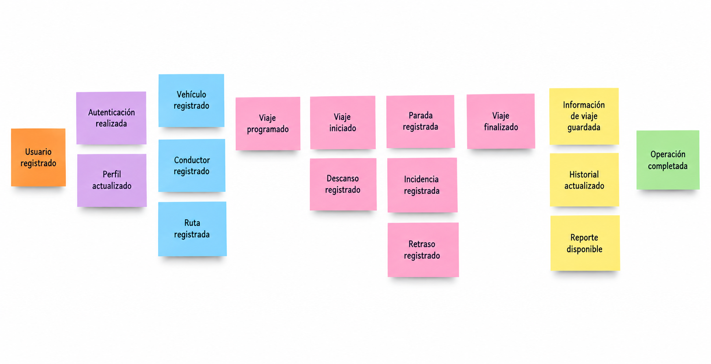

#### 2.5.1.1. Candidate Context Discovery

A partir del EventStorm, se realizó el **Candidate Context Discovery en Miro** para identificar posibles Bounded Contexts. Se utilizó principalmente la técnica **look-for-pivotal-events**, agrupando eventos relacionados e identificando cambios importantes dentro del proceso de negocio.

Durante el análisis se identificaron progresivamente los siguientes Candidate Bounded Contexts:

- **IAM**
- **Profile**
- **Trip Management**
- **Fleet Management**
- **Incident Management**
- **Operational History**


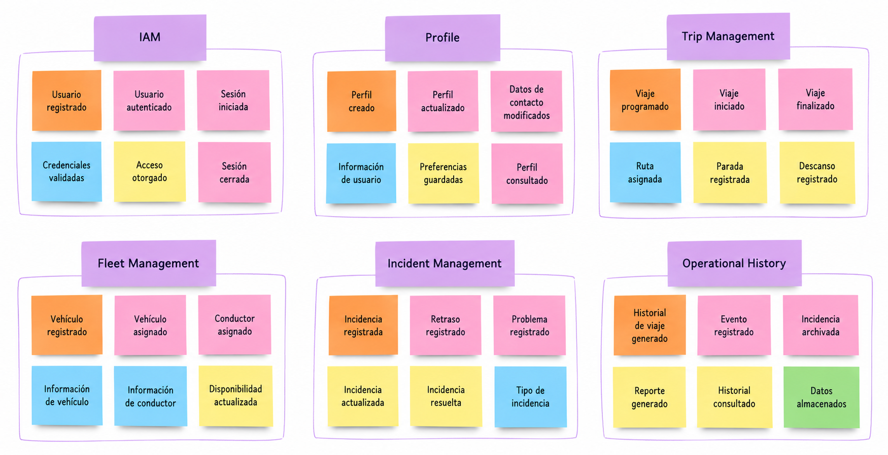


<div style="page-break-after: always;"></div>

#### 2.5.1.2. Domain Message Flows Modeling

En esta sección se modela la colaboración entre los Bounded Contexts de Trakto Route mediante la técnica Domain Storytelling, con el objetivo de visualizar cómo interactúan entre sí para resolver los principales casos de negocio.

Para ello, se elaboraron diagramas utilizando Structurizr, representando la participación y comunicación entre los Bounded Contexts IAM, Profile, Trip Management, Fleet Management, Incident Management y Operational History en los principales escenarios del dominio.

Estos diagramas permiten identificar los actores involucrados, las interacciones entre los diferentes contextos y el flujo de información necesario para ejecutar las operaciones de Trakto Route, facilitando la comprensión de las dependencias y responsabilidades existentes entre los Bounded Contexts.

A continuación, se presentan los diagramas de Domain Storytelling elaborados.

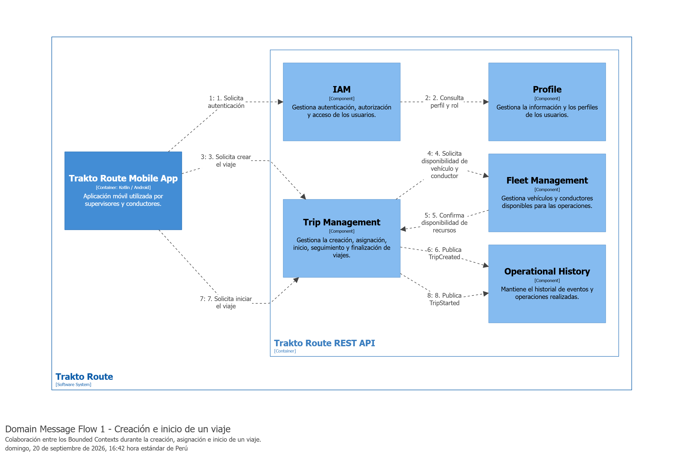

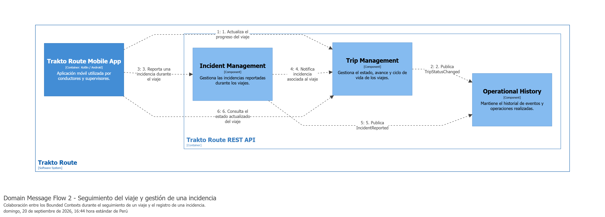

<div style="page-break-after: always;"></div>

#### 2.5.1.3. Bounded Context Canvases

En esta sección se detallan los **Candidate Bounded Contexts** identificados previamente mediante la elaboración de **Bounded Context Canvases**, con el propósito de precisar las responsabilidades, capacidades, reglas de negocio, dependencias y términos relevantes asociados a cada contexto del dominio de **Trakto Route**.

Los contextos se trabajan por orden de importancia y cada canvas considera el proceso indicado en la rúbrica:

- **Context Overview Definition**
- **Business Rules Distillation & Ubiquitous Language Capture**
- **Capability Analysis**
- **Capability Layering**, cuando corresponda
- **Dependencies Capture**
- **Design Critique**

Para **Trakto Route** se elaboran los siguientes Bounded Context Canvases:

1. **Trip Management**
2. **Fleet Management**
3. **Incident Management**
4. **Operational History**
5. **IAM**
6. **Profile**

Los Bounded Context Canvases fueron representados utilizando **Structurizr**, organizando visualmente la información correspondiente a las responsabilidades de cada contexto, sus principales capacidades de negocio, reglas, términos del **Ubiquitous Language** y dependencias con otros Bounded Contexts.

Estas representaciones permiten analizar los límites de responsabilidad definidos para cada contexto y verificar que las capacidades identificadas durante el **EventStorming** se encuentren correctamente distribuidas dentro del modelo estratégico de **Trakto Route**.

A continuación, se presentan las representaciones de los Bounded Context Canvases elaboradas.

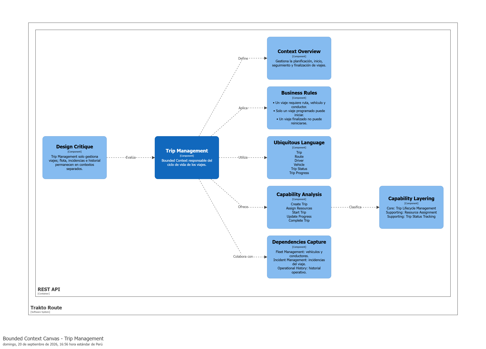


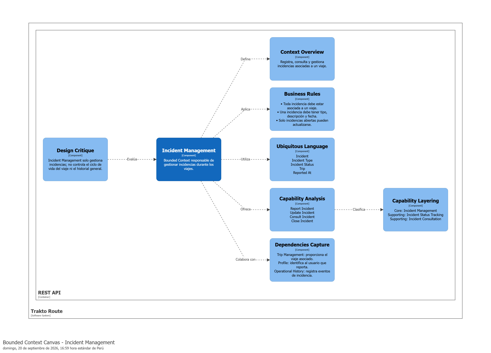


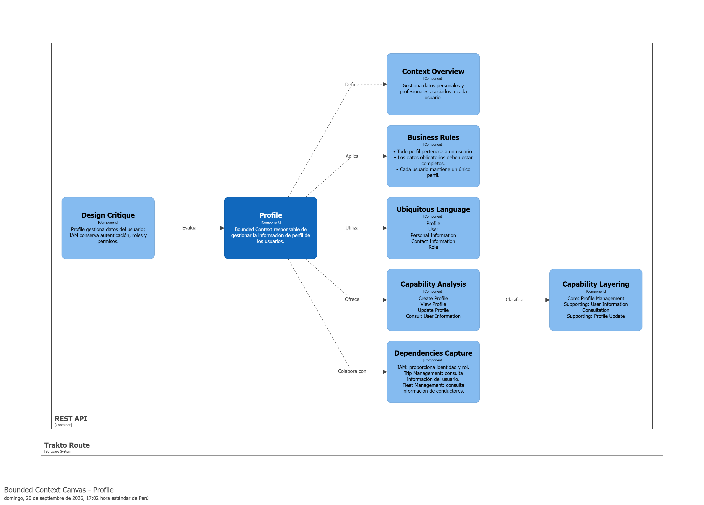

<div style="page-break-after: always;"></div>

### 2.5.2. Context Mapping

En esta sección se analizan las relaciones entre los **Bounded Contexts** de **Trakto Route**, evaluando sus responsabilidades y dependencias para mantener una adecuada separación del dominio.

Durante el proceso se consideraron alternativas de organización y patrones de relación de **Domain-Driven Design**, principalmente **Customer/Supplier** y **Conformist**.

Se evaluó una alternativa donde **IAM y Profile** se integraban en un mismo contexto. Finalmente, se decidió mantenerlos separados debido a que cumplen responsabilidades diferentes.

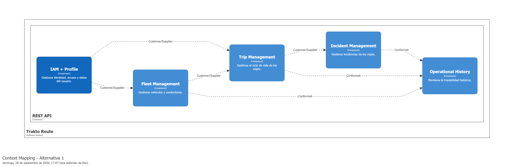

Como resultado, se definió el Context Map final con los Bounded Contexts **IAM, Profile, Trip Management, Fleet Management, Incident Management y Operational History**.

Las principales relaciones son:

- **IAM → Profile:** Customer/Supplier.
- **Fleet Management → Trip Management:** Customer/Supplier.
- **Trip Management → Incident Management:** Customer/Supplier.
- **Trip Management, Fleet Management e Incident Management → Operational History:** Conformist.

El Context Map final fue elaborado utilizando **Structurizr**.

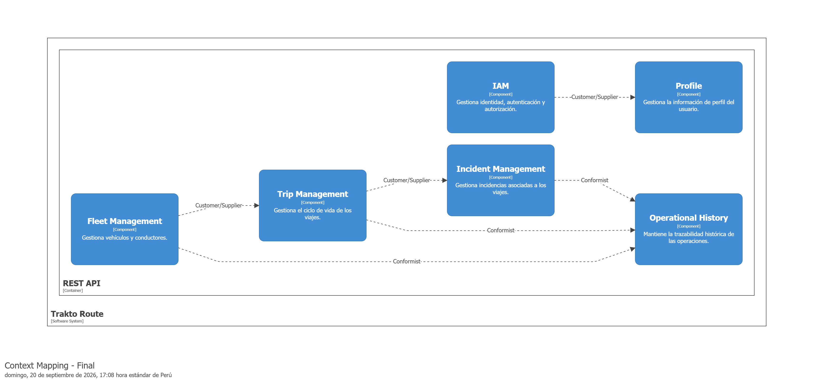

<div style="page-break-after: always;"></div>

### 2.5.3. Software Architecture

La arquitectura de **Trakto Route** sigue un enfoque cliente-servidor. El producto principal es una aplicación Android desarrollada en **Kotlin**, que consume una **API REST implementada en Java con Spring Boot**. El backend concentra las reglas de negocio y los Bounded Contexts definidos mediante DDD, mientras que **MySQL** funciona como la fuente central de persistencia.

#### 2.5.3.1. Software Architecture Context Level Diagrams

El Context Diagram representa a **Trakto Route** como el sistema central. Los actores principales son el **Supervisor de flota**, responsable de gestionar operaciones de transporte, y el **Cliente de transporte**, que consulta únicamente los envíos asociados a su organización. El sistema puede interactuar con servicios externos futuros —por ejemplo mapas o notificaciones— mediante adaptadores, sin incorporar esas dependencias al núcleo del dominio.

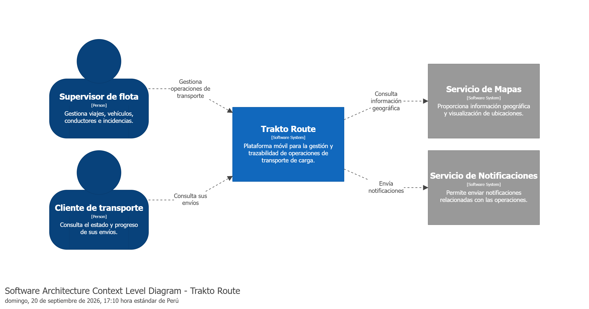

El diagrama debe reflejar claramente el límite de Trakto Route y distinguir las capacidades de gestión disponibles para la empresa transportista de las capacidades de consulta disponibles para el cliente.

#### 2.5.3.2. Software Architecture Container Level Diagrams

El Container Diagram debe mostrar como mínimo los siguientes containers:

| Container | Tecnología | Responsabilidad |
|---|---|---|
| **Trakto Route Mobile App** | Kotlin, Android | Presentar la experiencia móvil, manejar navegación y estado de UI, validar entradas básicas y consumir la API REST mediante HTTPS. |
| **Trakto Route REST API** | Java, Spring Boot, Spring Web | Exponer endpoints, aplicar autenticación/autorización, ejecutar casos de uso y coordinar los Bounded Contexts. |
| **Relational Database** | MySQL | Persistir usuarios, perfiles, viajes, rutas, vehículos, conductores, incidencias e información histórica. |

La aplicación móvil **no accede directamente a MySQL**. Toda lectura o modificación persistente se realiza a través de la API REST.

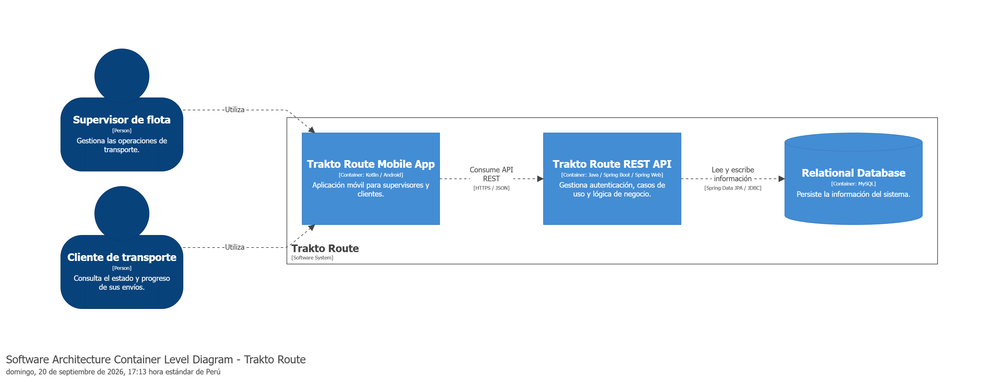

#### 2.5.3.3. Software Architecture Deployment Diagrams

El Deployment Diagram representa la distribución física de la solución:

- **Android Device:** ejecuta la aplicación Trakto Route desarrollada en Kotlin.
- **Application Server / Cloud Runtime:** ejecuta la aplicación Java/Spring Boot y expone la API mediante HTTPS.
- **MySQL Database Server:** aloja la base de datos relacional y solo es accesible desde el backend.
- La comunicación entre la aplicación móvil y el backend se realiza mediante **HTTPS/JSON**; la comunicación entre Spring Boot y MySQL utiliza el driver JDBC correspondiente a través de Spring Data JPA.

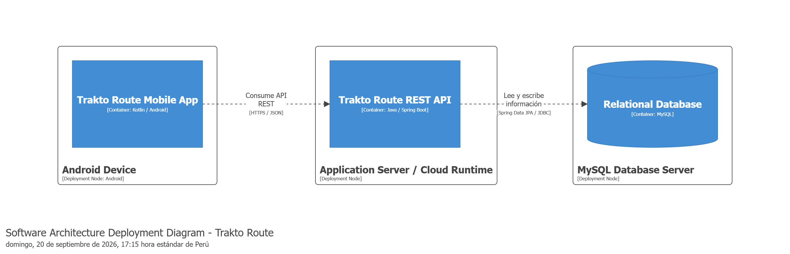

El despliegue mantiene separadas las responsabilidades de cliente móvil, servicios de negocio y persistencia, y evita almacenar la fuente oficial de datos únicamente en el dispositivo.

<div style="page-break-after: always;"></div>

## 2.6. Tactical-Level Domain-Driven Design

En esta sección se presenta la propuesta de diseño táctico del **backend de Trakto Route**, implementado en **Java con Spring Boot**. Para cada Bounded Context se identifican las clases correspondientes a las capas **Domain, Interface, Application e Infrastructure**. La aplicación Android en Kotlin consume estos casos de uso mediante la API REST, pero no reemplaza el modelo de dominio del backend.

Los Bounded Contexts definidos son:

1. **Trip Management**
2. **Fleet Management**
3. **Incident Management**
4. **Operational History**
5. **IAM**
6. **Profile**

<div style="page-break-after: always;"></div>

### 2.6.1. Bounded Context: Trip Management

El Bounded Context **Trip Management** gestiona el ciclo de vida de los viajes, incluyendo su programación, ruta, estado, paradas, descansos, inicio y finalización.

#### 2.6.1.1. Domain Layer

Esta capa representa el core y las reglas de negocio de **Trip Management**.

| **Clase** | **Tipo** | **Propósito** | **Atributos / Métodos principales** |
|---|---|---|---|
| `Trip` | Aggregate Root | Representar y controlar un viaje. | `id`, `route`, `status`, `stops`, `rests`; `assignRoute()`, `start()`, `updateStatus()`, `registerStop()`, `registerRest()`, `complete()` |
| `Route` | Entity | Representar la ruta asignada. | `id`, `origin`, `destination`; `updateRoute()` |
| `Stop` | Entity | Representar una parada. | `id`, `reason`, `startedAt`, `endedAt`; `finish()` |
| `Rest` | Entity | Representar un descanso. | `id`, `startedAt`, `endedAt`; `finish()` |
| `TripId` | Value Object | Identificar un viaje. | `value` |
| `TripStatus` | Enumeration | Representar el estado del viaje. | `SCHEDULED`, `PREPARED`, `IN_PROGRESS`, `COMPLETED`, `CANCELLED` |
| `TripRepository` | Repository Interface | Definir las operaciones de persistencia de viajes. | `save()`, `findById()`, `findAll()` |

Relaciones principales:

```text
Trip "1" ─── "1" Route
Trip "1" ─── "0..*" Stop
Trip "1" ─── "0..*" Rest
Trip ─────── TripStatus
Trip ─────── TripId
TripRepository ───> Trip
```

#### 2.6.1.2. Interface Layer

Esta capa contiene las clases de presentación utilizadas para interactuar con las funcionalidades de Trip Management.

| **Clase** | **Tipo** | **Propósito** | **Atributos / Métodos principales** |
|---|---|---|---|
| `TripController` | REST Controller | Gestionar las acciones relacionadas con viajes. | `loadTrips()`, `loadTrip()`, `scheduleTrip()`, `startTrip()`, `updateStatus()`, `registerStop()`, `registerRest()`, `completeTrip()` |
| `TripUiState` | UI State | Representar el estado de la información presentada. | `trips`, `selectedTrip`, `isLoading`, `error` |

#### 2.6.1.3. Application Layer

Esta capa coordina los flujos y capabilities de Trip Management mediante Commands, Queries y Handlers.

| **Clase** | **Tipo** | **Propósito** |
|---|---|---|
| `ScheduleTripCommand` | Command | Contener los datos para programar un viaje. |
| `ScheduleTripCommandHandler` | Command Handler | Procesar la programación del viaje. |
| `AssignRouteCommand` | Command | Solicitar la asignación de una ruta. |
| `AssignRouteCommandHandler` | Command Handler | Procesar la asignación de una ruta. |
| `StartTripCommand` | Command | Solicitar el inicio de un viaje. |
| `StartTripCommandHandler` | Command Handler | Procesar el inicio del viaje. |
| `UpdateTripStatusCommand` | Command | Solicitar un cambio de estado. |
| `UpdateTripStatusCommandHandler` | Command Handler | Procesar el cambio de estado. |
| `RegisterStopCommand` | Command | Solicitar el registro de una parada. |
| `RegisterStopCommandHandler` | Command Handler | Procesar el registro de una parada. |
| `RegisterRestCommand` | Command | Solicitar el registro de un descanso. |
| `RegisterRestCommandHandler` | Command Handler | Procesar el registro de un descanso. |
| `CompleteTripCommand` | Command | Solicitar la finalización del viaje. |
| `CompleteTripCommandHandler` | Command Handler | Procesar la finalización del viaje. |
| `GetTripsQuery` | Query | Solicitar los viajes registrados. |
| `GetTripsQueryHandler` | Query Handler | Obtener los viajes registrados. |
| `GetTripByIdQuery` | Query | Solicitar un viaje específico. |
| `GetTripByIdQueryHandler` | Query Handler | Obtener el detalle de un viaje. |

#### 2.6.1.4. Infrastructure Layer

Esta capa implementa la persistencia de Trip Management mediante **Spring Data JPA y MySQL**.

| **Clase** | **Tipo** | **Propósito** |
|---|---|---|
| `TripJpaEntity` | JPA Entity | Representar un viaje persistido. |
| `RouteJpaEntity` | JPA Entity | Representar una ruta persistida. |
| `StopJpaEntity` | JPA Entity | Representar una parada persistida. |
| `RestJpaEntity` | JPA Entity | Representar un descanso persistido. |
| `TripDao` | Spring Data Repository | Realizar operaciones de persistencia y consulta. |
| `TripRepositoryAdapter` | Repository Implementation | Implementar `TripRepository` utilizando Spring Data JPA y mapeo entre el dominio y las entidades de persistencia. |

<div style="page-break-after: always;"></div>

#### 2.6.1.5. Bounded Context Software Architecture Component Level Diagrams

El **Component Diagram del C4 Model** representa los componentes principales de Trip Management, sus responsabilidades, tecnologías e interacciones.

```text
Trip Presentation
        ↓
Trip Application
        ↓
Trip Domain
        ↓
Trip Infrastructure
        ↓
Spring Data JPA / MySQL
```

Tecnologías utilizadas: **Java, Spring Boot, Spring Web, Spring Data JPA y MySQL**.

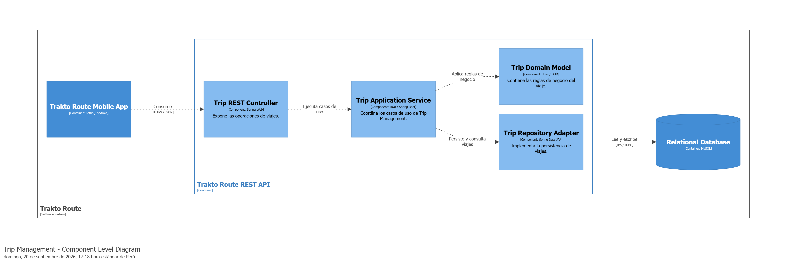

<div style="page-break-after: always;"></div>

#### 2.6.1.6. Bounded Context Software Architecture Code Level Diagrams

En esta sección se presentan los diagramas de mayor detalle de implementación de **Trip Management**.

##### 2.6.1.6.1. Bounded Context Domain Layer Class Diagrams

El UML Class Diagram representa las clases, interfaces, enumeraciones, atributos, métodos, scopes, relaciones y multiplicidades del Domain Layer.

```text
Trip
--------------------------------
- id: TripId
- route: Route
- status: TripStatus
- stops: List<Stop>
- rests: List<Rest>
--------------------------------
+ assignRoute(route: Route): Unit
+ start(): Unit
+ updateStatus(status: TripStatus): Unit
+ registerStop(stop: Stop): Unit
+ registerRest(rest: Rest): Unit
+ complete(): Unit

Route
--------------------------------
- id: Long
- origin: String
- destination: String
--------------------------------
+ updateRoute(origin: String, destination: String): Unit

Stop
--------------------------------
- id: Long
- reason: String
- startedAt: LocalDateTime
- endedAt: LocalDateTime?
--------------------------------
+ finish(endTime: LocalDateTime): Unit

Rest
--------------------------------
- id: Long
- startedAt: LocalDateTime
- endedAt: LocalDateTime?
--------------------------------
+ finish(endTime: LocalDateTime): Unit

TripId
--------------------------------
- value: Long

<<enumeration>>
TripStatus
--------------------------------
SCHEDULED
PREPARED
IN_PROGRESS
COMPLETED
CANCELLED

<<interface>>
TripRepository
--------------------------------
+ save(trip: Trip): Unit
+ findById(id: TripId): Trip?
+ findAll(): List<Trip>
```

Relaciones:

```text
Trip "1" ─── "1" Route
Trip "1" ─── "0..*" Stop
Trip "1" ─── "0..*" Rest
Trip ─────── TripStatus
Trip ─────── TripId
TripRepository ───> Trip
```

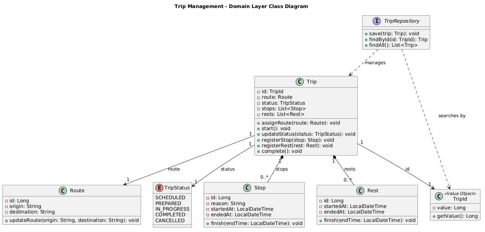

<div style="page-break-after: always;"></div>

##### 2.6.1.6.2. Bounded Context Database Design Diagram

El Database Diagram representa las tablas, columnas, constraints y relaciones utilizadas para la persistencia central de **Trip Management** mediante Spring Data JPA y MySQL.

| **Tabla** | **Columnas** | **Constraints** |
|---|---|---|
| `trips` | `id`, `route_id`, `status` | `id PK`, `route_id FK`, `status NOT NULL` |
| `routes` | `id`, `origin`, `destination` | `id PK`, `origin NOT NULL`, `destination NOT NULL` |
| `stops` | `id`, `trip_id`, `reason`, `started_at`, `ended_at` | `id PK`, `trip_id FK`, `reason NOT NULL`, `started_at NOT NULL` |
| `rests` | `id`, `trip_id`, `started_at`, `ended_at` | `id PK`, `trip_id FK`, `started_at NOT NULL` |

Relaciones:

```text
routes.id  "1" ─── "0..*" trips.route_id
trips.id   "1" ─── "0..*" stops.trip_id
trips.id   "1" ─── "0..*" rests.trip_id
```

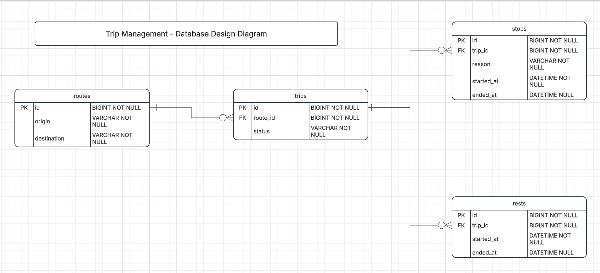

<div style="page-break-after: always;"></div>


### 2.6.2. Bounded Context: Fleet Management

El Bounded Context **Fleet Management** gestiona los vehículos y conductores utilizados en las operaciones de transporte, incluyendo su registro, actualización, disponibilidad y asignación.

#### 2.6.2.1. Domain Layer

Esta capa representa el core y las reglas de negocio de **Fleet Management**.

| **Clase** | **Tipo** | **Propósito** | **Atributos / Métodos principales** |
|---|---|---|---|
| `Vehicle` | Aggregate Root | Representar y controlar un vehículo. | `id`, `plate`, `brand`, `model`, `availability`; `update()`, `changeAvailability()` |
| `Driver` | Aggregate Root | Representar y controlar un conductor. | `id`, `name`, `licenseNumber`, `availability`; `update()`, `changeAvailability()` |
| `VehicleId` | Value Object | Identificar un vehículo. | `value` |
| `DriverId` | Value Object | Identificar un conductor. | `value` |
| `VehicleAvailability` | Enumeration | Representar la disponibilidad del vehículo. | `AVAILABLE`, `ASSIGNED`, `UNAVAILABLE` |
| `DriverAvailability` | Enumeration | Representar la disponibilidad del conductor. | `AVAILABLE`, `ASSIGNED`, `UNAVAILABLE` |
| `VehicleRepository` | Repository Interface | Definir las operaciones de persistencia de vehículos. | `save()`, `findById()`, `findAll()`, `findAvailable()` |
| `DriverRepository` | Repository Interface | Definir las operaciones de persistencia de conductores. | `save()`, `findById()`, `findAll()`, `findAvailable()` |

Relaciones principales:

```text
Vehicle ───── VehicleId
Vehicle ───── VehicleAvailability
Driver ────── DriverId
Driver ────── DriverAvailability
VehicleRepository ───> Vehicle
DriverRepository ─────> Driver
```

#### 2.6.2.2. Interface Layer

Esta capa contiene las clases de presentación utilizadas para interactuar con las funcionalidades de Fleet Management.

| **Clase** | **Tipo** | **Propósito** | **Atributos / Métodos principales** |
|---|---|---|---|
| `FleetController` | REST Controller | Gestionar la información general de vehículos y conductores. | `loadVehicles()`, `loadDrivers()` |
| `VehicleController` | REST Controller | Gestionar las acciones relacionadas con vehículos. | `registerVehicle()`, `updateVehicle()`, `loadAvailableVehicles()` |
| `DriverController` | REST Controller | Gestionar las acciones relacionadas con conductores. | `registerDriver()`, `updateDriver()`, `loadAvailableDrivers()` |
| `FleetUiState` | UI State | Representar los datos mostrados en la interfaz. | `vehicles`, `drivers`, `isLoading`, `error` |

#### 2.6.2.3. Application Layer

Esta capa coordina los flujos y capabilities relacionados con la gestión de vehículos y conductores.

| **Clase** | **Tipo** | **Propósito** |
|---|---|---|
| `RegisterVehicleCommand` | Command | Contener los datos para registrar un vehículo. |
| `RegisterVehicleCommandHandler` | Command Handler | Procesar el registro de un vehículo. |
| `UpdateVehicleCommand` | Command | Solicitar la actualización de un vehículo. |
| `UpdateVehicleCommandHandler` | Command Handler | Procesar la actualización de un vehículo. |
| `RegisterDriverCommand` | Command | Contener los datos para registrar un conductor. |
| `RegisterDriverCommandHandler` | Command Handler | Procesar el registro de un conductor. |
| `UpdateDriverCommand` | Command | Solicitar la actualización de un conductor. |
| `UpdateDriverCommandHandler` | Command Handler | Procesar la actualización de un conductor. |
| `AssignVehicleCommand` | Command | Solicitar la asignación de un vehículo. |
| `AssignVehicleCommandHandler` | Command Handler | Procesar la asignación de un vehículo. |
| `AssignDriverCommand` | Command | Solicitar la asignación de un conductor. |
| `AssignDriverCommandHandler` | Command Handler | Procesar la asignación de un conductor. |
| `GetVehiclesQuery` | Query | Solicitar los vehículos registrados. |
| `GetVehiclesQueryHandler` | Query Handler | Obtener los vehículos registrados. |
| `GetDriversQuery` | Query | Solicitar los conductores registrados. |
| `GetDriversQueryHandler` | Query Handler | Obtener los conductores registrados. |
| `GetAvailableVehiclesQueryHandler` | Query Handler | Obtener los vehículos disponibles. |
| `GetAvailableDriversQueryHandler` | Query Handler | Obtener los conductores disponibles. |

#### 2.6.2.4. Infrastructure Layer

Esta capa implementa la persistencia de Fleet Management mediante **Spring Data JPA y MySQL**.

| **Clase** | **Tipo** | **Propósito** |
|---|---|---|
| `VehicleJpaEntity` | JPA Entity | Representar un vehículo persistido. |
| `DriverJpaEntity` | JPA Entity | Representar un conductor persistido. |
| `VehicleDao` | Spring Data Repository | Realizar operaciones de persistencia de vehículos. |
| `DriverDao` | Spring Data Repository | Realizar operaciones de persistencia de conductores. |
| `VehicleRepositoryAdapter` | Repository Implementation | Implementar `VehicleRepository` utilizando Spring Data JPA. |
| `DriverRepositoryAdapter` | Repository Implementation | Implementar `DriverRepository` utilizando Spring Data JPA. |

<div style="page-break-after: always;"></div>

#### 2.6.2.5. Bounded Context Software Architecture Component Level Diagrams

El **Component Diagram del C4 Model** representa los componentes principales de Fleet Management, sus responsabilidades, tecnologías e interacciones.

```text
Fleet Presentation
        ↓
Fleet Application
        ↓
Fleet Domain
        ↓
Fleet Infrastructure
        ↓
Spring Data JPA / MySQL
```

Tecnologías utilizadas: **Java, Spring Boot, Spring Web, Spring Data JPA y MySQL**.


<div style="page-break-after: always;"></div>

#### 2.6.2.6. Bounded Context Software Architecture Code Level Diagrams

En esta sección se presentan los diagramas de mayor detalle de implementación de **Fleet Management**.

##### 2.6.2.6.1. Bounded Context Domain Layer Class Diagrams

El UML Class Diagram representa las clases, interfaces, enumeraciones, atributos, métodos, scopes y relaciones del Domain Layer.

```text
Vehicle
--------------------------------
- id: VehicleId
- plate: String
- brand: String
- model: String
- availability: VehicleAvailability
--------------------------------
+ update(brand: String, model: String): Unit
+ changeAvailability(
    availability: VehicleAvailability
  ): Unit


Driver
--------------------------------
- id: DriverId
- name: String
- licenseNumber: String
- availability: DriverAvailability
--------------------------------
+ update(name: String, licenseNumber: String): Unit
+ changeAvailability(
    availability: DriverAvailability
  ): Unit


VehicleId
--------------------------------
- value: Long


DriverId
--------------------------------
- value: Long


<<enumeration>>
VehicleAvailability
--------------------------------
AVAILABLE
ASSIGNED
UNAVAILABLE


<<enumeration>>
DriverAvailability
--------------------------------
AVAILABLE
ASSIGNED
UNAVAILABLE


<<interface>>
VehicleRepository
--------------------------------
+ save(vehicle: Vehicle): Unit
+ findById(id: VehicleId): Vehicle?
+ findAll(): List<Vehicle>
+ findAvailable(): List<Vehicle>


<<interface>>
DriverRepository
--------------------------------
+ save(driver: Driver): Unit
+ findById(id: DriverId): Driver?
+ findAll(): List<Driver>
+ findAvailable(): List<Driver>
```

Relaciones:

```text
Vehicle ───── VehicleId
Vehicle ───── VehicleAvailability
Driver ────── DriverId
Driver ────── DriverAvailability

VehicleRepository ───> Vehicle
DriverRepository ─────> Driver
```

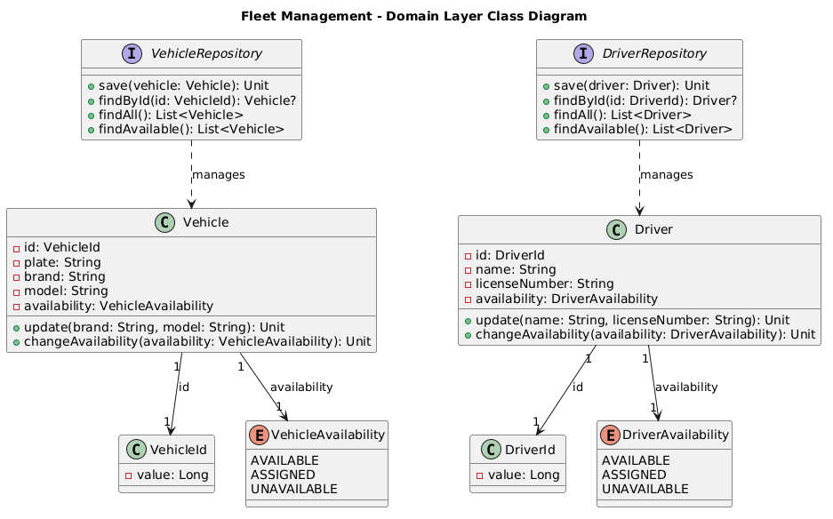

<div style="page-break-after: always;"></div>

##### 2.6.2.6.2. Bounded Context Database Design Diagram

El Database Diagram representa las tablas, columnas, constraints y relaciones utilizadas para la persistencia central de **Fleet Management** mediante Spring Data JPA y MySQL.

| **Tabla** | **Columnas** | **Constraints** |
|---|---|---|
| `vehicles` | `id`, `plate`, `brand`, `model`, `availability` | `id PK`, `plate UNIQUE NOT NULL`, `availability NOT NULL` |
| `drivers` | `id`, `name`, `license_number`, `availability` | `id PK`, `license_number UNIQUE NOT NULL`, `availability NOT NULL` |

```text
vehicles
--------------------------------
PK  id
    plate UNIQUE NOT NULL
    brand NOT NULL
    model NOT NULL
    availability NOT NULL


drivers
--------------------------------
PK  id
    name NOT NULL
    license_number UNIQUE NOT NULL
    availability NOT NULL
```

Las tablas `vehicles` y `drivers` son independientes dentro de Fleet Management. La asociación con los viajes se realiza desde **Trip Management** mediante los identificadores correspondientes.

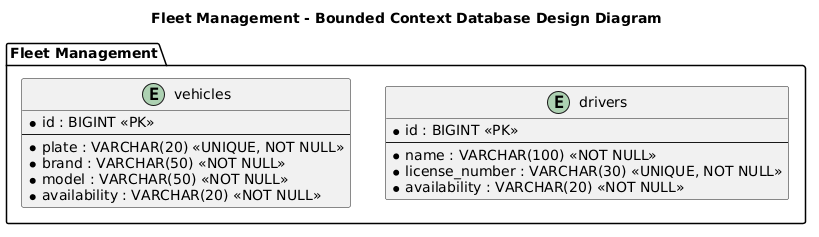

<div style="page-break-after: always;"></div>


### 2.6.3. Bounded Context: Incident Management

El Bounded Context **Incident Management** gestiona las incidencias ocurridas durante los viajes, incluyendo retrasos, problemas, accidentes y su estado de atención.

#### 2.6.3.1. Domain Layer

Esta capa representa el core y las reglas de negocio de **Incident Management**.

| **Clase** | **Tipo** | **Propósito** | **Atributos / Métodos principales** |
|---|---|---|---|
| `Incident` | Aggregate Root | Representar y gestionar una incidencia. | `id`, `tripId`, `type`, `status`, `description`, `occurredAt`; `updateStatus()`, `resolve()` |
| `IncidentId` | Value Object | Identificar una incidencia. | `value` |
| `IncidentType` | Enumeration | Clasificar el tipo de incidencia. | `DELAY`, `PROBLEM`, `ACCIDENT`, `OTHER` |
| `IncidentStatus` | Enumeration | Representar el estado de la incidencia. | `PENDING`, `IN_PROGRESS`, `RESOLVED` |
| `IncidentRepository` | Repository Interface | Definir las operaciones de persistencia de incidencias. | `save()`, `findById()`, `findByTripId()`, `findAll()` |

Relaciones principales:

```text
Incident ───── IncidentId
Incident ───── IncidentType
Incident ───── IncidentStatus
IncidentRepository ───> Incident
```

#### 2.6.3.2. Interface Layer

Esta capa contiene las clases de presentación utilizadas para interactuar con las funcionalidades de Incident Management.

| **Clase** | **Tipo** | **Propósito** | **Atributos / Métodos principales** |
|---|---|---|---|
| `IncidentController` | REST Controller | Gestionar acciones relacionadas con incidencias. | `loadIncidents()`, `loadIncident()`, `registerIncident()`, `updateStatus()` |
| `IncidentUiState` | UI State | Representar la información mostrada en la interfaz. | `incidents`, `selectedIncident`, `isLoading`, `error` |

#### 2.6.3.3. Application Layer

Esta capa coordina los flujos y capabilities relacionados con el registro y gestión de incidencias.

| **Clase** | **Tipo** | **Propósito** |
|---|---|---|
| `RegisterIncidentCommand` | Command | Contener los datos para registrar una incidencia. |
| `RegisterIncidentCommandHandler` | Command Handler | Procesar el registro de una incidencia. |
| `RegisterDelayCommand` | Command | Solicitar el registro de un retraso. |
| `RegisterDelayCommandHandler` | Command Handler | Procesar el registro de un retraso. |
| `RegisterProblemCommand` | Command | Solicitar el registro de un problema. |
| `RegisterProblemCommandHandler` | Command Handler | Procesar el registro de un problema. |
| `RegisterAccidentCommand` | Command | Solicitar el registro de un accidente. |
| `RegisterAccidentCommandHandler` | Command Handler | Procesar el registro de un accidente. |
| `UpdateIncidentStatusCommand` | Command | Solicitar la actualización del estado. |
| `UpdateIncidentStatusCommandHandler` | Command Handler | Procesar el cambio de estado de una incidencia. |
| `GetIncidentsQuery` | Query | Solicitar las incidencias registradas. |
| `GetIncidentsQueryHandler` | Query Handler | Obtener las incidencias registradas. |
| `GetIncidentByIdQuery` | Query | Solicitar una incidencia específica. |
| `GetIncidentByIdQueryHandler` | Query Handler | Obtener el detalle de una incidencia. |

#### 2.6.3.4. Infrastructure Layer

Esta capa implementa la persistencia de Incident Management mediante **Spring Data JPA y MySQL**.

| **Clase** | **Tipo** | **Propósito** |
|---|---|---|
| `IncidentJpaEntity` | JPA Entity | Representar una incidencia persistida. |
| `IncidentDao` | Spring Data Repository | Realizar operaciones de persistencia y consulta de incidencias. |
| `IncidentRepositoryAdapter` | Repository Implementation | Implementar `IncidentRepository` utilizando Spring Data JPA. |

<div style="page-break-after: always;"></div>

#### 2.6.3.5. Bounded Context Software Architecture Component Level Diagrams

El **Component Diagram del C4 Model** representa los componentes principales de Incident Management, sus responsabilidades, tecnologías e interacciones.

```text
Incident Presentation
        ↓
Incident Application
        ↓
Incident Domain
        ↓
Incident Infrastructure
        ↓
Spring Data JPA / MySQL
```

Tecnologías utilizadas: **Java, Spring Boot, Spring Web, Spring Data JPA y MySQL**.

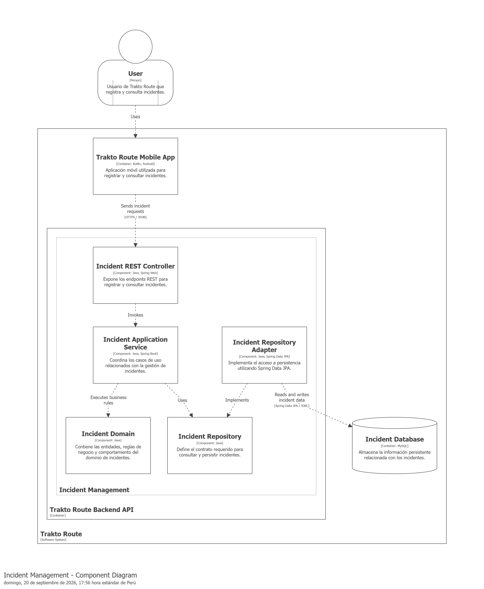

<div style="page-break-after: always;"></div>

#### 2.6.3.6. Bounded Context Software Architecture Code Level Diagrams

En esta sección se presentan los diagramas de mayor detalle de implementación de **Incident Management**.

##### 2.6.3.6.1. Bounded Context Domain Layer Class Diagrams

El UML Class Diagram representa las clases, interfaces, enumeraciones, atributos, métodos, scopes, relaciones y multiplicidades del Domain Layer.

```text
Incident
--------------------------------
- id: IncidentId
- tripId: Long
- type: IncidentType
- status: IncidentStatus
- description: String
- occurredAt: LocalDateTime
--------------------------------
+ updateStatus(status: IncidentStatus): Unit
+ resolve(): Unit


IncidentId
--------------------------------
- value: Long


<<enumeration>>
IncidentType
--------------------------------
DELAY
PROBLEM
ACCIDENT
OTHER


<<enumeration>>
IncidentStatus
--------------------------------
PENDING
IN_PROGRESS
RESOLVED


<<interface>>
IncidentRepository
--------------------------------
+ save(incident: Incident): Unit
+ findById(id: IncidentId): Incident?
+ findByTripId(tripId: Long): List<Incident>
+ findAll(): List<Incident>
```

Relaciones:

```text
Incident ───── IncidentId
Incident ───── IncidentType
Incident ───── IncidentStatus
IncidentRepository ───> Incident
```

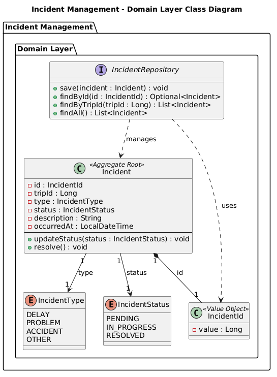

<div style="page-break-after: always;"></div>

##### 2.6.3.6.2. Bounded Context Database Design Diagram

El Database Diagram representa las tablas, columnas, constraints y relaciones utilizadas para la persistencia central de **Incident Management** mediante Spring Data JPA y MySQL.

| **Tabla** | **Columnas** | **Constraints** |
|---|---|---|
| `incidents` | `id`, `trip_id`, `type`, `status`, `description`, `occurred_at` | `id PK`, `trip_id NOT NULL`, `type NOT NULL`, `status NOT NULL`, `description NOT NULL`, `occurred_at NOT NULL` |

```text
incidents
--------------------------------
PK  id
    trip_id NOT NULL
    type NOT NULL
    status NOT NULL
    description NOT NULL
    occurred_at NOT NULL
```

`trip_id` permite asociar la incidencia con el viaje correspondiente del Bounded Context **Trip Management**.

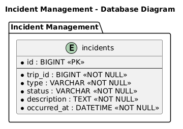

<div style="page-break-after: always;"></div>


### 2.6.4. Bounded Context: Operational History

El Bounded Context **Operational History** gestiona la consulta del historial de viajes, vehículos, conductores e incidencias, así como la revisión del desempeño de las operaciones realizadas.

#### 2.6.4.1. Domain Layer

Esta capa representa el core y las reglas de negocio de **Operational History**.

| **Clase** | **Tipo** | **Propósito** | **Atributos / Métodos principales** |
|---|---|---|---|
| `OperationHistory` | Aggregate Root | Representar el historial general de una operación. | `id`, `tripId`, `completedAt`, `performance`; `reviewPerformance()` |
| `TripHistory` | Entity | Representar información histórica de un viaje. | `tripId`, `status`, `startedAt`, `completedAt` |
| `VehicleHistory` | Entity | Representar el historial operativo de un vehículo. | `vehicleId`, `tripId`, `recordedAt` |
| `DriverHistory` | Entity | Representar el historial operativo de un conductor. | `driverId`, `tripId`, `recordedAt` |
| `OperationPerformance` | Value Object | Representar información de desempeño de una operación. | `completedTrips`, `incidentCount`, `delayCount` |
| `HistoryRepository` | Repository Interface | Definir las operaciones de consulta del historial. | `findTripHistory()`, `findVehicleHistory()`, `findDriverHistory()`, `findIncidentHistory()` |

Relaciones principales:

```text
OperationHistory ───── TripHistory
OperationHistory ───── VehicleHistory
OperationHistory ───── DriverHistory
OperationHistory ───── OperationPerformance
HistoryRepository ───> OperationHistory
```

#### 2.6.4.2. Interface Layer

Esta capa contiene las clases de presentación utilizadas para consultar el historial operativo.

| **Clase** | **Tipo** | **Propósito** | **Atributos / Métodos principales** |
|---|---|---|---|
| `HistoryController` | REST Controller | Gestionar las consultas del historial operativo. | `loadTripHistory()`, `loadVehicleHistory()`, `loadDriverHistory()`, `loadIncidentHistory()`, `reviewPerformance()` |
| `HistoryUiState` | UI State | Representar los datos históricos mostrados en la interfaz. | `tripHistory`, `vehicleHistory`, `driverHistory`, `incidentHistory`, `performance`, `isLoading`, `error` |

#### 2.6.4.3. Application Layer

Esta capa coordina los flujos y capabilities relacionados con la consulta del historial y desempeño operativo.

| **Clase** | **Tipo** | **Propósito** |
|---|---|---|
| `GetTripHistoryQuery` | Query | Solicitar el historial de viajes. |
| `GetTripHistoryQueryHandler` | Query Handler | Obtener el historial de viajes. |
| `GetVehicleHistoryQuery` | Query | Solicitar el historial de un vehículo. |
| `GetVehicleHistoryQueryHandler` | Query Handler | Obtener el historial de un vehículo. |
| `GetDriverHistoryQuery` | Query | Solicitar el historial de un conductor. |
| `GetDriverHistoryQueryHandler` | Query Handler | Obtener el historial de un conductor. |
| `GetIncidentHistoryQuery` | Query | Solicitar el historial de incidencias. |
| `GetIncidentHistoryQueryHandler` | Query Handler | Obtener el historial de incidencias. |
| `ReviewOperationPerformanceQuery` | Query | Solicitar la revisión del desempeño operativo. |
| `ReviewOperationPerformanceQueryHandler` | Query Handler | Obtener la información de desempeño de una operación. |
| `RecordCompletedTripEventHandler` | Event Handler | Registrar información histórica cuando un viaje finaliza. |

#### 2.6.4.4. Infrastructure Layer

Esta capa implementa el acceso a la información histórica mediante **Spring Data JPA y MySQL**.

| **Clase** | **Tipo** | **Propósito** |
|---|---|---|
| `OperationHistoryJpaEntity` | JPA Entity | Representar una operación histórica persistida. |
| `TripHistoryJpaEntity` | JPA Entity | Representar el historial de viajes persistido. |
| `VehicleHistoryJpaEntity` | JPA Entity | Representar el historial de vehículos persistido. |
| `DriverHistoryJpaEntity` | JPA Entity | Representar el historial de conductores persistido. |
| `HistoryDao` | DAO | Realizar consultas y operaciones sobre el historial. |
| `HistoryRepositoryAdapter` | Repository Implementation | Implementar `HistoryRepository` utilizando Spring Data JPA. |

<div style="page-break-after: always;"></div>

#### 2.6.4.5. Bounded Context Software Architecture Component Level Diagrams

El **Component Diagram del C4 Model** representa los componentes principales de Operational History, sus responsabilidades, tecnologías e interacciones.

```text
History Presentation
        ↓
History Application
        ↓
History Domain
        ↓
History Infrastructure
        ↓
Spring Data JPA / MySQL
```

Tecnologías utilizadas: **Java, Spring Boot, Spring Web, Spring Data JPA y MySQL**.


<div style="page-break-after: always;"></div>

#### 2.6.4.6. Bounded Context Software Architecture Code Level Diagrams

En esta sección se presentan los diagramas de mayor detalle de implementación de **Operational History**.

##### 2.6.4.6.1. Bounded Context Domain Layer Class Diagrams

El UML Class Diagram representa las clases, interfaces, atributos, métodos, scopes, relaciones y multiplicidades del Domain Layer.

```text
OperationHistory
--------------------------------
- id: Long
- tripId: Long
- completedAt: LocalDateTime
- performance: OperationPerformance
--------------------------------
+ reviewPerformance(): OperationPerformance


TripHistory
--------------------------------
- tripId: Long
- status: String
- startedAt: LocalDateTime
- completedAt: LocalDateTime


VehicleHistory
--------------------------------
- vehicleId: Long
- tripId: Long
- recordedAt: LocalDateTime


DriverHistory
--------------------------------
- driverId: Long
- tripId: Long
- recordedAt: LocalDateTime


OperationPerformance
--------------------------------
- completedTrips: Int
- incidentCount: Int
- delayCount: Int


<<interface>>
HistoryRepository
--------------------------------
+ findTripHistory(tripId: Long): TripHistory?
+ findVehicleHistory(vehicleId: Long): List<VehicleHistory>
+ findDriverHistory(driverId: Long): List<DriverHistory>
+ findIncidentHistory(tripId: Long): List<Long>
```

Relaciones:

```text
OperationHistory "1" ─── "1" TripHistory
OperationHistory "1" ─── "0..*" VehicleHistory
OperationHistory "1" ─── "0..*" DriverHistory
OperationHistory "1" ─── "1" OperationPerformance
HistoryRepository ───> OperationHistory
```

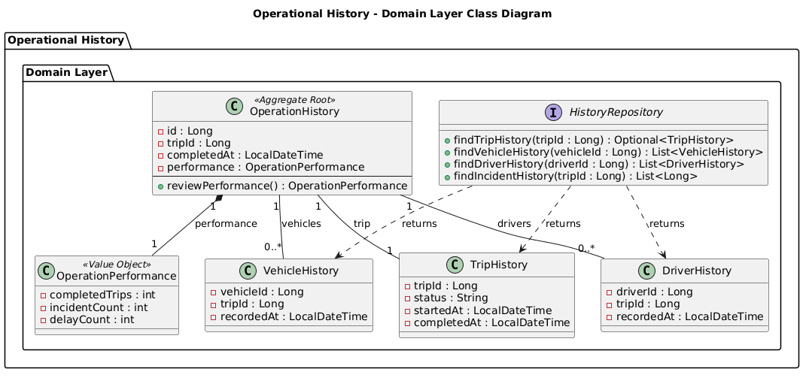

<div style="page-break-after: always;"></div>

##### 2.6.4.6.2. Bounded Context Database Design Diagram

El Database Diagram representa las tablas, columnas, constraints y relaciones utilizadas para la persistencia central de **Operational History** mediante Spring Data JPA y MySQL.

| **Tabla** | **Columnas** | **Constraints** |
|---|---|---|
| `operation_history` | `id`, `trip_id`, `completed_at`, `completed_trips`, `incident_count`, `delay_count` | `id PK`, `trip_id NOT NULL` |
| `trip_history` | `id`, `trip_id`, `status`, `started_at`, `completed_at` | `id PK`, `trip_id NOT NULL` |
| `vehicle_history` | `id`, `vehicle_id`, `trip_id`, `recorded_at` | `id PK`, `vehicle_id NOT NULL`, `trip_id NOT NULL` |
| `driver_history` | `id`, `driver_id`, `trip_id`, `recorded_at` | `id PK`, `driver_id NOT NULL`, `trip_id NOT NULL` |

Relaciones:

```text
operation_history.trip_id ─── trip_history.trip_id
trip_history.trip_id ─── vehicle_history.trip_id
trip_history.trip_id ─── driver_history.trip_id
```

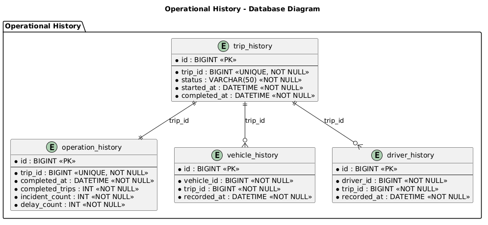

<div style="page-break-after: always;"></div>


### 2.6.5. Bounded Context: IAM

El Bounded Context **IAM (Identity and Access Management)** gestiona la identidad, autenticación y acceso de los usuarios de Trakto Route Route.

#### 2.6.5.1. Domain Layer

Esta capa representa las reglas de negocio relacionadas con usuarios, credenciales y roles.

| **Clase** | **Tipo** | **Propósito** | **Atributos / Métodos principales** |
|---|---|---|---|
| `User` | Aggregate Root | Representar la identidad de un usuario. | `id`, `email`, `passwordHash`, `role`; `changePassword()`, `changeRole()` |
| `UserId` | Value Object | Identificar un usuario. | `value` |
| `Email` | Value Object | Representar y validar el correo del usuario. | `value`; `isValid()` |
| `UserRole` | Enumeration | Representar el rol del usuario. | `FLEET_SUPERVISOR`, `OPERATIONS_COORDINATOR` |
| `UserRepository` | Repository Interface | Definir operaciones de persistencia de usuarios. | `save()`, `findById()`, `findByEmail()`, `existsByEmail()` |
| `AuthenticationService` | Domain Service Interface | Definir la validación de credenciales. | `authenticate()` |

Relaciones principales:

```text
User ───── UserId
User ───── Email
User ───── UserRole
UserRepository ───> User
AuthenticationService ───> User
```

#### 2.6.5.2. Interface Layer

Esta capa contiene las clases de presentación utilizadas para autenticación y gestión de sesión.

| **Clase** | **Tipo** | **Propósito** | **Atributos / Métodos principales** |
|---|---|---|---|
| `AuthController` | REST Controller | Gestionar registro, inicio y cierre de sesión. | `register()`, `login()`, `logout()`, `loadCurrentUser()` |
| `AuthUiState` | UI State | Representar el estado de autenticación. | `currentUser`, `isAuthenticated`, `isLoading`, `error` |

#### 2.6.5.3. Application Layer

Esta capa coordina los flujos relacionados con registro, autenticación y sesión.

| **Clase** | **Tipo** | **Propósito** |
|---|---|---|
| `RegisterUserCommand` | Command | Contener los datos para registrar un usuario. |
| `RegisterUserCommandHandler` | Command Handler | Procesar el registro del usuario. |
| `LoginCommand` | Command | Contener las credenciales de acceso. |
| `LoginCommandHandler` | Command Handler | Procesar la autenticación del usuario. |
| `LogoutCommand` | Command | Solicitar el cierre de sesión. |
| `LogoutCommandHandler` | Command Handler | Procesar el cierre de sesión. |
| `GetCurrentUserQuery` | Query | Solicitar el usuario autenticado. |
| `GetCurrentUserQueryHandler` | Query Handler | Obtener el usuario autenticado. |

#### 2.6.5.4. Infrastructure Layer

Esta capa implementa la persistencia, autenticación y gestión de sesión mediante **Spring Data JPA y MySQL**.

| **Clase** | **Tipo** | **Propósito** |
|---|---|---|
| `UserJpaEntity` | JPA Entity | Representar un usuario persistido. |
| `SpringDataUserRepository` | Spring Data Repository | Realizar operaciones de persistencia de usuarios. |
| `UserRepositoryAdapter` | Repository Implementation | Implementar `UserRepository` utilizando Spring Data JPA. |
| `AuthenticationServiceImpl` | Service Implementation | Implementar la validación de credenciales. |
| `PasswordHasher` | Infrastructure Service | Generar y verificar hashes de contraseñas. |
| `SessionManager` | Infrastructure Service | Gestionar la sesión del usuario. |

<div style="page-break-after: always;"></div>

#### 2.6.5.5. Bounded Context Software Architecture Component Level Diagrams

El **Component Diagram del C4 Model** representa los componentes principales de IAM, sus responsabilidades, tecnologías e interacciones.

```text
IAM Presentation
        ↓
IAM Application
        ↓
IAM Domain
        ↓
IAM Infrastructure
        ↓
Spring Data JPA / MySQL
```

Tecnologías utilizadas: **Java, Spring Boot, Spring Web, Spring Data JPA y MySQL**.


<div style="page-break-after: always;"></div>

#### 2.6.5.6. Bounded Context Software Architecture Code Level Diagrams

En esta sección se presentan los diagramas de mayor detalle de implementación del Bounded Context **IAM**.

##### 2.6.5.6.1. Bounded Context Domain Layer Class Diagrams

El UML Class Diagram representa las clases, interfaces, enumeraciones, atributos, métodos, scopes y relaciones del Domain Layer.

```text
User
--------------------------------
- id: UserId
- email: Email
- passwordHash: String
- role: UserRole
--------------------------------
+ changePassword(passwordHash: String): Unit
+ changeRole(role: UserRole): Unit


UserId
--------------------------------
- value: Long


Email
--------------------------------
- value: String
--------------------------------
+ isValid(): Boolean


<<enumeration>>
UserRole
--------------------------------
FLEET_SUPERVISOR
OPERATIONS_COORDINATOR


<<interface>>
UserRepository
--------------------------------
+ save(user: User): Unit
+ findById(id: UserId): User?
+ findByEmail(email: Email): User?
+ existsByEmail(email: Email): Boolean


<<interface>>
AuthenticationService
--------------------------------
+ authenticate(
    email: Email,
    password: String
  ): Boolean
```

Relaciones:

```text
User ───── UserId
User ───── Email
User ───── UserRole
UserRepository ───> User
AuthenticationService ───> User
```

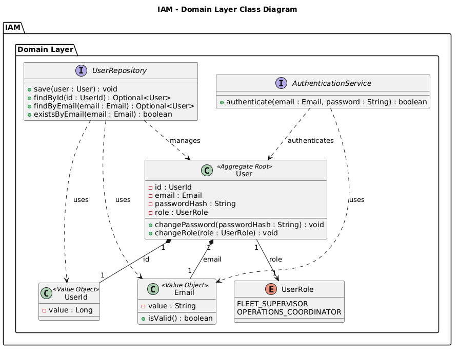

<div style="page-break-after: always;"></div>

##### 2.6.5.6.2. Bounded Context Database Design Diagram

El Database Diagram representa las tablas, columnas y constraints utilizadas para la persistencia central de **IAM** mediante Spring Data JPA y MySQL.

| **Tabla** | **Columnas** | **Constraints** |
|---|---|---|
| `users` | `id`, `email`, `password_hash`, `role`, `created_at` | `id PK`, `email UNIQUE NOT NULL`, `password_hash NOT NULL`, `role NOT NULL` |

```text
users
--------------------------------
PK  id
    email UNIQUE NOT NULL
    password_hash NOT NULL
    role NOT NULL
    created_at NOT NULL
```

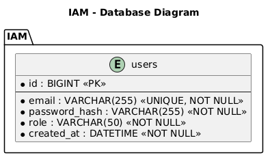

<div style="page-break-after: always;"></div>


### 2.6.6. Bounded Context: Profile

El Bounded Context **Profile** gestiona la información personal asociada a los usuarios de Trakto Route Route.

#### 2.6.6.1. Domain Layer

Esta capa representa las reglas de negocio relacionadas con la información del perfil del usuario.

| **Clase** | **Tipo** | **Propósito** | **Atributos / Métodos principales** |
|---|---|---|---|
| `Profile` | Aggregate Root | Representar y gestionar el perfil de un usuario. | `id`, `userId`, `firstName`, `lastName`, `phone`; `updatePersonalInformation()` |
| `ProfileId` | Value Object | Identificar un perfil. | `value` |
| `ProfileRepository` | Repository Interface | Definir las operaciones de persistencia de perfiles. | `save()`, `findById()`, `findByUserId()` |

Relaciones principales:

```text
Profile ───── ProfileId
ProfileRepository ───> Profile
```

#### 2.6.6.2. Interface Layer

Esta capa contiene las clases de presentación utilizadas para consultar y actualizar el perfil.

| **Clase** | **Tipo** | **Propósito** | **Atributos / Métodos principales** |
|---|---|---|---|
| `ProfileController` | REST Controller | Gestionar las acciones relacionadas con el perfil. | `loadProfile()`, `createProfile()`, `updateProfile()` |
| `ProfileUiState` | UI State | Representar la información mostrada en la interfaz. | `profile`, `isLoading`, `error` |

#### 2.6.6.3. Application Layer

Esta capa coordina los flujos relacionados con la creación, consulta y actualización del perfil.

| **Clase** | **Tipo** | **Propósito** |
|---|---|---|
| `CreateProfileCommand` | Command | Contener los datos para crear un perfil. |
| `CreateProfileCommandHandler` | Command Handler | Procesar la creación del perfil. |
| `UpdateProfileCommand` | Command | Solicitar la actualización del perfil. |
| `UpdateProfileCommandHandler` | Command Handler | Procesar la actualización del perfil. |
| `GetProfileQuery` | Query | Solicitar el perfil de un usuario. |
| `GetProfileQueryHandler` | Query Handler | Obtener la información del perfil. |
| `UserRegisteredEventHandler` | Event Handler | Crear el perfil inicial cuando se registra un usuario. |

#### 2.6.6.4. Infrastructure Layer

Esta capa implementa la persistencia de Profile mediante **Spring Data JPA y MySQL**.

| **Clase** | **Tipo** | **Propósito** |
|---|---|---|
| `ProfileJpaEntity` | JPA Entity | Representar un perfil persistido. |
| `SpringDataProfileRepository` | Spring Data Repository | Realizar operaciones de persistencia y consulta. |
| `ProfileRepositoryAdapter` | Repository Implementation | Implementar `ProfileRepository` utilizando Spring Data JPA. |

<div style="page-break-after: always;"></div>

#### 2.6.6.5. Bounded Context Software Architecture Component Level Diagrams

El **Component Diagram del C4 Model** representa los componentes principales de Profile, sus responsabilidades, tecnologías e interacciones.

```text
Profile Presentation
        ↓
Profile Application
        ↓
Profile Domain
        ↓
Profile Infrastructure
        ↓
Spring Data JPA / MySQL
```

Tecnologías utilizadas: **Java, Spring Boot, Spring Web, Spring Data JPA y MySQL**.

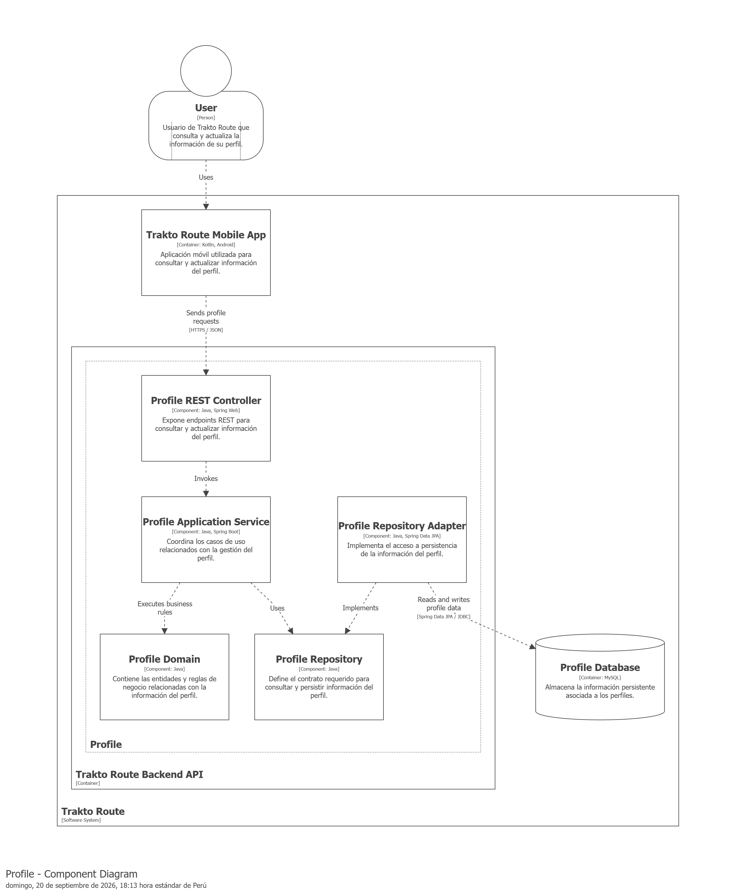

<div style="page-break-after: always;"></div>

#### 2.6.6.6. Bounded Context Software Architecture Code Level Diagrams

En esta sección se presentan los diagramas de mayor detalle de implementación del Bounded Context **Profile**.

##### 2.6.6.6.1. Bounded Context Domain Layer Class Diagrams

El UML Class Diagram representa las clases, interfaces, atributos, métodos, scopes y relaciones del Domain Layer.

```text
Profile
--------------------------------
- id: ProfileId
- userId: Long
- firstName: String
- lastName: String
- phone: String
--------------------------------
+ updatePersonalInformation(
    firstName: String,
    lastName: String,
    phone: String
  ): Unit


ProfileId
--------------------------------
- value: Long


<<interface>>
ProfileRepository
--------------------------------
+ save(profile: Profile): Unit
+ findById(id: ProfileId): Profile?
+ findByUserId(userId: Long): Profile?
```

Relaciones:

```text
Profile ───── ProfileId
ProfileRepository ───> Profile
```

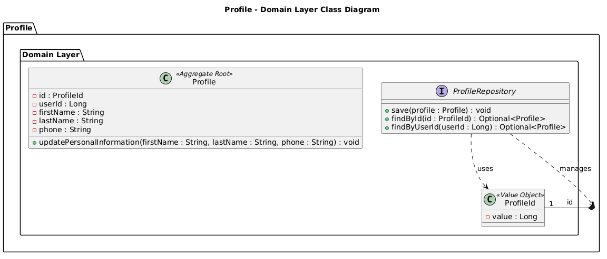

<div style="page-break-after: always;"></div>

##### 2.6.6.6.2. Bounded Context Database Design Diagram

El Database Diagram representa las tablas, columnas y constraints utilizadas para la persistencia central de **Profile** mediante Spring Data JPA y MySQL.

| **Tabla** | **Columnas** | **Constraints** |
|---|---|---|
| `profiles` | `id`, `user_id`, `first_name`, `last_name`, `phone` | `id PK`, `user_id UNIQUE NOT NULL`, `first_name NOT NULL`, `last_name NOT NULL` |

```text
profiles
--------------------------------
PK  id
    user_id UNIQUE NOT NULL
    first_name NOT NULL
    last_name NOT NULL
    phone
```

`user_id` permite asociar el perfil con el usuario correspondiente del Bounded Context **IAM**.

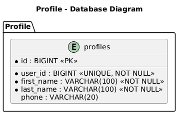

<div style="page-break-after: always;"></div>


# Anexos

## Anexo A. Herramientas utilizadas

| Herramienta | Uso en el proyecto |
|---|---|
| **UXPressia** | Elaboración de User Personas, User Journey Maps y Empathy Maps. |
| **Miro** | Elaboración de Lean UX Canvas, EventStorming y Candidate Context Discovery. |
| **Structurizr** | Elaboración de diagramas del C4 Model, Context Mapping y Component Diagrams. |
| **PlantUML** | Elaboración de UML Class Diagrams y Database Design Diagrams. |
| **GitHub** | Control de versiones, almacenamiento del informe, código fuente e imágenes del proyecto. |
| **Android Studio** | Desarrollo de la aplicación móvil Android en Kotlin. |
| **Spring Boot** | Desarrollo del backend y API REST en Java. |
| **MySQL** | Persistencia central de los datos del sistema. |

<div style="page-break-after: always;"></div>

## Anexo B. Enlaces de entrevistas

| Entrevistado | Segmento | Enlace |
|---|---|---|
| Gianfranco Quispe | Empresa de transporte de carga | [Ver entrevista](https://upcedupe-my.sharepoint.com/:v:/g/personal/u202218899_upc_edu_pe/IQDkzObcE5ATSpmZvlKaZk58ARkz3Yp5qF9_nS_ZYSTAGaQ) |
| Diego Cisneros | Empresa de transporte de carga | [Ver entrevista](https://upcedupe-my.sharepoint.com/:v:/g/personal/u202218899_upc_edu_pe/IQA-12ReLDzQR49ealZCQkCfATl5EcCRvhjS1SzkyXFY-xU) |
| Valeria Cardenas | Empresa de transporte de carga | [Ver entrevista](https://upcedupe-my.sharepoint.com/:v:/g/personal/u202218899_upc_edu_pe/IQBtRonP6CraSJUSB36JKYOyActf48po9v-Z1ghUJw-bAgE) |
| Rodrigo Guerra | Cliente de transporte de carga | [Ver entrevista](https://upcedupe-my.sharepoint.com/:v:/g/personal/u202218899_upc_edu_pe/IQAV3DQLGB33SpVkVyUbv9pQAUsYOLoLLNGkZGiAaly_qig) |
| Alejandro Medina | Cliente de transporte de carga | [Ver entrevista](https://upcedupe-my.sharepoint.com/:v:/g/personal/u202218899_upc_edu_pe/IQCYIb0z_NwBTLbajN-6r4f9AWyuPx7pVcLQDYFiSKfXhjQ) |
| Jael Pinta | Cliente de transporte de carga | [Ver entrevista](https://upcedupe-my.sharepoint.com/:v:/g/personal/u202218899_upc_edu_pe/IQAz-85vOfF1R46gy8UA0z54AfCV6TF7BxvrpjY63Y2yBAs) |

<div style="page-break-after: always;"></div>

