<p align="center">
  
</p>

<h1 align="center">Universidad Peruana de Ciencias Aplicadas</h1>
<h2 align="center">Carrera de Ingeniería de Software</h2>

<h3 align="center">1ACC0238</h3>

<h3 align="center">Aplicaciones para Dispositivos Móviles</h3>
<h3 align="center">NRC</h3>
<h3 align="center">4939</h3>

<h1 align="center">Informe de Trabajo Final</h1>

<h3 align="center">Docente</h3>
<h2 align="center">David Gerardo Quevedo Velasco</h2>

<h3 align="center">Equipo</h3>
<h2 align="center">Trakto</h2>

<h3 align="center">Proyecto</h3>
<h2 align="center">Trakto Route</h2>

<h2 align="center">Integrantes</h2>

<table align="center">
  <tr>
    <th>Código</th>
    <th>Apellidos y Nombres</th>
  </tr>
  <tr>
    <td>u202019409</td>
    <td>Cesar Alejandro Linares Bernable</td>
  </tr>
  <tr>
    <td>U20251B991</td>
    <td>Aguilar Aguayo Jeferson Renzo</td>
  </tr>
  <tr>
    <td>U202019498</td>
    <td>Fernandez Garfias, Alexander Piero</td>
  </tr>
  <tr>
    <td>U20201a293</td>
    <td>CHirito Torres , Jose Raul</td>
  </tr>
  <tr>
    <td>U20241E406</td>
    <td>Loa Rojas, Jean Franck</td>
  </tr>
</table>

<h3 align="center">Periodo 202620</h3>


<div style="page-break-after: always;"></div>

<h2 align="center">Registro de Versiones del Informe</h2>

| Versión | Fecha | Autor | Descripción de modificación |
|---|---|---|---|
| AV1 | 20/09/2026 | Fecha | Creación del informe. Inclusión de la presentación de la startup y del producto, Lean UX, análisis de competidores, entrevistas, Needfinding y Requirements Specification hasta Product Backlog. |
| AV1.1 | 21/09/2026 | Jean Franck Loa Rojas | Incorporación del integrante, fotografía y estructura del Student Outcome 7 conforme al enunciado. |
| TB1 | 03/10/2026 | Equipo Trakto Route | Incorporación de los capítulos III y IV, aplicación Android, evidencias reales de ejecución, repositorios GitFlow, despliegue público del Landing Page y estado verificable de pruebas y dependencias externas. |


<h2 align="center">Project Report Collaboration Insights</h2>

**Repositorio del informe:** [1ACC0238-2620-4939/Report](https://github.com/1ACC0238-2620-4939/Report)


**AV1.** Para el primer avance, el equipo trabajó en la definición de la startup **Trakto** y de su producto **Trakto Route**, el desarrollo del proceso Lean UX, el análisis competitivo, las entrevistas, los artefactos de Needfinding y la especificación inicial de requisitos. Las actividades fueron distribuidas entre los integrantes y consolidadas mediante herramientas colaborativas y control de versiones.

**TB1.** El informe se sincronizó con los aportes de los integrantes antes de cerrar la entrega. Los repositorios del [informe](https://github.com/1ACC0238-2620-4939/Report), [backend](https://github.com/1ACC0238-2620-4939/backend), [Landing Page](https://github.com/1ACC0238-2620-4939/landing-page) y [aplicación Android](https://github.com/1ACC0238-2620-4939/mobile-app) utilizan ramas `feature`, `develop`, `release` y `main`. La evidencia verificable incluye el Landing Page publicado, la aplicación instalada en un emulador Android y el backend compilado y probado. Las entrevistas de validación, el video continuo y la integración móvil-API quedan identificados como dependencias externas pendientes para evitar presentar evidencia inexistente.

<div style="page-break-after: always;"></div>

## Contenido

- [Student Outcome](#student-outcome)
- [Objetivos SMART](#objetivos-smart)
- [Capítulo I: Presentación](#capítulo-i-presentación)
    - [1.1. Startup Profile](#11-startup-profile)
        - [1.1.1. Descripción de la Startup](#111-descripción-de-la-startup)
        - [1.1.2. Perfiles de integrantes del equipo](#112-perfiles-de-integrantes-del-equipo)
    - [1.2. Solution Profile](#12-solution-profile)
        - [1.2.1. Antecedentes y problemática](#121-antecedentes-y-problemática)
        - [1.2.2. Lean UX Process](#122-lean-ux-process)
            - [1.2.2.1. Lean UX Problem Statements](#1221-lean-ux-problem-statements)
            - [1.2.2.2. Lean UX Assumptions](#1222-lean-ux-assumptions)
            - [1.2.2.3. Lean UX Hypothesis Statements](#1223-lean-ux-hypothesis-statements)
            - [1.2.2.4. Lean UX Canvas](#1224-lean-ux-canvas)
    - [1.3. Segmentos objetivo](#13-segmentos-objetivo)
- [Capítulo II: Requirements Development and Software Solution Design](#capítulo-ii-requirements-development-and-software-solution-design)
    - [2.1. Competidores](#21-competidores)
        - [2.1.1. Análisis competitivo](#211-análisis-competitivo)
        - [2.1.2. Estrategias y tácticas frente a competidores](#212-estrategias-y-tácticas-frente-a-competidores)
    - [2.2. Entrevistas](#22-entrevistas)
        - [2.2.1. Diseño de entrevistas](#221-diseño-de-entrevistas)
        - [2.2.2. Registro de entrevistas](#222-registro-de-entrevistas)
        - [2.2.3. Análisis de entrevistas](#223-análisis-de-entrevistas)
    - [2.3. Needfinding](#23-needfinding)
        - [2.3.1. User Personas](#231-user-personas)
        - [2.3.2. User Task Matrix](#232-user-task-matrix)
        - [2.3.3. User Journey Mapping](#233-user-journey-mapping)
        - [2.3.4. Empathy Mapping](#234-empathy-mapping)
        - [2.3.5. Big Picture EventStorming](#235-big-picture-eventstorming)
        - [2.3.6. Ubiquitous Language](#236-ubiquitous-language)
    - [2.4. Requirements Specification](#24-requirements-specification)
        - [To-Be Scenario Mapping](#to-be-scenario-mapping)
        - [2.4.1. User Stories](#241-user-stories)
        - [2.4.2. Impact Mapping](#242-impact-mapping)
        - [2.4.3. Product Backlog](#243-product-backlog)
    - [2.5. Strategic-Level Domain-Driven Design](#25-strategic-level-domain-driven-design)
        - [2.5.1. EventStorming](#251-eventstorming)
            - [2.5.1.1. Candidate Context Discovery](#2511-candidate-context-discovery)
            - [2.5.1.2. Domain Message Flows Modeling](#2512-domain-message-flows-modeling)
            - [2.5.1.3. Bounded Context Canvases](#2513-bounded-context-canvases)
        - [2.5.2. Context Mapping](#252-context-mapping)
        - [2.5.3. Software Architecture](#253-software-architecture)
            - [2.5.3.1. Software Architecture Context Level Diagrams](#2531-software-architecture-context-level-diagrams)
            - [2.5.3.2. Software Architecture Container Level Diagrams](#2532-software-architecture-container-level-diagrams)
            - [2.5.3.3. Software Architecture Deployment Diagrams](#2533-software-architecture-deployment-diagrams)
    - [2.6. Tactical-Level Domain-Driven Design](#26-tactical-level-domain-driven-design)
        - [2.6.1. Bounded Context: Trip Management](#261-bounded-context-trip-management)
            - [2.6.1.1. Domain Layer](#2611-domain-layer)
            - [2.6.1.2. Interface Layer](#2612-interface-layer)
            - [2.6.1.3. Application Layer](#2613-application-layer)
            - [2.6.1.4. Infrastructure Layer](#2614-infrastructure-layer)
            - [2.6.1.5. Bounded Context Software Architecture Component Level Diagrams](#2615-bounded-context-software-architecture-component-level-diagrams)
            - [2.6.1.6. Bounded Context Software Architecture Code Level Diagrams](#2616-bounded-context-software-architecture-code-level-diagrams)
                - [2.6.1.6.1. Bounded Context Domain Layer Class Diagrams](#26161-bounded-context-domain-layer-class-diagrams)
                - [2.6.1.6.2. Bounded Context Database Design Diagram](#26162-bounded-context-database-design-diagram)
        - [2.6.2. Bounded Context: Fleet Management](#262-bounded-context-fleet-management)
            - [2.6.2.1. Domain Layer](#2621-domain-layer)
            - [2.6.2.2. Interface Layer](#2622-interface-layer)
            - [2.6.2.3. Application Layer](#2623-application-layer)
            - [2.6.2.4. Infrastructure Layer](#2624-infrastructure-layer)
            - [2.6.2.5. Bounded Context Software Architecture Component Level Diagrams](#2625-bounded-context-software-architecture-component-level-diagrams)
            - [2.6.2.6. Bounded Context Software Architecture Code Level Diagrams](#2626-bounded-context-software-architecture-code-level-diagrams)
                - [2.6.2.6.1. Bounded Context Domain Layer Class Diagrams](#26261-bounded-context-domain-layer-class-diagrams)
                - [2.6.2.6.2. Bounded Context Database Design Diagram](#26262-bounded-context-database-design-diagram)
        - [2.6.3. Bounded Context: Incident Management](#263-bounded-context-incident-management)
            - [2.6.3.1. Domain Layer](#2631-domain-layer)
            - [2.6.3.2. Interface Layer](#2632-interface-layer)
            - [2.6.3.3. Application Layer](#2633-application-layer)
            - [2.6.3.4. Infrastructure Layer](#2634-infrastructure-layer)
            - [2.6.3.5. Bounded Context Software Architecture Component Level Diagrams](#2635-bounded-context-software-architecture-component-level-diagrams)
            - [2.6.3.6. Bounded Context Software Architecture Code Level Diagrams](#2636-bounded-context-software-architecture-code-level-diagrams)
                - [2.6.3.6.1. Bounded Context Domain Layer Class Diagrams](#26361-bounded-context-domain-layer-class-diagrams)
                - [2.6.3.6.2. Bounded Context Database Design Diagram](#26362-bounded-context-database-design-diagram)
        - [2.6.4. Bounded Context: Operational History](#264-bounded-context-operational-history)
            - [2.6.4.1. Domain Layer](#2641-domain-layer)
            - [2.6.4.2. Interface Layer](#2642-interface-layer)
            - [2.6.4.3. Application Layer](#2643-application-layer)
            - [2.6.4.4. Infrastructure Layer](#2644-infrastructure-layer)
            - [2.6.4.5. Bounded Context Software Architecture Component Level Diagrams](#2645-bounded-context-software-architecture-component-level-diagrams)
            - [2.6.4.6. Bounded Context Software Architecture Code Level Diagrams](#2646-bounded-context-software-architecture-code-level-diagrams)
                - [2.6.4.6.1. Bounded Context Domain Layer Class Diagrams](#26461-bounded-context-domain-layer-class-diagrams)
                - [2.6.4.6.2. Bounded Context Database Design Diagram](#26462-bounded-context-database-design-diagram)
        - [2.6.5. Bounded Context: IAM](#265-bounded-context-iam)
            - [2.6.5.1. Domain Layer](#2651-domain-layer)
            - [2.6.5.2. Interface Layer](#2652-interface-layer)
            - [2.6.5.3. Application Layer](#2653-application-layer)
            - [2.6.5.4. Infrastructure Layer](#2654-infrastructure-layer)
            - [2.6.5.5. Bounded Context Software Architecture Component Level Diagrams](#2655-bounded-context-software-architecture-component-level-diagrams)
            - [2.6.5.6. Bounded Context Software Architecture Code Level Diagrams](#2656-bounded-context-software-architecture-code-level-diagrams)
                - [2.6.5.6.1. Bounded Context Domain Layer Class Diagrams](#26561-bounded-context-domain-layer-class-diagrams)
                - [2.6.5.6.2. Bounded Context Database Design Diagram](#26562-bounded-context-database-design-diagram)
        - [2.6.6. Bounded Context: Profile](#266-bounded-context-profile)
            - [2.6.6.1. Domain Layer](#2661-domain-layer)
            - [2.6.6.2. Interface Layer](#2662-interface-layer)
            - [2.6.6.3. Application Layer](#2663-application-layer)
            - [2.6.6.4. Infrastructure Layer](#2664-infrastructure-layer)
            - [2.6.6.5. Bounded Context Software Architecture Component Level Diagrams](#2665-bounded-context-software-architecture-component-level-diagrams)
            - [2.6.6.6. Bounded Context Software Architecture Code Level Diagrams](#2666-bounded-context-software-architecture-code-level-diagrams)
                - [2.6.6.6.1. Bounded Context Domain Layer Class Diagrams](#26661-bounded-context-domain-layer-class-diagrams)
                - [2.6.6.6.2. Bounded Context Database Design Diagram](#26662-bounded-context-database-design-diagram)
- [Capítulo III: Solution UI/UX Design](#capítulo-iii-solution-uiux-design)
- [Capítulo IV: Product Implementation & Validation](#capítulo-iv-product-implementation--validation)
- [Conclusiones](#conclusiones)
- [Bibliografía](#bibliografía)
- [Anexos](#anexos)

<div style="page-break-after: always;"></div>

# Student Outcome

## ABET - EAC - Student Outcome 7
**Aprendizaje Continuo y Autónomo**

**Criterio:** La capacidad de adquirir y aplicar nuevos conocimientos según sea necesario, utilizando estrategias de aprendizaje apropiadas.

En el siguiente cuadro se describen las acciones realizadas y los enunciados de conclusiones por parte del equipo, que permiten sustentar el haber alcanzado el logro del ABET – EAC - Student Outcome 7.


| **Avance** | **Integrante** | **Actualiza conceptos y conocimientos necesarios para su desarrollo profesional y en especial para su proyecto en soluciones de software.** | **Reconoce la necesidad del aprendizaje permanente para el desempeño profesional y el desarrollo de proyectos en soluciones de software.** |
|---|---|---|---|
| **AV1** | **Cesar Alejandro Linares Bernable** | Investigó y aplicó conceptos de Lean UX para contribuir en la definición de la problemática, los supuestos y las hipótesis de la solución propuesta, apoyando la estructuración inicial del producto. | Reconoció la importancia de actualizar continuamente sus conocimientos sobre metodologías UX para comprender mejor las necesidades de los usuarios y orientar adecuadamente el desarrollo del producto. |
|  | **Aguilar Aguayo Jeferson Renzo** | Aplicó técnicas de análisis de competidores y entrevistas para recopilar información relevante sobre el mercado, los usuarios y sus principales necesidades, contribuyendo al análisis inicial de la solución. | Identificó la necesidad de fortalecer continuamente sus conocimientos en investigación, análisis de usuarios y herramientas de desarrollo para sustentar mejores decisiones durante la construcción de soluciones de software. |
|  | **Fernandez Garfias, Alexander Piero** | Profundizó y aplicó conocimientos de Lean UX, Needfinding, Domain-Driven Design y arquitectura de software, participando en la elaboración de User Personas, User Task Matrix, Empathy Maps, requisitos, Bounded Contexts y diagramas de arquitectura C4. Asimismo, fortaleció sus conocimientos en modelado de dominio, diseño de bases de datos y estructuración de una solución móvil basada en Kotlin, Java, Spring Boot y MySQL. | Reconoció que el aprendizaje continuo en arquitectura de software, DDD, desarrollo backend, aplicaciones móviles y técnicas de UX resulta necesario para diseñar soluciones mantenibles y adaptables. Además, identificó la importancia de investigar nuevas herramientas, patrones y tecnologías durante el desarrollo para resolver adecuadamente los problemas técnicos encontrados en el proyecto. |
|  | **Chirito Torres, Jose Raul** | Aplicó conocimientos relacionados con la especificación de requisitos mediante la elaboración y organización de User Stories y la revisión de funcionalidades orientadas a las necesidades identificadas en los usuarios. | Reconoció la importancia de actualizar sus conocimientos sobre gestión y especificación de requisitos, así como buenas prácticas de desarrollo, para mantener una adecuada relación entre las necesidades del usuario y las funcionalidades del producto. |
|  | **Loa Rojas, Jean Franck** | Fortaleció sus conocimientos sobre planificación de productos mediante la elaboración del Impact Map y la organización y priorización del Product Backlog, contribuyendo a definir las funcionalidades necesarias para la solución. | Identificó la necesidad del aprendizaje permanente en técnicas de planificación, gestión de productos y desarrollo de software para responder adecuadamente a nuevos requerimientos y cambios que puedan presentarse durante el proyecto. |
|  | **Conclusiones** | **El equipo actualizó y aplicó conocimientos relacionados con Lean UX, investigación de usuarios, análisis de requisitos, planificación del producto, Domain-Driven Design y arquitectura de software, integrándolos en el desarrollo del proyecto Trakto Route.** | **El equipo reconoció la importancia del aprendizaje continuo y autónomo para fortalecer sus competencias profesionales y adaptar el desarrollo de soluciones de software a las necesidades de los usuarios, los cambios tecnológicos y la evolución del proyecto.** |

| **TB1** | **Fernandez Garfias, Alexander Piero** | Aplicó DDD, Spring Boot, persistencia y documentación OpenAPI al implementar los contextos de viajes, flota, seguimiento y perfiles del backend. También contribuyó a la base del Landing Page. | Reconoció la necesidad de mantener actualizados sus conocimientos de arquitectura, persistencia y contratos REST para evolucionar varios contextos sin romper sus interfaces. |
|  | **Aguilar Aguayo, Jeferson Renzo** | Integró y estructuró los capítulos de diseño UI/UX e implementación y validación del producto, relacionando artefactos, Sprint y evidencias esperadas. | Identificó que la documentación técnica debe contrastarse continuamente con los repositorios y la ejecución real para conservar trazabilidad. |
|  | **Loa Rojas, Jean Franck** | Construyó la aplicación Android con Kotlin y Jetpack Compose, preparó la ejecución reproducible del backend, verificó las pruebas y el build, publicó el Landing Page y consolidó evidencias reales en el informe. | Reconoció la necesidad de aprender y aplicar GitFlow, Compose, Android tooling, contenedores y despliegue continuo para cerrar un incremento verificable. |
|  | **Cesar Alejandro Linares Bernable** | No se identificó evidencia de implementación TB1 atribuible en los repositorios revisados al 03/10/2026. | Requiere validación personal y evidencia del integrante antes de atribuir aprendizaje o contribuciones en TB1. |
|  | **Chirito Torres, Jose Raul** | Se identificaron aportes previos al informe, pero no evidencia de implementación TB1 en los repositorios de producto revisados al 03/10/2026. | Requiere validación personal y evidencia del integrante antes de atribuir aprendizaje o contribuciones en TB1. |
|  | **Conclusiones** | **La evidencia disponible muestra adquisición y aplicación de conocimientos en arquitectura DDD, desarrollo Android, construcción reproducible, despliegue web y documentación técnica.** | **El equipo debe continuar fortaleciendo pruebas automatizadas, integración móvil-API y validación con usuarios; esos resultados solo podrán declararse cuando exista evidencia directa.** |


<div style="page-break-after: always;"></div>

# Objetivos SMART

De acuerdo con la rúbrica, cada integrante debe formular al menos dos objetivos SMART orientados a su desarrollo profesional posterior a la carrera. Los siguientes enunciados constituyen una propuesta inicial y deben ser validados personalmente por cada integrante antes de la entrega final.


| Integrante | Objetivo SMART 1 | Objetivo SMART 2 |
|---|---|---|
| **Cesar Alejandro Linares Bernable** | Durante los 12 meses posteriores a la culminación de la carrera, completar al menos una certificación o programa especializado relacionado con desarrollo de software y aplicar los conocimientos adquiridos en un proyecto verificable de portafolio. | Durante los 18 meses posteriores a la graduación, participar en al menos un proyecto profesional o colaborativo de desarrollo de software, contribuyendo en la implementación de funcionalidades y documentando los principales aprendizajes obtenidos. |
| **Aguilar Aguayo Jeferson Renzo** | Durante los 12 meses posteriores a la culminación de la carrera, fortalecer sus conocimientos en desarrollo frontend y bases de datos mediante al menos una certificación o curso especializado en JavaScript, desarrollo web o MySQL, aplicando lo aprendido en un proyecto personal publicado en GitHub. | Durante los 18 meses posteriores a la graduación, participar en al menos un proyecto profesional o colaborativo de software donde contribuya en el desarrollo de interfaces, integración con servicios o gestión de datos, documentando los principales aprendizajes y mejoras realizadas. |
| **Fernandez Garfias, Alexander Piero** | Durante los 12 meses posteriores a la culminación de la carrera, fortalecer su especialización en desarrollo backend completando al menos una certificación avanzada en Java y Spring Boot, y desarrollar un proyecto de portafolio aplicando Domain-Driven Design, arquitectura limpia, APIs RESTful, seguridad y persistencia de datos, acompañado de documentación técnica y pruebas automatizadas. | Durante los 18 meses posteriores a la graduación, participar en al menos un proyecto profesional de software donde contribuya en decisiones de arquitectura, diseño de APIs, modelado de dominio y buenas prácticas de desarrollo, documentando al menos tres mejoras técnicas implementadas y sus resultados. |
| **Chirito Torres, Jose Raul** | Durante los 12 meses posteriores a la culminación de la carrera, completar al menos un curso o certificación relacionada con desarrollo de aplicaciones móviles o desarrollo de software y aplicar los conocimientos adquiridos en un proyecto personal publicado en GitHub. | Durante los 18 meses posteriores a la graduación, participar en al menos un proyecto profesional o colaborativo donde implemente funcionalidades de software y fortalezca sus conocimientos en trabajo en equipo, control de versiones y buenas prácticas de programación. |
| **Loa Rojas, Jean Franck** | Durante los 12 meses posteriores a la culminación de la carrera, completar al menos una capacitación especializada en desarrollo de software, bases de datos o tecnologías relacionadas y demostrar lo aprendido mediante un proyecto funcional de portafolio. | Durante los 18 meses posteriores a la graduación, participar en al menos un proyecto de desarrollo de software donde contribuya en la implementación, pruebas o mantenimiento de funcionalidades y documente los conocimientos técnicos adquiridos durante el proceso. |


<div style="page-break-after: always;"></div>

# Capítulo I: Presentación

## 1.1. Startup Profile

### 1.1.1. Descripción de la Startup

**Trakto** es una startup tecnológica orientada a la digitalización y mejora de las operaciones de transporte terrestre de carga. Su propósito es desarrollar productos digitales que permitan a empresas transportistas y a sus clientes disponer de información organizada, trazable y accesible sobre los viajes de carga.

Su producto principal es **Trakto Route**, una aplicación móvil Android desarrollada en **Kotlin**. La aplicación consume una **API REST desarrollada en Java con Spring Boot**, responsable de centralizar las reglas de negocio, autenticación, gestión de viajes, flota, incidencias e historial operativo. La información persistente del sistema se almacena en **MySQL**.

Trakto Route permite gestionar y consultar viajes, rutas, vehículos, conductores y eventos operativos; registrar paradas, descansos, retrasos, problemas e incidencias; y revisar el historial de las operaciones. Para los clientes que contratan el transporte, la solución busca proporcionar visibilidad del estado y progreso de sus envíos sin exponer funciones internas de administración de flota.

<div style="page-break-after: always;"></div>

### 1.1.2. Perfiles de integrantes del equipo

| Foto | Información |
|---|---|
|  | **Nombre:** Cesar Alejandro Linares Bernable<br><br>**Código:** u202019409<br><br>**Carrera:** Ingeniería de Software<br><br>**Acerca de mí:** Soy estudiante de Ingeniería de Software con conocimientos en tecnologías como Java, C++, C# y .NET. Me interesa continuar fortaleciendo mis habilidades en el desarrollo de soluciones de software y aportar al equipo mediante la responsabilidad, el aprendizaje constante y el trabajo colaborativo. |
|  | **Nombre:** Aguilar Aguayo Jeferson Renzo<br><br>**Código:** U20251B991<br><br>**Carrera:** Ingeniería de Software<br><br>**Acerca de mí:** Soy estudiante de Ingeniería de Software con conocimientos en JavaScript, HTML, CSS y MySQL. Me interesa el desarrollo de aplicaciones y la creación de soluciones orientadas a las necesidades de los usuarios. Entre mis fortalezas se encuentran el trabajo colaborativo, la responsabilidad en las entregas y la propuesta de ideas para mejorar el proyecto. |
|  | **Nombre:** Alexander Piero Fernandez Garfias<br><br>**Código:** U202019498<br><br>**Carrera:** Ingeniería de Software<br><br>**Acerca de mí:** Soy estudiante de Ingeniería de Software con conocimientos en Java, JavaScript, TypeScript, Angular, Vue, Vite, Kotlin, Flutter, C#, C++ y desarrollo Android. Me interesa seguir fortaleciendo mis conocimientos en desarrollo de software y participar en la construcción de aplicaciones aplicando buenas prácticas de programación y organización del código. |
|  | **Nombre:** Jose Raul Chirito Torres<br><br>**Código:** U20201A293<br><br>**Carrera:** Ingeniería de Software<br><br>**Acerca de mí:** Soy estudiante de Ingeniería de Software con conocimientos en Java, C++, desarrollo web y tecnologías como Angular y Vue. Me interesa ampliar mis habilidades en el desarrollo de aplicaciones y contribuir al equipo mediante la implementación de funcionalidades, la resolución de problemas y el trabajo coordinado. |
|  | **Nombre:** Loa Rojas, Jean Franck<br><br>**Código:** U20241E406<br><br>**Carrera:** Ingeniería de Software<br><br>**Acerca de mí:** Soy estudiante de Ingeniería de Software con conocimientos en Java, C#, C++, .NET y fundamentos de desarrollo web. Me interesa mejorar continuamente mis capacidades técnicas y participar en proyectos que me permitan aplicar lo aprendido, contribuir al desarrollo de funcionalidades y fortalecer mi experiencia trabajando en equipo. |


<div style="page-break-after: always;"></div>

## 1.2. Solution Profile

### 1.2.1. Antecedentes y problemática


**Who (¿Quién?) - ¿A quiénes afecta el problema?**  
Afecta, por un lado, a las **empresas de transporte de carga**, cuyos responsables necesitan gestionar viajes, vehículos, conductores, rutas e incidencias; y, por otro, a los **clientes que contratan servicios de transporte de carga**, quienes necesitan conocer el estado, progreso y eventos relevantes de sus envíos.

**What (¿Qué?) - ¿Cuál es el problema exactamente?**  
La información relacionada con las operaciones de transporte suele encontrarse distribuida entre diferentes medios. Esto dificulta que las empresas transportistas gestionen de manera centralizada los viajes y sus recursos, y que sus clientes consulten oportunamente el estado y progreso de los envíos contratados.

**Where (¿Dónde?) - ¿En qué contexto ocurre?**  
En las operaciones de transporte terrestre de carga, principalmente durante la coordinación entre **empresas transportistas** que administran vehículos, conductores y viajes, y **empresas o comerciantes clientes** que contratan el traslado de mercancías. El enfoque inicial se encuentra en el mercado peruano.

**When (¿Cuándo?) - ¿En qué momento se manifiesta el problema?**  
Durante la planificación, ejecución y finalización de los viajes. Para la empresa transportista se manifiesta al asignar recursos, actualizar estados o registrar eventos e incidencias; para el cliente, al intentar conocer el avance del envío o informarse sobre retrasos y problemas durante el traslado.

**Why (¿Por qué?) - ¿Por qué ocurre el problema?**  
El problema surge cuando la información de viajes, vehículos, conductores e incidencias se encuentra dispersa o se gestiona mediante diferentes medios, dificultando el control organizado de las operaciones.

**How (¿Cómo?) - ¿Cómo impacta en el usuario?**  
En las empresas transportistas genera mayor esfuerzo para organizar y consultar la información operativa y mantener la trazabilidad de los viajes. En los clientes genera incertidumbre y dependencia de llamadas o mensajes cuando necesitan conocer el estado de sus envíos o entender una incidencia.

**How Much (¿Cuánto?) - ¿Qué tan grande es el problema?**  
Las empresas de transporte gestionan múltiples viajes, vehículos, conductores e incidencias, por lo que la fragmentación de la información aumenta el esfuerzo necesario para supervisar cada operación. En este contexto, **Trakto Route** busca integrar la gestión de viajes, flota, incidencias e historial operativo y brindar al cliente visibilidad de los envíos asociados a su organización.

#### Objetivos de la solución

- Centralizar la información operativa de viajes, rutas, vehículos, conductores e incidencias.
- Permitir a supervisores de transporte registrar y consultar el ciclo de vida de cada viaje.
- Proporcionar a los clientes autorizados visibilidad del estado y progreso de sus envíos.
- Mantener un historial consultable que facilite la trazabilidad de las operaciones.
- Proveer una arquitectura cliente-servidor donde la aplicación Android consuma servicios REST y la información oficial permanezca centralizada en el backend.

#### Restricciones iniciales

- La aplicación móvil se implementará para **Android utilizando Kotlin**.
- Los servicios backend se implementarán en **Java con Spring Boot** y expondrán una **API REST**.
- La persistencia central del sistema utilizará **MySQL**.
- El alcance inicial se orientará al mercado peruano y a operaciones de transporte terrestre de carga.
- Las funcionalidades avanzadas de telemetría vehicular, hardware GPS propio y optimización automática de rutas quedan fuera del alcance inicial, salvo futuras integraciones.

<div style="page-break-after: always;"></div>


### 1.2.2. Lean UX Process

#### 1.2.2.1. Lean UX Problem Statements

**Problem Statement – Brand New Initiative**

El estado actual del dominio del **transporte terrestre de carga** se apoya con frecuencia en una combinación de sistemas de rastreo, hojas de cálculo, llamadas, mensajería y registros separados utilizados por empresas transportistas y por clientes que necesitan conocer el avance de sus envíos.

Lo que estas alternativas no siempre resuelven de manera integrada es la **trazabilidad de extremo a extremo de una operación**, relacionando en un mismo producto el viaje, la ruta, el vehículo, el conductor, los eventos operativos y las incidencias, junto con una vista de seguimiento apropiada para el cliente que contrata el servicio.

**Trakto Route** abordará esta brecha mediante una aplicación móvil Android en Kotlin conectada a una API REST en Java/Spring Boot y una base de datos MySQL centralizada. La estrategia inicial prioriza la gestión de viajes, flota e incidencias para las empresas transportistas y la consulta segura del estado de los envíos para sus clientes.

El foco inicial estará en **empresas peruanas de transporte de carga** y en **empresas o comerciantes que contratan servicios de transporte de carga**.

Se considerará evidencia inicial de éxito que, durante la validación del producto, los representantes de ambos segmentos puedan consultar la información necesaria de una operación desde Trakto Route y completen las tareas críticas definidas sin depender de registros dispersos para esos mismos datos.

<div style="page-break-after: always;"></div>

#### 1.2.2.2. Lean UX Assumptions

Las assumptions se expresan como creencias que deberán validarse mediante entrevistas, pruebas de usabilidad y métricas de uso. Se organizan según los cinco tipos requeridos por la rúbrica.

##### Business Assumptions

1. Creemos que las empresas de transporte de carga valorarán una solución móvil que centralice viajes, flota e incidencias sin requerir infraestructura telemática propia.
2. Creemos que un modelo B2B de suscripción puede ser viable si la solución reduce la fragmentación de información operativa.
3. Creemos que iniciar en el mercado peruano permite adaptar el producto a procesos y condiciones locales antes de ampliar su alcance.

##### Business Outcome Assumptions

1. Creemos que la adopción será visible en el crecimiento de usuarios activos de empresas registradas durante los primeros meses.
2. Creemos que el valor del producto podrá observarse en el porcentaje de viajes gestionados con eventos e incidencias registrados.
3. Creemos que la retención aumentará cuando supervisores y clientes consulten recurrentemente el estado e historial de sus operaciones.

##### User Assumptions

1. Creemos que los supervisores y responsables de empresas transportistas necesitan gestionar viajes, vehículos, conductores, rutas e incidencias.
2. Creemos que clientes que requieren servicios de transporte de carga necesitan conocer el estado, progreso y eventos relevantes de sus envíos.
3. Creemos que ambos segmentos utilizarán principalmente dispositivos móviles para consultas frecuentes durante una operación.

##### User Outcome and Benefit Assumptions

1. Creemos que los responsables de transporte desean reducir el tiempo empleado en reunir información distribuida entre diferentes medios.
2. Creemos que los clientes desean reducir la incertidumbre respecto al estado de sus envíos.
3. Creemos que disponer de historial y trazabilidad facilita revisar lo ocurrido durante una operación y tomar decisiones posteriores.

##### Feature Assumptions

1. Creemos que la **gestión centralizada de viajes, rutas, vehículos y conductores** permitirá al supervisor organizar mejor las operaciones.
2. Creemos que el **registro de eventos e incidencias** permitirá mantener trazabilidad del desarrollo de cada viaje.
3. Creemos que el **seguimiento del estado del envío para clientes autorizados** reducirá la dependencia de llamadas y mensajes para solicitar información.
4. Creemos que el **historial operativo** permitirá revisar viajes anteriores y analizar eventos asociados.
5. Creemos que la **autenticación y autorización por roles** permitirá ofrecer información y acciones distintas a supervisores y clientes de forma segura.

<div style="page-break-after: always;"></div>

#### 1.2.2.3. Lean UX Hypothesis Statements

Cada hipótesis deriva de una Feature Assumption y utiliza la estructura indicada por Lean UX. En cada caso, los componentes del template se presentan en inglés y el contenido específico de la hipótesis se expresa a continuación.

##### Hypothesis Statement 1 – Gestión centralizada

**We believe we will achieve** mayor adopción de la gestión digital de operaciones  
**If** supervisores de empresas de transporte de carga  
**Attain** la capacidad de organizar y consultar una operación desde un único sistema  
**With** la gestión centralizada de viajes, rutas, vehículos y conductores.

##### Hypothesis Statement 2 – Eventos e incidencias

**We believe we will achieve** mayor trazabilidad de los viajes gestionados  
**If** supervisores de transporte  
**Attain** la capacidad de registrar lo ocurrido durante la operación  
**With** el registro de paradas, descansos, retrasos, problemas e incidencias.

##### Hypothesis Statement 3 – Seguimiento del cliente

**We believe we will achieve** mayor uso recurrente de Trakto Route por parte de clientes  
**If** clientes que requieren servicios de transporte de carga  
**Attain** mayor visibilidad y menor incertidumbre sobre sus envíos  
**With** la consulta del estado, progreso y eventos relevantes del viaje asociado a su envío.

##### Hypothesis Statement 4 – Historial operativo

**We believe we will achieve** mayor consulta de información histórica para revisión de operaciones  
**If** supervisores de transporte y clientes autorizados  
**Attain** la capacidad de revisar viajes y eventos anteriores de forma organizada  
**With** el historial operativo centralizado.

##### Hypothesis Statement 5 – Acceso por roles

**We believe we will achieve** uso seguro y adecuado de las funcionalidades por cada tipo de usuario  
**If** supervisores y clientes registrados  
**Attain** acceso únicamente a la información y acciones que corresponden a su rol  
**With** autenticación y autorización basada en roles.

<div style="page-break-after: always;"></div>


#### 1.2.2.4. Lean UX Canvas

El **Lean UX Canvas** de Trakto Route fue elaborado en **Miro**, considerando la problemática, los supuestos, las hipótesis y los segmentos objetivo definidos durante el proceso Lean UX.


<div style="page-break-after: always;"></div>

## 1.3. Segmentos objetivo

### Segmento 1: Empresas de transporte de carga

Este segmento está conformado por empresas dedicadas al transporte terrestre de mercancías que administran vehículos, conductores, rutas y viajes. Estas organizaciones necesitan mantener organizada la información de sus operaciones, consultar el estado de los viajes e identificar paradas, descansos, retrasos, problemas, accidentes u otras incidencias que puedan presentarse durante los recorridos.

**Trakto Route** busca atender estas necesidades mediante una aplicación móvil que centralice la gestión y consulta de viajes, vehículos, conductores, rutas e incidencias. Asimismo, permite mantener un historial de las operaciones realizadas, facilitando la revisión de viajes anteriores y la evaluación del desempeño de los vehículos y conductores.

**Segmento Objetivo: Empresas de transporte de carga**

| Característica | Descripción |
|---|---|
| Tipo de cliente | Empresa (B2B) |
| Sector | Transporte terrestre de carga |
| Ubicación | Perú |
| Usuarios principales | Gestores de flota, supervisores y responsables de operaciones |
| Recursos gestionados | Camiones, conductores, rutas y viajes |
| Necesidad principal | Gestionar y mantener la trazabilidad de las operaciones de transporte |
| Funcionalidades de mayor valor | Gestión de viajes, consulta de rutas y estados, registro de incidencias e historial de vehículos, conductores y operaciones |

### Segmento 2: Clientes que requieren servicios de transporte de carga

Este segmento está conformado por organizaciones y comerciantes que dependen de terceros para trasladar mercancías y que necesitan conocer el progreso de los envíos contratados. A diferencia del primer segmento, estos usuarios no administran la flota ni asignan conductores; su necesidad principal es disponer de información confiable sobre el estado del traslado, los retrasos o incidencias relevantes y la culminación del servicio.

**Trakto Route** atiende este segmento mediante funcionalidades de consulta asociadas a los envíos autorizados para cada cliente. De esta forma, el usuario puede revisar el estado del viaje relacionado con su carga, conocer eventos relevantes y reducir la dependencia de llamadas o mensajes para solicitar actualizaciones.

**Segmento Objetivo: Clientes que requieren servicios de transporte de carga**

| Característica | Descripción |
|---|---|
| Tipo de cliente | Empresa o comerciante (B2B) |
| Actividad | Organizaciones que contratan servicios de transporte de mercancías |
| Ubicación inicial | Perú |
| Usuarios principales | Responsables de logística, compras, distribución o propietarios de negocios |
| Necesidad principal | Conocer el estado y progreso de sus envíos con mayor transparencia |
| Problemas frecuentes | Retrasos, poca visibilidad, comunicación lenta y preocupación por la seguridad de la mercancía |
| Funcionalidades de mayor valor | Consulta de estado del envío, progreso del viaje, eventos relevantes, incidencias e historial de envíos |

<div style="page-break-after: always;"></div>

# Capítulo II: Requirements Development and Software Solution Design

## 2.1. Competidores

Para comprender el entorno competitivo de **Trakto Route**, se analizaron soluciones relacionadas con la gestión de flotas, administración de operaciones logísticas y gestión del transporte de carga. Este análisis permite identificar las principales funcionalidades ofrecidas actualmente en el mercado, así como sus fortalezas y diferencias frente a nuestra propuesta.

Para el análisis competitivo se han considerado competidores directos e indirectos que ofrecen funcionalidades relacionadas con la gestión de vehículos, conductores, rutas, viajes, incidencias e historial de operaciones.

<div style="page-break-after: always;"></div>


### 2.1.1. Análisis competitivo

### Competitive Analysis Landscape

<div align="center">

<table>

<tr>
<th colspan="6" style="text-align: center">
Competitive Analysis Landscape
</th>
</tr>

<tr>
<th colspan="2">
¿Por qué llevar a cabo este análisis?
</th>

<td colspan="4">
Tiene como objetivo identificar y comprender las características, fortalezas y debilidades de las soluciones existentes en el mercado de transporte y logística, con la finalidad de detectar oportunidades de diferenciación y definir una propuesta de valor clara para Trakto Route.
</td>
</tr>


<tr>

<th colspan="2"></th>

<th style="text-align: center;">

</th>

<th style="text-align: center;">

</th>

<th style="text-align: center;">

</th>

<th style="text-align: center;">

</th>

</tr>


<tr>

<td rowspan="2" style="vertical-align: middle; font-weight: bold;">
Perfil
</td>

<td>
Overview
</td>


<td>

<i>
Trakto Route es una solución móvil Android orientada a mejorar la trazabilidad de viajes de transporte de carga. La aplicación está desarrollada en Kotlin y consume una API REST propia implementada en Java con Spring Boot, con persistencia centralizada en MySQL. Diferencia las capacidades disponibles para responsables de empresas transportistas y para clientes que consultan sus envíos.
</i>

</td>


<td>

<i>
Samsara es una plataforma integral de gestión de flotas que combina telemática, seguridad, mantenimiento y monitoreo operativo mediante software, sensores y dispositivos conectados.
</i>

</td>


<td>

<i>
SimpliRoute es una plataforma SaaS enfocada en la planificación de rutas, monitoreo de operaciones y optimización logística para empresas de distribución y transporte.
</i>

</td>


<td>

<i>
DispatchTrack es una plataforma especializada en gestión de última milla que permite planificar, monitorear entregas y mejorar la comunicación entre operadores y conductores.
</i>

</td>

</tr>


<tr>

<td>
Ventaja competitiva<br>
¿Qué valor ofrece a los clientes?
</td>


<td>

<i>

<ul>

<li>
Registro digital de viajes desde campo.
</li>

<li>
Seguimiento del estado del viaje mediante información centralizada.
</li>

<li>
Adaptación inicial a escenarios con conectividad variable.
</li>

<li>
Separación de funcionalidades según rol del usuario.
</li>

</ul>

</i>

</td>


<td>

<i>

<ul>

<li>
Visibilidad integral de flotas.
</li>

<li>
Analítica avanzada mediante telemática.
</li>

<li>
Herramientas de seguridad y mantenimiento preventivo.
</li>

</ul>

</i>

</td>


<td>

<i>

<ul>

<li>
Optimización automática de rutas.
</li>

<li>
Seguimiento en tiempo real.
</li>

<li>
Reducción de costos operativos.
</li>

</ul>

</i>

</td>


<td>

<i>

<ul>

<li>
Control especializado de entregas.
</li>

<li>
Mejora de experiencia del cliente final.
</li>

<li>
Seguimiento de operaciones de última milla.
</li>

</ul>

</i>

</td>

</tr>


<tr>

<td rowspan="2" style="vertical-align: middle; font-weight: bold;">
Perfil de Marketing
</td>


<td>
Mercado objetivo
</td>


<td>

<i>

<ul>

<li>
Empresas peruanas de transporte de carga.
</li>

<li>
Clientes que requieren servicios de transporte de carga.
</li>

<li>
Empresas pequeñas y medianas que requieren mejorar la supervisión de viajes.
</li>

</ul>

</i>

</td>


<td>

<i>

<ul>

<li>
Empresas con flotas medianas y grandes.
</li>

<li>
Organizaciones que requieren control integral de vehículos.
</li>

<li>
Empresas con necesidades avanzadas de monitoreo.
</li>

</ul>

</i>

</td>


<td>

<i>

<ul>

<li>
Empresas de logística y distribución.
</li>

<li>
Retail y operadores con múltiples rutas.
</li>

<li>
Empresas que buscan eficiencia operacional.
</li>

</ul>

</i>

</td>


<td>

<i>

<ul>

<li>
Empresas enfocadas en distribución.
</li>

<li>
Comercio electrónico.
</li>

<li>
Operaciones de última milla.
</li>

</ul>

</i>

</td>

</tr>


<tr>

<td>
Estrategias de Marketing
</td>


<td>

<i>

<ul>

<li>
Pilotos B2B con empresas de transporte.
</li>

<li>
Demostraciones funcionales.
</li>

<li>
Validación mediante usuarios reales.
</li>

</ul>

</i>

</td>


<td>

<i>

<ul>

<li>
Venta consultiva empresarial.
</li>

<li>
Demostraciones online.
</li>

<li>
Enfoque en seguridad y eficiencia.
</li>

</ul>

</i>

</td>


<td>

<i>

<ul>

<li>
Demostraciones comerciales.
</li>

<li>
Contenido educativo.
</li>

<li>
Posicionamiento basado en optimización logística.
</li>

</ul>

</i>

</td>


<td>

<i>

<ul>

<li>
Venta empresarial directa.
</li>

<li>
Demostraciones personalizadas.
</li>

<li>
Enfoque en resultados operativos.
</li>

</ul>

</i>

</td>

</tr>


<tr>

<td rowspan="3" style="vertical-align: middle; font-weight: bold;">
Perfil de producto
</td>


<td>
Productos & Servicios
</td>


<td>

<i>

<ul>

<li>
Aplicación móvil Android desarrollada en Kotlin.
</li>

<li>
API REST desarrollada en Java con Spring Boot.
</li>

<li>
Registro de viajes, avances e incidencias.
</li>

<li>
Línea de tiempo del recorrido.
</li>

<li>
Persistencia centralizada en MySQL mediante el backend.
</li>

</ul>

</i>

</td>


<td>

<i>

<ul>

<li>
Gestión de flotas.
</li>

<li>
Telemática vehicular.
</li>

<li>
Seguridad y mantenimiento.
</li>

<li>
Analítica operacional.
</li>

</ul>

</i>

</td>


<td>

<i>

<ul>

<li>
Planificación de rutas.
</li>

<li>
Monitoreo operativo.
</li>

<li>
Notificaciones e integraciones.
</li>

</ul>

</i>

</td>


<td>

<i>

<ul>

<li>
Planificación de entregas.
</li>

<li>
Seguimiento de última milla.
</li>

<li>
Aplicación para conductores.
</li>

</ul>

</i>

</td>

</tr>


<tr>

<td>
Precios & Costos
</td>

<td>
Modelo de suscripción pendiente de validación según tamaño de empresa y necesidades operativas.
</td>


<td>
Modelo basado en cotización según cantidad de vehículos y funcionalidades contratadas.
</td>


<td>
Planes según módulos y alcance operativo requerido.
</td>


<td>
Cotización empresarial según requerimientos del cliente.
</td>

</tr>


<tr>

<td>
Canales de distribución<br>(Web y/o Móvil)
</td>


<td>

<i>

<ul>

<li>
Aplicación móvil Android.
</li>

<li>
Servicios backend REST para la operación del producto.
</li>

<li>
Canales digitales B2B.
</li>

</ul>

</i>

</td>


<td>

<i>

<ul>

<li>
Plataforma web.
</li>

<li>
Aplicaciones móviles.
</li>

<li>
Hardware conectado.
</li>

</ul>

</i>

</td>


<td>

<i>

<ul>

<li>
Plataforma web.
</li>

<li>
Aplicaciones móviles.
</li>

</ul>

</i>

</td>


<td>

<i>

<ul>

<li>
Plataforma web.
</li>

<li>
Aplicación móvil.
</li>

</ul>

</i>

</td>

</tr>


<tr>

<td rowspan="4" style="vertical-align: middle; font-weight: bold;">
Análisis SWOT
</td>


<td>
Fortalezas
</td>

<td>
<ul>
<li>Enfoque específico en trazabilidad de viajes.</li>
<li>Separación por roles.</li>
<li>Adaptación inicial al contexto peruano.</li>
</ul>
</td>

<td>
<ul>
<li>Plataforma madura.</li>
<li>Amplio ecosistema tecnológico.</li>
<li>Hardware y analítica avanzada.</li>
</ul>
</td>

<td>
<ul>
<li>Especialización en optimización logística.</li>
<li>Experiencia regional.</li>
</ul>
</td>

<td>
<ul>
<li>Experiencia en última milla.</li>
<li>Solución especializada en entregas.</li>
</ul>
</td>

</tr>

<tr>

<td>
Debilidades
</td>


<td>
<ul>
<li>Sin adopción validada.</li>
<li>Sin resultados medidos.</li>
<li>Sin infraestructura telemática propia.</li>
</ul>
</td>


<td>
<ul>
<li>Mayor costo de implementación.</li>
<li>Puede ser complejo para necesidades pequeñas.</li>
</ul>
</td>

<td>
<ul>
<li>Puede superar necesidades básicas.</li>
<li>Menor enfoque en trazabilidad personalizada.</li>
</ul>
</td>

<td>
<ul>
<li>Mayor orientación hacia entrega final.</li>
<li>Menor ajuste para seguimiento general del viaje.</li>
</ul>
</td>

</tr>

<tr>

<td>
Oportunidades
</td>

<td>
<ul>
<li>Digitalización del transporte peruano.</li>
<li>Validación en escenarios de conectividad variable.</li>
<li>Integraciones futuras.</li>
</ul>
</td>

<td>
<ul>
<li>Crecimiento de IoT y analítica.</li>
<li>Mayor adopción empresarial.</li>
</ul>
</td>

<td>
<ul>
<li>Automatización logística.</li>
<li>Crecimiento del comercio digital.</li>
</ul>
</td>

<td>
<ul>
<li>Expansión de última milla.</li>
<li>Crecimiento del comercio electrónico.</li>
</ul>
</td>

</tr>

<tr>

<td>
Amenazas
</td>

<td>
<ul>
<li>Competidores consolidados.</li>
<li>Resistencia al cambio tecnológico.</li>
<li>Baja disposición de pago inicial.</li>
</ul>
</td>

<td>
<ul>
<li>Competidores regionales.</li>
<li>Costos elevados.</li>
</ul>
</td>

<td>
<ul>
<li>Plataformas globales con mayor inversión.</li>
</ul>
</td>

<td>
<ul>
<li>Soluciones integrales con mayor presencia.</li>
</ul>
</td>

</tr>

</table>

</div>

<div style="page-break-after: always;"></div>

### 2.1.2. Estrategias y tácticas frente a competidores

En esta sección se presentan las principales estrategias y tácticas que **Trakto Route** plantea desarrollar para competir dentro del mercado de soluciones de gestión de flotas y operaciones de transporte de carga. Estas acciones buscan fortalecer la propuesta de valor del producto, generar diferenciación frente a las alternativas existentes y responder a las necesidades identificadas en empresas de transporte y clientes que requieren servicios de transporte de carga.

Las estrategias consideran el posicionamiento de Trakto Route frente a soluciones consolidadas como Samsara, SimpliRoute y DispatchTrack, priorizando la trazabilidad operativa, facilidad de adopción, accesibilidad móvil y adaptación al contexto de empresas que requieren mejorar la organización y seguimiento de sus operaciones.


## Estrategias


**Diferenciación del producto:**  

Trakto Route buscará diferenciarse frente a plataformas integrales de gestión de flotas mediante una solución enfocada específicamente en la trazabilidad operativa de viajes y transporte de carga. La propuesta estará orientada a centralizar progresivamente información relacionada con viajes, vehículos, conductores, rutas, incidencias e historial operativo, reduciendo la dependencia de registros dispersos y herramientas independientes.


**Enfoque en la trazabilidad de las operaciones:**  

Trakto Route priorizará la recopilación y organización de información asociada a las operaciones de transporte, incluyendo datos de viajes, rutas, paradas, descansos, retrasos e incidencias. Esto permitirá que las empresas puedan disponer de un historial organizado de sus operaciones y mejorar la visibilidad sobre el desarrollo de cada viaje.


**Experiencia de usuario accesible:**  

Trakto Route buscará ofrecer una experiencia de uso sencilla e intuitiva mediante interfaces diferenciadas según el rol del usuario, permitiendo que supervisores de transporte y clientes autorizados puedan acceder a la información que corresponde a su rol sin requerir conocimientos técnicos especializados.


**Adaptación al contexto operativo de las empresas:**  

Trakto Route se desarrollará considerando las necesidades específicas de empresas de transporte de carga y empresas o comerciantes que contratan estos servicios, especialmente aquellas relacionadas con procesos manuales, dificultades de seguimiento operativo, conectividad limitada y necesidad de una transición progresiva hacia herramientas digitales.


**Enfoque en movilidad y acceso operativo:**  

Trakto Route priorizará el acceso mediante dispositivos móviles, permitiendo que los responsables de la operación puedan consultar información relacionada con viajes, vehículos, conductores, rutas e incidencias desde aplicaciones diseñadas para escenarios operativos de campo.


## Tácticas


**Implementación de retroalimentación de usuarios:**  

Se recopilarán y analizarán comentarios de supervisores, gestores de flota, coordinadores logísticos y operadores de transporte con la finalidad de identificar problemas actuales, necesidades emergentes y oportunidades de mejora. Esta información permitirá priorizar funcionalidades que generen mayor valor para los usuarios.


**Monitoreo de la competencia:**  

Se realizará un seguimiento periódico de soluciones existentes en el mercado como Samsara, SimpliRoute, DispatchTrack y otras plataformas relacionadas con gestión de flotas y logística. Este análisis permitirá identificar nuevas funcionalidades, tendencias tecnológicas y oportunidades de diferenciación para Trakto Route.


**Marketing digital B2B:**  

Se desarrollarán acciones de comunicación dirigidas a empresas de transporte de carga y empresas o comerciantes que contratan estos servicios mediante contenido relacionado con trazabilidad de viajes, organización de operaciones, gestión de incidencias y digitalización logística. El objetivo será posicionar a Trakto Route como una alternativa orientada a mejorar la visibilidad y control operativo.


**Contacto y demostraciones con empresas:**  

Se establecerá contacto con empresas del sector transporte y logística para presentar la propuesta de valor de Trakto Route mediante demostraciones funcionales. Estas actividades permitirán obtener validación temprana, identificar necesidades reales y evaluar la aceptación de la solución.


**Validación mediante pruebas con usuarios:**  

Se realizarán pruebas con representantes de los segmentos objetivo para evaluar la facilidad de uso, comprensión de funcionalidades y utilidad de la información proporcionada por Trakto Route. Los resultados permitirán validar hipótesis del producto y definir mejoras antes de ampliar su alcance funcional.


**Mejora continua de la solución:**  

Trakto Route seguirá un proceso de mejora continua basado en resultados obtenidos mediante entrevistas, pruebas con usuarios, análisis competitivo y retroalimentación del mercado. Esto permitirá mantener una evolución alineada con las necesidades reales del sector transporte y logística.


<div style="page-break-after: always;"></div>


## 2.2. Entrevistas


### 2.2.1. Diseño de entrevistas


Las entrevistas tienen como objetivo comprender las necesidades, dificultades y procesos actuales de los segmentos objetivo de **Trakto Route** respecto a la gestión de viajes, vehículos, conductores, rutas e incidencias dentro de las operaciones de transporte.

Asimismo, buscan identificar las herramientas utilizadas actualmente, los métodos empleados para registrar y consultar información operativa, las principales limitaciones existentes y los factores considerados importantes al momento de adoptar una solución tecnológica.

La información obtenida permitirá validar las hipótesis planteadas durante el proceso Lean UX, identificar oportunidades de mejora y determinar las funcionalidades que generan mayor valor para los usuarios.


## Segmento objetivo 1: Empresas de transporte de carga


1. ¿Cuánto tiempo lleva su empresa realizando operaciones de transporte de carga?

2. ¿Cuántos vehículos y conductores gestionan actualmente?

3. ¿Cómo organizan y consultan actualmente la información relacionada con los viajes realizados?

4. ¿Qué herramientas o sistemas utilizan actualmente para gestionar información de vehículos, conductores, rutas y operaciones?

5. ¿Cuáles son los principales problemas o dificultades que enfrentan al gestionar sus operaciones de transporte?

6. ¿Cómo registran actualmente paradas, descansos, retrasos, problemas, accidentes u otras incidencias ocurridas durante un viaje?

7. ¿Cómo consultan el estado de un viaje cuando necesitan conocer el avance de una operación en curso?

8. ¿Qué procedimiento siguen actualmente cuando ocurre una incidencia durante una operación de transporte?

9. ¿Mantienen algún registro histórico de viajes, rutas e incidencias? ¿Cómo gestionan actualmente esta información?

10. ¿Qué información considera más importante consultar para conocer el estado y desempeño de una operación de transporte?

11. ¿Qué dificultades encuentra al administrar información relacionada con vehículos, conductores, rutas y viajes?

12. ¿Qué tan útil sería para su empresa contar con una aplicación móvil que permita organizar y consultar información operativa desde un solo lugar?


## Segmento objetivo 2: Clientes que requieren servicios de transporte de carga

1. ¿Qué tipo de productos o mercancías envía habitualmente y con qué frecuencia contrata servicios de transporte de carga?
2. ¿Qué información necesita conocer desde que entrega la mercancía hasta que llega a su destino?
3. ¿Cómo consulta actualmente el estado o avance de sus envíos?
4. ¿Qué canales utiliza para comunicarse con la empresa transportista?
5. ¿Qué dificultades encuentra cuando necesita conocer dónde se encuentra su mercancía o cuánto falta para la entrega?
6. ¿Ha tenido retrasos, daños, pérdidas u otros problemas durante un traslado? ¿Cómo fue informado?
7. ¿Qué información considera más importante recibir cuando ocurre un retraso o incidencia?
8. ¿Con qué frecuencia solicita actualizaciones sobre un envío en curso?
9. ¿Mantiene algún registro de envíos anteriores? ¿Qué información conserva?
10. ¿Qué tan importante es para usted conocer el progreso del viaje sin realizar llamadas o enviar mensajes al transportista?
11. ¿Qué dispositivo y canales digitales utiliza con mayor frecuencia para consultar información de sus operaciones o pedidos?
12. ¿Qué tan útil sería una aplicación móvil que le permita consultar el estado, progreso e incidencias relevantes de sus envíos desde un solo lugar?

<div style="page-break-after: always;"></div>

### 2.2.2. Registro de entrevistas

En esta sección se presenta el registro de las entrevistas realizadas a los usuarios pertenecientes a los segmentos objetivo de **Trakto Route**. Para cada entrevista se registran los datos del entrevistado, la evidencia visual, el enlace al video, la duración correspondiente y un resumen de las principales respuestas obtenidas.

---

## Segmento objetivo 1: Empresas de transporte de carga

### Entrevista 1

| Campo | Detalle |
|---|---|
| Nombres y apellidos | Gianfranco Quispe |
| Segmento objetivo | Empresas de transporte de carga |
| Cargo / actividad | Empresario del sector de transporte y logística |
| Duración | 4:34 |
| URL del video | [Ver video](https://upcedupe-my.sharepoint.com/:v:/g/personal/u202218899_upc_edu_pe/IQDkzObcE5ATSpmZvlKaZk58ARkz3Yp5qF9_nS_ZYSTAGaQ?nav=eyJyZWZlcnJhbEluZm8iOnsicmVmZXJyYWxBcHAiOiJPbmVEcml2ZUZvckJ1c2luZXNzIiwicmVmZXJyYWxBcHBQbGF0Zm9ybSI6IldlYiIsInJlZmVycmFsTW9kZSI6InZpZXciLCJyZWZlcnJhbFZpZXciOiJNeUZpbGVzTGlua0NvcHkifX0&e=QOjMzT) |

<p align="center">
  
</p>

**Resumen:**  
Gianfranco Quispe es un empresario con cinco años de experiencia en el sector logístico y de transporte. Durante la entrevista destacó la importancia de utilizar tecnología para mejorar la eficiencia y seguridad de las operaciones, especialmente en zonas rurales del Perú. Actualmente emplea herramientas GPS y medios de comunicación en tiempo real para supervisar y coordinar los viajes. También recopila información de sus clientes mediante encuestas y sistemas de calificación. Frente a incrementos de demanda, aumenta temporalmente la disponibilidad de vehículos y reorganiza sus operaciones. Sus respuestas evidencian la necesidad de contar con una aplicación como **Trakto Route**, que permita centralizar la gestión de vehículos, conductores, rutas y viajes.

---

### Entrevista 2

| Campo | Detalle |
|---|---|
| Nombres y apellidos | Diego Cisneros |
| Segmento objetivo | Empresas de transporte de carga |
| Cargo / actividad | Personal relacionado con la gestión de transporte |
| Duración | 6:25 |
| URL del video | [Ver video](https://upcedupe-my.sharepoint.com/:v:/g/personal/u202218899_upc_edu_pe/IQA-12ReLDzQR49ealZCQkCfATl5EcCRvhjS1SzkyXFY-xU?nav=eyJyZWZlcnJhbEluZm8iOnsicmVmZXJyYWxBcHAiOiJPbmVEcml2ZUZvckJ1c2luZXNzIiwicmVmZXJyYWxBcHBQbGF0Zm9ybSI6IldlYiIsInJlZmVycmFsTW9kZSI6InZpZXciLCJyZWZlcnJhbFZpZXciOiJNeUZpbGVzTGlua0NvcHkifX0&e=Ujrc4n) |

<p align="center">
  
</p>

**Resumen:**  
Diego Cisneros considera que una aplicación móvil permitiría automatizar y optimizar diferentes procesos relacionados con el transporte, brindando mayor control sobre las operaciones. Señala que uno de los principales problemas son los retrasos ocasionados por el mal estado de algunas carreteras. Actualmente utiliza Excel para registrar información sobre los camiones, controlar su estado y programar mantenimientos según el tiempo de uso. Esto demuestra la necesidad de una solución como **Trakto Route**, donde la información de vehículos, viajes, rutas y estados pueda mantenerse centralizada y disponible de manera más rápida.

---

### Entrevista 3

| Campo | Detalle |
|---|---|
| Nombres y apellidos | Valeria Cardenas |
| Segmento objetivo | Empresas de transporte de carga |
| Cargo / actividad | Administradora en empresa de transporte de carga |
| Duración | 4:08 |
| URL del video | [Ver video](https://upcedupe-my.sharepoint.com/:v:/g/personal/u202218899_upc_edu_pe/IQBtRonP6CraSJUSB36JKYOyActf48po9v-Z1ghUJw-bAgE?nav=eyJyZWZlcnJhbEluZm8iOnsicmVmZXJyYWxBcHAiOiJPbmVEcml2ZUZvckJ1c2luZXNzIiwicmVmZXJyYWxBcHBQbGF0Zm9ybSI6IldlYiIsInJlZmVycmFsTW9kZSI6InZpZXciLCJyZWZlcnJhbFZpZXciOiJNeUZpbGVzTGlua0NvcHkifX0&e=6Xlw1F) |

<p align="center">
  
</p>

**Resumen:**  
Valeria Cardenas cuenta con dos años de experiencia como administradora en el sector de transporte de carga. Menciona que las condiciones geográficas y de infraestructura del país representan dificultades importantes para las operaciones. Actualmente utiliza herramientas como Excel y rastreo satelital para gestionar los envíos y consultar su avance. También considera importantes la seguridad, puntualidad y adecuada gestión de los vehículos y conductores. La entrevista evidencia la necesidad de centralizar la información operativa y mantener un historial de vehículos, viajes y recorridos mediante una solución móvil como **Trakto Route**.

---

## Segmento objetivo 2: Clientes que requieren servicios de transporte de carga

### Entrevista 4

| Campo | Detalle |
|---|---|
| Nombres y apellidos | Rodrigo Guerra |
| Segmento objetivo | Clientes que requieren servicios de transporte de carga |
| Cargo / actividad | Emprendedor |
| Duración | 5:49 |
| URL del video | [Ver video](https://upcedupe-my.sharepoint.com/:v:/g/personal/u202218899_upc_edu_pe/IQAV3DQLGB33SpVkVyUbv9pQAUsYOLoLLNGkZGiAaly_qig?nav=eyJyZWZlcnJhbEluZm8iOnsicmVmZXJyYWxBcHAiOiJPbmVEcml2ZUZvckJ1c2luZXNzIiwicmVmZXJyYWxBcHBQbGF0Zm9ybSI6IldlYiIsInJlZmVycmFsTW9kZSI6InZpZXciLCJyZWZlcnJhbFZpZXciOiJNeUZpbGVzTGlua0NvcHkifX0&e=wJlceN) |

<p align="center">
  
</p>

**Resumen:**  
Rodrigo Guerra es un emprendedor que depende de servicios de transporte de mercancías para desarrollar sus actividades comerciales. Durante la entrevista destacó problemas relacionados con la falta de visibilidad de los envíos y el control de los costos. Considera importante poder consultar el estado de un traslado y conocer su avance de forma sencilla. Mostró interés en utilizar una aplicación móvil que mejore la transparencia de las operaciones y destacó que la interfaz debería ser intuitiva y contar con un diseño moderno.

---

### Entrevista 5

| Campo | Detalle |
|---|---|
| Nombres y apellidos | Alejandro Medina |
| Segmento objetivo | Clientes que requieren servicios de transporte de carga |
| Cargo / actividad | Personal de empresa de mobiliario |
| Duración | 3:35 |
| URL del video | [Ver video](https://upcedupe-my.sharepoint.com/:v:/g/personal/u202218899_upc_edu_pe/IQCYIb0z_NwBTLbajN-6r4f9AWyuPx7pVcLQDYFiSKfXhjQ?nav=eyJyZWZlcnJhbEluZm8iOnsicmVmZXJyYWxBcHAiOiJPbmVEcml2ZUZvckJ1c2luZXNzIiwicmVmZXJycmFsTW9kZSI6InZpZXciLCJyZWZlcnJhbFZpZXciOiJNeUZpbGVzTGlua0NvcHkifX0&e=ah7IkZ) |

<p align="center">
  
</p>

**Resumen:**  
Alejandro Medina trabaja en una empresa dedicada al sector mobiliario y considera fundamental el servicio de transporte para realizar las entregas de sus productos. Entre los principales problemas identifica los retrasos, los posibles daños a la mercancía y la falta de comunicación con los transportistas. Considera útil disponer de una aplicación que permita conocer el estado de los envíos y mejorar la transparencia durante el traslado. También menciona como importante conocer la ubicación y el progreso de la entrega. Sus respuestas muestran interés por una solución que facilite el seguimiento y reduzca la incertidumbre durante las operaciones de transporte.


---

### Entrevista 6

| Campo | Detalle |
|---|---|
| Nombres y apellidos | Jael Pinta |
| Segmento objetivo | Clientes que requieren servicios de transporte de carga |
| Cargo / actividad | Comerciante mayorista de prendas |
| Duración | 4:12 |
| URL del video | [Ver video](https://upcedupe-my.sharepoint.com/:v:/g/personal/u202218899_upc_edu_pe/IQAz-85vOfF1R46gy8UA0z54AfCV6TF7BxvrpjY63Y2yBAs?nav=eyJyZWZlcnJhbEluZm8iOnsicmVmZXJyYWxBcHAiOiJPbmVEcml2ZUZvckJ1c2luZXNzIiwicmVmZXJyYWxBcHBQbGF0Zm9ybSI6IldlYiIsInJlZmVycmFsTW9kZSI6InZpZXciLCJyZWZlcnJhbFZpZXciOiJNeUZpbGVzTGlua0NvcHkifX0&e=CS9mfl) |

<p align="center">
  
</p>

**Resumen:**  
Jael Pinta se dedica a la venta mayorista de prendas hacia diferentes zonas del interior del país y utiliza servicios de transporte para realizar sus envíos. Su principal preocupación es la seguridad de la mercancía, debido a que en algunas ocasiones los productos no llegan completos o en las mismas condiciones en las que fueron enviados. También menciona que la comunicación mediante canales tradicionales puede resultar lenta y generar pérdida de tiempo al consultar el estado de los envíos. Considera importante contar con mayor información sobre el traslado y mejorar la organización y trazabilidad de las operaciones.


<div style="page-break-after: always;"></div>


### 2.2.3. Análisis de entrevistas

A partir de las **siete entrevistas realizadas**, distribuidas en **tres participantes del segmento de empresas de transporte de carga** y **cuatro participantes del segmento de clientes que requieren servicios de transporte de carga**, se analizaron las principales características, necesidades, dificultades y expectativas identificadas. El análisis considera aspectos objetivos y subjetivos recurrentes en las respuestas y sirve como base para la construcción de los User Personas y demás artefactos de Needfinding.

### Segmento objetivo 1: Empresas de transporte de carga

A partir de las tres entrevistas realizadas a representantes de empresas de transporte de carga, se identificó que el **100 % de los entrevistados considera importante conocer la ubicación de sus vehículos durante el desarrollo de los viajes**. Asimismo, el **66.7 % indicó tener dificultades para obtener de manera inmediata información sobre el estado de un recorrido cuando ocurre un retraso, parada no prevista u otra incidencia**.

Respecto a la comunicación, el **100 % señaló que mantiene contacto con los conductores durante las operaciones**, principalmente cuando necesita conocer el estado del viaje o resolver algún inconveniente. Sin embargo, el **66.7 % manifestó interés en contar con una solución que facilite la comunicación y permita relacionarla con la información del recorrido**.

En cuanto a la trazabilidad, el **66.7 % indicó que actualmente la información relacionada con vehículos, conductores, rutas e incidencias se encuentra distribuida entre diferentes medios o herramientas**, dificultando la consulta posterior de lo ocurrido durante una operación.

Finalmente, el **100 % de los entrevistados mostró interés en disponer de una plataforma que centralice la información de sus operaciones de transporte**, destacando como funcionalidades de mayor valor la geolocalización, la visualización de rutas y recorridos, el registro de incidencias, la comunicación con los conductores y el historial de viajes.

Estos resultados permiten identificar como características comunes del segmento la necesidad de **visibilidad operativa, control, comunicación rápida y trazabilidad de los recorridos**. Por ello, **Trakto Route** puede responder a estas necesidades mediante la centralización de información relacionada con cada operación de transporte.

<div style="page-break-after: always;"></div>

### Segmento objetivo 2: Clientes que requieren servicios de transporte de carga

A partir de las cuatro entrevistas realizadas a clientes que requieren servicios de transporte de carga, se identificó que el **100 % presenta la necesidad de conocer o mantener organizado el estado y progreso de la mercancía durante el traslado**. La falta de visibilidad y la dificultad para obtener información de manera oportuna aparecen de forma recurrente en las experiencias descritas.

Respecto a la comunicación, el **75 % de los entrevistados manifestó dificultades o ineficiencias al comunicarse con transportistas o conductores para conocer el estado de la carga**. Esto evidencia una dependencia de canales tradicionales que puede generar demoras y pérdida de tiempo al solicitar actualizaciones.

En relación con la seguridad de la mercancía, el **50 % manifestó preocupación por daños, pérdidas o por recibir productos en condiciones diferentes a las esperadas**. Asimismo, el **25 % mencionó explícitamente los retrasos como un problema relevante durante las operaciones de transporte**.

El **50 % expresó de manera explícita interés en utilizar una aplicación móvil o solución tecnológica que facilite el seguimiento del envío**, mientras que el resto de los participantes manifestó la necesidad de disponer de mayor información, organización y trazabilidad durante el traslado.

A partir de estos resultados, se identifica que este segmento se caracteriza principalmente por buscar **mayor visibilidad del envío, comunicación más eficiente, seguridad de la mercancía y trazabilidad del traslado**. Estas características respaldan el enfoque de **Trakto Route** como una aplicación móvil que permite consultar el estado, progreso e incidencias relevantes asociadas a los envíos.

<div style="page-break-after: always;"></div>


## 2.3. Needfinding

### 2.3.1. User Personas

Las siguientes fichas de **User Persona** fueron elaboradas en **UXPressia** a partir del análisis de los segmentos objetivo de **Trakto Route**, considerando las necesidades, comportamientos, objetivos y dificultades identificadas durante el proceso de entrevistas. Cada ficha representa un arquetipo de usuario que permite comprender mejor el contexto en el que se desarrollan las operaciones de transporte y las necesidades que Trakto Route busca atender.

Para el primer segmento, correspondiente a **empresas de transporte de carga**, se identificó un perfil relacionado con la gestión y supervisión de las operaciones de transporte, cuyo principal objetivo es mantener organizada la información de los viajes, vehículos, conductores y rutas. Este usuario necesita consultar el estado de los viajes, registrar incidencias y acceder al historial de las operaciones para mantener una adecuada trazabilidad de las actividades realizadas.

Para el segundo segmento, correspondiente a **clientes que requieren servicios de transporte de carga**, se identificó un perfil responsable de hacer seguimiento a mercancías enviadas mediante empresas transportistas. Este usuario valora especialmente conocer el estado y progreso del envío, recibir información oportuna sobre retrasos o incidencias y reducir la dependencia de llamadas o mensajes para solicitar actualizaciones.

**1. Primer segmento: Empresas de transporte de carga**


**2. Segundo segmento: Clientes que requieren servicios de transporte de carga**


<div style="page-break-after: always;"></div>

### 2.3.2. User Task Matrix

El **User Task Matrix** compara las principales tareas que realizan actualmente los representantes de ambos segmentos, independientemente de la existencia de Trakto Route. **Carlos Mendoza** representa a una empresa de transporte de carga y **Andrea Salazar** representa a una empresa cliente que contrata servicios de transporte.

| **User Task** | **Carlos Mendoza** | | **Andrea Salazar** | |
|---|---|---|---|---|
| | **Frecuencia** | **Importancia** | **Frecuencia** | **Importancia** |
| Revisar viajes programados y en curso | Siempre | Alta | A veces | Media |
| Verificar vehículo y conductor asignados | Siempre | Alta | Rara vez | Baja |
| Consultar el estado de un traslado | Siempre | Alta | Siempre | Alta |
| Consultar el progreso del viaje | Siempre | Alta | Siempre | Alta |
| Identificar retrasos o incidencias | Siempre | Alta | Siempre | Alta |
| Registrar información sobre incidencias | A veces | Alta | Nunca | Baja |
| Comunicarse con la contraparte cuando existe un problema | A veces | Alta | A veces | Alta |
| Consultar información de operaciones o envíos anteriores | A veces | Media | A veces | Media |
| Confirmar la finalización o entrega de un traslado | Siempre | Alta | Siempre | Alta |
| Revisar antecedentes de vehículos y conductores | A veces | Media | Nunca | Baja |
| Coordinar recursos de transporte | Siempre | Alta | Nunca | Baja |
| Solicitar actualizaciones del envío | Rara vez | Baja | Siempre | Alta |

### Análisis de la User Task Matrix

La matriz evidencia que ambos segmentos coinciden en la necesidad de conocer el **estado y progreso de una operación**, identificar retrasos o incidencias y confirmar su finalización. La diferencia principal se encuentra en el nivel de responsabilidad sobre la operación.

**Carlos Mendoza**, como supervisor de flota, administra directamente los recursos y el ciclo de vida del viaje, por lo que necesita verificar vehículos, conductores, rutas e incidencias y registrar información operativa.

**Andrea Salazar**, como responsable logística de una empresa cliente, no administra la flota del transportista. Su prioridad es obtener visibilidad del envío contratado, reducir la necesidad de solicitar actualizaciones manuales y conocer oportunamente los eventos que afectan la entrega.

Esta diferencia permite delimitar funcionalidades por rol: el primer segmento requiere capacidades de **gestión**, mientras que el segundo requiere principalmente capacidades de **consulta y seguimiento**.

<div style="page-break-after: always;"></div>

### 2.3.3. User Journey Mapping

En esta sección se presentan los **User Journey Maps elaborados en UXPressia** correspondientes a cada uno de los User Personas identificados para los segmentos objetivo de Trakto Route. Estos diagramas permiten representar de manera secuencial las actividades que realizan actualmente los usuarios durante una operación de transporte, desde la preparación del viaje hasta su finalización.

Para este análisis se elaboraron las versiones **As-Is** de los User Journey Maps, por lo que se representa la situación actual de los usuarios **sin considerar la existencia de Trakto Route como solución**. El objetivo es identificar las acciones realizadas durante el proceso, así como los pensamientos, emociones, dificultades y oportunidades que aparecen en cada etapa.

Cada User Journey Map se encuentra vinculado con el User Persona correspondiente. **Carlos Mendoza** representa al segmento de empresas de transporte de carga, mientras que **Andrea Salazar** representa al segmento de clientes que requieren servicios de transporte de carga.

#### 1. As-Is User Journey Map – Carlos Mendoza

El primer User Journey Map corresponde a **Carlos Mendoza**, supervisor de flota y representante del segmento de **empresas de transporte de carga**.

El journey representa el proceso actual que realiza Carlos para preparar y supervisar una operación de transporte. El recorrido comienza con la preparación del viaje y la verificación de los recursos necesarios, continúa con el inicio y seguimiento de la operación, contempla la gestión de posibles incidencias y finaliza con la revisión y registro de la información correspondiente al viaje realizado.

Durante este proceso, Carlos necesita consultar información sobre vehículos, conductores y rutas, verificar el estado de las operaciones, identificar retrasos o problemas y mantener registros que posteriormente le permitan revisar lo ocurrido durante cada viaje.

Las principales etapas consideradas en su As-Is User Journey Map son:

1. **Preparación del viaje:** revisa la información del viaje, la ruta, el vehículo y el conductor asignado.
2. **Inicio del viaje:** verifica que la operación haya comenzado de acuerdo con lo planificado y registra la información correspondiente al inicio.
3. **Seguimiento de la operación:** consulta el estado del viaje y obtiene información sobre su desarrollo mediante los medios disponibles actualmente.
4. **Gestión de incidencias:** identifica retrasos, paradas, problemas o accidentes y coordina las acciones necesarias para responder ante la situación.
5. **Finalización del viaje:** verifica la culminación de la operación, registra la información correspondiente y revisa lo ocurrido durante el recorrido.

A lo largo de estas etapas se identifican dificultades relacionadas con la **información distribuida entre diferentes medios, la necesidad de consultar constantemente el estado de las operaciones y la dificultad para mantener un historial organizado de viajes, vehículos, conductores e incidencias**.


<div style="page-break-after: always;"></div>


#### 2. As-Is User Journey Map – Andrea Salazar

El segundo User Journey Map corresponde a **Andrea Salazar**, responsable logística de una empresa cliente y representante del segmento de **clientes que requieren servicios de transporte de carga**.

El journey representa el proceso actual que realiza Andrea para hacer seguimiento a los envíos que su organización contrata con empresas transportistas. El recorrido comienza cuando coordina el despacho y obtiene los datos básicos del servicio, continúa con la consulta del avance del traslado, contempla la comunicación con el transportista ante retrasos o incidencias y finaliza cuando confirma la llegada de la mercancía.

Durante este proceso, Andrea necesita conocer el estado y progreso de los envíos contratados, consultar información relevante del traslado y comunicarse con el transportista cuando se presentan retrasos, daños u otras incidencias.

Las principales etapas consideradas en su As-Is User Journey Map son:

1. **Coordinación del envío:** confirma con el transportista los datos del servicio y de la mercancía.
2. **Inicio del traslado:** verifica que el envío haya iniciado y conserva los datos disponibles para seguimiento.
3. **Seguimiento del envío:** solicita o consulta actualizaciones para conocer el avance del traslado.
4. **Atención de incidencias:** se comunica con el transportista cuando existe un retraso, daño, pérdida u otro problema.
5. **Confirmación de entrega:** verifica la llegada de la mercancía y conserva la información relevante del servicio.

A lo largo de estas etapas se identifican dificultades relacionadas con la **falta de visibilidad continua, la dependencia de llamadas o mensajes, la demora para obtener actualizaciones y la incertidumbre cuando ocurre una incidencia**.


Los User Journey Maps permiten identificar similitudes y diferencias entre ambos perfiles. Mientras **Carlos Mendoza** necesita administrar directamente viajes, vehículos, conductores e incidencias, **Andrea Salazar** necesita principalmente consultar el progreso de los envíos contratados y recibir información oportuna cuando el servicio presenta cambios o problemas.

En ambos casos, el journey evidencia oportunidades relacionadas con la **centralización de la información, organización de los registros, trazabilidad de los viajes y acceso eficiente al historial de las operaciones**. Estas oportunidades servirán posteriormente como insumo para definir y priorizar las funcionalidades de la solución.

<div style="page-break-after: always;"></div>


### 2.3.4. Empathy Mapping

En esta sección se presentan los **Empathy Maps elaborados en UXPressia** para cada uno de los User Personas identificados en los segmentos objetivo de Trakto Route. Estos mapas permiten comprender con mayor profundidad las necesidades, comportamientos, pensamientos, preocupaciones y expectativas de los usuarios dentro de su contexto actual de trabajo.

Para su elaboración, se tomó como referencia la información obtenida durante las entrevistas y el análisis realizado previamente. Cada Empathy Map se encuentra vinculado con su respectivo User Persona y organiza los principales hallazgos relacionados con lo que el usuario necesita hacer, dice, ve, hace, escucha, piensa y siente. Asimismo, se identifican sus principales **Pains** y **Gains**, permitiendo comprender las dificultades que enfrenta actualmente y los resultados que espera alcanzar.

Al igual que los User Journey Maps As-Is, los Empathy Maps representan la **situación actual de los usuarios sin considerar a Trakto Route como solución**, permitiendo identificar posteriormente oportunidades de mejora a partir de problemas y necesidades reales.

#### 1. Empathy Map del primer segmento: Empresas de transporte de carga

El primer Empathy Map corresponde a **Carlos Mendoza**, supervisor de flota y representante del segmento de **empresas de transporte de carga**. Este perfil necesita gestionar información relacionada con los viajes, vehículos, conductores y rutas de la empresa, además de consultar el estado de las operaciones y atender las incidencias que puedan presentarse durante su desarrollo.

En su trabajo cotidiano, Carlos necesita revisar los viajes programados, verificar los vehículos y conductores asignados, consultar las rutas, conocer el estado de las operaciones y revisar los eventos ocurridos durante los recorridos. Para realizar estas actividades puede depender de diferentes registros, mensajes, llamadas u otras herramientas utilizadas por la empresa.

Entre sus principales preocupaciones se encuentran la dificultad para encontrar rápidamente información sobre una operación, la existencia de datos distribuidos entre diferentes medios, los posibles errores en los registros y la dificultad para consultar posteriormente lo ocurrido durante viajes anteriores.

Sus principales **Pains** están relacionados con la información dispersa, el tiempo necesario para consultar diferentes fuentes, la dificultad para mantener registros organizados y la necesidad de obtener información suficiente cuando ocurre un retraso, problema o incidencia.

Como principales **Gains**, Carlos busca disponer de información organizada y accesible, mantener una mayor trazabilidad de los viajes, facilitar la revisión de incidencias y contar con registros que le permitan evaluar posteriormente las operaciones, los vehículos y los conductores.


#### 2. Empathy Map del segundo segmento: Clientes que requieren servicios de transporte de carga

El segundo Empathy Map corresponde a **Andrea Salazar**, responsable logística de una empresa cliente. Su responsabilidad no es administrar la flota del transportista, sino asegurar que las mercancías contratadas lleguen al destino esperado y disponer de información suficiente para responder ante retrasos o problemas.

En su actividad cotidiana, Andrea coordina despachos, conserva datos del servicio, solicita actualizaciones sobre el traslado y se comunica con el transportista cuando necesita conocer el avance del envío o cuando ocurre una incidencia.

Entre sus principales preocupaciones se encuentran la **falta de visibilidad**, la demora en recibir respuestas, los retrasos, los posibles daños o pérdidas de mercancía y la dificultad para explicar a otras personas de su organización qué está ocurriendo con un envío.

Sus principales **Pains** son la dependencia de llamadas o mensajes, la información incompleta, la incertidumbre frente a retrasos y la falta de un historial sencillo de consultar.

Como principales **Gains**, Andrea busca consultar el estado del envío de forma autónoma, conocer oportunamente eventos relevantes, disponer de información histórica y reducir el tiempo empleado en solicitar actualizaciones manuales.


Los Empathy Maps permiten identificar que ambos perfiles comparten necesidades relacionadas con la **organización de la información, trazabilidad de las operaciones, consulta de incidencias y acceso a registros históricos**. Sin embargo, Carlos presenta un mayor enfoque en la gestión de vehículos, conductores y viajes individuales, mientras que Andrea requiere principalmente coordinar y organizar información correspondiente a múltiples operaciones de transporte.

Estos hallazgos complementan los resultados obtenidos mediante los User Personas, User Task Matrix y User Journey Maps, y permiten identificar oportunidades que posteriormente podrán ser consideradas durante la definición de las funcionalidades de Trakto Route.

<div style="page-break-after: always;"></div>


### 2.3.5. Big Picture EventStorming

En esta sección se presenta el resultado del **Big Picture EventStorming elaborado en Miro** con el objetivo de explorar y comprender el dominio de negocio de **Trakto Route** a alto nivel. Durante la sesión, el equipo identificó y organizó cronológicamente los principales **Domain Events**, actores y procesos relacionados con la gestión de las operaciones de transporte.

A partir del análisis colaborativo se identificaron seis **Bounded Contexts** principales: **IAM, Profile, Trip Management, Fleet Management, Incident Management y Operational History**. Cada contexto agrupa eventos y conceptos relacionados con una responsabilidad específica del dominio, permitiendo establecer una primera separación siguiendo los principios de **Domain-Driven Design**.

El contexto **IAM (Identity and Access Management)** gestiona los eventos relacionados con la autenticación, autorización y acceso de los usuarios. **Profile** administra la información asociada al perfil de cada usuario. **Trip Management** concentra el ciclo de vida de los viajes, incluyendo rutas, estados, paradas y descansos. **Fleet Management** administra los vehículos y conductores involucrados en las operaciones. **Incident Management** gestiona los retrasos, problemas, accidentes e incidencias ocurridas durante los viajes. Finalmente, **Operational History** mantiene el historial de viajes, vehículos y conductores, permitiendo conservar la trazabilidad de las operaciones realizadas.

Durante la sesión también se identificaron **Hot Spots** relacionados con los cambios de estado de los viajes, la disponibilidad de vehículos y conductores, los tipos de incidencias y las condiciones bajo las cuales una operación puede continuar o finalizar. Estos puntos representan aspectos del dominio que requieren un análisis posterior con mayor nivel de detalle.

A continuación, se presenta una captura del **Big Picture EventStorming de Trakto Route elaborado en Miro** durante la sesión.


<div style="page-break-after: always;"></div>


### 2.3.6. Ubiquitous Language

El siguiente glosario reúne los principales términos y conceptos utilizados dentro del dominio de negocio de **Trakto Route**, relacionados con la gestión de operaciones de transporte de carga. Su objetivo es establecer un lenguaje común, claro y sin ambigüedades entre los miembros del equipo y stakeholders del proyecto.

Los términos se presentan en inglés junto con su equivalente en español y corresponden exclusivamente a conceptos del dominio del negocio identificados durante el proceso de análisis y Big Picture EventStorming.

| **Term** | **Definition** |
|---|---|
| **Trip (Viaje)** | Operación de transporte realizada desde un punto de origen hasta un destino determinado, utilizando un vehículo, un conductor y una ruta asignada. |
| **Trip Status (Estado del viaje)** | Condición en la que se encuentra un viaje durante su ciclo de vida, como programado, preparado, en curso, finalizado o cancelado. |
| **Route (Ruta)** | Recorrido definido que debe seguirse durante una operación de transporte entre el origen y el destino. |
| **Driver (Conductor)** | Persona responsable de conducir el vehículo asignado durante una operación de transporte. |
| **Vehicle (Vehículo)** | Unidad de transporte utilizada para realizar un viaje y trasladar la carga entre el origen y el destino. |
| **Vehicle Availability (Disponibilidad del vehículo)** | Condición que determina si un vehículo se encuentra disponible para ser asignado a una operación de transporte. |
| **Driver Availability (Disponibilidad del conductor)** | Condición que determina si un conductor se encuentra disponible para participar en una operación de transporte. |
| **Stop (Parada)** | Interrupción temporal del desplazamiento del vehículo durante el desarrollo de un viaje. |
| **Rest (Descanso)** | Pausa realizada por el conductor durante una operación de transporte antes de continuar el viaje. |
| **Delay (Retraso)** | Situación en la que una operación presenta una demora respecto al tiempo previsto para su desarrollo. |
| **Problem (Problema)** | Situación inesperada que puede afectar el desarrollo normal de una operación de transporte. |
| **Incident (Incidencia)** | Evento ocurrido durante un viaje que afecta o puede afectar el desarrollo normal de la operación y requiere ser registrado o atendido. |
| **Incident Type (Tipo de incidencia)** | Clasificación utilizada para identificar la naturaleza de una incidencia ocurrida durante un viaje. |
| **Incident Status (Estado de incidencia)** | Condición actual de una incidencia, utilizada para determinar si se encuentra pendiente, en atención o atendida. |
| **Accident (Accidente)** | Suceso no planificado ocurrido durante una operación de transporte que puede afectar al conductor, vehículo, carga o continuidad del viaje. |
| **Trip History (Historial de viajes)** | Registro de los viajes realizados que permite consultar posteriormente la información y los eventos asociados a cada operación. |
| **Driver History (Historial del conductor)** | Registro de los viajes e incidencias asociados a un conductor a lo largo de sus operaciones. |
| **Vehicle History (Historial del vehículo)** | Registro de los viajes e incidencias asociados a un vehículo durante las operaciones en las que ha participado. |
| **Operation Performance (Desempeño de la operación)** | Resultado de la revisión de una operación de transporte considerando su desarrollo, cumplimiento y eventos registrados. |

<div style="page-break-after: always;"></div>


## 2.4. Requirements Specification

En esta sección se especifican los principales requisitos de **Trakto Route** a partir de la información obtenida durante el proceso de investigación, análisis de usuarios y Needfinding. Los requisitos identificados permiten definir las funcionalidades necesarias para atender las necesidades de los segmentos objetivo y establecer una base para la planificación y desarrollo del producto digital.

La especificación de requisitos inicia con el **To-Be Scenario Mapping** como artefacto de transición hacia el escenario futuro y continúa con las secciones numeradas de **User Stories, Impact Mapping y Product Backlog**, permitiendo relacionar las necesidades de los usuarios con las funcionalidades, prioridades y objetivos del producto.

### To-Be Scenario Mapping

El **To-Be Scenario Mapping** representa la experiencia esperada de los segmentos objetivo cuando utilizan **Trakto Route**. A diferencia de los User Journey Maps As-Is, este artefacto muestra cómo la solución propuesta transforma las actividades actuales, reduciendo la dispersión de información, la dependencia de llamadas o mensajes y la incertidumbre durante el seguimiento de los viajes.

**Segmento: Empresas de transporte de carga**<br>

| **Phases** | **Programación y asignación del viaje** | **Inicio del viaje** | **Seguimiento y gestión de incidencias** | **Finalización y revisión** |
| :- | :- | :- | :- | :- |
| **Doing** | - Ingresa a **Trakto Route** y programa el viaje.<br>- Registra o selecciona la ruta, el vehículo y el conductor que participarán en la operación.<br>- Verifica que los recursos asignados se encuentren disponibles. | - Consulta la información del viaje programado.<br>- Confirma el inicio de la operación y actualiza su estado.<br>- Verifica que el vehículo y conductor asignados correspondan al viaje. | - Consulta el estado y progreso del viaje desde la aplicación.<br>- Registra paradas, descansos, retrasos, problemas o accidentes cuando ocurren.<br>- Revisa las incidencias registradas y coordina las acciones necesarias para continuar la operación. | - Registra la finalización del viaje.<br>- Revisa los eventos ocurridos durante el recorrido.<br>- Consulta el historial del viaje, vehículo y conductor para mantener la trazabilidad de la operación. |
| **Thinking** | - “Puedo organizar el viaje y sus recursos desde un solo lugar.”<br>- “Necesito asegurarme de que el vehículo y el conductor estén disponibles antes de iniciar.” | - “Ahora puedo verificar rápidamente que la operación comenzó según lo planificado.”<br>- “La información del viaje está centralizada y disponible cuando la necesito.” | - “Puedo conocer lo que está ocurriendo durante el viaje sin reunir información de diferentes medios.”<br>- “Si ocurre un problema, necesito registrarlo y consultarlo de inmediato para tomar una decisión.” | - “Quiero revisar lo ocurrido durante el recorrido y conservar un historial confiable.”<br>- “Esta información me ayudará a evaluar futuras operaciones.” |
| **Feeling** | - Tranquilo al contar con la información de planificación organizada.<br>- Confiado al verificar los recursos antes del viaje. | - Seguro al confirmar el inicio y disponer de los datos de la operación.<br>- Satisfecho por acceder rápidamente a la información necesaria. | - En control al visualizar el progreso y los eventos del viaje.<br>- Más preparado para responder ante retrasos o incidencias. | - Satisfecho al cerrar la operación con la información registrada.<br>- Confiado al disponer de trazabilidad e historial para consultas posteriores. |

**Segmento: Clientes que requieren servicios de transporte de carga**<br>

| **Phases** | **Consulta del envío** | **Seguimiento del progreso** | **Consulta de incidencias** | **Confirmación de finalización** |
| :- | :- | :- | :- | :- |
| **Doing** | - Ingresa a **Trakto Route** con su cuenta.<br>- Consulta el envío asociado a su organización.<br>- Revisa la información general disponible del traslado. | - Consulta el estado y progreso del viaje relacionado con su mercancía.<br>- Revisa los eventos relevantes registrados durante el recorrido sin depender de llamadas o mensajes constantes. | - Consulta si se registró algún retraso, problema, accidente u otra incidencia que afecte el traslado.<br>- Utiliza la información disponible para decidir si necesita comunicarse con la empresa transportista. | - Verifica que el viaje haya finalizado.<br>- Confirma el estado final del traslado.<br>- Consulta posteriormente la información histórica del envío cuando la necesita. |
| **Thinking** | - “Quiero encontrar rápidamente la información de mi envío sin tener que solicitarla por otros medios.”<br>- “Necesito saber que estoy consultando el traslado correcto.” | - “Puedo revisar el avance del envío cuando lo necesite.”<br>- “Ya no tengo que llamar constantemente para saber cómo va el traslado.” | - “Si ocurre algo con mi mercancía, quiero enterarme y entender qué sucedió.”<br>- “Tener información del problema reduce la incertidumbre mientras espero una solución.” | - “Quiero confirmar que el traslado terminó y conservar la información por si necesito revisarla después.”<br>- “El historial me permite tener mayor claridad sobre el servicio recibido.” |
| **Feeling** | - Tranquilo al encontrar la información del envío en un solo lugar.<br>- Confiado al disponer de acceso autorizado a sus traslados. | - Informado y con menor incertidumbre durante el recorrido.<br>- Satisfecho por reducir la dependencia de canales de comunicación externos. | - Más seguro al conocer oportunamente los eventos relevantes.<br>- Preocupado si existe una incidencia, pero con mayor claridad sobre lo ocurrido. | - Satisfecho al confirmar la finalización del traslado.<br>- Confiado al disponer de un registro consultable de la operación. |

<div style="page-break-after: always;"></div>

### 2.4.1. User Stories


En esta sección se presentan las **User Stories** identificadas para **Trakto Route**. Estas historias describen las funcionalidades requeridas desde la perspectiva de los usuarios y se encuentran agrupadas mediante **Epics** relacionadas con las principales responsabilidades del dominio.

Cada User Story incluye su identificador, usuario, prioridad, Epic, título, descripción y varios criterios de aceptación verificables. Los criterios de aceptación se encuentran redactados en tiempo presente, en tercera persona y utilizando la estructura **Given-When-Then**, evitando referencias a elementos específicos de interfaz.

Adicionalmente, se incluyen **Technical Stories** para funcionalidades que no representan una interacción directa con el usuario final y **Spike Stories** destinadas a reducir incertidumbre mediante actividades de investigación, análisis o pruebas de viabilidad técnica.

#### Epics

| Epic ID | Epic | Descripción |
|---|---|---|
| EP01 | Identity and Access Management | Gestiona el registro, autenticación y acceso de los usuarios a Trakto Route. |
| EP02 | Profile Management | Gestiona la información asociada al perfil de los usuarios. |
| EP03 | Trip Management | Gestiona el ciclo de vida de los viajes, rutas, estados, paradas y descansos. |
| EP04 | Fleet Management | Gestiona los vehículos, conductores y su disponibilidad para las operaciones. |
| EP05 | Incident Management | Gestiona retrasos, problemas, accidentes e incidencias relacionadas con los viajes. |
| EP06 | Operational History | Gestiona el historial de viajes, vehículos, conductores, incidencias y desempeño de las operaciones. |

---

#### US01 – Registrar cuenta

| Campo | Detalle |
|---|---|
| **Story ID** | US01 |
| **User** | Usuario |
| **Priority** | High |
| **Epic** | EP01 – Identity and Access Management |
| **Title** | Registrar cuenta |
| **Description** | Como usuario, deseo registrar una cuenta para acceder a las funcionalidades de Trakto Route. |
| **Acceptance Criteria** | **Scenario 1: Registro válido**<br>**Given** que el usuario proporciona los datos requeridos y un correo no registrado<br>**When** solicita registrar su cuenta<br>**Then** el sistema registra la cuenta correctamente.<br><br>**Scenario 2: Correo ya registrado**<br>**Given** que existe una cuenta asociada al correo proporcionado<br>**When** el usuario solicita registrar una nueva cuenta<br>**Then** el sistema rechaza el registro e informa que el correo ya se encuentra registrado.<br><br>**Scenario 3: Datos inválidos**<br>**Given** que los datos proporcionados no cumplen las reglas establecidas<br>**When** el usuario solicita registrar su cuenta<br>**Then** el sistema rechaza el registro. |

---

#### US02 – Iniciar sesión

| Campo | Detalle |
|---|---|
| **Story ID** | US02 |
| **User** | Usuario |
| **Priority** | High |
| **Epic** | EP01 – Identity and Access Management |
| **Title** | Iniciar sesión |
| **Description** | Como usuario registrado, deseo autenticarme con mis credenciales para acceder de manera segura a Trakto Route. |
| **Acceptance Criteria** | **Scenario 1: Credenciales válidas**<br>**Given** que el usuario posee una cuenta registrada<br>**When** proporciona credenciales válidas<br>**Then** el sistema autentica al usuario y permite el acceso.<br><br>**Scenario 2: Credenciales inválidas**<br>**Given** que las credenciales proporcionadas son incorrectas<br>**When** el usuario intenta autenticarse<br>**Then** el sistema rechaza la autenticación.<br><br>**Scenario 3: Credenciales incompletas**<br>**Given** que el usuario no proporciona todos los datos requeridos<br>**When** intenta autenticarse<br>**Then** el sistema rechaza la solicitud. |

---

#### US03 – Consultar perfil

| Campo | Detalle |
|---|---|
| **Story ID** | US03 |
| **User** | Usuario |
| **Priority** | Medium |
| **Epic** | EP02 – Profile Management |
| **Title** | Consultar perfil |
| **Description** | Como usuario, deseo consultar la información de mi perfil para conocer los datos asociados a mi cuenta. |
| **Acceptance Criteria** | **Scenario 1: Perfil existente**<br>**Given** que el usuario posee un perfil registrado<br>**When** solicita consultar su información<br>**Then** el sistema proporciona los datos asociados al perfil.<br><br>**Scenario 2: Perfil inexistente**<br>**Given** que no existe un perfil asociado al usuario<br>**When** solicita consultar su información<br>**Then** el sistema informa que el perfil no se encuentra disponible. |

---

#### US04 – Actualizar perfil

| Campo | Detalle |
|---|---|
| **Story ID** | US04 |
| **User** | Usuario |
| **Priority** | Medium |
| **Epic** | EP02 – Profile Management |
| **Title** | Actualizar perfil |
| **Description** | Como usuario, deseo actualizar la información de mi perfil para mantener mis datos vigentes. |
| **Acceptance Criteria** | **Scenario 1: Actualización válida**<br>**Given** que el usuario posee un perfil registrado<br>**When** proporciona información válida para actualizarlo<br>**Then** el sistema actualiza los datos del perfil.<br><br>**Scenario 2: Información inválida**<br>**Given** que la información proporcionada no cumple las reglas establecidas<br>**When** el usuario solicita actualizar su perfil<br>**Then** el sistema rechaza la actualización y conserva la información anterior. |

---

#### US05 – Consultar viajes

| Campo | Detalle |
|---|---|
| **Story ID** | US05 |
| **User** | Supervisor de flota |
| **Priority** | High |
| **Epic** | EP03 – Trip Management |
| **Title** | Consultar viajes |
| **Description** | Como supervisor de flota, deseo consultar los viajes registrados para conocer las operaciones de transporte bajo mi responsabilidad. |
| **Acceptance Criteria** | **Scenario 1: Existen viajes**<br>**Given** que existen viajes registrados<br>**When** el supervisor solicita consultar los viajes<br>**Then** el sistema proporciona las operaciones disponibles.<br><br>**Scenario 2: No existen viajes**<br>**Given** que no existen viajes registrados<br>**When** el supervisor realiza la consulta<br>**Then** el sistema informa que no existen viajes disponibles. |

---

#### US06 – Consultar detalle de viaje

| Campo | Detalle |
|---|---|
| **Story ID** | US06 |
| **User** | Supervisor de flota |
| **Priority** | High |
| **Epic** | EP03 – Trip Management |
| **Title** | Consultar detalle de viaje |
| **Description** | Como supervisor de flota, deseo consultar el detalle de un viaje para conocer su ruta, conductor, vehículo, estado y demás información asociada. |
| **Acceptance Criteria** | **Scenario 1: Viaje existente**<br>**Given** que el viaje solicitado existe<br>**When** el supervisor consulta sus detalles<br>**Then** el sistema proporciona la información asociada al viaje.<br><br>**Scenario 2: Viaje inexistente**<br>**Given** que el viaje solicitado no existe<br>**When** el supervisor intenta consultar sus detalles<br>**Then** el sistema informa que el viaje no se encuentra disponible. |

---

#### US07 – Consultar estado del viaje

| Campo | Detalle |
|---|---|
| **Story ID** | US07 |
| **User** | Supervisor de flota |
| **Priority** | High |
| **Epic** | EP03 – Trip Management |
| **Title** | Consultar estado del viaje |
| **Description** | Como supervisor de flota, deseo consultar el estado de un viaje para conocer la situación actual de la operación. |
| **Acceptance Criteria** | **Scenario 1: Estado disponible**<br>**Given** que el viaje existe y posee un estado registrado<br>**When** el supervisor consulta su estado<br>**Then** el sistema proporciona el estado actual del viaje.<br><br>**Scenario 2: Viaje inexistente**<br>**Given** que el viaje solicitado no existe<br>**When** el supervisor consulta su estado<br>**Then** el sistema informa que el viaje no se encuentra disponible. |

---

#### US08 – Consultar ruta asignada

| Campo | Detalle |
|---|---|
| **Story ID** | US08 |
| **User** | Cliente de transporte |
| **Priority** | High |
| **Epic** | EP03 – Trip Management |
| **Title** | Consultar ruta asignada |
| **Description** | Como cliente de transporte, deseo consultar la ruta asignada a un viaje para conocer el recorrido establecido para la operación. |
| **Acceptance Criteria** | **Scenario 1: Ruta asignada**<br>**Given** que el viaje posee una ruta asignada<br>**When** el cliente consulta la ruta<br>**Then** el sistema proporciona la información correspondiente.<br><br>**Scenario 2: Ruta no asignada**<br>**Given** que el viaje no posee una ruta asignada<br>**When** el cliente realiza la consulta<br>**Then** el sistema informa que no existe una ruta asociada. |

---

#### US09 – Consultar conductor

| Campo | Detalle |
|---|---|
| **Story ID** | US09 |
| **User** | Supervisor de flota |
| **Priority** | High |
| **Epic** | EP04 – Fleet Management |
| **Title** | Consultar información del conductor |
| **Description** | Como supervisor de flota, deseo consultar la información del conductor asignado para conocer los datos del responsable de una operación. |
| **Acceptance Criteria** | **Scenario 1: Conductor asignado**<br>**Given** que el viaje posee un conductor asignado<br>**When** el supervisor solicita consultar su información<br>**Then** el sistema proporciona los datos disponibles del conductor.<br><br>**Scenario 2: Conductor no asignado**<br>**Given** que el viaje no posee un conductor asignado<br>**When** el supervisor realiza la consulta<br>**Then** el sistema informa que no existe un conductor asignado. |

---

#### US10 – Consultar vehículo

| Campo | Detalle |
|---|---|
| **Story ID** | US10 |
| **User** | Supervisor de flota |
| **Priority** | High |
| **Epic** | EP04 – Fleet Management |
| **Title** | Consultar información del vehículo |
| **Description** | Como supervisor de flota, deseo consultar la información del vehículo asignado para conocer la unidad utilizada en una operación. |
| **Acceptance Criteria** | **Scenario 1: Vehículo asignado**<br>**Given** que el viaje posee un vehículo asignado<br>**When** el supervisor solicita consultar su información<br>**Then** el sistema proporciona los datos disponibles del vehículo.<br><br>**Scenario 2: Vehículo no asignado**<br>**Given** que el viaje no posee un vehículo asignado<br>**When** el supervisor realiza la consulta<br>**Then** el sistema informa que no existe un vehículo asignado. |

---

#### US11 – Registrar incidencia

| Campo | Detalle |
|---|---|
| **Story ID** | US11 |
| **User** | Supervisor de flota |
| **Priority** | High |
| **Epic** | EP05 – Incident Management |
| **Title** | Registrar incidencia |
| **Description** | Como supervisor de flota, deseo registrar una incidencia asociada a un viaje para mantener constancia de los problemas ocurridos durante la operación. |
| **Acceptance Criteria** | **Scenario 1: Registro válido**<br>**Given** que existe un viaje y se proporciona información válida sobre una incidencia<br>**When** el supervisor solicita registrarla<br>**Then** el sistema registra la incidencia asociada al viaje.<br><br>**Scenario 2: Viaje inexistente**<br>**Given** que el viaje indicado no existe<br>**When** el supervisor intenta registrar una incidencia<br>**Then** el sistema rechaza el registro.<br><br>**Scenario 3: Información incompleta**<br>**Given** que no se proporciona la información requerida<br>**When** el supervisor solicita registrar la incidencia<br>**Then** el sistema rechaza la operación. |

---

#### US12 – Consultar eventos e incidencias del viaje

| Campo | Detalle |
|---|---|
| **Story ID** | US12 |
| **User** | Cliente de transporte |
| **Priority** | High |
| **Epic** | EP05 – Incident Management |
| **Title** | Consultar eventos e incidencias del viaje |
| **Description** | Como cliente de transporte, deseo consultar los eventos e incidencias de un viaje para conocer las situaciones ocurridas durante la operación. |
| **Acceptance Criteria** | **Scenario 1: Existen eventos**<br>**Given** que el viaje posee eventos o incidencias registrados<br>**When** el cliente solicita consultarlos<br>**Then** el sistema proporciona los registros asociados.<br><br>**Scenario 2: No existen eventos**<br>**Given** que el viaje no posee eventos registrados<br>**When** el cliente realiza la consulta<br>**Then** el sistema informa que no existen eventos disponibles. |

---

#### US13 – Consultar historial de viajes

| Campo | Detalle |
|---|---|
| **Story ID** | US13 |
| **User** | Cliente de transporte |
| **Priority** | High |
| **Epic** | EP06 – Operational History |
| **Title** | Consultar historial de viajes |
| **Description** | Como cliente de transporte, deseo consultar el historial de viajes para revisar operaciones realizadas anteriormente. |
| **Acceptance Criteria** | **Scenario 1: Historial disponible**<br>**Given** que existen viajes finalizados registrados<br>**When** el cliente consulta el historial<br>**Then** el sistema proporciona las operaciones históricas disponibles.<br><br>**Scenario 2: Historial vacío**<br>**Given** que no existen operaciones históricas<br>**When** el cliente realiza la consulta<br>**Then** el sistema informa que no existen registros disponibles. |

---

#### US14 – Consultar historial del conductor

| Campo | Detalle |
|---|---|
| **Story ID** | US14 |
| **User** | Supervisor de flota |
| **Priority** | Medium |
| **Epic** | EP06 – Operational History |
| **Title** | Consultar historial del conductor |
| **Description** | Como supervisor de flota, deseo consultar el historial de un conductor para revisar los viajes e incidencias asociados a sus operaciones anteriores. |
| **Acceptance Criteria** | **Scenario 1: Historial disponible**<br>**Given** que el conductor posee operaciones registradas<br>**When** el supervisor consulta su historial<br>**Then** el sistema proporciona los viajes e incidencias asociados.<br><br>**Scenario 2: Sin historial**<br>**Given** que el conductor no posee operaciones históricas<br>**When** el supervisor realiza la consulta<br>**Then** el sistema informa que no existen registros disponibles. |

---

#### US15 – Consultar historial del vehículo

| Campo | Detalle |
|---|---|
| **Story ID** | US15 |
| **User** | Supervisor de flota |
| **Priority** | Medium |
| **Epic** | EP06 – Operational History |
| **Title** | Consultar historial del vehículo |
| **Description** | Como supervisor de flota, deseo consultar el historial de un vehículo para revisar los viajes e incidencias asociados a la unidad. |
| **Acceptance Criteria** | **Scenario 1: Historial disponible**<br>**Given** que el vehículo posee operaciones registradas<br>**When** el supervisor consulta su historial<br>**Then** el sistema proporciona los viajes e incidencias asociados.<br><br>**Scenario 2: Sin historial**<br>**Given** que el vehículo no posee operaciones históricas<br>**When** el supervisor realiza la consulta<br>**Then** el sistema informa que no existen registros disponibles. |

---

#### US16 – Filtrar historial de viajes

| Campo | Detalle |
|---|---|
| **Story ID** | US16 |
| **User** | Cliente de transporte |
| **Priority** | Medium |
| **Epic** | EP06 – Operational History |
| **Title** | Filtrar historial de viajes |
| **Description** | Como cliente de transporte, deseo filtrar el historial de viajes para localizar operaciones anteriores según criterios específicos. |
| **Acceptance Criteria** | **Scenario 1: Existen coincidencias**<br>**Given** que existen viajes que cumplen los criterios indicados<br>**When** el cliente aplica los criterios de filtrado<br>**Then** el sistema proporciona las operaciones coincidentes.<br><br>**Scenario 2: No existen coincidencias**<br>**Given** que ningún viaje cumple los criterios indicados<br>**When** el cliente realiza el filtrado<br>**Then** el sistema informa que no existen resultados coincidentes. |

---

#### US17 – Programar viaje

| Campo | Detalle |
|---|---|
| **Story ID** | US17 |
| **User** | Supervisor de flota |
| **Priority** | High |
| **Epic** | EP03 – Trip Management |
| **Title** | Programar viaje |
| **Description** | Como supervisor de flota, deseo programar un viaje para registrar una nueva operación de transporte. |
| **Acceptance Criteria** | **Scenario 1: Programación válida**<br>**Given** que se proporciona la información requerida<br>**When** el supervisor solicita programar el viaje<br>**Then** el sistema registra la operación con estado programado.<br><br>**Scenario 2: Información incompleta**<br>**Given** que faltan datos requeridos<br>**When** el supervisor solicita programar el viaje<br>**Then** el sistema rechaza la operación.<br><br>**Scenario 3: Información inválida**<br>**Given** que los datos no cumplen las reglas establecidas<br>**When** el supervisor solicita programar el viaje<br>**Then** el sistema rechaza el registro. |

---

#### US18 – Asignar ruta a un viaje

| Campo | Detalle |
|---|---|
| **Story ID** | US18 |
| **User** | Supervisor de flota |
| **Priority** | High |
| **Epic** | EP03 – Trip Management |
| **Title** | Asignar ruta a un viaje |
| **Description** | Como supervisor de flota, deseo asignar una ruta a un viaje para establecer el recorrido que debe realizarse. |
| **Acceptance Criteria** | **Scenario 1: Asignación válida**<br>**Given** que existe un viaje y una ruta disponible<br>**When** el supervisor asigna la ruta<br>**Then** el sistema registra la ruta asociada al viaje.<br><br>**Scenario 2: Viaje inexistente**<br>**Given** que el viaje indicado no existe<br>**When** el supervisor intenta asignar una ruta<br>**Then** el sistema rechaza la operación.<br><br>**Scenario 3: Ruta inexistente**<br>**Given** que la ruta indicada no existe<br>**When** se intenta realizar la asignación<br>**Then** el sistema rechaza la operación. |

---

#### US19 – Actualizar estado del viaje

| Campo | Detalle |
|---|---|
| **Story ID** | US19 |
| **User** | Supervisor de flota |
| **Priority** | High |
| **Epic** | EP03 – Trip Management |
| **Title** | Actualizar estado del viaje |
| **Description** | Como supervisor de flota, deseo actualizar el estado de un viaje para reflejar la situación actual de la operación. |
| **Acceptance Criteria** | **Scenario 1: Cambio válido**<br>**Given** que el viaje existe y el cambio de estado está permitido<br>**When** el supervisor actualiza el estado<br>**Then** el sistema registra el nuevo estado.<br><br>**Scenario 2: Cambio no permitido**<br>**Given** que la transición solicitada no cumple las reglas establecidas<br>**When** el supervisor intenta actualizar el estado<br>**Then** el sistema rechaza el cambio.<br><br>**Scenario 3: Viaje inexistente**<br>**Given** que el viaje no existe<br>**When** el supervisor solicita actualizar su estado<br>**Then** el sistema rechaza la operación. |

---

#### US20 – Registrar parada

| Campo | Detalle |
|---|---|
| **Story ID** | US20 |
| **User** | Supervisor de flota |
| **Priority** | Medium |
| **Epic** | EP03 – Trip Management |
| **Title** | Registrar parada |
| **Description** | Como supervisor de flota, deseo registrar una parada ocurrida durante un viaje para mantener la trazabilidad de la operación. |
| **Acceptance Criteria** | **Scenario 1: Registro válido**<br>**Given** que el viaje se encuentra en curso<br>**When** el supervisor registra una parada válida<br>**Then** el sistema asocia la parada al viaje.<br><br>**Scenario 2: Viaje no iniciado**<br>**Given** que el viaje no se encuentra en curso<br>**When** se intenta registrar una parada<br>**Then** el sistema rechaza el registro.<br><br>**Scenario 3: Datos incompletos**<br>**Given** que faltan datos requeridos<br>**When** el supervisor solicita registrar la parada<br>**Then** el sistema rechaza la operación. |

---

#### US21 – Registrar descanso

| Campo | Detalle |
|---|---|
| **Story ID** | US21 |
| **User** | Supervisor de flota |
| **Priority** | Medium |
| **Epic** | EP03 – Trip Management |
| **Title** | Registrar descanso |
| **Description** | Como supervisor de flota, deseo registrar un descanso realizado durante un viaje para mantener constancia de las pausas de la operación. |
| **Acceptance Criteria** | **Scenario 1: Registro válido**<br>**Given** que el viaje se encuentra en curso<br>**When** el supervisor registra un descanso válido<br>**Then** el sistema asocia el descanso al viaje.<br><br>**Scenario 2: Viaje no iniciado**<br>**Given** que el viaje no se encuentra en curso<br>**When** se intenta registrar un descanso<br>**Then** el sistema rechaza el registro.<br><br>**Scenario 3: Datos incompletos**<br>**Given** que faltan datos requeridos<br>**When** se solicita registrar el descanso<br>**Then** el sistema rechaza la operación. |

---

#### US22 – Finalizar viaje

| Campo | Detalle |
|---|---|
| **Story ID** | US22 |
| **User** | Supervisor de flota |
| **Priority** | High |
| **Epic** | EP03 – Trip Management |
| **Title** | Finalizar viaje |
| **Description** | Como supervisor de flota, deseo finalizar un viaje para registrar que la operación de transporte ha concluido. |
| **Acceptance Criteria** | **Scenario 1: Finalización válida**<br>**Given** que el viaje se encuentra en curso y cumple las condiciones de finalización<br>**When** el supervisor solicita finalizarlo<br>**Then** el sistema registra el viaje como finalizado.<br><br>**Scenario 2: Estado incompatible**<br>**Given** que el viaje se encuentra en un estado que no permite su finalización<br>**When** el supervisor intenta finalizarlo<br>**Then** el sistema rechaza la operación.<br><br>**Scenario 3: Viaje inexistente**<br>**Given** que el viaje no existe<br>**When** se intenta finalizarlo<br>**Then** el sistema rechaza la operación. |

---

#### US23 – Registrar vehículo

| Campo | Detalle |
|---|---|
| **Story ID** | US23 |
| **User** | Supervisor de flota |
| **Priority** | High |
| **Epic** | EP04 – Fleet Management |
| **Title** | Registrar vehículo |
| **Description** | Como supervisor de flota, deseo registrar un vehículo para incorporarlo a las operaciones de transporte. |
| **Acceptance Criteria** | **Scenario 1: Registro válido**<br>**Given** que se proporcionan los datos requeridos de un vehículo no registrado<br>**When** el supervisor solicita registrarlo<br>**Then** el sistema registra el vehículo.<br><br>**Scenario 2: Vehículo duplicado**<br>**Given** que el vehículo ya se encuentra registrado<br>**When** el supervisor intenta registrarlo nuevamente<br>**Then** el sistema rechaza el registro.<br><br>**Scenario 3: Datos inválidos**<br>**Given** que los datos no cumplen las reglas establecidas<br>**When** se solicita registrar el vehículo<br>**Then** el sistema rechaza la operación. |

---

#### US24 – Actualizar información del vehículo

| Campo | Detalle |
|---|---|
| **Story ID** | US24 |
| **User** | Supervisor de flota |
| **Priority** | Medium |
| **Epic** | EP04 – Fleet Management |
| **Title** | Actualizar información del vehículo |
| **Description** | Como supervisor de flota, deseo actualizar la información de un vehículo para mantener sus datos vigentes. |
| **Acceptance Criteria** | **Scenario 1: Actualización válida**<br>**Given** que el vehículo se encuentra registrado<br>**When** el supervisor proporciona información válida<br>**Then** el sistema actualiza los datos del vehículo.<br><br>**Scenario 2: Vehículo inexistente**<br>**Given** que el vehículo no existe<br>**When** el supervisor intenta actualizarlo<br>**Then** el sistema rechaza la operación.<br><br>**Scenario 3: Datos inválidos**<br>**Given** que los datos proporcionados no son válidos<br>**When** se solicita la actualización<br>**Then** el sistema conserva la información anterior. |

---

#### US25 – Registrar conductor

| Campo | Detalle |
|---|---|
| **Story ID** | US25 |
| **User** | Supervisor de flota |
| **Priority** | High |
| **Epic** | EP04 – Fleet Management |
| **Title** | Registrar conductor |
| **Description** | Como supervisor de flota, deseo registrar un conductor para incorporarlo a las operaciones de transporte. |
| **Acceptance Criteria** | **Scenario 1: Registro válido**<br>**Given** que se proporcionan los datos requeridos de un conductor no registrado<br>**When** el supervisor solicita registrarlo<br>**Then** el sistema registra al conductor.<br><br>**Scenario 2: Conductor duplicado**<br>**Given** que el conductor ya se encuentra registrado<br>**When** se intenta registrarlo nuevamente<br>**Then** el sistema rechaza el registro.<br><br>**Scenario 3: Datos inválidos**<br>**Given** que los datos no cumplen las reglas establecidas<br>**When** se solicita registrar al conductor<br>**Then** el sistema rechaza la operación. |

---

#### US26 – Actualizar información del conductor

| Campo | Detalle |
|---|---|
| **Story ID** | US26 |
| **User** | Supervisor de flota |
| **Priority** | Medium |
| **Epic** | EP04 – Fleet Management |
| **Title** | Actualizar información del conductor |
| **Description** | Como supervisor de flota, deseo actualizar la información de un conductor para mantener sus datos vigentes. |
| **Acceptance Criteria** | **Scenario 1: Actualización válida**<br>**Given** que el conductor se encuentra registrado<br>**When** el supervisor proporciona información válida<br>**Then** el sistema actualiza los datos del conductor.<br><br>**Scenario 2: Conductor inexistente**<br>**Given** que el conductor no existe<br>**When** se intenta actualizar su información<br>**Then** el sistema rechaza la operación.<br><br>**Scenario 3: Datos inválidos**<br>**Given** que los datos proporcionados no son válidos<br>**When** se solicita la actualización<br>**Then** el sistema conserva la información anterior. |

---

#### US27 – Asignar vehículo a un viaje

| Campo | Detalle |
|---|---|
| **Story ID** | US27 |
| **User** | Supervisor de flota |
| **Priority** | High |
| **Epic** | EP04 – Fleet Management |
| **Title** | Asignar vehículo a un viaje |
| **Description** | Como supervisor de flota, deseo asignar un vehículo a un viaje para definir la unidad que realizará la operación. |
| **Acceptance Criteria** | **Scenario 1: Vehículo disponible**<br>**Given** que existe un viaje y el vehículo se encuentra disponible<br>**When** el supervisor realiza la asignación<br>**Then** el sistema registra el vehículo asociado al viaje.<br><br>**Scenario 2: Vehículo no disponible**<br>**Given** que el vehículo no se encuentra disponible<br>**When** se intenta asignarlo<br>**Then** el sistema rechaza la asignación.<br><br>**Scenario 3: Viaje inexistente**<br>**Given** que el viaje no existe<br>**When** se intenta realizar la asignación<br>**Then** el sistema rechaza la operación. |

---

#### US28 – Asignar conductor a un viaje

| Campo | Detalle |
|---|---|
| **Story ID** | US28 |
| **User** | Supervisor de flota |
| **Priority** | High |
| **Epic** | EP04 – Fleet Management |
| **Title** | Asignar conductor a un viaje |
| **Description** | Como supervisor de flota, deseo asignar un conductor a un viaje para definir al responsable de realizar la operación. |
| **Acceptance Criteria** | **Scenario 1: Conductor disponible**<br>**Given** que existe un viaje y el conductor se encuentra disponible<br>**When** el supervisor realiza la asignación<br>**Then** el sistema registra al conductor asociado al viaje.<br><br>**Scenario 2: Conductor no disponible**<br>**Given** que el conductor no se encuentra disponible<br>**When** se intenta asignarlo<br>**Then** el sistema rechaza la asignación.<br><br>**Scenario 3: Viaje inexistente**<br>**Given** que el viaje no existe<br>**When** se intenta realizar la asignación<br>**Then** el sistema rechaza la operación. |

---

#### US29 – Consultar disponibilidad de vehículos

| Campo | Detalle |
|---|---|
| **Story ID** | US29 |
| **User** | Supervisor de flota |
| **Priority** | Medium |
| **Epic** | EP04 – Fleet Management |
| **Title** | Consultar disponibilidad de vehículos |
| **Description** | Como supervisor de flota, deseo consultar la disponibilidad de los vehículos para identificar qué unidades pueden ser asignadas a una operación. |
| **Acceptance Criteria** | **Scenario 1: Vehículos disponibles**<br>**Given** que existen vehículos disponibles<br>**When** el supervisor consulta su disponibilidad<br>**Then** el sistema proporciona las unidades disponibles.<br><br>**Scenario 2: Sin vehículos disponibles**<br>**Given** que ninguna unidad se encuentra disponible<br>**When** el supervisor realiza la consulta<br>**Then** el sistema informa que no existen vehículos disponibles. |

---

#### US30 – Consultar disponibilidad de conductores

| Campo | Detalle |
|---|---|
| **Story ID** | US30 |
| **User** | Supervisor de flota |
| **Priority** | Medium |
| **Epic** | EP04 – Fleet Management |
| **Title** | Consultar disponibilidad de conductores |
| **Description** | Como supervisor de flota, deseo consultar la disponibilidad de los conductores para identificar quién puede ser asignado a una operación. |
| **Acceptance Criteria** | **Scenario 1: Conductores disponibles**<br>**Given** que existen conductores disponibles<br>**When** el supervisor consulta su disponibilidad<br>**Then** el sistema proporciona los conductores disponibles.<br><br>**Scenario 2: Sin conductores disponibles**<br>**Given** que ningún conductor se encuentra disponible<br>**When** el supervisor realiza la consulta<br>**Then** el sistema informa que no existen conductores disponibles. |

---

#### US31 – Registrar retraso

| Campo | Detalle |
|---|---|
| **Story ID** | US31 |
| **User** | Supervisor de flota |
| **Priority** | High |
| **Epic** | EP05 – Incident Management |
| **Title** | Registrar retraso |
| **Description** | Como supervisor de flota, deseo registrar un retraso ocurrido durante un viaje para mantener constancia de las demoras de la operación. |
| **Acceptance Criteria** | **Scenario 1: Registro válido**<br>**Given** que existe un viaje en curso<br>**When** el supervisor registra un retraso con la información requerida<br>**Then** el sistema asocia el retraso al viaje.<br><br>**Scenario 2: Viaje inexistente**<br>**Given** que el viaje indicado no existe<br>**When** se intenta registrar el retraso<br>**Then** el sistema rechaza la operación.<br><br>**Scenario 3: Información incompleta**<br>**Given** que faltan datos requeridos<br>**When** se solicita registrar el retraso<br>**Then** el sistema rechaza el registro. |

---

#### US32 – Registrar problema

| Campo | Detalle |
|---|---|
| **Story ID** | US32 |
| **User** | Supervisor de flota |
| **Priority** | High |
| **Epic** | EP05 – Incident Management |
| **Title** | Registrar problema |
| **Description** | Como supervisor de flota, deseo registrar un problema ocurrido durante un viaje para documentar situaciones que puedan afectar la operación. |
| **Acceptance Criteria** | **Scenario 1: Registro válido**<br>**Given** que existe un viaje en curso<br>**When** el supervisor registra un problema con información válida<br>**Then** el sistema asocia el problema al viaje.<br><br>**Scenario 2: Viaje inexistente**<br>**Given** que el viaje indicado no existe<br>**When** se intenta registrar el problema<br>**Then** el sistema rechaza la operación.<br><br>**Scenario 3: Información insuficiente**<br>**Given** que faltan datos requeridos<br>**When** se solicita registrar el problema<br>**Then** el sistema rechaza el registro. |

---

#### US33 – Registrar accidente

| Campo | Detalle |
|---|---|
| **Story ID** | US33 |
| **User** | Supervisor de flota |
| **Priority** | High |
| **Epic** | EP05 – Incident Management |
| **Title** | Registrar accidente |
| **Description** | Como supervisor de flota, deseo registrar un accidente asociado a un viaje para mantener constancia de los eventos que afectan la operación, el vehículo o el conductor. |
| **Acceptance Criteria** | **Scenario 1: Registro válido**<br>**Given** que existe un viaje en curso y se proporciona la información requerida<br>**When** el supervisor registra el accidente<br>**Then** el sistema asocia el accidente al viaje.<br><br>**Scenario 2: Viaje inexistente**<br>**Given** que el viaje indicado no existe<br>**When** se intenta registrar el accidente<br>**Then** el sistema rechaza la operación.<br><br>**Scenario 3: Información incompleta**<br>**Given** que faltan datos requeridos del accidente<br>**When** se solicita registrarlo<br>**Then** el sistema rechaza el registro. |

---

#### US34 – Actualizar estado de incidencia

| Campo | Detalle |
|---|---|
| **Story ID** | US34 |
| **User** | Supervisor de flota |
| **Priority** | High |
| **Epic** | EP05 – Incident Management |
| **Title** | Actualizar estado de incidencia |
| **Description** | Como supervisor de flota, deseo actualizar el estado de una incidencia para reflejar su situación durante el proceso de atención. |
| **Acceptance Criteria** | **Scenario 1: Cambio válido**<br>**Given** que existe una incidencia registrada y la transición está permitida<br>**When** el supervisor actualiza su estado<br>**Then** el sistema registra el nuevo estado.<br><br>**Scenario 2: Cambio no permitido**<br>**Given** que la transición solicitada no cumple las reglas establecidas<br>**When** se intenta actualizar la incidencia<br>**Then** el sistema rechaza la modificación.<br><br>**Scenario 3: Incidencia inexistente**<br>**Given** que la incidencia no existe<br>**When** se intenta actualizar su estado<br>**Then** el sistema rechaza la operación. |

---

#### US35 – Consultar detalle de incidencia

| Campo | Detalle |
|---|---|
| **Story ID** | US35 |
| **User** | Cliente de transporte |
| **Priority** | Medium |
| **Epic** | EP05 – Incident Management |
| **Title** | Consultar detalle de incidencia |
| **Description** | Como cliente de transporte, deseo consultar el detalle de una incidencia para conocer la situación registrada durante un viaje. |
| **Acceptance Criteria** | **Scenario 1: Incidencia existente**<br>**Given** que la incidencia se encuentra registrada<br>**When** el cliente solicita consultar sus detalles<br>**Then** el sistema proporciona la información asociada.<br><br>**Scenario 2: Incidencia inexistente**<br>**Given** que la incidencia no existe<br>**When** el cliente intenta consultarla<br>**Then** el sistema informa que la incidencia no se encuentra disponible. |

---

#### US36 – Consultar historial de incidencias

| Campo | Detalle |
|---|---|
| **Story ID** | US36 |
| **User** | Cliente de transporte |
| **Priority** | Medium |
| **Epic** | EP06 – Operational History |
| **Title** | Consultar historial de incidencias |
| **Description** | Como cliente de transporte, deseo consultar las incidencias registradas en operaciones anteriores para analizar los problemas ocurridos durante los viajes. |
| **Acceptance Criteria** | **Scenario 1: Historial disponible**<br>**Given** que existen incidencias registradas en operaciones anteriores<br>**When** el cliente consulta el historial<br>**Then** el sistema proporciona las incidencias disponibles.<br><br>**Scenario 2: Historial vacío**<br>**Given** que no existen incidencias históricas<br>**When** el cliente realiza la consulta<br>**Then** el sistema informa que no existen registros disponibles. |

---

#### US37 – Revisar desempeño de una operación

| Campo | Detalle |
|---|---|
| **Story ID** | US37 |
| **User** | Supervisor de flota |
| **Priority** | Medium |
| **Epic** | EP06 – Operational History |
| **Title** | Revisar desempeño de una operación |
| **Description** | Como supervisor de flota, deseo revisar el desempeño de un viaje finalizado para evaluar el desarrollo de la operación. |
| **Acceptance Criteria** | **Scenario 1: Operación finalizada**<br>**Given** que existe un viaje finalizado con información registrada<br>**When** el supervisor solicita revisar su desempeño<br>**Then** el sistema proporciona la información relacionada con el desarrollo de la operación.<br><br>**Scenario 2: Viaje no finalizado**<br>**Given** que el viaje todavía no ha finalizado<br>**When** el supervisor solicita evaluar su desempeño final<br>**Then** el sistema informa que la operación aún no puede evaluarse como finalizada. |

---

#### US38 – Consultar viajes por conductor

| Campo | Detalle |
|---|---|
| **Story ID** | US38 |
| **User** | Supervisor de flota |
| **Priority** | Medium |
| **Epic** | EP06 – Operational History |
| **Title** | Consultar viajes por conductor |
| **Description** | Como supervisor de flota, deseo consultar los viajes realizados por un conductor para revisar las operaciones en las que ha participado. |
| **Acceptance Criteria** | **Scenario 1: Existen viajes asociados**<br>**Given** que el conductor posee viajes registrados<br>**When** el supervisor consulta sus operaciones<br>**Then** el sistema proporciona los viajes asociados al conductor.<br><br>**Scenario 2: Sin viajes asociados**<br>**Given** que el conductor no posee viajes registrados<br>**When** el supervisor realiza la consulta<br>**Then** el sistema informa que no existen operaciones asociadas. |

---

#### US39 – Consultar viajes por vehículo

| Campo | Detalle |
|---|---|
| **Story ID** | US39 |
| **User** | Supervisor de flota |
| **Priority** | Medium |
| **Epic** | EP06 – Operational History |
| **Title** | Consultar viajes por vehículo |
| **Description** | Como supervisor de flota, deseo consultar los viajes realizados por un vehículo para revisar las operaciones en las que ha sido utilizado. |
| **Acceptance Criteria** | **Scenario 1: Existen viajes asociados**<br>**Given** que el vehículo posee viajes registrados<br>**When** el supervisor consulta sus operaciones<br>**Then** el sistema proporciona los viajes asociados al vehículo.<br><br>**Scenario 2: Sin viajes asociados**<br>**Given** que el vehículo no posee viajes registrados<br>**When** el supervisor realiza la consulta<br>**Then** el sistema informa que no existen operaciones asociadas. |

---

#### US40 – Consultar progreso de un envío

| Campo | Detalle |
|---|---|
| **Story ID** | US40 |
| **User** | Cliente de transporte |
| **Priority** | High |
| **Epic** | EP03 – Trip Management |
| **Title** | Consultar progreso de un envío |
| **Description** | Como cliente de transporte, deseo consultar el progreso del viaje asociado a mi envío para reducir la incertidumbre durante el traslado. |
| **Acceptance Criteria** | **Scenario 1: Envío autorizado**<br>**Given** que el envío está asociado a la organización del cliente<br>**When** el cliente consulta su progreso<br>**Then** el sistema proporciona el estado y la información de avance disponible.<br><br>**Scenario 2: Envío no autorizado**<br>**Given** que el envío no pertenece a la organización del cliente<br>**When** intenta consultarlo<br>**Then** el sistema deniega el acceso a la información. |

---

#### US41 – Consultar eventos relevantes de un envío

| Campo | Detalle |
|---|---|
| **Story ID** | US41 |
| **User** | Cliente de transporte |
| **Priority** | High |
| **Epic** | EP05 – Incident Management |
| **Title** | Consultar eventos relevantes de un envío |
| **Description** | Como cliente de transporte, deseo conocer los retrasos e incidencias relevantes de mi envío para tomar decisiones oportunas. |
| **Acceptance Criteria** | **Scenario 1: Existen eventos relevantes**<br>**Given** que el viaje asociado al envío registra eventos visibles para el cliente<br>**When** el cliente consulta el envío<br>**Then** el sistema proporciona los eventos relevantes autorizados.<br><br>**Scenario 2: Sin eventos relevantes**<br>**Given** que el envío no registra eventos relevantes<br>**When** el cliente realiza la consulta<br>**Then** el sistema informa el estado actual sin reportar incidencias inexistentes. |

---

### Technical Stories

Las siguientes historias representan requisitos técnicos necesarios para soportar las funcionalidades de **Trakto Route** que no implican una interacción directa con los usuarios finales. De acuerdo con la rúbrica, estas historias utilizan **Developer** como rol y sus criterios de aceptación consideran escenarios de solicitud y respuesta.

#### TS01 – Proporcionar servicios para la gestión de viajes

| Campo | Detalle |
|---|---|
| **Story ID** | TS01 |
| **User** | Developer |
| **Priority** | High |
| **Epic** | EP03 – Trip Management |
| **Title** | Proporcionar servicios para la gestión de viajes |
| **Description** | Como Developer, deseo disponer de servicios para gestionar la información de los viajes para que los datos de las operaciones puedan ser consultados y procesados de manera consistente. |
| **Acceptance Criteria** | **Scenario 1: Consulta válida**<br>**Given** que existen viajes registrados<br>**When** se realiza una solicitud válida de consulta<br>**Then** el servicio proporciona una respuesta exitosa con la información correspondiente.<br><br>**Scenario 2: Recurso inexistente**<br>**Given** que se solicita un viaje inexistente<br>**When** el servicio procesa la solicitud<br>**Then** proporciona una respuesta indicando que el recurso no fue encontrado.<br><br>**Scenario 3: Solicitud inválida**<br>**Given** que la solicitud contiene datos inválidos<br>**When** el servicio procesa la solicitud<br>**Then** proporciona una respuesta indicando que la solicitud no es válida. |

---

#### TS02 – Proporcionar servicios para la gestión de flota

| Campo | Detalle |
|---|---|
| **Story ID** | TS02 |
| **User** | Developer |
| **Priority** | High |
| **Epic** | EP04 – Fleet Management |
| **Title** | Proporcionar servicios para la gestión de flota |
| **Description** | Como Developer, deseo disponer de servicios para gestionar vehículos y conductores para que la información de la flota pueda ser consultada y actualizada de manera consistente. |
| **Acceptance Criteria** | **Scenario 1: Consulta válida**<br>**Given** que existen recursos de flota registrados<br>**When** se realiza una solicitud válida<br>**Then** el servicio proporciona la información correspondiente.<br><br>**Scenario 2: Recurso inexistente**<br>**Given** que se solicita un vehículo o conductor inexistente<br>**When** el servicio procesa la solicitud<br>**Then** proporciona una respuesta indicando que el recurso no fue encontrado.<br><br>**Scenario 3: Datos inválidos**<br>**Given** que la solicitud contiene información inválida<br>**When** el servicio intenta procesarla<br>**Then** proporciona una respuesta indicando que la solicitud no es válida. |

---

#### TS03 – Proporcionar servicios para la gestión de incidencias

| Campo | Detalle |
|---|---|
| **Story ID** | TS03 |
| **User** | Developer |
| **Priority** | High |
| **Epic** | EP05 – Incident Management |
| **Title** | Proporcionar servicios para la gestión de incidencias |
| **Description** | Como Developer, deseo disponer de servicios para registrar y consultar incidencias para que los eventos ocurridos durante los viajes puedan ser gestionados de manera consistente. |
| **Acceptance Criteria** | **Scenario 1: Registro válido**<br>**Given** que se proporciona una solicitud válida asociada a un viaje existente<br>**When** el servicio procesa el registro<br>**Then** registra la incidencia y proporciona una respuesta exitosa.<br><br>**Scenario 2: Viaje inexistente**<br>**Given** que la solicitud referencia un viaje inexistente<br>**When** el servicio procesa el registro<br>**Then** proporciona una respuesta indicando que el viaje no fue encontrado.<br><br>**Scenario 3: Consulta válida**<br>**Given** que existen incidencias asociadas a un viaje<br>**When** se solicita consultarlas<br>**Then** el servicio proporciona los registros correspondientes. |

---

#### TS04 – Proporcionar servicios para el historial operativo

| Campo | Detalle |
|---|---|
| **Story ID** | TS04 |
| **User** | Developer |
| **Priority** | Medium |
| **Epic** | EP06 – Operational History |
| **Title** | Proporcionar servicios para el historial operativo |
| **Description** | Como Developer, deseo disponer de servicios para consultar el historial operativo para que la información histórica de viajes, vehículos y conductores pueda ser recuperada de manera consistente. |
| **Acceptance Criteria** | **Scenario 1: Historial disponible**<br>**Given** que existen registros históricos<br>**When** se realiza una solicitud válida<br>**Then** el servicio proporciona la información histórica correspondiente.<br><br>**Scenario 2: Sin registros**<br>**Given** que no existen registros para los criterios solicitados<br>**When** el servicio procesa la consulta<br>**Then** proporciona una respuesta sin resultados.<br><br>**Scenario 3: Solicitud inválida**<br>**Given** que los parámetros solicitados no son válidos<br>**When** el servicio procesa la solicitud<br>**Then** proporciona una respuesta indicando que la consulta no es válida. |

---

### Spike Stories

Las Spike Stories permiten investigar aspectos técnicos antes de implementar una funcionalidad, reduciendo incertidumbre y facilitando la toma de decisiones del equipo.

#### SP01 – Investigar estrategia de sincronización ante conectividad variable

**Spike Story:**  
Como equipo de desarrollo, deseamos investigar estrategias de tolerancia a conectividad variable para determinar cómo la aplicación Android puede conservar temporalmente información necesaria y sincronizarla con el backend cuando la conexión se restablezca.

**Acceptance Criteria:**

- **Given** que Trakto Route depende de servicios REST remotos  
  **When** el equipo investiga estrategias de caché y sincronización  
  **Then** documenta ventajas, limitaciones y riesgos de las alternativas.

- **Given** que se selecciona una alternativa  
  **When** se realiza una prueba de concepto  
  **Then** se demuestra una consulta o registro temporal y su posterior sincronización con la API.

- **Given** que la prueba ha sido evaluada  
  **When** finaliza la investigación  
  **Then** el equipo documenta la alternativa recomendada sin reemplazar a MySQL como fuente oficial de persistencia.

**Definition of Done:**

- Alternativas investigadas y comparadas.
- Prueba de concepto realizada.
- Estrategia de sincronización y manejo de conflictos documentada.

---

#### SP02 – Investigar estrategia de autenticación segura

**Spike Story:**  
Como equipo de desarrollo, deseamos investigar alternativas de autenticación para determinar una estrategia segura y adecuada para Trakto Route.

**Acceptance Criteria:**

- **Given** que Trakto Route requiere autenticación de usuarios  
  **When** el equipo investiga las alternativas disponibles  
  **Then** documenta sus ventajas, limitaciones y consideraciones de seguridad.

- **Given** que se identifica una alternativa adecuada  
  **When** el desarrollador realiza una prueba de concepto  
  **Then** se valida un flujo básico de autenticación.

- **Given** que las alternativas han sido evaluadas  
  **When** finaliza la investigación  
  **Then** el equipo documenta la opción recomendada y su justificación.

**Definition of Done:**

- Alternativas de autenticación evaluadas.
- Prueba de concepto realizada.
- Riesgos y recomendación técnica documentados.

<div style="page-break-after: always;"></div>


### 2.4.2. Impact Mapping

El **Impact Mapping de Trakto Route** relaciona objetivos de negocio con los dos User Personas: **Carlos Mendoza**, supervisor de flota de una empresa transportista, y **Andrea Salazar**, responsable logística de una empresa cliente.

Se plantean los siguientes Business Goals SMART como hipótesis de negocio a validar:

- **BG01:** Alcanzar al menos **100 usuarios registrados** en Trakto Route durante los primeros **6 meses** posteriores al lanzamiento.
- **BG02:** Lograr que al menos el **70% de los usuarios activos de empresas transportistas** utilice las funcionalidades de gestión o consulta de viajes durante los primeros **6 meses**.
- **BG03:** Lograr que al menos el **60% de los clientes activos** consulte autónomamente el estado o progreso de sus envíos durante los primeros **8 meses**.

#### Business Goal 1

| **Actor / Persona** | **Impact** | **Deliverables** | **User Stories** |
|---|---|---|---|
| Carlos Mendoza – Supervisor de flota | Adopta Trakto Route para gestionar operaciones. | Registro, autenticación y perfil. | US01, US02, US03, US04 |
| Andrea Salazar – Cliente de transporte | Adopta Trakto Route para consultar sus envíos. | Registro, autenticación y acceso por rol. | US01, US02, US03, US04 |

#### Business Goal 2

| **Actor / Persona** | **Impact** | **Deliverables** | **User Stories** |
|---|---|---|---|
| Carlos Mendoza – Supervisor de flota | Centraliza programación, asignaciones y seguimiento operativo. | Gestión de viajes, rutas, vehículos y conductores. | US05, US06, US17, US18, US23, US25, US27, US28 |

#### Business Goal 3

| **Actor / Persona** | **Impact** | **Deliverables** | **User Stories** |
|---|---|---|---|
| Andrea Salazar – Cliente de transporte | Consulta el estado del envío sin depender de actualizaciones manuales. | Seguimiento y progreso del envío. | US07, US08, US40 |
| Andrea Salazar – Cliente de transporte | Revisa retrasos e incidencias relevantes del traslado. | Consulta de eventos e incidencias autorizadas. | US12, US35, US36, US41 |


<div style="page-break-after: always;"></div>

### 2.4.3. Product Backlog

El **Product Backlog** de Trakto Route reúne las User Stories identificadas y las organiza según su valor para el negocio. Cada historia cuenta con una estimación mediante **Story Points**, utilizando los valores **1, 2, 3, 5 y 8**, y se distribuye entre los Sprints planificados para el desarrollo del producto.

El orden del Product Backlog prioriza inicialmente las funcionalidades relacionadas con la gestión de viajes, flota e incidencias, debido a que representan las principales capacidades del dominio de Trakto Route.

| **Orden** | **User Story Id** | **Título** | **Story Points** | **Sprint** |
|---:|---|---|---:|---:|
| 1 | US17 | Programar viaje | 5 | 1 |
| 2 | US05 | Consultar viajes | 3 | 1 |
| 3 | US06 | Consultar detalle de viaje | 3 | 1 |
| 4 | US18 | Asignar ruta a un viaje | 3 | 1 |
| 5 | US23 | Registrar vehículo | 3 | 1 |
| 6 | US25 | Registrar conductor | 3 | 1 |
| 7 | US27 | Asignar vehículo a un viaje | 5 | 1 |
| 8 | US28 | Asignar conductor a un viaje | 5 | 1 |
| 9 | US07 | Consultar estado del viaje | 2 | 1 |
| 10 | US19 | Actualizar estado del viaje | 3 | 1 |
| 11 | US01 | Registrar cuenta | 3 | 1 |
| 12 | US02 | Iniciar sesión | 3 | 1 |
| 13 | US08 | Consultar ruta asignada | 2 | 2 |
| 14 | US09 | Consultar información del conductor | 2 | 2 |
| 15 | US10 | Consultar información del vehículo | 2 | 2 |
| 16 | US29 | Consultar disponibilidad de vehículos | 3 | 2 |
| 17 | US30 | Consultar disponibilidad de conductores | 3 | 2 |
| 18 | US11 | Registrar incidencia | 5 | 2 |
| 19 | US31 | Registrar retraso | 3 | 2 |
| 20 | US32 | Registrar problema | 3 | 2 |
| 21 | US33 | Registrar accidente | 3 | 2 |
| 22 | US34 | Actualizar estado de incidencia | 3 | 2 |
| 23 | US35 | Consultar detalle de incidencia | 2 | 2 |
| 24 | US12 | Consultar eventos e incidencias del viaje | 3 | 2 |
| 25 | US20 | Registrar parada | 3 | 2 |
| 26 | US21 | Registrar descanso | 3 | 2 |
| 27 | US22 | Finalizar viaje | 3 | 2 |
| 28 | US13 | Consultar historial de viajes | 5 | 3 |
| 29 | US16 | Filtrar historial de viajes | 3 | 3 |
| 30 | US14 | Consultar historial del conductor | 3 | 3 |
| 31 | US15 | Consultar historial del vehículo | 3 | 3 |
| 32 | US36 | Consultar historial de incidencias | 3 | 3 |
| 33 | US37 | Revisar desempeño de una operación | 5 | 3 |
| 34 | US38 | Consultar viajes por conductor | 3 | 3 |
| 35 | US39 | Consultar viajes por vehículo | 3 | 3 |
| 36 | US24 | Actualizar información del vehículo | 2 | 3 |
| 37 | US26 | Actualizar información del conductor | 2 | 3 |
| 38 | US03 | Consultar perfil | 2 | 3 |
| 39 | US04 | Actualizar perfil | 2 | 3 |
| 40 | US40 | Consultar progreso de un envío | 3 | 2 |
| 41 | US41 | Consultar eventos relevantes de un envío | 3 | 2 |

A continuación, se presenta una captura del **Product Backlog de Trakto Route elaborado en Trello**.


**Enlace público del Product Backlog en Trello:**  

https://trello.com/invite/b/6a9f35b637f25ac414075cf7/ATTIf84a9d213de599cd378224b9c2fa3fe4F4197A6F/mi-tablero-de-trello

<div style="page-break-after: always;"></div>


## 2.5. Strategic-Level Domain-Driven Design

En esta sección se aplica **Domain-Driven Design (DDD)** a nivel estratégico para identificar los límites naturales del dominio de **Trakto Route** y definir sus Bounded Contexts. Para ello se utilizan **EventStorming** y **Bounded Context Canvas**.

### 2.5.1. EventStorming

Se realizó una sesión de **EventStorming en Miro** para modelar el dominio general de **Trakto Route** e identificar los principales eventos relacionados con las operaciones de transporte.

Durante la sesión se organizaron cronológicamente eventos relacionados con viajes, vehículos, conductores, rutas, incidencias, usuarios e historial operativo.


#### 2.5.1.1. Candidate Context Discovery

A partir del EventStorm, se realizó el **Candidate Context Discovery en Miro** para identificar posibles Bounded Contexts. Se utilizó principalmente la técnica **look-for-pivotal-events**, agrupando eventos relacionados e identificando cambios importantes dentro del proceso de negocio.

Durante el análisis se identificaron progresivamente los siguientes Candidate Bounded Contexts:

- **IAM**
- **Profile**
- **Trip Management**
- **Fleet Management**
- **Incident Management**
- **Operational History**


<div style="page-break-after: always;"></div>

#### 2.5.1.2. Domain Message Flows Modeling

En esta sección se modela la colaboración entre los Bounded Contexts de Trakto Route mediante la técnica Domain Storytelling, con el objetivo de visualizar cómo interactúan entre sí para resolver los principales casos de negocio.

Para ello, se elaboraron diagramas utilizando Structurizr, representando la participación y comunicación entre los Bounded Contexts IAM, Profile, Trip Management, Fleet Management, Incident Management y Operational History en los principales escenarios del dominio.

Estos diagramas permiten identificar los actores involucrados, las interacciones entre los diferentes contextos y el flujo de información necesario para ejecutar las operaciones de Trakto Route, facilitando la comprensión de las dependencias y responsabilidades existentes entre los Bounded Contexts.

A continuación, se presentan los diagramas de Domain Storytelling elaborados.


<div style="page-break-after: always;"></div>

#### 2.5.1.3. Bounded Context Canvases

En esta sección se detallan los **Candidate Bounded Contexts** identificados previamente mediante la elaboración de **Bounded Context Canvases**, con el propósito de precisar las responsabilidades, capacidades, reglas de negocio, dependencias y términos relevantes asociados a cada contexto del dominio de **Trakto Route**.

Los contextos se trabajan por orden de importancia y cada canvas considera el proceso indicado en la rúbrica:

- **Context Overview Definition**
- **Business Rules Distillation & Ubiquitous Language Capture**
- **Capability Analysis**
- **Capability Layering**, cuando corresponda
- **Dependencies Capture**
- **Design Critique**

Para **Trakto Route** se elaboran los siguientes Bounded Context Canvases:

1. **Trip Management**
2. **Fleet Management**
3. **Incident Management**
4. **Operational History**
5. **IAM**
6. **Profile**

Los Bounded Context Canvases fueron representados utilizando **Structurizr**, organizando visualmente la información correspondiente a las responsabilidades de cada contexto, sus principales capacidades de negocio, reglas, términos del **Ubiquitous Language** y dependencias con otros Bounded Contexts.

Estas representaciones permiten analizar los límites de responsabilidad definidos para cada contexto y verificar que las capacidades identificadas durante el **EventStorming** se encuentren correctamente distribuidas dentro del modelo estratégico de **Trakto Route**.

A continuación, se presentan las representaciones de los Bounded Context Canvases elaboradas.


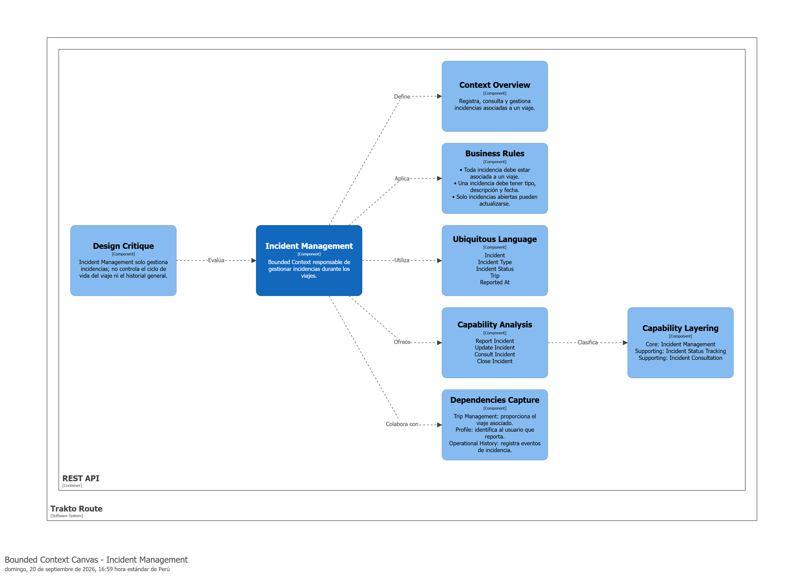

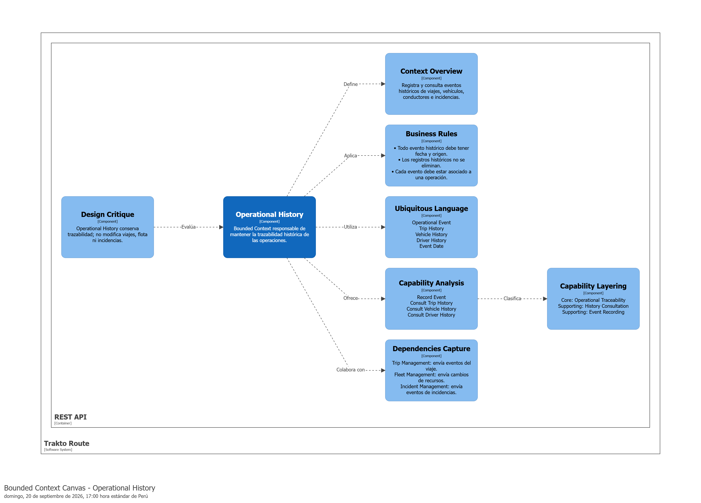


<div style="page-break-after: always;"></div>

### 2.5.2. Context Mapping

En esta sección se analizan las relaciones entre los **Bounded Contexts** de **Trakto Route**, evaluando sus responsabilidades y dependencias para mantener una adecuada separación del dominio.

Durante el proceso se consideraron alternativas de organización y patrones de relación de **Domain-Driven Design**, principalmente **Customer/Supplier** y **Conformist**.

Se evaluó una alternativa donde **IAM y Profile** se integraban en un mismo contexto. Finalmente, se decidió mantenerlos separados debido a que cumplen responsabilidades diferentes.


Como resultado, se definió el Context Map final con los Bounded Contexts **IAM, Profile, Trip Management, Fleet Management, Incident Management y Operational History**.

Las principales relaciones son:

- **IAM → Profile:** Customer/Supplier.
- **Fleet Management → Trip Management:** Customer/Supplier.
- **Trip Management → Incident Management:** Customer/Supplier.
- **Trip Management, Fleet Management e Incident Management → Operational History:** Conformist.

El Context Map final fue elaborado utilizando **Structurizr**.


<div style="page-break-after: always;"></div>

### 2.5.3. Software Architecture

La arquitectura de **Trakto Route** sigue un enfoque cliente-servidor. El producto principal es una aplicación Android desarrollada en **Kotlin**, que consume una **API REST implementada en Java con Spring Boot**. El backend concentra las reglas de negocio y los Bounded Contexts definidos mediante DDD, mientras que **MySQL** funciona como la fuente central de persistencia.

#### 2.5.3.1. Software Architecture Context Level Diagrams

El Context Diagram representa a **Trakto Route** como el sistema central. Los actores principales son el **Supervisor de flota**, responsable de gestionar operaciones de transporte, y el **Cliente de transporte**, que consulta únicamente los envíos asociados a su organización. El sistema puede interactuar con servicios externos futuros —por ejemplo mapas o notificaciones— mediante adaptadores, sin incorporar esas dependencias al núcleo del dominio.


El diagrama debe reflejar claramente el límite de Trakto Route y distinguir las capacidades de gestión disponibles para la empresa transportista de las capacidades de consulta disponibles para el cliente.

#### 2.5.3.2. Software Architecture Container Level Diagrams

El Container Diagram debe mostrar como mínimo los siguientes containers:

| Container | Tecnología | Responsabilidad |
|---|---|---|
| **Trakto Route Mobile App** | Kotlin, Android | Presentar la experiencia móvil, manejar navegación y estado de UI, validar entradas básicas y consumir la API REST mediante HTTPS. |
| **Trakto Route REST API** | Java, Spring Boot, Spring Web | Exponer endpoints, aplicar autenticación/autorización, ejecutar casos de uso y coordinar los Bounded Contexts. |
| **Relational Database** | MySQL | Persistir usuarios, perfiles, viajes, rutas, vehículos, conductores, incidencias e información histórica. |

La aplicación móvil **no accede directamente a MySQL**. Toda lectura o modificación persistente se realiza a través de la API REST.


#### 2.5.3.3. Software Architecture Deployment Diagrams

El Deployment Diagram representa la distribución física de la solución:

- **Android Device:** ejecuta la aplicación Trakto Route desarrollada en Kotlin.
- **Application Server / Cloud Runtime:** ejecuta la aplicación Java/Spring Boot y expone la API mediante HTTPS.
- **MySQL Database Server:** aloja la base de datos relacional y solo es accesible desde el backend.
- La comunicación entre la aplicación móvil y el backend se realiza mediante **HTTPS/JSON**; la comunicación entre Spring Boot y MySQL utiliza el driver JDBC correspondiente a través de Spring Data JPA.


El despliegue mantiene separadas las responsabilidades de cliente móvil, servicios de negocio y persistencia, y evita almacenar la fuente oficial de datos únicamente en el dispositivo.

<div style="page-break-after: always;"></div>

## 2.6. Tactical-Level Domain-Driven Design

En esta sección se presenta la propuesta de diseño táctico del **backend de Trakto Route**, implementado en **Java con Spring Boot**. Para cada Bounded Context se identifican las clases correspondientes a las capas **Domain, Interface, Application e Infrastructure**. La aplicación Android en Kotlin consume estos casos de uso mediante la API REST, pero no reemplaza el modelo de dominio del backend.

Los Bounded Contexts definidos son:

1. **Trip Management**
2. **Fleet Management**
3. **Incident Management**
4. **Operational History**
5. **IAM**
6. **Profile**

<div style="page-break-after: always;"></div>

### 2.6.1. Bounded Context: Trip Management

El Bounded Context **Trip Management** gestiona el ciclo de vida de los viajes, incluyendo su programación, ruta, estado, paradas, descansos, inicio y finalización.

#### 2.6.1.1. Domain Layer

Esta capa representa el core y las reglas de negocio de **Trip Management**.

| **Clase** | **Tipo** | **Propósito** | **Atributos / Métodos principales** |
|---|---|---|---|
| `Trip` | Aggregate Root | Representar y controlar un viaje. | `id`, `route`, `status`, `stops`, `rests`; `assignRoute()`, `start()`, `updateStatus()`, `registerStop()`, `registerRest()`, `complete()` |
| `Route` | Entity | Representar la ruta asignada. | `id`, `origin`, `destination`; `updateRoute()` |
| `Stop` | Entity | Representar una parada. | `id`, `reason`, `startedAt`, `endedAt`; `finish()` |
| `Rest` | Entity | Representar un descanso. | `id`, `startedAt`, `endedAt`; `finish()` |
| `TripId` | Value Object | Identificar un viaje. | `value` |
| `TripStatus` | Enumeration | Representar el estado del viaje. | `SCHEDULED`, `PREPARED`, `IN_PROGRESS`, `COMPLETED`, `CANCELLED` |
| `TripRepository` | Repository Interface | Definir las operaciones de persistencia de viajes. | `save()`, `findById()`, `findAll()` |

Relaciones principales:

```text
Trip "1" ─── "1" Route
Trip "1" ─── "0..*" Stop
Trip "1" ─── "0..*" Rest
Trip ─────── TripStatus
Trip ─────── TripId
TripRepository ───> Trip
```

#### 2.6.1.2. Interface Layer

Esta capa contiene las clases de presentación utilizadas para interactuar con las funcionalidades de Trip Management.

| **Clase** | **Tipo** | **Propósito** | **Atributos / Métodos principales** |
|---|---|---|---|
| `TripController` | REST Controller | Gestionar las acciones relacionadas con viajes. | `loadTrips()`, `loadTrip()`, `scheduleTrip()`, `startTrip()`, `updateStatus()`, `registerStop()`, `registerRest()`, `completeTrip()` |
| `TripUiState` | UI State | Representar el estado de la información presentada. | `trips`, `selectedTrip`, `isLoading`, `error` |

#### 2.6.1.3. Application Layer

Esta capa coordina los flujos y capabilities de Trip Management mediante Commands, Queries y Handlers.

| **Clase** | **Tipo** | **Propósito** |
|---|---|---|
| `ScheduleTripCommand` | Command | Contener los datos para programar un viaje. |
| `ScheduleTripCommandHandler` | Command Handler | Procesar la programación del viaje. |
| `AssignRouteCommand` | Command | Solicitar la asignación de una ruta. |
| `AssignRouteCommandHandler` | Command Handler | Procesar la asignación de una ruta. |
| `StartTripCommand` | Command | Solicitar el inicio de un viaje. |
| `StartTripCommandHandler` | Command Handler | Procesar el inicio del viaje. |
| `UpdateTripStatusCommand` | Command | Solicitar un cambio de estado. |
| `UpdateTripStatusCommandHandler` | Command Handler | Procesar el cambio de estado. |
| `RegisterStopCommand` | Command | Solicitar el registro de una parada. |
| `RegisterStopCommandHandler` | Command Handler | Procesar el registro de una parada. |
| `RegisterRestCommand` | Command | Solicitar el registro de un descanso. |
| `RegisterRestCommandHandler` | Command Handler | Procesar el registro de un descanso. |
| `CompleteTripCommand` | Command | Solicitar la finalización del viaje. |
| `CompleteTripCommandHandler` | Command Handler | Procesar la finalización del viaje. |
| `GetTripsQuery` | Query | Solicitar los viajes registrados. |
| `GetTripsQueryHandler` | Query Handler | Obtener los viajes registrados. |
| `GetTripByIdQuery` | Query | Solicitar un viaje específico. |
| `GetTripByIdQueryHandler` | Query Handler | Obtener el detalle de un viaje. |

#### 2.6.1.4. Infrastructure Layer

Esta capa implementa la persistencia de Trip Management mediante **Spring Data JPA y MySQL**.

| **Clase** | **Tipo** | **Propósito** |
|---|---|---|
| `TripJpaEntity` | JPA Entity | Representar un viaje persistido. |
| `RouteJpaEntity` | JPA Entity | Representar una ruta persistida. |
| `StopJpaEntity` | JPA Entity | Representar una parada persistida. |
| `RestJpaEntity` | JPA Entity | Representar un descanso persistido. |
| `TripDao` | Spring Data Repository | Realizar operaciones de persistencia y consulta. |
| `TripRepositoryAdapter` | Repository Implementation | Implementar `TripRepository` utilizando Spring Data JPA y mapeo entre el dominio y las entidades de persistencia. |

<div style="page-break-after: always;"></div>

#### 2.6.1.5. Bounded Context Software Architecture Component Level Diagrams

El **Component Diagram del C4 Model** representa los componentes principales de Trip Management, sus responsabilidades, tecnologías e interacciones.

```text
Trip Presentation
        ↓
Trip Application
        ↓
Trip Domain
        ↓
Trip Infrastructure
        ↓
Spring Data JPA / MySQL
```

Tecnologías utilizadas: **Java, Spring Boot, Spring Web, Spring Data JPA y MySQL**.


<div style="page-break-after: always;"></div>

#### 2.6.1.6. Bounded Context Software Architecture Code Level Diagrams

En esta sección se presentan los diagramas de mayor detalle de implementación de **Trip Management**.

##### 2.6.1.6.1. Bounded Context Domain Layer Class Diagrams

El UML Class Diagram representa las clases, interfaces, enumeraciones, atributos, métodos, scopes, relaciones y multiplicidades del Domain Layer.

```text
Trip
--------------------------------
- id: TripId
- route: Route
- status: TripStatus
- stops: List<Stop>
- rests: List<Rest>
--------------------------------
+ assignRoute(route: Route): Unit
+ start(): Unit
+ updateStatus(status: TripStatus): Unit
+ registerStop(stop: Stop): Unit
+ registerRest(rest: Rest): Unit
+ complete(): Unit

Route
--------------------------------
- id: Long
- origin: String
- destination: String
--------------------------------
+ updateRoute(origin: String, destination: String): Unit

Stop
--------------------------------
- id: Long
- reason: String
- startedAt: LocalDateTime
- endedAt: LocalDateTime?
--------------------------------
+ finish(endTime: LocalDateTime): Unit

Rest
--------------------------------
- id: Long
- startedAt: LocalDateTime
- endedAt: LocalDateTime?
--------------------------------
+ finish(endTime: LocalDateTime): Unit

TripId
--------------------------------
- value: Long

<<enumeration>>
TripStatus
--------------------------------
SCHEDULED
PREPARED
IN_PROGRESS
COMPLETED
CANCELLED

<<interface>>
TripRepository
--------------------------------
+ save(trip: Trip): Unit
+ findById(id: TripId): Trip?
+ findAll(): List<Trip>
```

Relaciones:

```text
Trip "1" ─── "1" Route
Trip "1" ─── "0..*" Stop
Trip "1" ─── "0..*" Rest
Trip ─────── TripStatus
Trip ─────── TripId
TripRepository ───> Trip
```


<div style="page-break-after: always;"></div>

##### 2.6.1.6.2. Bounded Context Database Design Diagram

El Database Diagram representa las tablas, columnas, constraints y relaciones utilizadas para la persistencia central de **Trip Management** mediante Spring Data JPA y MySQL.

| **Tabla** | **Columnas** | **Constraints** |
|---|---|---|
| `trips` | `id`, `route_id`, `status` | `id PK`, `route_id FK`, `status NOT NULL` |
| `routes` | `id`, `origin`, `destination` | `id PK`, `origin NOT NULL`, `destination NOT NULL` |
| `stops` | `id`, `trip_id`, `reason`, `started_at`, `ended_at` | `id PK`, `trip_id FK`, `reason NOT NULL`, `started_at NOT NULL` |
| `rests` | `id`, `trip_id`, `started_at`, `ended_at` | `id PK`, `trip_id FK`, `started_at NOT NULL` |

Relaciones:

```text
routes.id  "1" ─── "0..*" trips.route_id
trips.id   "1" ─── "0..*" stops.trip_id
trips.id   "1" ─── "0..*" rests.trip_id
```


<div style="page-break-after: always;"></div>


### 2.6.2. Bounded Context: Fleet Management

El Bounded Context **Fleet Management** gestiona los vehículos y conductores utilizados en las operaciones de transporte, incluyendo su registro, actualización, disponibilidad y asignación.

#### 2.6.2.1. Domain Layer

Esta capa representa el core y las reglas de negocio de **Fleet Management**.

| **Clase** | **Tipo** | **Propósito** | **Atributos / Métodos principales** |
|---|---|---|---|
| `Vehicle` | Aggregate Root | Representar y controlar un vehículo. | `id`, `plate`, `brand`, `model`, `availability`; `update()`, `changeAvailability()` |
| `Driver` | Aggregate Root | Representar y controlar un conductor. | `id`, `name`, `licenseNumber`, `availability`; `update()`, `changeAvailability()` |
| `VehicleId` | Value Object | Identificar un vehículo. | `value` |
| `DriverId` | Value Object | Identificar un conductor. | `value` |
| `VehicleAvailability` | Enumeration | Representar la disponibilidad del vehículo. | `AVAILABLE`, `ASSIGNED`, `UNAVAILABLE` |
| `DriverAvailability` | Enumeration | Representar la disponibilidad del conductor. | `AVAILABLE`, `ASSIGNED`, `UNAVAILABLE` |
| `VehicleRepository` | Repository Interface | Definir las operaciones de persistencia de vehículos. | `save()`, `findById()`, `findAll()`, `findAvailable()` |
| `DriverRepository` | Repository Interface | Definir las operaciones de persistencia de conductores. | `save()`, `findById()`, `findAll()`, `findAvailable()` |

Relaciones principales:

```text
Vehicle ───── VehicleId
Vehicle ───── VehicleAvailability
Driver ────── DriverId
Driver ────── DriverAvailability
VehicleRepository ───> Vehicle
DriverRepository ─────> Driver
```

#### 2.6.2.2. Interface Layer

Esta capa contiene las clases de presentación utilizadas para interactuar con las funcionalidades de Fleet Management.

| **Clase** | **Tipo** | **Propósito** | **Atributos / Métodos principales** |
|---|---|---|---|
| `FleetController` | REST Controller | Gestionar la información general de vehículos y conductores. | `loadVehicles()`, `loadDrivers()` |
| `VehicleController` | REST Controller | Gestionar las acciones relacionadas con vehículos. | `registerVehicle()`, `updateVehicle()`, `loadAvailableVehicles()` |
| `DriverController` | REST Controller | Gestionar las acciones relacionadas con conductores. | `registerDriver()`, `updateDriver()`, `loadAvailableDrivers()` |
| `FleetUiState` | UI State | Representar los datos mostrados en la interfaz. | `vehicles`, `drivers`, `isLoading`, `error` |

#### 2.6.2.3. Application Layer

Esta capa coordina los flujos y capabilities relacionados con la gestión de vehículos y conductores.

| **Clase** | **Tipo** | **Propósito** |
|---|---|---|
| `RegisterVehicleCommand` | Command | Contener los datos para registrar un vehículo. |
| `RegisterVehicleCommandHandler` | Command Handler | Procesar el registro de un vehículo. |
| `UpdateVehicleCommand` | Command | Solicitar la actualización de un vehículo. |
| `UpdateVehicleCommandHandler` | Command Handler | Procesar la actualización de un vehículo. |
| `RegisterDriverCommand` | Command | Contener los datos para registrar un conductor. |
| `RegisterDriverCommandHandler` | Command Handler | Procesar el registro de un conductor. |
| `UpdateDriverCommand` | Command | Solicitar la actualización de un conductor. |
| `UpdateDriverCommandHandler` | Command Handler | Procesar la actualización de un conductor. |
| `AssignVehicleCommand` | Command | Solicitar la asignación de un vehículo. |
| `AssignVehicleCommandHandler` | Command Handler | Procesar la asignación de un vehículo. |
| `AssignDriverCommand` | Command | Solicitar la asignación de un conductor. |
| `AssignDriverCommandHandler` | Command Handler | Procesar la asignación de un conductor. |
| `GetVehiclesQuery` | Query | Solicitar los vehículos registrados. |
| `GetVehiclesQueryHandler` | Query Handler | Obtener los vehículos registrados. |
| `GetDriversQuery` | Query | Solicitar los conductores registrados. |
| `GetDriversQueryHandler` | Query Handler | Obtener los conductores registrados. |
| `GetAvailableVehiclesQueryHandler` | Query Handler | Obtener los vehículos disponibles. |
| `GetAvailableDriversQueryHandler` | Query Handler | Obtener los conductores disponibles. |

#### 2.6.2.4. Infrastructure Layer

Esta capa implementa la persistencia de Fleet Management mediante **Spring Data JPA y MySQL**.

| **Clase** | **Tipo** | **Propósito** |
|---|---|---|
| `VehicleJpaEntity` | JPA Entity | Representar un vehículo persistido. |
| `DriverJpaEntity` | JPA Entity | Representar un conductor persistido. |
| `VehicleDao` | Spring Data Repository | Realizar operaciones de persistencia de vehículos. |
| `DriverDao` | Spring Data Repository | Realizar operaciones de persistencia de conductores. |
| `VehicleRepositoryAdapter` | Repository Implementation | Implementar `VehicleRepository` utilizando Spring Data JPA. |
| `DriverRepositoryAdapter` | Repository Implementation | Implementar `DriverRepository` utilizando Spring Data JPA. |

<div style="page-break-after: always;"></div>

#### 2.6.2.5. Bounded Context Software Architecture Component Level Diagrams

El **Component Diagram del C4 Model** representa los componentes principales de Fleet Management, sus responsabilidades, tecnologías e interacciones.

```text
Fleet Presentation
        ↓
Fleet Application
        ↓
Fleet Domain
        ↓
Fleet Infrastructure
        ↓
Spring Data JPA / MySQL
```

Tecnologías utilizadas: **Java, Spring Boot, Spring Web, Spring Data JPA y MySQL**.


<div style="page-break-after: always;"></div>

#### 2.6.2.6. Bounded Context Software Architecture Code Level Diagrams

En esta sección se presentan los diagramas de mayor detalle de implementación de **Fleet Management**.

##### 2.6.2.6.1. Bounded Context Domain Layer Class Diagrams

El UML Class Diagram representa las clases, interfaces, enumeraciones, atributos, métodos, scopes y relaciones del Domain Layer.

```text
Vehicle
--------------------------------
- id: VehicleId
- plate: String
- brand: String
- model: String
- availability: VehicleAvailability
--------------------------------
+ update(brand: String, model: String): Unit
+ changeAvailability(
    availability: VehicleAvailability
  ): Unit


Driver
--------------------------------
- id: DriverId
- name: String
- licenseNumber: String
- availability: DriverAvailability
--------------------------------
+ update(name: String, licenseNumber: String): Unit
+ changeAvailability(
    availability: DriverAvailability
  ): Unit


VehicleId
--------------------------------
- value: Long


DriverId
--------------------------------
- value: Long


<<enumeration>>
VehicleAvailability
--------------------------------
AVAILABLE
ASSIGNED
UNAVAILABLE


<<enumeration>>
DriverAvailability
--------------------------------
AVAILABLE
ASSIGNED
UNAVAILABLE


<<interface>>
VehicleRepository
--------------------------------
+ save(vehicle: Vehicle): Unit
+ findById(id: VehicleId): Vehicle?
+ findAll(): List<Vehicle>
+ findAvailable(): List<Vehicle>


<<interface>>
DriverRepository
--------------------------------
+ save(driver: Driver): Unit
+ findById(id: DriverId): Driver?
+ findAll(): List<Driver>
+ findAvailable(): List<Driver>
```

Relaciones:

```text
Vehicle ───── VehicleId
Vehicle ───── VehicleAvailability
Driver ────── DriverId
Driver ────── DriverAvailability

VehicleRepository ───> Vehicle
DriverRepository ─────> Driver
```


<div style="page-break-after: always;"></div>

##### 2.6.2.6.2. Bounded Context Database Design Diagram

El Database Diagram representa las tablas, columnas, constraints y relaciones utilizadas para la persistencia central de **Fleet Management** mediante Spring Data JPA y MySQL.

| **Tabla** | **Columnas** | **Constraints** |
|---|---|---|
| `vehicles` | `id`, `plate`, `brand`, `model`, `availability` | `id PK`, `plate UNIQUE NOT NULL`, `availability NOT NULL` |
| `drivers` | `id`, `name`, `license_number`, `availability` | `id PK`, `license_number UNIQUE NOT NULL`, `availability NOT NULL` |

```text
vehicles
--------------------------------
PK  id
    plate UNIQUE NOT NULL
    brand NOT NULL
    model NOT NULL
    availability NOT NULL


drivers
--------------------------------
PK  id
    name NOT NULL
    license_number UNIQUE NOT NULL
    availability NOT NULL
```

Las tablas `vehicles` y `drivers` son independientes dentro de Fleet Management. La asociación con los viajes se realiza desde **Trip Management** mediante los identificadores correspondientes.


<div style="page-break-after: always;"></div>


### 2.6.3. Bounded Context: Incident Management

El Bounded Context **Incident Management** gestiona las incidencias ocurridas durante los viajes, incluyendo retrasos, problemas, accidentes y su estado de atención.

#### 2.6.3.1. Domain Layer

Esta capa representa el core y las reglas de negocio de **Incident Management**.

| **Clase** | **Tipo** | **Propósito** | **Atributos / Métodos principales** |
|---|---|---|---|
| `Incident` | Aggregate Root | Representar y gestionar una incidencia. | `id`, `tripId`, `type`, `status`, `description`, `occurredAt`; `updateStatus()`, `resolve()` |
| `IncidentId` | Value Object | Identificar una incidencia. | `value` |
| `IncidentType` | Enumeration | Clasificar el tipo de incidencia. | `DELAY`, `PROBLEM`, `ACCIDENT`, `OTHER` |
| `IncidentStatus` | Enumeration | Representar el estado de la incidencia. | `PENDING`, `IN_PROGRESS`, `RESOLVED` |
| `IncidentRepository` | Repository Interface | Definir las operaciones de persistencia de incidencias. | `save()`, `findById()`, `findByTripId()`, `findAll()` |

Relaciones principales:

```text
Incident ───── IncidentId
Incident ───── IncidentType
Incident ───── IncidentStatus
IncidentRepository ───> Incident
```

#### 2.6.3.2. Interface Layer

Esta capa contiene las clases de presentación utilizadas para interactuar con las funcionalidades de Incident Management.

| **Clase** | **Tipo** | **Propósito** | **Atributos / Métodos principales** |
|---|---|---|---|
| `IncidentController` | REST Controller | Gestionar acciones relacionadas con incidencias. | `loadIncidents()`, `loadIncident()`, `registerIncident()`, `updateStatus()` |
| `IncidentUiState` | UI State | Representar la información mostrada en la interfaz. | `incidents`, `selectedIncident`, `isLoading`, `error` |

#### 2.6.3.3. Application Layer

Esta capa coordina los flujos y capabilities relacionados con el registro y gestión de incidencias.

| **Clase** | **Tipo** | **Propósito** |
|---|---|---|
| `RegisterIncidentCommand` | Command | Contener los datos para registrar una incidencia. |
| `RegisterIncidentCommandHandler` | Command Handler | Procesar el registro de una incidencia. |
| `RegisterDelayCommand` | Command | Solicitar el registro de un retraso. |
| `RegisterDelayCommandHandler` | Command Handler | Procesar el registro de un retraso. |
| `RegisterProblemCommand` | Command | Solicitar el registro de un problema. |
| `RegisterProblemCommandHandler` | Command Handler | Procesar el registro de un problema. |
| `RegisterAccidentCommand` | Command | Solicitar el registro de un accidente. |
| `RegisterAccidentCommandHandler` | Command Handler | Procesar el registro de un accidente. |
| `UpdateIncidentStatusCommand` | Command | Solicitar la actualización del estado. |
| `UpdateIncidentStatusCommandHandler` | Command Handler | Procesar el cambio de estado de una incidencia. |
| `GetIncidentsQuery` | Query | Solicitar las incidencias registradas. |
| `GetIncidentsQueryHandler` | Query Handler | Obtener las incidencias registradas. |
| `GetIncidentByIdQuery` | Query | Solicitar una incidencia específica. |
| `GetIncidentByIdQueryHandler` | Query Handler | Obtener el detalle de una incidencia. |

#### 2.6.3.4. Infrastructure Layer

Esta capa implementa la persistencia de Incident Management mediante **Spring Data JPA y MySQL**.

| **Clase** | **Tipo** | **Propósito** |
|---|---|---|
| `IncidentJpaEntity` | JPA Entity | Representar una incidencia persistida. |
| `IncidentDao` | Spring Data Repository | Realizar operaciones de persistencia y consulta de incidencias. |
| `IncidentRepositoryAdapter` | Repository Implementation | Implementar `IncidentRepository` utilizando Spring Data JPA. |

<div style="page-break-after: always;"></div>

#### 2.6.3.5. Bounded Context Software Architecture Component Level Diagrams

El **Component Diagram del C4 Model** representa los componentes principales de Incident Management, sus responsabilidades, tecnologías e interacciones.

```text
Incident Presentation
        ↓
Incident Application
        ↓
Incident Domain
        ↓
Incident Infrastructure
        ↓
Spring Data JPA / MySQL
```

Tecnologías utilizadas: **Java, Spring Boot, Spring Web, Spring Data JPA y MySQL**.

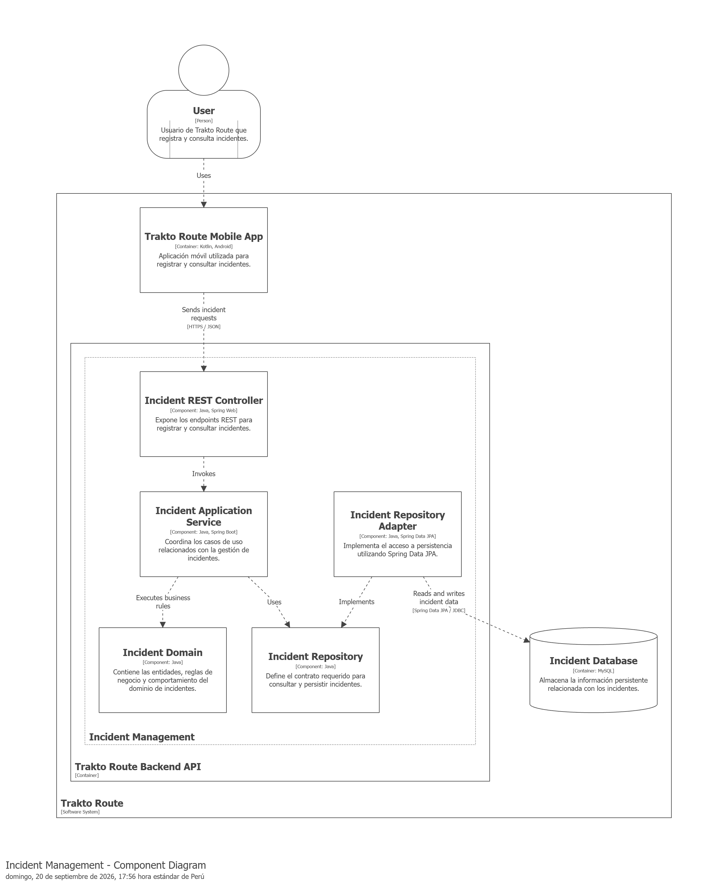

<div style="page-break-after: always;"></div>

#### 2.6.3.6. Bounded Context Software Architecture Code Level Diagrams

En esta sección se presentan los diagramas de mayor detalle de implementación de **Incident Management**.

##### 2.6.3.6.1. Bounded Context Domain Layer Class Diagrams

El UML Class Diagram representa las clases, interfaces, enumeraciones, atributos, métodos, scopes, relaciones y multiplicidades del Domain Layer.

```text
Incident
--------------------------------
- id: IncidentId
- tripId: Long
- type: IncidentType
- status: IncidentStatus
- description: String
- occurredAt: LocalDateTime
--------------------------------
+ updateStatus(status: IncidentStatus): Unit
+ resolve(): Unit


IncidentId
--------------------------------
- value: Long


<<enumeration>>
IncidentType
--------------------------------
DELAY
PROBLEM
ACCIDENT
OTHER


<<enumeration>>
IncidentStatus
--------------------------------
PENDING
IN_PROGRESS
RESOLVED


<<interface>>
IncidentRepository
--------------------------------
+ save(incident: Incident): Unit
+ findById(id: IncidentId): Incident?
+ findByTripId(tripId: Long): List<Incident>
+ findAll(): List<Incident>
```

Relaciones:

```text
Incident ───── IncidentId
Incident ───── IncidentType
Incident ───── IncidentStatus
IncidentRepository ───> Incident
```

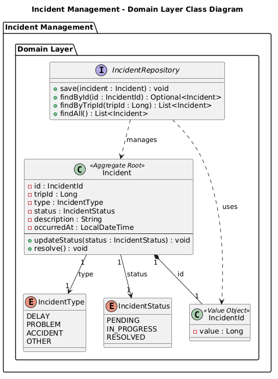

<div style="page-break-after: always;"></div>

##### 2.6.3.6.2. Bounded Context Database Design Diagram

El Database Diagram representa las tablas, columnas, constraints y relaciones utilizadas para la persistencia central de **Incident Management** mediante Spring Data JPA y MySQL.

| **Tabla** | **Columnas** | **Constraints** |
|---|---|---|
| `incidents` | `id`, `trip_id`, `type`, `status`, `description`, `occurred_at` | `id PK`, `trip_id NOT NULL`, `type NOT NULL`, `status NOT NULL`, `description NOT NULL`, `occurred_at NOT NULL` |

```text
incidents
--------------------------------
PK  id
    trip_id NOT NULL
    type NOT NULL
    status NOT NULL
    description NOT NULL
    occurred_at NOT NULL
```

`trip_id` permite asociar la incidencia con el viaje correspondiente del Bounded Context **Trip Management**.

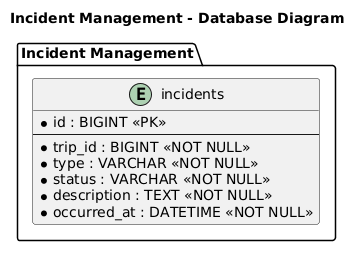

<div style="page-break-after: always;"></div>


### 2.6.4. Bounded Context: Operational History

El Bounded Context **Operational History** gestiona la consulta del historial de viajes, vehículos, conductores e incidencias, así como la revisión del desempeño de las operaciones realizadas.

#### 2.6.4.1. Domain Layer

Esta capa representa el core y las reglas de negocio de **Operational History**.

| **Clase** | **Tipo** | **Propósito** | **Atributos / Métodos principales** |
|---|---|---|---|
| `OperationHistory` | Aggregate Root | Representar el historial general de una operación. | `id`, `tripId`, `completedAt`, `performance`; `reviewPerformance()` |
| `TripHistory` | Entity | Representar información histórica de un viaje. | `tripId`, `status`, `startedAt`, `completedAt` |
| `VehicleHistory` | Entity | Representar el historial operativo de un vehículo. | `vehicleId`, `tripId`, `recordedAt` |
| `DriverHistory` | Entity | Representar el historial operativo de un conductor. | `driverId`, `tripId`, `recordedAt` |
| `OperationPerformance` | Value Object | Representar información de desempeño de una operación. | `completedTrips`, `incidentCount`, `delayCount` |
| `HistoryRepository` | Repository Interface | Definir las operaciones de consulta del historial. | `findTripHistory()`, `findVehicleHistory()`, `findDriverHistory()`, `findIncidentHistory()` |

Relaciones principales:

```text
OperationHistory ───── TripHistory
OperationHistory ───── VehicleHistory
OperationHistory ───── DriverHistory
OperationHistory ───── OperationPerformance
HistoryRepository ───> OperationHistory
```

#### 2.6.4.2. Interface Layer

Esta capa contiene las clases de presentación utilizadas para consultar el historial operativo.

| **Clase** | **Tipo** | **Propósito** | **Atributos / Métodos principales** |
|---|---|---|---|
| `HistoryController` | REST Controller | Gestionar las consultas del historial operativo. | `loadTripHistory()`, `loadVehicleHistory()`, `loadDriverHistory()`, `loadIncidentHistory()`, `reviewPerformance()` |
| `HistoryUiState` | UI State | Representar los datos históricos mostrados en la interfaz. | `tripHistory`, `vehicleHistory`, `driverHistory`, `incidentHistory`, `performance`, `isLoading`, `error` |

#### 2.6.4.3. Application Layer

Esta capa coordina los flujos y capabilities relacionados con la consulta del historial y desempeño operativo.

| **Clase** | **Tipo** | **Propósito** |
|---|---|---|
| `GetTripHistoryQuery` | Query | Solicitar el historial de viajes. |
| `GetTripHistoryQueryHandler` | Query Handler | Obtener el historial de viajes. |
| `GetVehicleHistoryQuery` | Query | Solicitar el historial de un vehículo. |
| `GetVehicleHistoryQueryHandler` | Query Handler | Obtener el historial de un vehículo. |
| `GetDriverHistoryQuery` | Query | Solicitar el historial de un conductor. |
| `GetDriverHistoryQueryHandler` | Query Handler | Obtener el historial de un conductor. |
| `GetIncidentHistoryQuery` | Query | Solicitar el historial de incidencias. |
| `GetIncidentHistoryQueryHandler` | Query Handler | Obtener el historial de incidencias. |
| `ReviewOperationPerformanceQuery` | Query | Solicitar la revisión del desempeño operativo. |
| `ReviewOperationPerformanceQueryHandler` | Query Handler | Obtener la información de desempeño de una operación. |
| `RecordCompletedTripEventHandler` | Event Handler | Registrar información histórica cuando un viaje finaliza. |

#### 2.6.4.4. Infrastructure Layer

Esta capa implementa el acceso a la información histórica mediante **Spring Data JPA y MySQL**.

| **Clase** | **Tipo** | **Propósito** |
|---|---|---|
| `OperationHistoryJpaEntity` | JPA Entity | Representar una operación histórica persistida. |
| `TripHistoryJpaEntity` | JPA Entity | Representar el historial de viajes persistido. |
| `VehicleHistoryJpaEntity` | JPA Entity | Representar el historial de vehículos persistido. |
| `DriverHistoryJpaEntity` | JPA Entity | Representar el historial de conductores persistido. |
| `HistoryDao` | DAO | Realizar consultas y operaciones sobre el historial. |
| `HistoryRepositoryAdapter` | Repository Implementation | Implementar `HistoryRepository` utilizando Spring Data JPA. |

<div style="page-break-after: always;"></div>

#### 2.6.4.5. Bounded Context Software Architecture Component Level Diagrams

El **Component Diagram del C4 Model** representa los componentes principales de Operational History, sus responsabilidades, tecnologías e interacciones.

```text
History Presentation
        ↓
History Application
        ↓
History Domain
        ↓
History Infrastructure
        ↓
Spring Data JPA / MySQL
```

Tecnologías utilizadas: **Java, Spring Boot, Spring Web, Spring Data JPA y MySQL**.


<div style="page-break-after: always;"></div>

#### 2.6.4.6. Bounded Context Software Architecture Code Level Diagrams

En esta sección se presentan los diagramas de mayor detalle de implementación de **Operational History**.

##### 2.6.4.6.1. Bounded Context Domain Layer Class Diagrams

El UML Class Diagram representa las clases, interfaces, atributos, métodos, scopes, relaciones y multiplicidades del Domain Layer.

```text
OperationHistory
--------------------------------
- id: Long
- tripId: Long
- completedAt: LocalDateTime
- performance: OperationPerformance
--------------------------------
+ reviewPerformance(): OperationPerformance


TripHistory
--------------------------------
- tripId: Long
- status: String
- startedAt: LocalDateTime
- completedAt: LocalDateTime


VehicleHistory
--------------------------------
- vehicleId: Long
- tripId: Long
- recordedAt: LocalDateTime


DriverHistory
--------------------------------
- driverId: Long
- tripId: Long
- recordedAt: LocalDateTime


OperationPerformance
--------------------------------
- completedTrips: Int
- incidentCount: Int
- delayCount: Int


<<interface>>
HistoryRepository
--------------------------------
+ findTripHistory(tripId: Long): TripHistory?
+ findVehicleHistory(vehicleId: Long): List<VehicleHistory>
+ findDriverHistory(driverId: Long): List<DriverHistory>
+ findIncidentHistory(tripId: Long): List<Long>
```

Relaciones:

```text
OperationHistory "1" ─── "1" TripHistory
OperationHistory "1" ─── "0..*" VehicleHistory
OperationHistory "1" ─── "0..*" DriverHistory
OperationHistory "1" ─── "1" OperationPerformance
HistoryRepository ───> OperationHistory
```

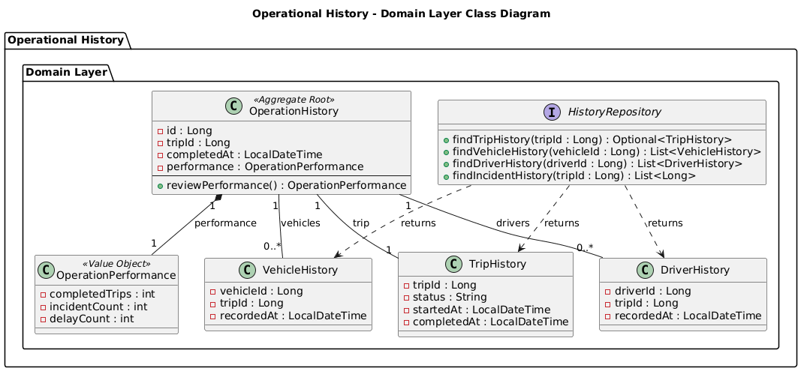

<div style="page-break-after: always;"></div>

##### 2.6.4.6.2. Bounded Context Database Design Diagram

El Database Diagram representa las tablas, columnas, constraints y relaciones utilizadas para la persistencia central de **Operational History** mediante Spring Data JPA y MySQL.

| **Tabla** | **Columnas** | **Constraints** |
|---|---|---|
| `operation_history` | `id`, `trip_id`, `completed_at`, `completed_trips`, `incident_count`, `delay_count` | `id PK`, `trip_id NOT NULL` |
| `trip_history` | `id`, `trip_id`, `status`, `started_at`, `completed_at` | `id PK`, `trip_id NOT NULL` |
| `vehicle_history` | `id`, `vehicle_id`, `trip_id`, `recorded_at` | `id PK`, `vehicle_id NOT NULL`, `trip_id NOT NULL` |
| `driver_history` | `id`, `driver_id`, `trip_id`, `recorded_at` | `id PK`, `driver_id NOT NULL`, `trip_id NOT NULL` |

Relaciones:

```text
operation_history.trip_id ─── trip_history.trip_id
trip_history.trip_id ─── vehicle_history.trip_id
trip_history.trip_id ─── driver_history.trip_id
```

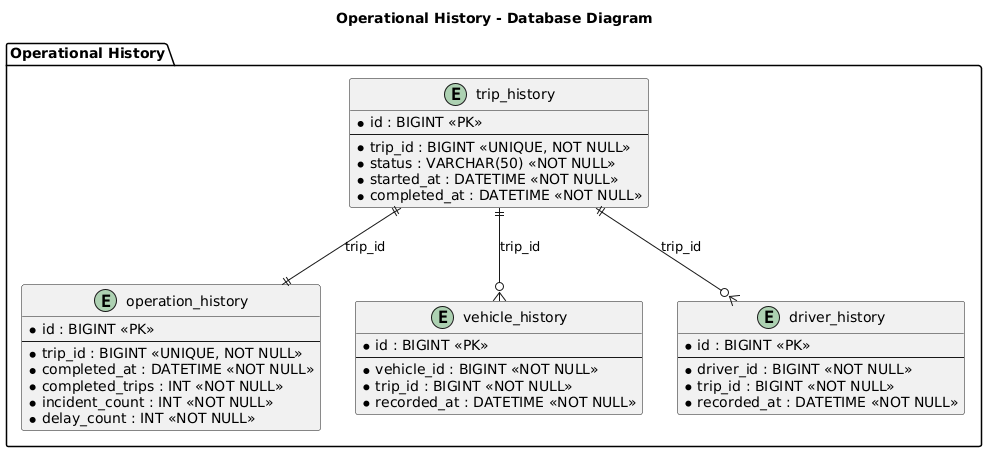

<div style="page-break-after: always;"></div>


### 2.6.5. Bounded Context: IAM

El Bounded Context **IAM (Identity and Access Management)** gestiona la identidad, autenticación y acceso de los usuarios de Trakto Route Route.

#### 2.6.5.1. Domain Layer

Esta capa representa las reglas de negocio relacionadas con usuarios, credenciales y roles.

| **Clase** | **Tipo** | **Propósito** | **Atributos / Métodos principales** |
|---|---|---|---|
| `User` | Aggregate Root | Representar la identidad de un usuario. | `id`, `email`, `passwordHash`, `role`; `changePassword()`, `changeRole()` |
| `UserId` | Value Object | Identificar un usuario. | `value` |
| `Email` | Value Object | Representar y validar el correo del usuario. | `value`; `isValid()` |
| `UserRole` | Enumeration | Representar el rol del usuario. | `FLEET_SUPERVISOR`, `OPERATIONS_COORDINATOR` |
| `UserRepository` | Repository Interface | Definir operaciones de persistencia de usuarios. | `save()`, `findById()`, `findByEmail()`, `existsByEmail()` |
| `AuthenticationService` | Domain Service Interface | Definir la validación de credenciales. | `authenticate()` |

Relaciones principales:

```text
User ───── UserId
User ───── Email
User ───── UserRole
UserRepository ───> User
AuthenticationService ───> User
```

#### 2.6.5.2. Interface Layer

Esta capa contiene las clases de presentación utilizadas para autenticación y gestión de sesión.

| **Clase** | **Tipo** | **Propósito** | **Atributos / Métodos principales** |
|---|---|---|---|
| `AuthController` | REST Controller | Gestionar registro, inicio y cierre de sesión. | `register()`, `login()`, `logout()`, `loadCurrentUser()` |
| `AuthUiState` | UI State | Representar el estado de autenticación. | `currentUser`, `isAuthenticated`, `isLoading`, `error` |

#### 2.6.5.3. Application Layer

Esta capa coordina los flujos relacionados con registro, autenticación y sesión.

| **Clase** | **Tipo** | **Propósito** |
|---|---|---|
| `RegisterUserCommand` | Command | Contener los datos para registrar un usuario. |
| `RegisterUserCommandHandler` | Command Handler | Procesar el registro del usuario. |
| `LoginCommand` | Command | Contener las credenciales de acceso. |
| `LoginCommandHandler` | Command Handler | Procesar la autenticación del usuario. |
| `LogoutCommand` | Command | Solicitar el cierre de sesión. |
| `LogoutCommandHandler` | Command Handler | Procesar el cierre de sesión. |
| `GetCurrentUserQuery` | Query | Solicitar el usuario autenticado. |
| `GetCurrentUserQueryHandler` | Query Handler | Obtener el usuario autenticado. |

#### 2.6.5.4. Infrastructure Layer

Esta capa implementa la persistencia, autenticación y gestión de sesión mediante **Spring Data JPA y MySQL**.

| **Clase** | **Tipo** | **Propósito** |
|---|---|---|
| `UserJpaEntity` | JPA Entity | Representar un usuario persistido. |
| `SpringDataUserRepository` | Spring Data Repository | Realizar operaciones de persistencia de usuarios. |
| `UserRepositoryAdapter` | Repository Implementation | Implementar `UserRepository` utilizando Spring Data JPA. |
| `AuthenticationServiceImpl` | Service Implementation | Implementar la validación de credenciales. |
| `PasswordHasher` | Infrastructure Service | Generar y verificar hashes de contraseñas. |
| `SessionManager` | Infrastructure Service | Gestionar la sesión del usuario. |

<div style="page-break-after: always;"></div>

#### 2.6.5.5. Bounded Context Software Architecture Component Level Diagrams

El **Component Diagram del C4 Model** representa los componentes principales de IAM, sus responsabilidades, tecnologías e interacciones.

```text
IAM Presentation
        ↓
IAM Application
        ↓
IAM Domain
        ↓
IAM Infrastructure
        ↓
Spring Data JPA / MySQL
```

Tecnologías utilizadas: **Java, Spring Boot, Spring Web, Spring Data JPA y MySQL**.


<div style="page-break-after: always;"></div>

#### 2.6.5.6. Bounded Context Software Architecture Code Level Diagrams

En esta sección se presentan los diagramas de mayor detalle de implementación del Bounded Context **IAM**.

##### 2.6.5.6.1. Bounded Context Domain Layer Class Diagrams

El UML Class Diagram representa las clases, interfaces, enumeraciones, atributos, métodos, scopes y relaciones del Domain Layer.

```text
User
--------------------------------
- id: UserId
- email: Email
- passwordHash: String
- role: UserRole
--------------------------------
+ changePassword(passwordHash: String): Unit
+ changeRole(role: UserRole): Unit


UserId
--------------------------------
- value: Long


Email
--------------------------------
- value: String
--------------------------------
+ isValid(): Boolean


<<enumeration>>
UserRole
--------------------------------
FLEET_SUPERVISOR
OPERATIONS_COORDINATOR


<<interface>>
UserRepository
--------------------------------
+ save(user: User): Unit
+ findById(id: UserId): User?
+ findByEmail(email: Email): User?
+ existsByEmail(email: Email): Boolean


<<interface>>
AuthenticationService
--------------------------------
+ authenticate(
    email: Email,
    password: String
  ): Boolean
```

Relaciones:

```text
User ───── UserId
User ───── Email
User ───── UserRole
UserRepository ───> User
AuthenticationService ───> User
```


<div style="page-break-after: always;"></div>

##### 2.6.5.6.2. Bounded Context Database Design Diagram

El Database Diagram representa las tablas, columnas y constraints utilizadas para la persistencia central de **IAM** mediante Spring Data JPA y MySQL.

| **Tabla** | **Columnas** | **Constraints** |
|---|---|---|
| `users` | `id`, `email`, `password_hash`, `role`, `created_at` | `id PK`, `email UNIQUE NOT NULL`, `password_hash NOT NULL`, `role NOT NULL` |

```text
users
--------------------------------
PK  id
    email UNIQUE NOT NULL
    password_hash NOT NULL
    role NOT NULL
    created_at NOT NULL
```


<div style="page-break-after: always;"></div>


### 2.6.6. Bounded Context: Profile

El Bounded Context **Profile** gestiona la información personal asociada a los usuarios de Trakto Route Route.

#### 2.6.6.1. Domain Layer

Esta capa representa las reglas de negocio relacionadas con la información del perfil del usuario.

| **Clase** | **Tipo** | **Propósito** | **Atributos / Métodos principales** |
|---|---|---|---|
| `Profile` | Aggregate Root | Representar y gestionar el perfil de un usuario. | `id`, `userId`, `firstName`, `lastName`, `phone`; `updatePersonalInformation()` |
| `ProfileId` | Value Object | Identificar un perfil. | `value` |
| `ProfileRepository` | Repository Interface | Definir las operaciones de persistencia de perfiles. | `save()`, `findById()`, `findByUserId()` |

Relaciones principales:

```text
Profile ───── ProfileId
ProfileRepository ───> Profile
```

#### 2.6.6.2. Interface Layer

Esta capa contiene las clases de presentación utilizadas para consultar y actualizar el perfil.

| **Clase** | **Tipo** | **Propósito** | **Atributos / Métodos principales** |
|---|---|---|---|
| `ProfileController` | REST Controller | Gestionar las acciones relacionadas con el perfil. | `loadProfile()`, `createProfile()`, `updateProfile()` |
| `ProfileUiState` | UI State | Representar la información mostrada en la interfaz. | `profile`, `isLoading`, `error` |

#### 2.6.6.3. Application Layer

Esta capa coordina los flujos relacionados con la creación, consulta y actualización del perfil.

| **Clase** | **Tipo** | **Propósito** |
|---|---|---|
| `CreateProfileCommand` | Command | Contener los datos para crear un perfil. |
| `CreateProfileCommandHandler` | Command Handler | Procesar la creación del perfil. |
| `UpdateProfileCommand` | Command | Solicitar la actualización del perfil. |
| `UpdateProfileCommandHandler` | Command Handler | Procesar la actualización del perfil. |
| `GetProfileQuery` | Query | Solicitar el perfil de un usuario. |
| `GetProfileQueryHandler` | Query Handler | Obtener la información del perfil. |
| `UserRegisteredEventHandler` | Event Handler | Crear el perfil inicial cuando se registra un usuario. |

#### 2.6.6.4. Infrastructure Layer

Esta capa implementa la persistencia de Profile mediante **Spring Data JPA y MySQL**.

| **Clase** | **Tipo** | **Propósito** |
|---|---|---|
| `ProfileJpaEntity` | JPA Entity | Representar un perfil persistido. |
| `SpringDataProfileRepository` | Spring Data Repository | Realizar operaciones de persistencia y consulta. |
| `ProfileRepositoryAdapter` | Repository Implementation | Implementar `ProfileRepository` utilizando Spring Data JPA. |

<div style="page-break-after: always;"></div>

#### 2.6.6.5. Bounded Context Software Architecture Component Level Diagrams

El **Component Diagram del C4 Model** representa los componentes principales de Profile, sus responsabilidades, tecnologías e interacciones.

```text
Profile Presentation
        ↓
Profile Application
        ↓
Profile Domain
        ↓
Profile Infrastructure
        ↓
Spring Data JPA / MySQL
```

Tecnologías utilizadas: **Java, Spring Boot, Spring Web, Spring Data JPA y MySQL**.


<div style="page-break-after: always;"></div>

#### 2.6.6.6. Bounded Context Software Architecture Code Level Diagrams

En esta sección se presentan los diagramas de mayor detalle de implementación del Bounded Context **Profile**.

##### 2.6.6.6.1. Bounded Context Domain Layer Class Diagrams

El UML Class Diagram representa las clases, interfaces, atributos, métodos, scopes y relaciones del Domain Layer.

```text
Profile
--------------------------------
- id: ProfileId
- userId: Long
- firstName: String
- lastName: String
- phone: String
--------------------------------
+ updatePersonalInformation(
    firstName: String,
    lastName: String,
    phone: String
  ): Unit


ProfileId
--------------------------------
- value: Long


<<interface>>
ProfileRepository
--------------------------------
+ save(profile: Profile): Unit
+ findById(id: ProfileId): Profile?
+ findByUserId(userId: Long): Profile?
```

Relaciones:

```text
Profile ───── ProfileId
ProfileRepository ───> Profile
```


<div style="page-break-after: always;"></div>

##### 2.6.6.6.2. Bounded Context Database Design Diagram

El Database Diagram representa las tablas, columnas y constraints utilizadas para la persistencia central de **Profile** mediante Spring Data JPA y MySQL.

| **Tabla** | **Columnas** | **Constraints** |
|---|---|---|
| `profiles` | `id`, `user_id`, `first_name`, `last_name`, `phone` | `id PK`, `user_id UNIQUE NOT NULL`, `first_name NOT NULL`, `last_name NOT NULL` |

```text
profiles
--------------------------------
PK  id
    user_id UNIQUE NOT NULL
    first_name NOT NULL
    last_name NOT NULL
    phone
```

`user_id` permite asociar el perfil con el usuario correspondiente del Bounded Context **IAM**.


<div style="page-break-after: always;"></div>

# Capítulo III: Solution UI/UX Design

## 3.1. Product design

El diseño de **Trakto Route** se plantea como la continuidad de las decisiones obtenidas durante el proceso de investigación, Needfinding y especificación de requisitos desarrollado en los capítulos anteriores. La solución debe responder a las necesidades de los dos segmentos identificados: las empresas de transporte de carga, representadas por **Carlos Mendoza**, supervisor de flota, y los clientes que contratan servicios de transporte, representados por **Andrea Salazar**, responsable logística.

A partir de las entrevistas, User Personas, User Task Matrix, User Journey Maps, Empathy Maps, User Stories y Product Backlog, se identificó que ambos perfiles necesitan interactuar con la misma operación de transporte, pero desde responsabilidades diferentes. Carlos Mendoza requiere administrar viajes, vehículos, conductores, rutas, estados e incidencias, mientras que Andrea Salazar necesita consultar información autorizada sobre sus envíos, conocer su progreso, identificar eventos relevantes y acceder al historial de operaciones sin depender continuamente de llamadas o mensajes a la empresa transportista.

Por esta razón, el Product Design de Trakto Route establece una experiencia diferenciada según el rol del usuario. La aplicación móvil concentra las funcionalidades operativas y de consulta definidas en las User Stories, mientras que el Landing Page cumple una función informativa y de presentación de la propuesta de valor del producto. Esta separación permite que la arquitectura visual y funcional se mantenga alineada con el alcance establecido previamente.

Trakto Route no incorpora dentro de su alcance inicial dispositivos físicos o infraestructura telemática propia. Su propuesta se concentra en el producto digital conformado por la aplicación móvil Android, el Landing Page y los servicios que permiten gestionar y consultar la información de las operaciones de transporte.

El diseño prioriza la claridad, trazabilidad y reducción de carga cognitiva. Las funcionalidades asociadas a viajes, flota, incidencias, historial y perfil se organizan de acuerdo con las tareas que cada tipo de usuario necesita realizar y con los Bounded Contexts definidos previamente. De esta manera, las decisiones de UI/UX mantienen trazabilidad con la arquitectura funcional de la solución y evitan presentar al cliente funciones internas de administración que corresponden exclusivamente al supervisor de flota.

<div style="page-break-after: always;"></div>

### 3.1.1. Style Guidelines

Las Style Guidelines de **Trakto Route** establecen los criterios visuales y de comunicación que deberán mantenerse de manera consistente entre el Landing Page y la aplicación móvil. Su propósito es proporcionar al equipo una referencia común para el uso del branding, tipografía, colores, espaciado, iconografía y componentes de interfaz, reduciendo variaciones innecesarias durante el diseño e implementación.

La propuesta utiliza como referencia los principios de **Material Design 3**, adaptándolos a la identidad y necesidades específicas de Trakto Route. El uso de un sistema común de estilos facilita que las diferentes pantallas mantengan una jerarquía visual reconocible y que acciones equivalentes se representen de forma similar a lo largo de la experiencia.

Estas reglas también consideran la accesibilidad. La interfaz no dependerá exclusivamente del color para representar estados; las acciones importantes deberán acompañarse de etiquetas o iconografía comprensible; y los elementos interactivos de la aplicación móvil utilizarán áreas táctiles suficientemente amplias para favorecer una interacción confiable.

#### 3.1.1.1. General Style Guidelines

Las General Style Guidelines definen las decisiones visuales aplicables transversalmente a los productos digitales de Trakto Route. La propuesta busca proyectar una identidad tecnológica, confiable y orientada al control de operaciones, evitando una apariencia excesivamente informal que pueda disminuir la percepción de precisión necesaria en un producto relacionado con transporte y logística.

**Branding**

La identidad de Trakto Route debe transmitir principalmente **control, movimiento, trazabilidad y confianza**. Estos conceptos se relacionan directamente con la propuesta de valor del producto: centralizar información asociada a operaciones de transporte y permitir que cada usuario pueda identificar oportunamente el estado de un viaje.

El branding debe mantener una composición visual limpia, con predominio de superficies claras, elementos de contraste y componentes fácilmente reconocibles. Los elementos gráficos asociados a rutas, ubicación, vehículos, progreso y estados operativos pueden utilizarse como referencias visuales, siempre que mantengan un lenguaje gráfico homogéneo.

En caso de utilizar el nombre completo del producto, debe conservarse la denominación **Trakto Route**, evitando variaciones innecesarias que puedan generar inconsistencias entre el Landing Page, la aplicación móvil y la documentación del proyecto.

**NOT_VERIFIED:** No se encontró el artefacto visual SG-01 – Branding de Trakto Route mostrando logotipo oficial, variantes permitidas y ejemplos de uso – elaborado en Figma en los repositorios sincronizados.

La figura SG-01 deberá consolidar la identidad visual utilizada en los productos digitales, incluyendo el logotipo seleccionado por el equipo, sus principales variantes y las condiciones básicas de uso sobre superficies claras y oscuras.

**Tone of Voice**

El tono de comunicación se define utilizando las cuatro dimensiones propuestas para productos digitales: serio/divertido, formal/casual, respetuoso/irreverente y entusiasta/sereno. Debido al contexto operativo de Trakto Route, se adopta un tono predominantemente serio, profesional, respetuoso y sereno.

| Dimensión | Posición seleccionada | Justificación |
|---|---|---|
| Divertido ↔ Serio | Predominantemente serio | Trakto Route comunica información relacionada con viajes, retrasos, incidencias, vehículos y conductores. La precisión debe prevalecer sobre el humor. |
| Formal ↔ Casual | Formal con lenguaje directo | El producto está orientado a un contexto empresarial y logístico. Sin embargo, los textos deben evitar tecnicismos innecesarios y mantenerse comprensibles. |
| Respetuoso ↔ Irreverente | Altamente respetuoso | Los mensajes pueden involucrar problemas operativos, accidentes o retrasos, por lo que deben expresarse de forma objetiva y profesional. |
| Entusiasta ↔ Sereno | Predominantemente sereno | La interfaz debe transmitir control y estabilidad, especialmente cuando se comunican cambios de estado o incidencias. |

Este tono se aplicará en títulos, mensajes informativos, estados vacíos, confirmaciones y mensajes de error. Por ejemplo, ante una consulta sin resultados se utilizará un mensaje como **“No se encontraron viajes con los criterios seleccionados”**, evitando expresiones ambiguas o excesivamente informales.

**Typography**

Se propone **Roboto** como familia tipográfica principal debido a su legibilidad en interfaces digitales, compatibilidad con Android y adecuación con Material Design. El uso de una única familia tipográfica facilita mantener consistencia entre la experiencia móvil y la versión web.

La jerarquía propuesta toma como referencia la escala de Material Design 3 y se adapta al nivel de información necesario en Trakto Route.

| Token | Tamaño orientativo | Weight | Uso principal |
|---|---:|---|---|
| Display | 36 sp / px | Regular | Mensajes principales o encabezados promocionales del Landing Page |
| H1 | 32 sp / px | Medium | Títulos principales de páginas o pantallas |
| H2 | 24 sp / px | Medium | Secciones principales |
| H3 | 20 sp / px | Medium | Subsecciones y encabezados de cards |
| Body Large | 16 sp / px | Regular | Contenido principal y datos operativos |
| Body Medium | 14 sp / px | Regular | Información complementaria |
| Label | 14 sp / px | Medium | Buttons, filtros y controles |
| Caption | 12 sp / px | Regular | Metadatos, fechas y textos auxiliares |

Los tamaños deben respetar las posibilidades de escalamiento del sistema operativo y no deben utilizarse como dimensiones rígidas cuando puedan afectar la accesibilidad.

**Color System**

Como propuesta de diseño para el Capítulo III, se establece un sistema cromático orientado a transmitir confianza, estabilidad y claridad. El azul se utiliza como color principal por su asociación visual con control y confiabilidad, mientras que un tono teal se utiliza como apoyo para elementos secundarios. Los colores de estado se diferencian claramente para representar resultados exitosos, advertencias, errores e información.

| Token | HEX | Uso |
|---|---|---|
| Primary | `#155EEF` | Acciones principales, elementos activos y énfasis |
| Primary Container | `#E8EEFF` | Fondos destacados y elementos seleccionados |
| Secondary | `#0E7490` | Acciones secundarias y elementos complementarios |
| Background | `#F7F9FC` | Fondo general de las experiencias |
| Surface | `#FFFFFF` | Cards, dialogs y superficies elevadas |
| Text Primary | `#172033` | Títulos y contenido principal |
| Text Secondary | `#5B6472` | Información secundaria y supporting text |
| Success | `#2E7D32` | Operaciones completadas o estados correctos |
| Warning | `#A15C00` | Retrasos, alertas preventivas o atención requerida |
| Error | `#B3261E` | Errores, accidentes o acciones fallidas |
| Info | `#00639A` | Información contextual y mensajes informativos |

Los estados no deberán diferenciarse únicamente mediante color. Cuando se represente una incidencia, un retraso o un viaje finalizado, se utilizará también texto, iconografía o indicadores que permitan identificar el significado sin depender de la percepción cromática.

**NOT_VERIFIED:** No se encontró el artefacto visual SG-02 – Color System de Trakto Route mostrando tokens, códigos HEX y ejemplos de aplicación – elaborado en Figma en los repositorios sincronizados.

La figura SG-02 deberá representar visualmente la relación entre los colores principales, secundarios y semánticos, incluyendo ejemplos de su aplicación sobre buttons, cards, chips de estado y mensajes.

**Spacing**

Se adopta una escala de espaciado basada en múltiplos de **4**, facilitando la consistencia entre componentes.

| Token | Valor | Aplicación |
|---|---:|---|
| XS | 4 dp / px | Separación mínima entre icono y label |
| S | 8 dp / px | Elementos estrechamente relacionados |
| M | 16 dp / px | Padding estándar en cards y formularios |
| L | 24 dp / px | Separación entre grupos de contenido |
| XL | 32 dp / px | Separación entre bloques principales |
| XXL | 48 dp / px | Separación de secciones principales del Landing Page |

El sistema permite generar agrupaciones visuales predecibles. Los elementos relacionados se sitúan más próximos entre sí, mientras que las secciones con diferentes propósitos utilizan una separación mayor.

**Iconography**

La iconografía utilizará un mismo lenguaje visual, preferentemente basado en **Material Symbols** o un set equivalente coherente. Los iconos se utilizarán como apoyo visual y no como sustituto de información crítica.

Entre los conceptos que requieren representación gráfica se encuentran:

- Viajes.
- Rutas.
- Vehículos.
- Conductores.
- Incidencias.
- Historial.
- Perfil.
- Estados de operación.
- Paradas y descansos.

Los iconos relacionados con acciones críticas, como finalizar un viaje o registrar una incidencia, deberán acompañarse de labels comprensibles para minimizar errores de interpretación.

**UI Components**

El sistema visual utilizará componentes reutilizables que permitan conservar consistencia entre pantallas.

| Componente | Aplicación en Trakto Route |
|---|---|
| Buttons | Confirmar acciones primarias como programar, guardar o actualizar |
| Outlined Buttons | Acciones secundarias o cancelaciones |
| Text Fields | Registro, autenticación y edición de información |
| Cards | Resumen de viajes, vehículos, conductores e incidencias |
| Chips | Representación de estados y filtros |
| Lists | Viajes, eventos, historial, vehículos y conductores |
| Dialogs | Confirmación de acciones de impacto |
| Snackbar | Feedback breve de acciones completadas o fallidas |
| Progress Indicators | Procesamiento y carga de información |
| Search / Filter Controls | Filtrado del historial cuando corresponda a US16 |
| Empty States | Ausencia de viajes, incidencias o resultados |
| Navigation Components | Navegación principal según el rol |

**NOT_VERIFIED:** No se encontró el artefacto visual SG-03 – General Style Guidelines y principales UI Components de Trakto Route – elaborado en Figma en los repositorios sincronizados.

La figura SG-03 deberá presentar los componentes principales en sus estados normal, pressed, disabled, error y selected cuando corresponda, estableciendo una referencia visual reutilizable para el equipo.

**Web Style Guidelines**

Para el Landing Page se utilizará una estructura responsive que permita reorganizar el contenido según el ancho disponible. En Desktop se priorizará una composición amplia, con navegación visible en el header y contenido distribuido mediante secciones claramente diferenciadas. En Mobile Web, los componentes se reorganizarán de manera vertical, manteniendo la prioridad de la propuesta de valor y de las llamadas a la acción.

Los buttons y enlaces deberán presentar estados de hover y focus visibles. Los encabezados mantendrán una jerarquía consistente y el contenido se dividirá en bloques que faciliten la exploración rápida.

**Mobile Style Guidelines**

La aplicación Android utilizará los patrones visuales de Material Design adaptados a la identidad de Trakto Route. Los componentes interactivos deberán contemplar objetivos táctiles de al menos **48 dp × 48 dp**, evitando controles difíciles de seleccionar.

Las acciones frecuentes se mantendrán fácilmente accesibles y las acciones críticas requerirán confirmación cuando exista riesgo de modificar información relevante. Los elementos deberán respetar los system insets del dispositivo para evitar superposición con barras del sistema.

<div style="page-break-after: always;"></div>

### 3.1.2. Information Architecture

La Information Architecture de Trakto Route define la organización y agrupación del contenido que será presentado en el Landing Page y en la aplicación móvil. La estructura se fundamenta en las necesidades identificadas para Carlos Mendoza y Andrea Salazar, así como en las User Stories y los Bounded Contexts definidos en el capítulo anterior.

La organización de la aplicación respeta la diferencia existente entre ambos perfiles. El supervisor de flota necesita acceder a información operativa asociada a viajes, flota, incidencias e historial, mientras que el cliente de transporte requiere principalmente consultar la información correspondiente a sus propios envíos.

Esto significa que ambos usuarios no deben visualizar necesariamente la misma estructura. El sistema debe presentar información y acciones de acuerdo con el rol autenticado, reduciendo opciones que no aportan a las tareas del usuario y evitando exponer capacidades administrativas a quienes no corresponden.

La Information Architecture determina **qué contenido se agrupa y cómo se relaciona**, mientras que el Navigation System establece **cómo se desplazará el usuario entre dichos grupos**. Esta distinción permite estructurar la información antes de seleccionar los componentes concretos de navegación.

#### 3.1.2.1. Organization Systems

Trakto Route utiliza una combinación de organización jerárquica, secuencial, temática, cronológica y por audiencia. La selección depende del tipo de información y de la tarea realizada.

| Producto | Contenido | Sistema de organización | Esquema | Justificación |
|---|---|---|---|---|
| Landing Page | Propuesta de valor y presentación del producto | Jerárquico | Por tópico | Prioriza primero el problema y valor de Trakto Route y luego amplía sus principales capacidades |
| Landing Page | Explicación del funcionamiento | Secuencial | Por tópico | Permite presentar de forma progresiva cómo el producto apoya una operación de transporte |
| Mobile App | Funcionalidades del supervisor | Jerárquico | Por audiencia/rol | Presenta viajes, flota, incidencias e historial únicamente al perfil que administra operaciones |
| Mobile App | Funcionalidades del cliente | Jerárquico | Por audiencia/rol | Prioriza envíos, progreso, eventos e historial sin exponer gestión interna de flota |
| Viajes | Operaciones registradas | Jerárquico | Por tópico y estado | Agrupa la información principal del viaje y sus recursos relacionados |
| Eventos de viaje | Paradas, descansos e incidencias | Secuencial | Cronológico | Permite comprender la evolución de la operación según el momento en que ocurrieron los eventos |
| Operational History | Operaciones anteriores | Jerárquico | Cronológico | Facilita la revisión de operaciones finalizadas y su trazabilidad |
| Fleet Management | Vehículos y conductores | Jerárquico | Por tópico | Separa los dos principales tipos de recursos administrados por el supervisor |

El Landing Page se propone con una estructura basada en los siguientes bloques conceptuales: presentación principal, problemática, propuesta de valor, funcionalidades, funcionamiento, segmentos objetivo, llamada a la acción y contacto. Estos bloques no representan funcionalidades adicionales del sistema, sino contenido informativo destinado a comunicar el modelo de negocio.

La aplicación, en cambio, organiza la información alrededor de las responsabilidades definidas previamente en los Epics y Bounded Contexts: **Identity and Access Management, Profile Management, Trip Management, Fleet Management, Incident Management y Operational History**.

**NOT_VERIFIED:** No se encontró el artefacto visual IA-01 – Information Architecture del Landing Page de Trakto Route en los repositorios sincronizados.

La figura IA-01 deberá representar la jerarquía de contenido del Landing Page y las relaciones entre sus principales secciones, evidenciando el recorrido desde la propuesta de valor hasta la llamada a la acción.

**NOT_VERIFIED:** No se encontró el artefacto visual IA-02 – Information Architecture de la aplicación móvil diferenciada para Carlos Mendoza y Andrea Salazar en los repositorios sincronizados.

La figura IA-02 deberá mostrar qué grupos de información se encuentran disponibles para cada User Persona, evidenciando que las capacidades administrativas de flota y operación permanecen separadas de las capacidades de consulta del cliente.

#### 3.1.2.2. Labelling Systems

El Labelling System utiliza denominaciones breves y relacionadas con el lenguaje empleado por los usuarios durante las actividades del dominio. Se evita presentar términos internos de arquitectura como *Bounded Context*, *IAM*, *Aggregate* o *Repository*, debido a que dichos conceptos pertenecen a la implementación y no al modelo mental del usuario.

**Landing Page**

| Contexto | Etiqueta | Información representada | Usuario |
|---|---|---|---|
| Navegación principal | Inicio | Presentación general del producto | Visitante |
| Sección de valor | Beneficios | Principales mejoras que aporta Trakto Route | Visitante |
| Capacidades | Funcionalidades | Resumen de capacidades del producto | Visitante |
| Explicación | Cómo funciona | Descripción resumida del flujo de uso | Visitante |
| Público objetivo | Para transportistas | Valor para empresas que gestionan operaciones | Empresa transportista |
| Público objetivo | Para clientes | Valor para organizaciones que contratan transporte | Cliente |
| Comunicación | Contacto | Canal de contacto relacionado con el producto | Visitante |

**Mobile Application**

| Contexto | Etiqueta | Información representada | Usuario |
|---|---|---|---|
| Resumen | Inicio | Estado general y accesos relevantes | Ambos |
| Trip Management | Viajes | Operaciones de transporte | Supervisor |
| Trip Management | Mis envíos | Viajes autorizados asociados al cliente | Cliente |
| Fleet Management | Flota | Vehículos y conductores | Supervisor |
| Incident Management | Incidencias | Eventos que afectan las operaciones | Supervisor |
| Incident Management | Eventos | Eventos relevantes visibles para el cliente | Cliente |
| Operational History | Historial | Operaciones anteriores | Ambos, según permisos |
| Profile | Perfil | Información de la cuenta | Ambos |

Las labels de acciones también utilizarán verbos directos y específicos. Por ejemplo: **Programar viaje**, **Asignar vehículo**, **Asignar conductor**, **Registrar incidencia**, **Actualizar estado** y **Finalizar viaje**. Esto permite comunicar con claridad el resultado esperado de cada interacción.

#### 3.1.2.3. SEO Tags and Meta Tags

La estrategia de SEO del Landing Page tiene como finalidad describir claramente el producto y facilitar que los motores de búsqueda interpreten su contenido. El enunciado académico requiere como mínimo `Title`, `Description`, `Keywords` y `Author`; adicionalmente, se contemplan metadata de social sharing y configuración básica de indexación.

| Elemento | Valor propuesto | Propósito |
|---|---|---|
| Title | Trakto Route \| Gestión y trazabilidad del transporte de carga | Identificar claramente el producto y su propósito |
| Description | Trakto Route centraliza la gestión de viajes de carga y permite consultar su progreso, recursos, incidencias e historial operativo. | Resumir el contenido del Landing Page |
| Keywords | transporte de carga, gestión de viajes, logística, trazabilidad, gestión de flota, seguimiento de envíos, transporte terrestre, Trakto Route | Cumplimiento de la estructura académica y definición de términos objetivo |
| Author | Trakto | Identificar al equipo responsable del producto |
| Robots | index, follow | Permitir indexación cuando el Landing Page sea publicado |
| Viewport | width=device-width, initial-scale=1.0 | Facilitar comportamiento responsive |
| Canonical | URL pública del Landing Page | Identificar la URL principal una vez desplegado |
| Open Graph Title | Trakto Route – Gestión y trazabilidad del transporte de carga | Presentación al compartir el contenido |
| Open Graph Description | Centraliza viajes, flota e incidencias y consulta el progreso de tus operaciones de transporte. | Resumen para social sharing |

Aunque `Keywords` se mantiene en esta sección debido a que forma parte de lo solicitado en el enunciado académico, no se considera un mecanismo de posicionamiento en Google. Las decisiones SEO se concentran principalmente en contenido útil, títulos descriptivos, estructura comprensible y metadata consistente.

El fragmento propuesto para el Landing Page es el siguiente:

```html
<head>
    <meta charset="UTF-8">

    <meta
        name="viewport"
        content="width=device-width, initial-scale=1.0"
    >

    <title>
        Trakto Route | Gestión y trazabilidad del transporte de carga
    </title>

    <meta
        name="description"
        content="Trakto Route centraliza la gestión de viajes de carga y permite consultar su progreso, recursos, incidencias e historial operativo."
    >

    <meta
        name="keywords"
        content="transporte de carga, gestión de viajes, logística, trazabilidad, gestión de flota, seguimiento de envíos, transporte terrestre, Trakto Route"
    >

    <meta name="author" content="Trakto">
    <meta name="robots" content="index, follow">

    <link
        rel="canonical"
        href="https://1acc0238-2620-4939.github.io/landing-page/"
    >

    <meta
        property="og:title"
        content="Trakto Route – Gestión y trazabilidad del transporte de carga"
    >

    <meta
        property="og:description"
        content="Centraliza viajes, flota e incidencias y consulta el progreso de tus operaciones de transporte."
    >

    <meta property="og:type" content="website">

    <meta
        property="og:url"
        content="https://1acc0238-2620-4939.github.io/landing-page/"
    >

    <meta
        property="og:image"
        content="https://1acc0238-2620-4939.github.io/landing-page/logo.png"
    >
</head>
```

**ASO – App Store Optimization**

Debido a que el producto móvil se desarrolla para Android, se distingue entre los elementos solicitados académicamente y los campos utilizados en una futura ficha de Google Play.

| Elemento ASO solicitado | Valor propuesto |
|---|---|
| App Title | Trakto Route |
| App Keywords | transporte de carga, viajes, logística, flota, incidencias, historial, trazabilidad |
| App Subtitle | Control y trazabilidad de operaciones de transporte |
| App Description | Aplicación móvil para gestionar operaciones de transporte de carga y consultar viajes, recursos, incidencias, progreso e historial según el rol del usuario. |

Para Google Play, los campos correspondientes se plantean de la siguiente manera:

| Campo de Google Play | Valor propuesto |
|---|---|
| App name | Trakto Route |
| Short description | Gestiona viajes de carga y consulta su progreso, incidencias e historial. |
| Full description | Trakto Route centraliza información relacionada con operaciones de transporte terrestre de carga. Los supervisores pueden gestionar viajes, recursos e incidencias, mientras que los clientes autorizados pueden consultar el progreso, eventos relevantes e historial de sus envíos. |

En este informe, **App Keywords** representa el conjunto de términos objetivo de la estrategia ASO y no un campo independiente de Google Play Console.

#### 3.1.2.4. Searching Systems

Trakto Route no plantea una búsqueda global que permita consultar indiscriminadamente información de todos los Bounded Contexts. Esta decisión mantiene el alcance alineado con las User Stories existentes y reduce la posibilidad de presentar información que no corresponde al usuario autenticado.

El mecanismo de recuperación más claramente especificado en los requisitos es el **filtrado del historial de viajes**, definido en la User Story **US16 – Filtrar historial de viajes**. Las demás operaciones se resuelven principalmente mediante consultas de listas estructuradas y selección de elementos específicos.

| Módulo | Búsqueda / consulta | Filtros | Ordenamiento | Presentación de resultados |
|---|---|---|---|---|
| Viajes | Consulta de viajes registrados | No se incorporan filtros adicionales sin requisito previo | Según criterio definido por la implementación | Cards o list items con estado e información resumida |
| Historial de viajes | Consulta de operaciones anteriores | Criterios definidos para US16 | Cronológico como representación principal | Lista de viajes coincidentes |
| Conductores | Consulta de información y disponibilidad | Según disponibilidad cuando aplica US30 | No se incorpora criterio adicional no definido | Lista de conductores |
| Vehículos | Consulta de información y disponibilidad | Según disponibilidad cuando aplica US29 | No se incorpora criterio adicional no definido | Lista de vehículos |
| Incidencias | Consulta asociada a una operación | Por asociación con el viaje | Cronológico | Timeline o lista de eventos |
| Historial de incidencias | Consulta de registros anteriores | Según operaciones autorizadas | Cronológico | Lista de incidencias |

Cuando un filtro no produce coincidencias, el sistema presentará un estado vacío mediante un mensaje directo como **“No se encontraron resultados con los criterios seleccionados”** y proporcionará una acción para limpiar los criterios aplicados.

En el caso de los clientes, cualquier consulta debe permanecer limitada a viajes y eventos asociados a su organización, respetando las restricciones contempladas en las User Stories US40 y US41.

#### 3.1.2.5. Navigation Systems

El Navigation System define la manera en que los usuarios recorrerán los grupos de información establecidos previamente.

**Landing Page**

El Landing Page utilizará navegación global mediante un header y enlaces internos hacia las principales secciones. En Desktop, los principales enlaces permanecerán visibles en el encabezado. En Mobile Web, la navegación se adaptará a un componente compacto que permita acceder a las mismas secciones sin ocupar un espacio excesivo.

Los CTAs se utilizarán para dirigir la atención hacia las acciones principales relacionadas con conocer el producto o acceder al ecosistema de Trakto Route.

**Mobile Application**

La navegación móvil se define de acuerdo con las responsabilidades de cada rol. Se propone utilizar una **Navigation Bar** para los destinos principales de mayor frecuencia, complementada con **Top App Bars** y navegación contextual para acciones internas.

| Producto / Usuario | Tipo de navegación | Destinos principales | Justificación |
|---|---|---|---|
| Landing Page Desktop | Header navigation + anchors | Inicio, Beneficios, Funcionalidades, Cómo funciona, Contacto | Facilita recorrer rápidamente una página de contenido continuo |
| Landing Page Mobile | Menú responsive + anchors | Mismos destinos del Desktop | Conserva el contenido reduciendo espacio ocupado |
| Carlos Mendoza | Navigation Bar + Top App Bar | Inicio, Viajes, Flota, Incidencias, Historial | Corresponde a sus principales tareas operativas |
| Andrea Salazar | Navigation Bar + Top App Bar | Inicio, Mis envíos, Historial, Perfil | Prioriza consulta de envíos y elimina administración de flota |

Las acciones específicas como programar un viaje, registrar una incidencia, asignar un recurso o consultar un detalle se encuentran dentro de los destinos principales y no requieren ocupar permanentemente un elemento de navegación global.

**NOT_VERIFIED:** No se encontró el artefacto visual NAV-01 – Navigation System del Landing Page de Trakto Route en los repositorios sincronizados.

La figura NAV-01 deberá representar la navegación entre las principales secciones del Landing Page y su comportamiento responsive.

**NOT_VERIFIED:** No se encontró el artefacto visual NAV-02 – Navigation System de la aplicación móvil para Carlos Mendoza – elaborado en Figma en los repositorios sincronizados.

La figura NAV-02 deberá evidenciar el acceso del supervisor a viajes, flota, incidencias e historial, manteniendo las acciones específicas dentro de cada módulo.

**NOT_VERIFIED:** No se encontró el artefacto visual NAV-03 – Navigation System de la aplicación móvil para Andrea Salazar – elaborado en Figma en los repositorios sincronizados.

La figura NAV-03 deberá evidenciar una estructura simplificada orientada a consulta de envíos, eventos e historial, sin mostrar capacidades internas de Fleet Management.

<div style="page-break-after: always;"></div>

### 3.1.3. Landing Page UI Design

El Landing Page de Trakto Route transforma las decisiones establecidas en las Style Guidelines y la Information Architecture en una experiencia orientada a presentar el producto, comunicar su propuesta de valor y diferenciar los beneficios proporcionados a empresas transportistas y clientes.

La interfaz utiliza una jerarquía visual progresiva. La primera sección comunica el nombre del producto y su valor principal; posteriormente se explica el problema que busca resolver, las principales capacidades de la solución, su funcionamiento y los beneficios específicos para cada segmento.

La composición debe conservar la identidad cromática y tipográfica establecida previamente y adaptarse tanto a Desktop Web Browser como a Mobile Web Browser.

La estructura propuesta comprende:

1. Header con identidad de Trakto Route y navegación.
2. Hero con propuesta de valor principal y CTA.
3. Problem statement resumido.
4. Principales beneficios.
5. Funcionalidades relevantes.
6. Explicación de cómo funciona la solución.
7. Diferenciación entre empresas transportistas y clientes.
8. Call to Action.
9. Contacto y footer.

Estas secciones corresponden a contenido informativo y no implican la incorporación de nuevas funcionalidades operativas al Product Backlog.

#### 3.1.3.1. Landing Page Wireframe

Los Wireframes del Landing Page se elaborarán en **Figma** y representarán inicialmente la estructura, jerarquía y ubicación de los elementos sin depender todavía de los detalles gráficos finales.

**Desktop Web Browser**

**NOT_VERIFIED:** No se encontró el artefacto visual LP-WF-01 – Wireframe Desktop Web Browser del Landing Page de Trakto Route – elaborado en Figma en los repositorios sincronizados.

El wireframe Desktop organiza el contenido utilizando el mayor espacio horizontal disponible. El Hero prioriza la propuesta de valor y un CTA principal, mientras que las secciones posteriores separan claramente beneficios, funcionalidades y segmentos. La navegación se mantiene visible en el header para permitir saltos directos hacia las principales áreas de contenido.

Las funcionalidades pueden representarse mediante cards agrupadas, facilitando una lectura rápida y permitiendo diferenciar capacidades relacionadas con viajes, flota, incidencias, trazabilidad e historial.

**Mobile Web Browser**

**NOT_VERIFIED:** No se encontró el artefacto visual LP-WF-02 – Wireframe Mobile Web Browser del Landing Page de Trakto Route – elaborado en Figma en los repositorios sincronizados.

En Mobile Web, los bloques se reorganizan verticalmente para mantener una secuencia clara de lectura. Los elementos presentados en múltiples columnas en Desktop pasan a una distribución de una columna o grupos reducidos. El menú principal se transforma en navegación compacta y los CTAs utilizan un ancho suficiente para facilitar la interacción táctil.

La versión móvil conserva la misma información esencial que Desktop y modifica únicamente la distribución necesaria para responder al espacio disponible.

#### 3.1.3.2. Landing Page Mock-up

Los Mock-ups representan la versión visual de alta fidelidad del Landing Page. A diferencia de los Wireframes, incorporan los colores, tipografía, iconografía, imágenes y componentes definidos en las General Style Guidelines.

**Desktop Web Browser**

**NOT_VERIFIED:** No se encontró el artefacto visual LP-MK-01 – Mock-up Desktop Web Browser del Landing Page de Trakto Route – elaborado en Figma en los repositorios sincronizados.

El Mock-up Desktop deberá aplicar la paleta visual propuesta, mantener una jerarquía clara entre encabezados y supporting text, y utilizar recursos visuales relacionados con transporte y trazabilidad sin saturar la interfaz.

La propuesta de valor debe ser visible desde la primera sección y los CTAs deben distinguirse claramente del contenido secundario mediante el color Primary.

**Mobile Web Browser**

**NOT_VERIFIED:** No se encontró el artefacto visual LP-MK-02 – Mock-up Mobile Web Browser del Landing Page de Trakto Route – elaborado en Figma en los repositorios sincronizados.

El Mock-up Mobile debe conservar la identidad visual de la versión Desktop y adaptar tamaños, espacios y agrupaciones sin reducir la legibilidad. Los componentes interactivos deberán considerar una interacción táctil cómoda y mantener suficiente separación entre acciones.

<div style="page-break-after: always;"></div>

### 3.1.4. Mobile Applications UX/UI Design

La propuesta UX/UI de la aplicación móvil de Trakto Route se construye alrededor de los User Goals asociados a **Carlos Mendoza** y **Andrea Salazar**. Ambos usuarios acceden a una misma solución, pero la interfaz adapta sus opciones de acuerdo con el rol y las responsabilidades identificadas durante el Needfinding.

Para Carlos Mendoza, la experiencia prioriza la gestión y supervisión operativa: programar viajes, asignar recursos, revisar estados, administrar información de vehículos y conductores, registrar eventos e incidencias y consultar información histórica.

Para Andrea Salazar, la experiencia reduce la cantidad de opciones y prioriza visibilidad: consultar sus envíos autorizados, conocer la ruta y progreso, revisar eventos relevantes e incidencias y consultar operaciones anteriores.

La aplicación utilizará principios de Material Design para mantener patrones de interacción conocidos en Android, complementados por el sistema visual definido para Trakto Route. La navegación, estados y feedback se diseñarán para minimizar errores y mantener visible la situación actual de cada operación.

#### 3.1.4.1. Mobile Applications Wireframes

Los Mobile Applications Wireframes representan la estructura inicial de las pantallas antes de aplicar el diseño visual de alta fidelidad. Se elaborarán en **Figma** y se agrupan por capacidades funcionales para evitar generar una pantalla independiente por cada User Story cuando varias historias pueden resolverse mediante una misma vista.

| Grupo funcional | Pantallas necesarias | User Persona | User Stories relacionadas |
|---|---|---|---|
| Authentication & Profile | Registro, inicio de sesión, perfil y edición de perfil | Carlos / Andrea | US01, US02, US03, US04 |
| Home | Dashboard según rol | Carlos / Andrea | Acceso contextual a funcionalidades relacionadas |
| Trip Management – Supervisor | Lista de viajes, detalle, programación, ruta, estado, paradas, descansos y finalización | Carlos Mendoza | US05, US06, US07, US17, US18, US19, US20, US21, US22 |
| Fleet Management | Vehículos, conductores, disponibilidad, registro, actualización y asignación | Carlos Mendoza | US09, US10, US23, US24, US25, US26, US27, US28, US29, US30 |
| Incident Management – Supervisor | Registro, clasificación, detalle y actualización de incidencias | Carlos Mendoza | US11, US31, US32, US33, US34 |
| Operational History – Supervisor | Historial por operación, conductor y vehículo | Carlos Mendoza | US14, US15, US37, US38, US39 |
| Shipment Tracking – Cliente | Mis envíos, detalle, ruta, progreso y eventos | Andrea Salazar | US08, US12, US35, US40, US41 |
| Operational History – Cliente | Historial, filtros e incidencias anteriores | Andrea Salazar | US13, US16, US36 |

**NOT_VERIFIED:** No se encontró el artefacto visual MW-01 – Wireframes de Authentication & Profile para Carlos Mendoza y Andrea Salazar – elaborado en Figma en los repositorios sincronizados.

MW-01 deberá representar registro, inicio de sesión, consulta y edición de perfil, manteniendo los formularios simples y mostrando mensajes de validación próximos al campo correspondiente.

**NOT_VERIFIED:** No se encontró el artefacto visual MW-02 – Wireframes de Home y Trip Management para Carlos Mendoza – elaborado en Figma en los repositorios sincronizados.

MW-02 deberá mostrar el Dashboard del supervisor, la lista de viajes y el acceso al detalle de una operación. Desde este grupo deberá poder visualizarse información resumida del viaje y acceder a acciones relacionadas con su ciclo de vida.

**NOT_VERIFIED:** No se encontró el artefacto visual MW-03 – Wireframes de programación y asignación de recursos para Carlos Mendoza – elaborado en Figma en los repositorios sincronizados.

MW-03 deberá representar el proceso de programación de un viaje y la posterior asignación de ruta, conductor y vehículo, incluyendo la consulta previa de disponibilidad establecida por US29 y US30.

**NOT_VERIFIED:** No se encontró el artefacto visual MW-04 – Wireframes de Fleet Management para Carlos Mendoza – elaborado en Figma en los repositorios sincronizados.

MW-04 deberá incluir listados, detalle, registro y actualización de vehículos y conductores, diferenciando claramente ambos tipos de recurso.

**NOT_VERIFIED:** No se encontró el artefacto visual MW-05 – Wireframes de Incident Management para Carlos Mendoza – elaborado en Figma en los repositorios sincronizados.

MW-05 deberá representar el registro de incidencias y sus variaciones para retrasos, problemas y accidentes, además del detalle y actualización de estado.

**NOT_VERIFIED:** No se encontró el artefacto visual MW-06 – Wireframes de Operational History para Carlos Mendoza – elaborado en Figma en los repositorios sincronizados.

MW-06 deberá permitir revisar operaciones finalizadas, desempeño e historial relacionado con vehículos y conductores.

**NOT_VERIFIED:** No se encontró el artefacto visual MW-07 – Wireframes de seguimiento de envíos para Andrea Salazar – elaborado en Figma en los repositorios sincronizados.

MW-07 deberá concentrarse en la consulta de envíos autorizados, progreso, ruta y eventos relevantes sin exponer acciones administrativas.

**NOT_VERIFIED:** No se encontró el artefacto visual MW-08 – Wireframes de historial y filtrado para Andrea Salazar – elaborado en Figma en los repositorios sincronizados.

MW-08 deberá representar la consulta del historial y el mecanismo de filtrado correspondiente a US16, contemplando estados con resultados y sin resultados.

#### 3.1.4.2. Mobile Applications Wireflow Diagrams

Los Wireflow Diagrams relacionan los Wireframes anteriores con las rutas de interacción necesarias para que los User Personas alcancen sus principales User Goals. Estos diagramas se elaborarán en **LucidChart u Overflow** y utilizarán pantallas de baja o media fidelidad.

| ID | User Persona | User Goal | User Stories relacionadas | Wireflow requerido |
|---|---|---|---|---|
| WF-01 | Carlos Mendoza | Programar y preparar un viaje | US17, US18, US27, US28, US29, US30 | Programación y asignación de recursos |
| WF-02 | Carlos Mendoza | Supervisar el ciclo de vida de un viaje | US05, US06, US07, US19, US20, US21, US22 | Consulta, actualización y cierre |
| WF-03 | Carlos Mendoza | Registrar y gestionar una incidencia | US11, US31, US32, US33, US34 | Registro y actualización de eventos |
| WF-04 | Carlos Mendoza | Gestionar vehículos y conductores | US09, US10, US23, US24, US25, US26 | Gestión de flota |
| WF-05 | Andrea Salazar | Consultar el progreso de un envío | US08, US40 | Consulta de ruta y progreso |
| WF-06 | Andrea Salazar | Consultar eventos relevantes de un envío | US12, US35, US41 | Consulta de eventos e incidencias |
| WF-07 | Andrea Salazar | Consultar operaciones anteriores | US13, US16, US36 | Historial y filtrado |

**WF-01 – Programar y preparar un viaje**

**User Persona:** Carlos Mendoza.

**User Goal:** registrar una nueva operación y asignar los recursos necesarios antes de su ejecución.

**NOT_VERIFIED:** No se encontró el artefacto visual WF-01 – Wireflow del User Goal “Programar y preparar un viaje” para Carlos Mendoza – elaborado en LucidChart/Overflow en los repositorios sincronizados.

El flujo inicia desde la sección Viajes. El supervisor selecciona la acción para programar una operación, registra la información requerida, asigna una ruta y posteriormente consulta la disponibilidad de vehículos y conductores para seleccionar los recursos correspondientes. El flujo finaliza cuando el viaje cuenta con la información necesaria para continuar su ciclo de operación.

**WF-02 – Supervisar el ciclo de vida de un viaje**

**User Persona:** Carlos Mendoza.

**NOT_VERIFIED:** No se encontró el artefacto visual WF-02 – Wireflow del User Goal “Supervisar el ciclo de vida de un viaje” para Carlos Mendoza – elaborado en LucidChart/Overflow en los repositorios sincronizados.

El flujo inicia con la consulta de viajes y continúa con el detalle de la operación. Desde esta vista se consulta el estado actual y se registran las actualizaciones permitidas, incluyendo paradas y descansos. Cuando la operación concluye, el supervisor ejecuta la acción de finalización.

**WF-03 – Registrar y gestionar una incidencia**

**User Persona:** Carlos Mendoza.

**NOT_VERIFIED:** No se encontró el artefacto visual WF-03 – Wireflow del User Goal “Registrar y gestionar una incidencia” para Carlos Mendoza – elaborado en LucidChart/Overflow en los repositorios sincronizados.

El supervisor ingresa desde un viaje o desde Incident Management, selecciona el tipo de evento correspondiente, registra la información necesaria y confirma el registro. Posteriormente puede consultar el detalle y actualizar el estado de la incidencia.

**WF-04 – Gestionar vehículos y conductores**

**User Persona:** Carlos Mendoza.

**NOT_VERIFIED:** No se encontró el artefacto visual WF-04 – Wireflow del User Goal “Gestionar vehículos y conductores” para Carlos Mendoza – elaborado en LucidChart/Overflow en los repositorios sincronizados.

El flujo permite acceder a la sección Flota y seleccionar el tipo de recurso. Desde allí el supervisor puede consultar información existente, registrar nuevos recursos y mantener actualizados los datos correspondientes.

**WF-05 – Consultar el progreso de un envío**

**User Persona:** Andrea Salazar.

**NOT_VERIFIED:** No se encontró el artefacto visual WF-05 – Wireflow del User Goal “Consultar el progreso de un envío” para Andrea Salazar – elaborado en LucidChart/Overflow en los repositorios sincronizados.

El flujo inicia en Mis envíos. Andrea selecciona una operación autorizada y accede a su detalle, donde consulta el estado actual, la ruta asociada y la información de progreso disponible.

**WF-06 – Consultar eventos relevantes de un envío**

**User Persona:** Andrea Salazar.

**NOT_VERIFIED:** No se encontró el artefacto visual WF-06 – Wireflow del User Goal “Consultar eventos relevantes de un envío” para Andrea Salazar – elaborado en LucidChart/Overflow en los repositorios sincronizados.

El flujo permite acceder a los eventos visibles asociados al envío, consultar si existe una incidencia y revisar su información autorizada. Cuando no existen eventos relevantes, la aplicación comunica el estado actual sin generar alertas inexistentes.

**WF-07 – Consultar operaciones anteriores**

**User Persona:** Andrea Salazar.

**NOT_VERIFIED:** No se encontró el artefacto visual WF-07 – Wireflow del User Goal “Consultar operaciones anteriores” para Andrea Salazar – elaborado en LucidChart/Overflow en los repositorios sincronizados.

El flujo inicia en Historial y presenta las operaciones autorizadas. El usuario puede aplicar los criterios contemplados por US16 y visualizar los resultados coincidentes o un estado vacío cuando ningún registro cumple las condiciones seleccionadas.

#### 3.1.4.3. Mobile Applications Mock-ups

Los Mock-ups transforman los Wireframes en representaciones de alta fidelidad aplicando el Design System de Trakto Route. Se elaborarán en **Figma** y conservarán la misma estructura funcional definida previamente.

| ID | Grupo | Pantallas | Objetivo visual |
|---|---|---|---|
| MM-01 | Authentication & Profile | Registro, inicio de sesión y perfil | Presentar formularios claros, estados de error y branding consistente |
| MM-02 | Trip Management | Home, viajes y detalle | Facilitar la lectura del estado de cada operación |
| MM-03 | Trip Preparation | Programación y asignación | Guiar paso a paso la preparación del viaje |
| MM-04 | Fleet Management | Vehículos y conductores | Diferenciar recursos manteniendo componentes consistentes |
| MM-05 | Incident Management | Registro y detalle de incidencias | Comunicar severidad y estado sin depender exclusivamente del color |
| MM-06 | Operational History | Historial y desempeño | Priorizar trazabilidad y lectura cronológica |
| MM-07 | Client Shipment Tracking | Mis envíos, progreso y eventos | Proporcionar visibilidad sin exponer controles administrativos |
| MM-08 | Client History | Historial y filtros | Facilitar la localización de operaciones anteriores |

**NOT_VERIFIED:** No se encontró el artefacto visual MM-01 – Mock-ups de Authentication & Profile – elaborado en Figma en los repositorios sincronizados.

**NOT_VERIFIED:** No se encontró el artefacto visual MM-02 – Mock-ups de Home y Trip Management para Carlos Mendoza – elaborado en Figma en los repositorios sincronizados.

**NOT_VERIFIED:** No se encontró el artefacto visual MM-03 – Mock-ups de programación y asignación de recursos – elaborado en Figma en los repositorios sincronizados.

**NOT_VERIFIED:** No se encontró el artefacto visual MM-04 – Mock-ups de Fleet Management – elaborado en Figma en los repositorios sincronizados.

**NOT_VERIFIED:** No se encontró el artefacto visual MM-05 – Mock-ups de Incident Management – elaborado en Figma en los repositorios sincronizados.

**NOT_VERIFIED:** No se encontró el artefacto visual MM-06 – Mock-ups de Operational History para Carlos Mendoza – elaborado en Figma en los repositorios sincronizados.

**NOT_VERIFIED:** No se encontró el artefacto visual MM-07 – Mock-ups de seguimiento de envíos para Andrea Salazar – elaborado en Figma en los repositorios sincronizados.

**NOT_VERIFIED:** No se encontró el artefacto visual MM-08 – Mock-ups de historial y filtrado para Andrea Salazar – elaborado en Figma en los repositorios sincronizados.

Los Mock-ups deberán conservar correspondencia directa con los Wireframes MW-01 a MW-08. Las diferencias entre ambos tipos de artefacto se limitarán a la incorporación de estilo visual, recursos gráficos, contenido representativo y estados de interacción, sin modificar arbitrariamente la arquitectura previamente definida.

#### 3.1.4.4. Mobile Applications User Flow Diagrams

Los User Flow Diagrams se derivan de los Wireflows desarrollados anteriormente. A diferencia de estos últimos, los User Flows emplearán los Mock-ups de alta fidelidad y representarán tanto el recorrido esperado o **happy path** como las decisiones y principales rutas alternativas o **unhappy paths**.

| ID | User Persona | User Goal | Happy Path | Alternative / Unhappy Paths |
|---|---|---|---|---|
| UF-01 | Carlos Mendoza | Programar y preparar un viaje | Crear viaje → asignar ruta → seleccionar vehículo → seleccionar conductor → confirmar | Datos inválidos, vehículo no disponible, conductor no disponible |
| UF-02 | Carlos Mendoza | Supervisar el ciclo de vida del viaje | Seleccionar viaje → consultar detalle → actualizar estado → registrar eventos → finalizar | Viaje inexistente, actualización inválida |
| UF-03 | Carlos Mendoza | Gestionar incidencia | Seleccionar viaje → registrar incidencia → consultar detalle → actualizar estado | Datos incompletos, viaje inexistente |
| UF-04 | Carlos Mendoza | Gestionar flota | Flota → seleccionar recurso → consultar/registrar/actualizar → confirmar | Datos inválidos, recurso inexistente |
| UF-05 | Andrea Salazar | Consultar progreso | Mis envíos → seleccionar envío → consultar estado/ruta/progreso | Envío inexistente o no autorizado |
| UF-06 | Andrea Salazar | Consultar eventos | Seleccionar envío → eventos → consultar incidencia | Sin eventos relevantes, acceso no autorizado |
| UF-07 | Andrea Salazar | Consultar historial | Historial → aplicar criterios → revisar resultados → seleccionar operación | Sin coincidencias |

**UF-01 – Programar y preparar un viaje**

**Happy Path:** Carlos accede a Viajes, inicia la programación, registra los datos requeridos, selecciona una ruta, consulta los recursos disponibles, asigna un vehículo y conductor y confirma la operación.

**Alternative / Unhappy Paths:** el sistema conserva la información válida y comunica claramente si existen datos incompletos o si el vehículo o conductor seleccionado no se encuentra disponible.

**NOT_VERIFIED:** No se encontró el artefacto visual UF-01 – User Flow del User Goal “Programar y preparar un viaje” para Carlos Mendoza, incluyendo happy path y unhappy paths – elaborado en LucidChart/Overflow en los repositorios sincronizados.

**UF-02 – Supervisar el ciclo de vida de un viaje**

**Happy Path:** Carlos consulta un viaje existente, revisa su estado y detalle, registra las actualizaciones correspondientes y finalmente marca la operación como finalizada.

**Alternative / Unhappy Paths:** si el recurso consultado no está disponible o una actualización no cumple las reglas establecidas, el sistema comunica la situación sin modificar información válida previamente registrada.

**NOT_VERIFIED:** No se encontró el artefacto visual UF-02 – User Flow del User Goal “Supervisar el ciclo de vida de un viaje” para Carlos Mendoza, incluyendo happy path y unhappy paths – elaborado en LucidChart/Overflow en los repositorios sincronizados.

**UF-03 – Registrar y gestionar una incidencia**

**Happy Path:** Carlos selecciona la operación, registra la incidencia correspondiente, verifica su detalle y posteriormente actualiza su estado cuando cambia la situación.

**Alternative / Unhappy Paths:** se contemplan datos incompletos, información inválida o inexistencia del viaje asociado.

**NOT_VERIFIED:** No se encontró el artefacto visual UF-03 – User Flow del User Goal “Registrar y gestionar una incidencia” para Carlos Mendoza, incluyendo happy path y unhappy paths – elaborado en LucidChart/Overflow en los repositorios sincronizados.

**UF-04 – Gestionar vehículos y conductores**

**Happy Path:** Carlos accede a Flota, selecciona vehículos o conductores y posteriormente consulta, registra o actualiza el recurso correspondiente.

**Alternative / Unhappy Paths:** si los datos no cumplen las reglas establecidas, se mantiene la información anterior y se comunica el error antes de confirmar el cambio.

**NOT_VERIFIED:** No se encontró el artefacto visual UF-04 – User Flow del User Goal “Gestionar vehículos y conductores” para Carlos Mendoza, incluyendo happy path y unhappy paths – elaborado en LucidChart/Overflow en los repositorios sincronizados.

**UF-05 – Consultar el progreso de un envío**

**Happy Path:** Andrea accede a Mis envíos, selecciona una operación asociada a su organización y consulta su estado, ruta y progreso.

**Alternative / Unhappy Paths:** si intenta consultar un envío no autorizado, el sistema deniega el acceso sin revelar información de la operación.

**NOT_VERIFIED:** No se encontró el artefacto visual UF-05 – User Flow del User Goal “Consultar el progreso de un envío” para Andrea Salazar, incluyendo happy path y unhappy paths – elaborado en LucidChart/Overflow en los repositorios sincronizados.

**UF-06 – Consultar eventos relevantes de un envío**

**Happy Path:** Andrea selecciona su envío, accede a los eventos registrados y consulta el detalle de una incidencia relevante.

**Alternative / Unhappy Paths:** cuando no existen eventos relevantes, la interfaz muestra el estado actual sin presentar información inexistente; si el evento no pertenece a una operación autorizada, se deniega el acceso.

**NOT_VERIFIED:** No se encontró el artefacto visual UF-06 – User Flow del User Goal “Consultar eventos relevantes de un envío” para Andrea Salazar, incluyendo happy path y unhappy paths – elaborado en LucidChart/Overflow en los repositorios sincronizados.

**UF-07 – Consultar operaciones anteriores**

**Happy Path:** Andrea accede al historial, utiliza el mecanismo de filtrado disponible y selecciona una operación coincidente para revisar su información.

**Alternative / Unhappy Paths:** si no existen operaciones que cumplan los criterios, la interfaz muestra un estado vacío y permite limpiar o modificar los filtros.

**NOT_VERIFIED:** No se encontró el artefacto visual UF-07 – User Flow del User Goal “Consultar operaciones anteriores” para Andrea Salazar, incluyendo happy path y unhappy paths – elaborado en LucidChart/Overflow en los repositorios sincronizados.

La trazabilidad entre los artefactos se conserva mediante la siguiente relación:

| User Goal | Wireframes | Wireflow | Mock-ups | User Flow |
|---|---|---|---|---|
| Programar y preparar viaje | MW-02, MW-03 | WF-01 | MM-02, MM-03 | UF-01 |
| Supervisar viaje | MW-02 | WF-02 | MM-02 | UF-02 |
| Gestionar incidencia | MW-05 | WF-03 | MM-05 | UF-03 |
| Gestionar flota | MW-04 | WF-04 | MM-04 | UF-04 |
| Consultar progreso de envío | MW-07 | WF-05 | MM-07 | UF-05 |
| Consultar eventos relevantes | MW-07 | WF-06 | MM-07 | UF-06 |
| Consultar historial | MW-08 | WF-07 | MM-08 | UF-07 |

#### 3.1.4.5. Mobile Applications Prototyping

El prototipo interactivo de **Trakto Route** se elaborará en **Figma** a partir de los Mock-ups y User Flows definidos en las secciones anteriores. Su propósito es representar de manera navegable las principales interacciones de la aplicación Android antes de su implementación definitiva.

El prototipo deberá cubrir principalmente los User Goals asociados al core del producto. Para el supervisor de flota, esto comprende la programación y preparación de viajes, la consulta y actualización de operaciones, la gestión de flota y el registro de incidencias. Para el cliente de transporte, deberá permitir consultar el progreso de un envío, revisar eventos relevantes y acceder al historial autorizado.

Las decisiones de interacción consideradas incluyen:

- Feedback inmediato después de acciones de registro o actualización.
- Indicadores de carga cuando sea necesario recuperar información.
- Confirmación antes de acciones de impacto, como finalizar una operación.
- Mensajes de error próximos al elemento que requiere corrección.
- Estados vacíos para listas sin información.
- Estados diferenciados para viajes e incidencias.
- Navegación coherente con el rol autenticado.
- Preservación de la jerarquía definida en la Information Architecture.
- Objetivos táctiles adecuados para la interacción móvil.
- Uso de labels e iconografía comprensibles.
- Transiciones discretas que apoyen la comprensión del cambio de estado.

El prototipo no debe incorporar funcionalidades que no se encuentren respaldadas por las User Stories o por las decisiones de diseño establecidas en este capítulo.

**NOT_VERIFIED:** No se encontró el artefacto visual MP-01 – Vista general del prototipo interactivo Android de Trakto Route – elaborado en Figma en los repositorios sincronizados.

La figura MP-01 deberá mostrar la conexión general entre los principales grupos de pantallas y permitir identificar las rutas de navegación correspondientes a Carlos Mendoza y Andrea Salazar.

**Enlace del prototipo Figma:** `NOT_VERIFIED`; no se encontró un enlace público en los repositorios sincronizados.

El enlace deberá dirigir al prototipo navegable utilizado para demostrar los flujos principales definidos en UF-01 a UF-07.

**NOT_VERIFIED:** No se encontró el artefacto visual MP-02 – Screenshot representativo del video de demostración del prototipo móvil en los repositorios sincronizados.

La captura MP-02 deberá mostrar un momento representativo del recorrido por uno de los User Goals core de Trakto Route.

**BLOCKED:** El video MP-02 – Video de demostración de navegación del prototipo móvil de Trakto Route requiere grabación y publicación por el equipo.

El video deberá demostrar y explicar los principales flujos de interacción del prototipo, manteniendo correspondencia con los Wireflows, Mock-ups y User Flow Diagrams documentados previamente.

<div style="page-break-after: always;"></div>

# Capítulo IV: Product Implementation & Validation

## 4. Product Implementation & Validation

En este capítulo se documenta el proceso mediante el cual **Trakto Route** evoluciona desde los requisitos, modelos de dominio y decisiones de UX/UI definidos en los capítulos anteriores hacia una solución de software implementada, comprobada, desplegada y posteriormente validada con representantes de los segmentos objetivo.

La solución está conformada por tres productos digitales principales: el **Landing Page**, encargado de comunicar la propuesta de valor de Trakto Route; la **aplicación móvil Android**, desarrollada en Kotlin y orientada a la interacción de supervisores de flota y clientes; y los **RESTful Web Services**, desarrollados con Java y Spring Boot para centralizar las reglas de negocio, autenticación y operaciones correspondientes a los Bounded Contexts definidos mediante Domain-Driven Design.

La persistencia central se realiza mediante **MySQL**. La aplicación Android no accede directamente a la base de datos, sino que consume los servicios ofrecidos por la REST API utilizando comunicación basada en HTTP/HTTPS y JSON. Esta separación conserva las responsabilidades establecidas previamente en los diagramas de arquitectura de software.

El proceso de implementación se organiza mediante Sprints. Para la presente entrega se documenta el **Sprint 1**, cuyo alcance se encuentra definido a partir de las User Stories priorizadas en el Product Backlog. Las siguientes subsecciones presentan las decisiones de Software Configuration Management, el Sprint Planning, el Sprint Backlog y las evidencias que deberán demostrar implementación, pruebas, ejecución, documentación de servicios, despliegue y colaboración del equipo.

Las evidencias de implementación mantienen como principio de trazabilidad la relación:

**User Story → Sprint → Work-item → Commit → Test → Execution Evidence → Deployment → Validation.**

<div style="page-break-after: always;"></div>

### 4.1. Software Configuration Management

El Software Configuration Management de **Trakto Route** establece las herramientas, convenciones y prácticas utilizadas por el equipo para mantener consistencia durante el desarrollo de los productos digitales. Este conjunto de decisiones comprende la configuración del entorno de desarrollo, el control de versiones mediante Git y GitHub, las convenciones de código y el esquema de deployment.

Debido a que Trakto Route está compuesto por productos con responsabilidades diferentes, la configuración considera separadamente el Landing Page, la aplicación Android y los RESTful Web Services. No obstante, todos los productos comparten criterios relacionados con nomenclatura en inglés, gestión de versiones, trazabilidad de cambios y organización del código fuente.

#### 4.1.1. Software Development Environment Configuration

Las herramientas seleccionadas responden a las diferentes actividades realizadas durante el ciclo de vida del proyecto: Requirements Management, UX/UI Design, Architecture Design, Software Development, Source Code Management y Product Management.

**Tabla 4.1**  
*Software Development Environment Configuration de Trakto Route*

| Category | Product | Version | Purpose | Reference |
|---|---|---|---|---|
| Product Management | Trello | SaaS | Organización y priorización del Product Backlog de Trakto Route. | https://trello.com/ |
| UX Research | UXPressia | SaaS | Elaboración de User Personas, User Journey Maps y Empathy Maps. | https://uxpressia.com/ |
| Collaborative Modeling | Miro | SaaS | Elaboración del Lean UX Canvas, Big Picture EventStorming y Candidate Context Discovery. | https://miro.com/ |
| UX/UI Design | Figma | SaaS | Elaboración de Wireframes, Mock-ups y prototipos del Landing Page y aplicación móvil. | https://www.figma.com/ |
| Software Architecture | Structurizr | SaaS / DSL | Elaboración de Context, Container, Deployment y Component Diagrams bajo C4 Model. | https://structurizr.com/ |
| UML / Diagram-as-Code | PlantUML | `NOT_VERIFIED` | Elaboración de Class Diagrams y Database Design Diagrams. | https://plantuml.com/ |
| Mobile Development | Android Studio | JBR 25.0.2; versión de IDE `NOT_VERIFIED` | Desarrollo, compilación y ejecución de la aplicación Android. | https://developer.android.com/studio |
| Mobile Programming | Kotlin | 2.2.10 | Lenguaje utilizado para desarrollar la aplicación Android. | https://kotlinlang.org/ |
| Backend Development | Spring Boot | 4.1.1 | Implementación de RESTful Web Services y casos de uso del dominio. | https://spring.io/projects/spring-boot |
| Backend Programming | Java | 25 | Lenguaje utilizado para implementar el backend. | https://www.java.com/ |
| Database Management | MySQL | Driver administrado por Spring Boot; servidor `NOT_VERIFIED` | Persistencia central de datos operativos. | https://www.mysql.com/ |
| Source Code Management | Git | Instalación local verificada; versión no relevante para el entregable | Control distribuido de versiones. | https://git-scm.com/ |
| Repository Hosting | GitHub | SaaS | Alojamiento de repositorios y colaboración mediante branches y commits. | https://github.com/ |
| API Documentation | OpenAPI / Swagger | springdoc 3.0.3 | Documentación de los endpoints REST implementados. | https://swagger.io/ |

El Product Backlog ya se encuentra administrado mediante Trello y contiene las User Stories organizadas por prioridad, Story Points y Sprint. El enlace público documentado actualmente es:

**Product Backlog:**  
https://trello.com/invite/b/6a9f35b637f25ac414075cf7/ATTIf84a9d213de599cd378224b9c2fa3fe4F4197A6F/mi-tablero-de-trello

Las versiones exactas correspondientes a Android Studio, Kotlin, Java, Spring Boot, MySQL y las herramientas de build deberán obtenerse directamente de los repositorios de implementación para mantener consistencia con la configuración realmente utilizada por el equipo.

<div style="page-break-after: always;"></div>

#### 4.1.2. Source Code Management

El equipo utiliza **Git** como sistema distribuido de control de versiones y **GitHub** como plataforma para almacenar los repositorios, aislar el desarrollo de funcionalidades mediante branches y mantener trazabilidad entre las modificaciones realizadas y las funcionalidades del producto.

Los productos de Trakto Route requieren repositorios independientes para evitar mezclar responsabilidades correspondientes al Landing Page, los RESTful Web Services y la aplicación Android.

**Tabla 4.2**  
*Repositorios de los productos de Trakto Route*

| Product | Repository | Purpose |
|---|---|---|
| Landing Page | https://github.com/1ACC0238-2620-4939/landing-page | Código HTML, CSS, JavaScript y assets correspondientes al sitio público de Trakto Route. |
| RESTful Web Services | https://github.com/1ACC0238-2620-4939/backend | Backend Java/Spring Boot, REST API, persistencia y prueba de contexto. |
| Android Mobile Application | https://github.com/1ACC0238-2620-4939/mobile-app | Código Kotlin y Jetpack Compose correspondiente a la experiencia móvil de Trakto Route. |

Como recurso complementario, el informe del proyecto se encuentra bajo control de versiones en el siguiente repositorio:

`https://github.com/1ACC0238-2620-4939/Report`

El repositorio del informe no sustituye a los repositorios de los productos de software, pero permite mantener trazabilidad de la evolución de la documentación del proyecto.

**GitFlow Workflow**

Para la administración de branches se adopta **GitFlow**, manteniendo separación entre código estable, integración y desarrollo de funcionalidades.

| Branch | Convention | Purpose |
|---|---|---|
| Main | `main` | Contener versiones estables del producto. |
| Development | `develop` | Integrar funcionalidades que formarán parte de la siguiente versión. |
| Feature | `feature/<short-description>` | Aislar la implementación de una funcionalidad específica. |
| Release | `release/<version>` | Preparar una versión para su liberación. |
| Hotfix | `hotfix/<short-description>` | Resolver errores críticos identificados sobre una versión estable. |

Una funcionalidad nueva debe desarrollarse en un feature branch generado a partir de `develop`. Una vez revisada y comprobada, deberá integrarse nuevamente a `develop`. Las versiones preparadas para publicación se gestionarán mediante release branches, mientras que los hotfix branches se reservarán para correcciones críticas sobre una versión estable.

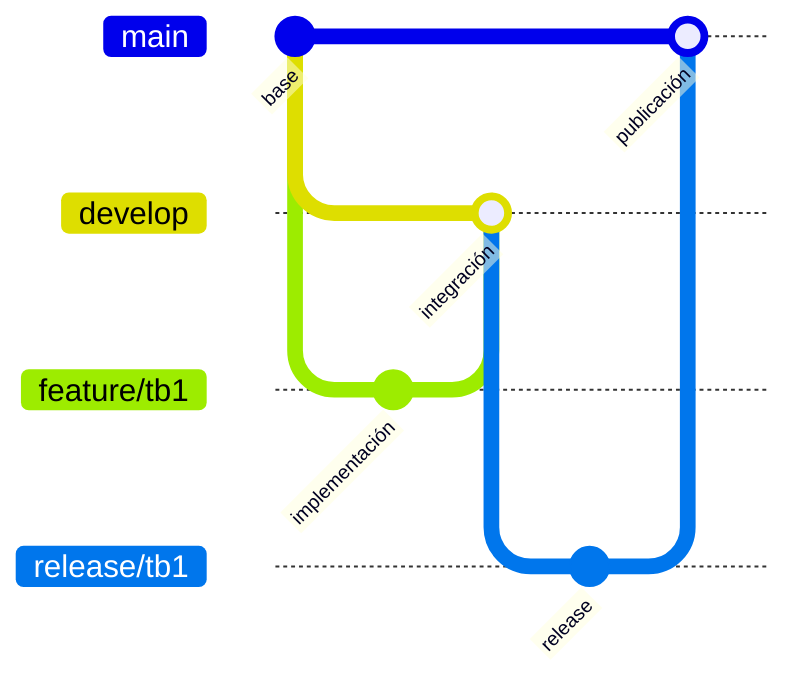

**Figura 4.1**  
*GitFlow utilizado por Trakto Route.*

La figura deberá evidenciar la relación entre `main`, `develop`, `feature`, `release` y `hotfix`, así como el flujo esperado de integración de cambios.

**Conventional Commits**

Los mensajes de commit deben seguir la estructura propuesta por Conventional Commits:

```text
<type>[optional scope]: <description>

[optional body]

[optional footer]
```

**Tabla 4.3**  
*Tipos de commits adoptados*

| Type | Purpose | Example |
|---|---|---|
| `feat` | Incorporar una nueva funcionalidad. | `feat(trips): add trip scheduling` |
| `fix` | Corregir un comportamiento defectuoso. | `fix(auth): handle invalid credentials` |
| `docs` | Actualizar documentación. | `docs(api): update trip endpoints documentation` |
| `style` | Modificar formato sin alterar comportamiento. | `style(mobile): format trip screen` |
| `refactor` | Reestructurar código sin modificar su comportamiento externo. | `refactor(fleet): simplify vehicle mapper` |
| `test` | Incorporar o modificar pruebas. | `test(trips): add trip service tests` |
| `build` | Modificar configuración de build o dependencias. | `build(android): update project dependencies` |
| `ci` | Modificar integración continua. | `ci(backend): configure build workflow` |
| `chore` | Realizar tareas de mantenimiento. | `chore: update repository configuration` |

Los ejemplos anteriores representan la **convención adoptada** y no constituyen evidencia de commits ya existentes.

**Semantic Versioning**

Para identificar releases se adopta Semantic Versioning bajo la estructura:

```text
MAJOR.MINOR.PATCH
```

- **MAJOR:** cambios incompatibles con una versión anterior.
- **MINOR:** incorporación de funcionalidades compatibles.
- **PATCH:** correcciones compatibles con versiones anteriores.

Por ejemplo, `1.0.0` representa conceptualmente una primera versión estable. No obstante, las versiones reales de Trakto Route deberán obtenerse de los tags o releases de los repositorios.

No se encontraron tags SemVer publicados. Los releases TB1 quedan identificados por los commits `3d2cad9` (backend), `3af2425` (Landing Page) y `5641a0f` (Android); el etiquetado SemVer permanece `NOT_VERIFIED`.

<div style="page-break-after: always;"></div>

#### 4.1.3. Source Code Style Guide & Conventions

Las convenciones de programación tienen como propósito mantener una base de código legible y consistente entre los integrantes. La nomenclatura de clases, funciones, variables, endpoints y demás elementos del proyecto se realizará en inglés.

**Tabla 4.4**  
*Source Code Style Guide & Conventions*

| Technology | Convention / Style Guide | Application in Trakto Route |
|---|---|---|
| Kotlin | Kotlin Coding Conventions | Aplicación Android. |
| Java | Google Java Style Guide y convenciones de Spring Boot | RESTful Web Services. |
| HTML5 | Convenciones de estructura semántica HTML | Landing Page. |
| CSS3 | Convenciones de nomenclatura y organización de estilos | Landing Page. |
| JavaScript | Nomenclatura consistente en inglés y `camelCase` | Interacciones del Landing Page. |
| Gherkin | Given-When-Then | Acceptance Tests únicamente cuando existan archivos `.feature`. |

**Kotlin**

Las clases y objetos utilizan `PascalCase`.

```kotlin
class TripRepository
class TripDetailsViewModel
data class TripUiState(...)
```

Las funciones y variables utilizan `camelCase`.

```kotlin
fun loadTrips()
fun scheduleTrip()
val selectedTrip
var isLoading
```

Las constantes utilizan `UPPER_SNAKE_CASE` cuando corresponda.

```kotlin
const val BASE_URL = "..."
```

Los packages se mantienen en minúsculas y organizados según las responsabilidades del proyecto.

```text
com.trakto.route
com.trakto.route.trip
com.trakto.route.fleet
```

**Java**

Las clases, interfaces y enumeraciones utilizan `PascalCase`.

```java
TripController
ScheduleTripCommand
TripRepository
TripStatus
```

Los métodos y variables utilizan `camelCase`.

```java
scheduleTrip()
findById()
updateStatus()
```

Las constantes utilizan `UPPER_SNAKE_CASE`.

```java
private static final String DEFAULT_STATUS = "SCHEDULED";
```

Los packages se expresan en minúsculas y deben reflejar de forma coherente los Bounded Contexts y capas definidas en el diseño táctico.

**HTML**

El Landing Page utiliza elementos semánticos cuando corresponda:

```html
<header>
<nav>
<main>
<section>
<footer>
```

Los tags y atributos se mantienen en minúsculas y la indentación debe permanecer consistente.

**CSS**

Los estilos deberán utilizar nombres descriptivos relacionados con la función del componente y evitar duplicaciones innecesarias.

```css
.hero-section {}
.trip-feature-card {}
.primary-button {}
```

**JavaScript**

Las funciones y variables utilizan nomenclatura en inglés y `camelCase`.

```javascript
const navigationMenu = document.querySelector(...);

function openNavigationMenu() {
    ...
}
```

**Gherkin**

En caso de implementar Acceptance Tests bajo BDD, los criterios deben conservar la estructura:

```gherkin
Feature: Trip management

  Scenario: Schedule a valid trip
    Given ...
    When ...
    Then ...
```

Los archivos `.feature` deberán relacionarse con las Acceptance Criteria de las User Stories correspondientes y no crear comportamientos que no formen parte del Product Backlog.

<div style="page-break-after: always;"></div>

#### 4.1.4. Software Deployment Configuration

La configuración de deployment mantiene la separación arquitectónica definida en el Capítulo II. La aplicación móvil funciona como cliente, los RESTful Web Services centralizan las reglas de negocio y MySQL mantiene la fuente persistente de información.

**Tabla 4.5**  
*Software Deployment Configuration*

| Product / Component | Source Repository | Build | Deployment Target | Public URL / Distribution |
|---|---|---|---|---|
| Landing Page | [landing-page](https://github.com/1ACC0238-2620-4939/landing-page) | HTML5, CSS3 y JavaScript | GitHub Pages desde `main` | [Sitio público](https://1acc0238-2620-4939.github.io/landing-page/) |
| RESTful Web Services | [backend](https://github.com/1ACC0238-2620-4939/backend) | Java 25 / Spring Boot / Docker | Railway; deployment existente confirmado por el owner | La URL de administración está registrada en GitHub; el health check público no fue comprobado durante este cierre |
| MySQL Database | No aplica como repositorio independiente | MySQL | Variable de conexión gestionada por el runtime | Acceso restringido desde backend; entorno cloud `NOT_VERIFIED` |
| Android Application | [mobile-app](https://github.com/1ACC0238-2620-4939/mobile-app) | Kotlin / Jetpack Compose / Gradle | APK debug instalado en Android Emulator | [Repositorio y APK reproducible](https://github.com/1ACC0238-2620-4939/mobile-app) |

Para el **Landing Page**, el deployment debe generar un sitio público accesible mediante navegador web.

Para el **backend**, el proceso debe generar una instancia ejecutable de Spring Boot accesible mediante HTTPS. Las variables sensibles, como credenciales de base de datos, no deben incluirse directamente en el código fuente.

La base de datos MySQL debe permanecer accesible únicamente por el backend y no por la aplicación Android.

Para la aplicación móvil, la demostración del Sprint puede ejecutarse en un dispositivo físico o entorno Android configurado. La distribución formal deberá documentarse cuando se utilice Firebase App Distribution o un servicio equivalente.

El Deployment Diagram previamente definido para Trakto Route representa esta separación.

**Figura 4.2**  
*Software Architecture Deployment Diagram de Trakto Route.*


El diagrama muestra al dispositivo Android como cliente de la solución, un entorno de ejecución encargado de alojar la REST API desarrollada con Spring Boot y un servidor MySQL utilizado como persistencia central. La comunicación entre la aplicación y el backend se realiza mediante HTTPS/JSON, mientras que el acceso a MySQL se concentra en la capa de infraestructura del backend.

<div style="page-break-after: always;"></div>

### 4.2. Landing Page & Mobile Application Implementation

Esta sección documenta el avance de implementación de Trakto Route organizado por Sprint. Para la entrega TB1 se considera el **Sprint 1**, el cual concentra las primeras funcionalidades core relacionadas con autenticación, programación y consulta de viajes, registro de recursos de flota y asignación de conductor y vehículo.

El alcance se obtiene directamente del Product Backlog establecido en el Capítulo II. De esta manera, las evidencias presentadas en Sprint Review deberán mantener correspondencia con las User Stories comprometidas y con los Work-items definidos por el equipo durante el Sprint Planning.

#### 4.2.1. Sprint 1

El Sprint 1 se centra en construir una primera base funcional del proceso de transporte. El Sprint comprende la posibilidad de registrar e iniciar sesión en el sistema y las capacidades fundamentales para que un supervisor pueda programar un viaje, consultar sus datos, asignar una ruta, registrar vehículos y conductores, asignar ambos recursos a una operación y mantener actualizado su estado.

De acuerdo con el Product Backlog, el Sprint 1 está conformado por **12 User Stories**, que representan en conjunto **41 Story Points**.

**Tabla 4.6**  
*User Stories correspondientes al Sprint 1*

| Order | User Story | Title | Story Points |
|---:|---|---|---:|
| 1 | US17 | Programar viaje | 5 |
| 2 | US05 | Consultar viajes | 3 |
| 3 | US06 | Consultar detalle de viaje | 3 |
| 4 | US18 | Asignar ruta a un viaje | 3 |
| 5 | US23 | Registrar vehículo | 3 |
| 6 | US25 | Registrar conductor | 3 |
| 7 | US27 | Asignar vehículo a un viaje | 5 |
| 8 | US28 | Asignar conductor a un viaje | 5 |
| 9 | US07 | Consultar estado del viaje | 2 |
| 10 | US19 | Actualizar estado del viaje | 3 |
| 11 | US01 | Registrar cuenta | 3 |
| 12 | US02 | Iniciar sesión | 3 |
|  |  | **Total** | **41** |

<div style="page-break-after: always;"></div>

##### 4.2.1.1. Sprint Planning 1

El Sprint Planning 1 establece el alcance inicial de implementación y organiza el trabajo necesario para alcanzar un incremento funcional de Trakto Route. Debido a que corresponde al primer Sprint, no existe un Sprint Review ni Sprint Retrospective anterior que deban utilizarse como entrada.

**Tabla 4.7**  
*Sprint Planning 1*

| Sprint # | Sprint 1 |
|---|---|
| **Sprint Planning Background** | |
| Date | `NOT_VERIFIED`: requiere el acta real del equipo |
| Time | `NOT_VERIFIED`: requiere el acta real del equipo |
| Location | `NOT_VERIFIED`: requiere el acta real del equipo |
| Prepared By | `NOT_VERIFIED`: requiere el acta real del equipo |
| Attendees (to planning meeting) | Cesar Alejandro Linares Bernable / Aguilar Aguayo Jeferson Renzo / Fernandez Garfias, Alexander Piero / Chirito Torres, Jose Raul / Loa Rojas, Jean Franck |
| Sprint 0 Review Summary | No aplica. Sprint 1 corresponde a la primera iteración de implementación del producto. |
| Sprint 0 Retrospective Summary | No aplica. No existe una iteración anterior que deba ser evaluada. |
| **Sprint Goal & User Stories** | |
| Sprint 1 Goal | Our focus is on enabling the fleet supervisor to create and prepare transport operations through an initial end-to-end trip management flow. We believe it delivers centralized operational control to transport companies by allowing authenticated users to schedule trips, assign routes, vehicles and drivers, and consult or update trip information. This will be confirmed when a supervisor can authenticate, create a trip, associate its required resources and consult its current state through the implemented solution. |
| Sprint 1 Velocity | `NOT_VERIFIED`: no se encontró una velocidad acordada en los repositorios |
| Sum of Story Points | **41 Story Points** |

El Sprint Goal no se limita al cumplimiento individual de User Stories. Su propósito es proporcionar un incremento coherente que permita comprobar el flujo base de gestión de una operación de transporte.

<div style="page-break-after: always;"></div>

##### 4.2.1.2. Aspect Leaders and Collaborators

Para establecer responsabilidades durante el Sprint se utiliza una **Leadership-and-Collaboration Matrix (LACX)**. Los aspectos deben relacionarse con el trabajo definido posteriormente en el Sprint Backlog.

Para Sprint 1, los principales aspectos funcionales son **Landing Page**, **Authentication**, **Trip Management**, **Fleet Management**, **Backend & API** y **Testing & Integration**.

**Tabla 4.8**  
*Leadership-and-Collaboration Matrix del Sprint 1*

| Team Member (Last Name, First Name) | GitHub Username | Landing Page | Authentication | Trip Management | Fleet Management | Backend & API | Testing & Integration |
|---|---|---|---|---|---|---|---|
| Linares Bernable, Cesar Alejandro | `NOT_VERIFIED` | `NOT_VERIFIED` | `NOT_VERIFIED` | `NOT_VERIFIED` | `NOT_VERIFIED` | `NOT_VERIFIED` |
| Aguilar Aguayo, Jeferson Renzo | `JeferSomBlan` | C | C | C | C | C | C |
| Fernandez Garfias, Alexander Piero | `Dostoyevsk1` | L | C | L | L | L | L |
| Chirito Torres, Jose Raul | `JoseR044` | C | `NOT_VERIFIED` | `NOT_VERIFIED` | `NOT_VERIFIED` | `NOT_VERIFIED` | `NOT_VERIFIED` |
| Loa Rojas, Jean Franck | `JeanLoa` | C | C | L | L | C | L |

**Leyenda:** `L = Leader`, `C = Collaborator`.

La matriz anterior se deriva de la autoría observable en GitHub. Las celdas marcadas `NOT_VERIFIED` requieren confirmación del equipo porque los repositorios no permiten inferir acuerdos personales o trabajo realizado fuera de GitHub.

La asignación final debe mantener coherencia con los Work-items, responsables y commits que posteriormente se documenten en las evidencias del Sprint.

<div style="page-break-after: always;"></div>

##### 4.2.1.3. Sprint Backlog 1

El Sprint Backlog convierte el alcance establecido en Sprint Planning en actividades concretas. Las User Stories fueron seleccionadas desde el Product Backlog atendiendo al Sprint previamente definido.

`NOT_VERIFIED`: no se encontró un Sprint Board público asociado a los repositorios revisados.

**Figura 4.3**  
*Board de gestión correspondiente al Sprint 1.*

**URL del Board:** `NOT_VERIFIED`.

**Tabla 4.9**  
*Sprint Backlog 1*

| User Story Id | User Story Title | Work-Item / Task Id | Work-Item / Task Title | Description | Estimation (Hours) | Assigned To | Status |
|---|---|---|---|---|---:|---|---|
| US17 | Programar viaje | API-TRIP-CREATE | Implementar creación de viaje | Command, controller y persistencia de viajes | `NOT_VERIFIED` | Alexander | Implementado en backend; aceptación `NOT_VERIFIED` |
| US05 | Consultar viajes | API-TRIP-LIST | Implementar consulta de viajes | Query service y endpoint de listado | `NOT_VERIFIED` | Alexander | Implementado en backend; aceptación `NOT_VERIFIED` |
| US06 | Consultar detalle de viaje | API-TRIP-DETAIL | Implementar detalle de viaje | Query service y endpoint por identificador | `NOT_VERIFIED` | Alexander | Implementado en backend; aceptación `NOT_VERIFIED` |
| US18 | Asignar ruta a un viaje | MOB-TRACKING | Preparar vista de seguimiento | Presentar ruta y progreso operativo | `NOT_VERIFIED` | Jean | Prototipo ejecutable con datos temporales |
| US23 | Registrar vehículo | API-VEHICLE-CREATE | Implementar vehículo | Command y controller de vehículos | `NOT_VERIFIED` | Alexander | Implementado en backend; aceptación `NOT_VERIFIED` |
| US25 | Registrar conductor | API-DRIVER-CREATE | Implementar conductor | Command y controller de conductores | `NOT_VERIFIED` | Alexander | Implementado en backend; aceptación `NOT_VERIFIED` |
| US27 | Asignar vehículo a un viaje | MOB-FLEET | Preparar gestión de flota | Vista de vehículos y estados | `NOT_VERIFIED` | Jean | Prototipo ejecutable; integración `NOT_VERIFIED` |
| US28 | Asignar conductor a un viaje | MOB-FLEET | Preparar gestión de conductores | Vista de conductores y estados | `NOT_VERIFIED` | Jean | Prototipo ejecutable; integración `NOT_VERIFIED` |
| US07 | Consultar estado del viaje | MOB-TRIPS | Mostrar estado de viajes | Lista y resumen operativo | `NOT_VERIFIED` | Jean | Verificado en emulador con datos temporales |
| US19 | Actualizar estado del viaje | API-TRIP-STATE | Implementar cambios de estado | Endpoints `start`, `complete` y `cancel` | `NOT_VERIFIED` | Alexander | Implementado en backend; aceptación `NOT_VERIFIED` |
| US01 | Registrar cuenta | IAM | Registrar cuenta | Contexto IAM requerido | `NOT_VERIFIED` | `NOT_VERIFIED` | No implementado en el backend revisado |
| US02 | Iniciar sesión | IAM | Iniciar sesión | Contexto IAM requerido | `NOT_VERIFIED` | `NOT_VERIFIED` | No implementado en el backend revisado |

Los estados utilizados deberán corresponder a `To-do`, `In-Process`, `To-Review` o `Done`. Cada Work-item debe contar con estimación en horas y un responsable claramente identificado.

<div style="page-break-after: always;"></div>

##### 4.2.1.4. Development Evidence for Sprint Review

Esta sección presenta evidencia obtenida de los productos ejecutados y de sus historiales Git.

**Landing Page**

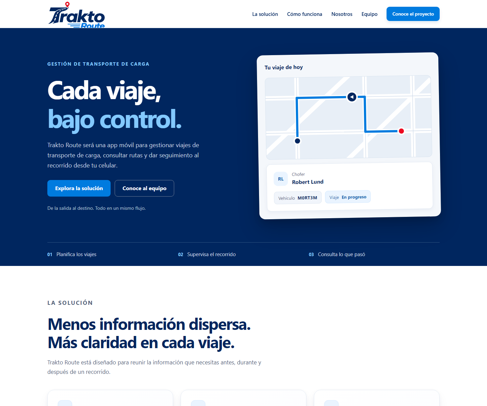

**Figura 4.4**  
*Avance de implementación del Landing Page durante Sprint 1.*

La captura corresponde al código publicado desde `main` y muestra la propuesta de valor, funcionalidades y equipo.

**Android Mobile Application**

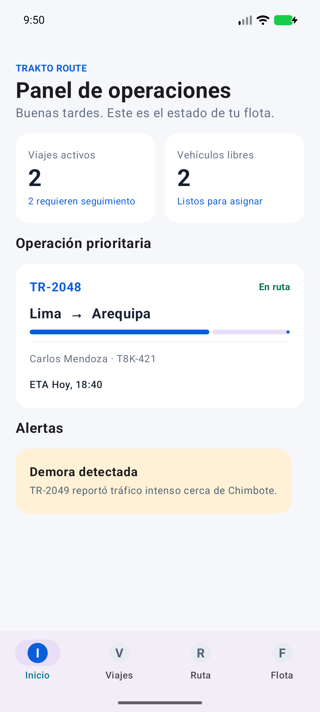

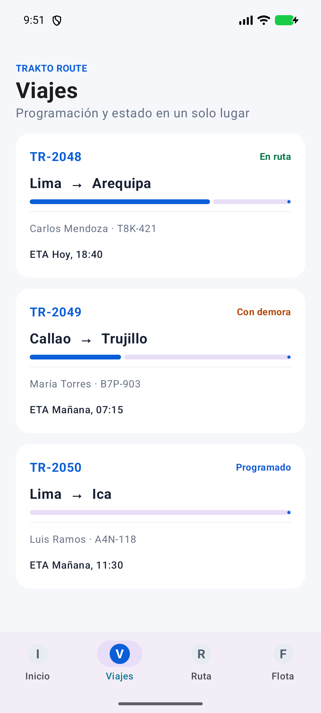

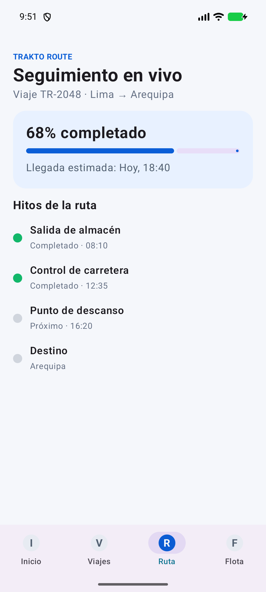

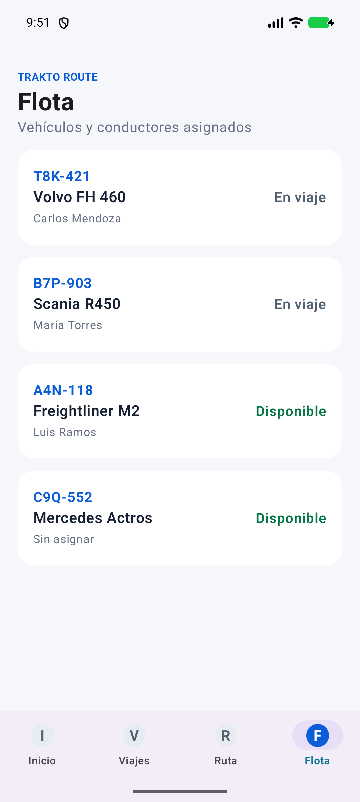

**Figura 4.5**  
*Avance de implementación de la aplicación Android durante Sprint 1.*

Las capturas se obtuvieron de un APK instalado en Android Emulator. El dashboard, los viajes, el seguimiento y la flota son ejecutables. Los datos temporales están centralizados en `DemoTraktoRepository`; el consumo del backend permanece `NOT_VERIFIED`.

**RESTful Web Services**

El backend implementa controllers, command/query services, repositorios JPA y recursos para viajes, seguimiento, vehículos, conductores y perfiles. El contexto IAM descrito en el diseño no está implementado en el código revisado.

**Figura 4.6**  
*Avance de implementación de RESTful Web Services durante Sprint 1.*

**Repositorio:** [1ACC0238-2620-4939/backend](https://github.com/1ACC0238-2620-4939/backend)

**Tabla 4.10**  
*Commits relacionados con Development durante Sprint 1*

| Repository | Branch | Commit Id | Commit Message | Commit Message Body | Committed on (Date) |
|---|---|---|---|---|---|
| landing-page | `feature/tb1-landing-readiness` | `c2d28f9` | `docs(landing): connect public project resources` | Conecta recursos públicos y corrige referencias del proyecto. | 2026-10-03 |
| landing-page | `feature/tb1-landing-readiness` | `5e72057` | `docs(landing): add tb1 visual evidence` | Agrega evidencia visual real del Landing Page. | 2026-10-03 |
| mobile-app | `feature/tb1-mobile` | `0d80734` | `feat(mobile): add tb1 core operations experience` | Implementa la experiencia Android core y sus capturas. | 2026-10-03 |
| backend | `main` | `d85705e` | `refactor(shared): update documentation for swagger` | Actualiza la documentación OpenAPI del backend. | 2026-10-03 |
| backend | `feature/tb1-deployment-readiness` | `e11a4ff` | `chore(deployment): make backend build reproducible` | Añade entorno de prueba reproducible y build Docker. | 2026-10-03 |

<div style="page-break-after: always;"></div>

##### 4.2.1.5. Testing Suite Evidence for Sprint Review

La verificación ejecutada se limita a las pruebas y gates existentes o reproducibles. No se atribuyen Unit Tests, Integration Tests ni Acceptance Tests que no existan en los repositorios.

**Tabla 4.11**  
*Testing Suite correspondiente al Sprint 1*

| Test ID | Product | Test Type | Related User Story | Tested Component / Behavior | Result |
|---|---|---|---|---|---|
| BACKEND-CTX-01 | Backend | Spring context smoke test | Transversal | Arranque del contexto con H2, sin depender de MySQL externo | `PASS`: 1 test, 0 failures, 0 errors |
| BACKEND-BUILD-01 | Backend | Container build | Transversal | Compilación Java 25 y construcción de imagen Docker | `PASS` |
| ANDROID-BUILD-01 | Android | Build gate | Transversal | `clean assembleDebug` | `PASS`: APK generado |
| ANDROID-LINT-01 | Android | Static analysis | Transversal | `lintDebug` | `PASS` |
| ANDROID-RUNTIME-01 | Android | Runtime smoke | US05, US07, US18, US23, US25 | Instalación y navegación por Dashboard, Viajes, Seguimiento y Flota | `PASS` en Android Emulator |
| ACCEPTANCE-01 | Backend/Android | Acceptance | US01-US28 | Criterios de aceptación automatizados | `NOT_VERIFIED`: suite inexistente |

Los comandos reproducibles son `./mvnw test`, `docker build -t trakto-route-backend:tb1 .` y `./gradlew clean assembleDebug lintDebug` en sus respectivos repositorios.

**Tabla 4.12**  
*Commits relacionados con Testing durante Sprint 1*

| Repository | Branch | Commit Id | Commit Message | Commit Message Body | Committed on (Date) |
|---|---|---|---|---|---|
| backend | `feature/tb1-deployment-readiness` | `e11a4ff` | `chore(deployment): make backend build reproducible` | Incorpora H2 para el test de contexto y Dockerfile reproducible. | 2026-10-03 |
| mobile-app | `feature/tb1-mobile` | `0d80734` | `feat(mobile): add tb1 core operations experience` | Incluye el proyecto Android validado mediante build, lint e instalación. | 2026-10-03 |

<div style="page-break-after: always;"></div>

##### 4.2.1.6. Execution Evidence for Sprint Review

La Execution Evidence permite demostrar que las funcionalidades desarrolladas durante Sprint 1 pueden ejecutarse e interactuar entre sí de acuerdo con el alcance definido.

**Landing Page**


**Figura 4.10**  
*Landing Page de Trakto Route en ejecución.*

**URL pública:** https://1acc0238-2620-4939.github.io/landing-page/

**Android Mobile Application**


**Figura 4.11**  
*Aplicación móvil Trakto Route en ejecución.*

La ejecución en Android Emulator fue verificada mediante instalación del APK y navegación automatizada por las cuatro secciones disponibles.

**Flujo integrado**

`NOT_VERIFIED`: la aplicación utiliza `DemoTraktoRepository`; todavía no existe un adaptador REST conectado al backend.

**Figura 4.12**  
*Interacción entre la aplicación Android y los RESTful Web Services.*

La evidencia deberá demostrar que la aplicación consume información procedente de la API y que los datos persistentes no dependen únicamente del dispositivo móvil.

**URL del video:** `BLOCKED`: requiere que el equipo grabe y publique una demostración continua con su cuenta institucional.

El video deberá mostrar de manera continua los principales flujos implementados durante el Sprint y explicar su correspondencia con las User Stories comprometidas.

<div style="page-break-after: always;"></div>

##### 4.2.1.7. Services Documentation Evidence for Sprint Review

La documentación de servicios presenta los endpoints REST implementados durante Sprint 1 y su relación con las User Stories.

Debido a que las rutas exactas deben corresponder con los Controllers del repositorio backend, estas deberán obtenerse directamente del código y de la especificación OpenAPI antes de completar la entrega.

**Tabla 4.13**  
*RESTful Services incluidos en el alcance del Sprint 1*

| Endpoint | HTTP Method | Purpose | Related User Story | Parameters / Request | Response | Documentation URL |
|---|---|---|---|---|---|---|
| `/api/v1/trips` | GET | Consultar viajes | US05 | Sin body | Colección de recursos de viaje | `/swagger-ui.html` local |
| `/api/v1/trips/{id}` | GET | Consultar detalle | US06 | `id` | Recurso de viaje | `/swagger-ui.html` local |
| `/api/v1/trips` | POST | Programar viaje | US17 | Recurso de creación | Recurso de viaje creado | `/swagger-ui.html` local |
| `/api/v1/trips/{id}/start` | PATCH | Iniciar viaje | US19 | `id` | Viaje actualizado | `/swagger-ui.html` local |
| `/api/v1/trips/{id}/complete` | PATCH | Completar viaje | US19 | `id` | Viaje actualizado | `/swagger-ui.html` local |
| `/api/v1/trips/{id}/cancel` | PATCH | Cancelar viaje | US19 | `id` | Viaje actualizado | `/swagger-ui.html` local |
| `/api/v1/vehicles` | GET / POST | Consultar o registrar vehículo | US10, US23 | Filtros o recurso de creación | Recurso(s) de vehículo | `/swagger-ui.html` local |
| `/api/v1/drivers` | GET / POST | Consultar o registrar conductor | US09, US25 | Filtros o recurso de creación | Recurso(s) de conductor | `/swagger-ui.html` local |
| `/api/v1/trackings` | POST | Registrar seguimiento | US18 | Recurso de creación | Recurso de seguimiento | `/swagger-ui.html` local |
| `/api/v1/trackings/{id}/positions` | POST | Registrar posición | US40 | Recurso de posición | Seguimiento actualizado | `/swagger-ui.html` local |
| `/api/v1/profiles` | GET / POST | Consultar o registrar perfil | US03 | Filtros o recurso de creación | Recurso(s) de perfil | `/swagger-ui.html` local |
| No implementado | — | Registrar cuenta / iniciar sesión | US01, US02 | — | — | `NOT_VERIFIED`: IAM no existe en el backend revisado |

Para cada endpoint documentado deberán especificarse los parámetros, request body cuando corresponda, posibles códigos HTTP y un ejemplo del response.

La UI de Swagger está configurada en `/swagger-ui.html`. Su ejecución contra una base MySQL y un request/response persistente permanece `NOT_VERIFIED`.

**REST API Repository:**  
[https://github.com/1ACC0238-2620-4939/backend](https://github.com/1ACC0238-2620-4939/backend)

**OpenAPI / Swagger:**  
`http://localhost:8080/swagger-ui.html` (URL local; no se presenta como deployment público)

Si los RESTful Web Services todavía no se encuentran desplegados públicamente durante esta etapa, puede utilizarse la URL local realmente configurada en el proyecto. Esta URL no deberá presentarse como un deployment público.

<div style="page-break-after: always;"></div>

##### 4.2.1.8. Software Deployment Evidence for Sprint Review

Esta sección documenta únicamente las actividades de deployment realizadas durante Sprint 1. Debe diferenciarse de la configuración general presentada en 4.1.4, ya que aquí se incorporan evidencias concretas del trabajo ejecutado durante la iteración.

Para TB1, el Landing Page debe encontrarse disponible públicamente. Las evidencias deberán mostrar el proceso utilizado para generar y publicar la versión correspondiente al Sprint.

**Landing Page**

El repositorio usa GitHub Pages con source `main` y raíz `/`. El release documentado corresponde al commit `3af2425`.

**Figura 4.15**  
*Configuración de deployment del Landing Page.*


**Figura 4.16**  
*Landing Page desplegado durante Sprint 1.*

**URL:** https://1acc0238-2620-4939.github.io/landing-page/

**RESTful Web Services**

El backend contiene un `Dockerfile` multi-stage con Java 25, `.dockerignore` y variables de entorno documentadas. La imagen `trakto-route-backend:tb1` se construyó correctamente.

**Figura 4.17**  
*Configuración del backend correspondiente al Sprint 1.*

El owner confirmó que el backend ya se encuentra desplegado en Railway y pidió conservarlo sin cambios. Este cierre no modificó el proyecto ni sus variables. GitHub registra el entorno `precious-analysis / production`; la URL pública del servicio y su health check no fueron comprobados de forma independiente.

**Android Application**


**Figura 4.18**  
*Build de la aplicación Android correspondiente al Sprint 1.*

El APK debug fue generado, instalado y ejecutado en Android Emulator. No se publicó en Firebase App Distribution; esa distribución queda fuera de la evidencia verificada.

<div style="page-break-after: always;"></div>

##### 4.2.1.9. Team Collaboration Insights during Sprint

La colaboración durante Sprint 1 debe analizarse utilizando evidencias obtenidas de los repositorios y de la herramienta de gestión del Sprint. El análisis no debe limitarse a contabilizar commits, sino relacionar las contribuciones con los aspectos y responsabilidades definidos previamente en la Leadership-and-Collaboration Matrix.

| Repositorio | Evidencia de colaboradores observada en GitHub | Resultado |
|---|---|---|
| Report | `Dostoyevsk1` 23, `JeferSomBlan` 7, `JoseR044` 2 contribuciones visibles antes del cierre; Jean integró el cierre TB1 | Evidencia de documentación distribuida |
| backend | `Dostoyevsk1` 28, `JeanLoa` 3 | Alexander concentra la implementación; Jean añadió reproducibilidad y verificación |
| landing-page | `JeanLoa` 7, `Dostoyevsk1` 4 | Base visual de Alexander y cierre/publicación de Jean |
| mobile-app | `JeanLoa` 4 | Implementación y evidencias a cargo de Jean |

La actividad muestra una concentración técnica en Alexander para el backend y en Jean para la aplicación Android, el cierre de despliegue y la integración del informe. Jeferson aportó los capítulos III y IV, mientras Jose registra aportes previos al informe. No se encontró un Board público ni contribuciones atribuibles a Cesar en los repositorios revisados; esas actividades no se infieren.

<div style="page-break-after: always;"></div>

### 4.3. Validation Interviews

Las Validation Interviews tienen como finalidad evaluar la experiencia propuesta mediante la interacción de usuarios representativos de los segmentos objetivo con el Landing Page y la aplicación móvil de Trakto Route.

A diferencia de las entrevistas realizadas durante Needfinding, estas sesiones no buscan descubrir inicialmente las necesidades del dominio, sino observar si la solución diseñada permite a los usuarios completar sus principales tareas de forma comprensible y consistente.

La validación considera los dos segmentos definidos en el proyecto:

1. **Empresas de transporte de carga**, representadas mediante el User Persona Carlos Mendoza.
2. **Clientes que requieren servicios de transporte de carga**, representados mediante el User Persona Andrea Salazar.

Las sesiones deberán evaluar tanto la comprensión del Landing Page como la ejecución de User Flows relevantes dentro de la aplicación móvil.

#### 4.3.1. Diseño de Entrevistas

Las sesiones de validación seguirán una estructura consistente para ambos segmentos. En primer lugar, se presentará brevemente el propósito de la sesión sin explicar anticipadamente cómo completar las tareas. Posteriormente, el participante interactuará con el Landing Page y con las funcionalidades asignadas de la aplicación.

Durante la interacción, el entrevistador deberá observar las acciones realizadas, dudas, retrocesos, errores y comentarios espontáneos del participante. Una vez finalizadas las tareas, se realizarán preguntas orientadas a conocer la claridad, facilidad de navegación y percepción de la solución.

**Tabla 4.14**  
*Actividades previstas para las Validation Interviews*

| Segment | Product | User Flow / Task | Validation Objective |
|---|---|---|---|
| Empresa de transporte de carga | Landing Page | Identificar qué problema resuelve Trakto Route y sus principales funcionalidades | Evaluar claridad de la propuesta de valor y encontrabilidad de información |
| Empresa de transporte de carga | Mobile App | Iniciar sesión | Comprobar claridad del proceso de autenticación |
| Empresa de transporte de carga | Mobile App | Programar un viaje | Evaluar comprensión del flujo y campos necesarios |
| Empresa de transporte de carga | Mobile App | Asignar ruta, vehículo y conductor | Evaluar claridad del proceso de preparación de la operación |
| Empresa de transporte de carga | Mobile App | Consultar y actualizar el estado de un viaje | Evaluar facilidad para supervisar una operación |
| Cliente de transporte de carga | Landing Page | Identificar beneficios dirigidos al cliente | Evaluar si el Landing Page comunica adecuadamente el valor para este segmento |
| Cliente de transporte de carga | Mobile App | Iniciar sesión | Evaluar facilidad de acceso |
| Cliente de transporte de carga | Mobile App | Consultar un envío | Evaluar encontrabilidad de una operación autorizada |
| Cliente de transporte de carga | Mobile App | Consultar progreso y ruta | Evaluar comprensión de la información operativa |
| Cliente de transporte de carga | Mobile App | Consultar eventos relevantes | Evaluar claridad de eventos e incidencias visibles |

**Preguntas introductorias**

1. ¿Con qué frecuencia utiliza aplicaciones o plataformas digitales relacionadas con transporte, logística o seguimiento de operaciones?
2. ¿Qué información espera encontrar rápidamente en una solución como Trakto Route?
3. Cuando necesita conocer el estado de una operación de transporte, ¿qué información considera más importante?

**Preguntas relacionadas con el Landing Page**

1. ¿Cuál considera que es el principal propósito de Trakto Route después de revisar esta página?
2. ¿Pudo identificar con facilidad las principales funcionalidades de la solución?
3. ¿La información dirigida a su tipo de usuario resulta clara?
4. ¿Hubo alguna sección cuyo contenido le resultara difícil de comprender o localizar?
5. ¿Qué información adicional esperaría encontrar antes de utilizar la solución?

**Preguntas posteriores a las tareas de la aplicación**

1. ¿Qué tan claro resultó el recorrido para completar la tarea?
2. ¿En algún momento no supo qué acción realizar a continuación?
3. ¿Las etiquetas utilizadas representaron adecuadamente las acciones disponibles?
4. ¿La información mostrada fue suficiente para tomar una decisión?
5. ¿Hubo algún elemento que le generara confusión?
6. ¿Qué modificaría para completar la tarea con menor esfuerzo?
7. ¿Considera que los mensajes de confirmación o error fueron suficientemente claros?
8. ¿Utilizaría este flujo en una operación real? ¿Por qué?

Las respuestas deberán analizarse conjuntamente con la observación del comportamiento durante la ejecución de las tareas.

<div style="page-break-after: always;"></div>

#### 4.3.2. Registro de Entrevistas

Las entrevistas de validación requieren entre **3 y 5 participantes por segmento**, grabación, datos del participante, timing y resumen de hallazgos reales.

| Evidencia requerida | Estado al 03/10/2026 | Condición de cierre |
|---|---|---|
| 3-5 entrevistas: empresas de transporte | `BLOCKED` | El equipo debe reclutar participantes, grabar las sesiones y publicar los enlaces autorizados |
| 3-5 entrevistas: clientes de transporte | `BLOCKED` | El equipo debe reclutar participantes, grabar las sesiones y publicar los enlaces autorizados |
| Capturas y timing de cada sesión | `BLOCKED` | Solo pueden extraerse de videos reales |
| Resumen de apreciaciones | `BLOCKED` | Debe redactarse desde respuestas y observación reales |

No se reutilizan las entrevistas de Needfinding como si fueran pruebas de validación y no se atribuyen opiniones a participantes inexistentes.

<div style="page-break-after: always;"></div>

#### 4.3.3. Evaluaciones según heurísticas

La evaluación debe usar el formato oficial del **Anexo E: UX Heuristics & Principles Evaluation** y hallazgos observados durante las entrevistas.

| Resultado | Estado |
|---|---|
| Tabla de problemas y severidad | `BLOCKED`: depende de las entrevistas de validación |
| Capturas que evidencian cada problema | `BLOCKED`: depende de interacción real |
| Recomendaciones priorizadas | `BLOCKED`: no pueden formularse como hallazgos de usuario antes de observarlos |

La escala prevista es: 1 problema superficial, 2 problema menor, 3 problema mayor y 4 problema muy grave. Los nombres de heurísticas y principios deberán copiarse exactamente del Anexo E cuando se completen las sesiones.

# Conclusiones

1. El incremento TB1 cuenta con tres productos versionados: Landing Page público, backend Spring Boot reproducible y aplicación Android ejecutable.
2. La aplicación móvil demuestra navegación y presentación de operaciones en emulador, pero su repositorio temporal de datos todavía debe reemplazarse por un adaptador REST para demostrar persistencia end-to-end.
3. El backend implementa viajes, seguimiento, flota y perfiles; IAM y una suite de pruebas de comportamiento siguen pendientes y no forman parte de la evidencia aceptada.
4. GitFlow quedó aplicado mediante ramas `feature`, `develop`, `release` y `main`, conservando trazabilidad entre el trabajo técnico y los releases.
5. La aceptación del producto requiere aún entrevistas reales, evaluación heurística derivada de esas sesiones, video de demostración y validación de los datos del Sprint Planning.

# Bibliografía

- Android Developers. *Jetpack Compose*. https://developer.android.com/compose
- GitHub Docs. *Configuring a publishing source for your GitHub Pages site*. https://docs.github.com/pages/getting-started-with-github-pages/configuring-a-publishing-source-for-your-github-pages-site
- Spring. *Spring Boot Reference Documentation*. https://docs.spring.io/spring-boot/reference/
- Docker Docs. *Multi-stage builds*. https://docs.docker.com/build/building/multi-stage/
- OpenAPI Initiative. *OpenAPI Specification*. https://spec.openapis.org/oas/latest.html
# Anexos

## Anexo A. Herramientas utilizadas

| Herramienta | Uso en el proyecto |
|---|---|
| **UXPressia** | Elaboración de User Personas, User Journey Maps y Empathy Maps. |
| **Miro** | Elaboración de Lean UX Canvas, EventStorming y Candidate Context Discovery. |
| **Structurizr** | Elaboración de diagramas del C4 Model, Context Mapping y Component Diagrams. |
| **PlantUML** | Elaboración de UML Class Diagrams y Database Design Diagrams. |
| **GitHub** | Control de versiones, almacenamiento del informe, código fuente e imágenes del proyecto. |
| **Android Studio** | Desarrollo de la aplicación móvil Android en Kotlin. |
| **Spring Boot** | Desarrollo del backend y API REST en Java. |
| **MySQL** | Persistencia central de los datos del sistema. |

<div style="page-break-after: always;"></div>

## Anexo B. Enlaces de entrevistas

| Entrevistado | Segmento | Enlace |
|---|---|---|
| Gianfranco Quispe | Empresa de transporte de carga | [Ver entrevista](https://upcedupe-my.sharepoint.com/:v:/g/personal/u202218899_upc_edu_pe/IQDkzObcE5ATSpmZvlKaZk58ARkz3Yp5qF9_nS_ZYSTAGaQ) |
| Diego Cisneros | Empresa de transporte de carga | [Ver entrevista](https://upcedupe-my.sharepoint.com/:v:/g/personal/u202218899_upc_edu_pe/IQA-12ReLDzQR49ealZCQkCfATl5EcCRvhjS1SzkyXFY-xU) |
| Valeria Cardenas | Empresa de transporte de carga | [Ver entrevista](https://upcedupe-my.sharepoint.com/:v:/g/personal/u202218899_upc_edu_pe/IQBtRonP6CraSJUSB36JKYOyActf48po9v-Z1ghUJw-bAgE) |
| Rodrigo Guerra | Cliente de transporte de carga | [Ver entrevista](https://upcedupe-my.sharepoint.com/:v:/g/personal/u202218899_upc_edu_pe/IQAV3DQLGB33SpVkVyUbv9pQAUsYOLoLLNGkZGiAaly_qig) |
| Alejandro Medina | Cliente de transporte de carga | [Ver entrevista](https://upcedupe-my.sharepoint.com/:v:/g/personal/u202218899_upc_edu_pe/IQCYIb0z_NwBTLbajN-6r4f9AWyuPx7pVcLQDYFiSKfXhjQ) |
| Jael Pinta | Cliente de transporte de carga | [Ver entrevista](https://upcedupe-my.sharepoint.com/:v:/g/personal/u202218899_upc_edu_pe/IQAz-85vOfF1R46gy8UA0z54AfCV6TF7BxvrpjY63Y2yBAs) |

<div style="page-break-after: always;"></div>

## Anexo C. Videos de Exposiciones

| Entrega | Video | Estado | URL |
|---|---|---|---|
| TB1 | Exposición del proyecto | `BLOCKED`: requiere grabación editada de máximo 15 minutos con participación ante cámara | `NOT_VERIFIED` |
| TB1 | App Validation | `BLOCKED`: depende de sesiones reales de validación y su grabación | `NOT_VERIFIED` |
| TB1 | About the Product | `BLOCKED`: requiere demostración del producto y testimonios reales autorizados | `NOT_VERIFIED` |
| TB1 | About the Team | `BLOCKED`: requiere escenas reales de trabajo y testimonio de cada integrante | `NOT_VERIFIED` |

Los archivos deberán publicarse en el OneDrive indicado por el docente. Los videos About the Product y About the Team también deberán publicarse en YouTube e incorporarse al Landing Page cuando el equipo los produzca.

<div style="page-break-after: always;"></div>
