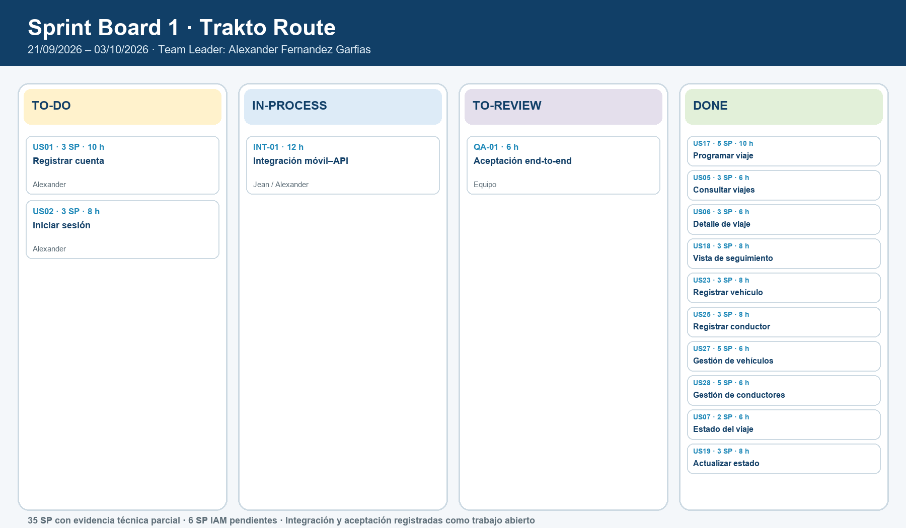

# Sprint Board 1

**Periodo:** 21/09/2026 – 03/10/2026  
**Team Leader:** Alexander Piero Fernandez Garfias  
**Capacidad planificada:** 41 Story Points  
**Resultado del Stage Review:** 35 Story Points con evidencia técnica de alcance parcial y 6 Story Points pendientes por IAM. La aceptación integral y la velocidad final permanecen sin verificar.

**Tablero del equipo:** [Trello de Trakto Route](https://trello.com/invite/b/6a9f35b637f25ac414075cf7/ATTIf84a9d213de599cd378224b9c2fa3fe4F4197A6F/mi-tablero-de-trello)

La integración entre la aplicación móvil y la API, junto con su aceptación end-to-end, se mantiene visible como trabajo abierto y no se contabiliza como evidencia cerrada.
